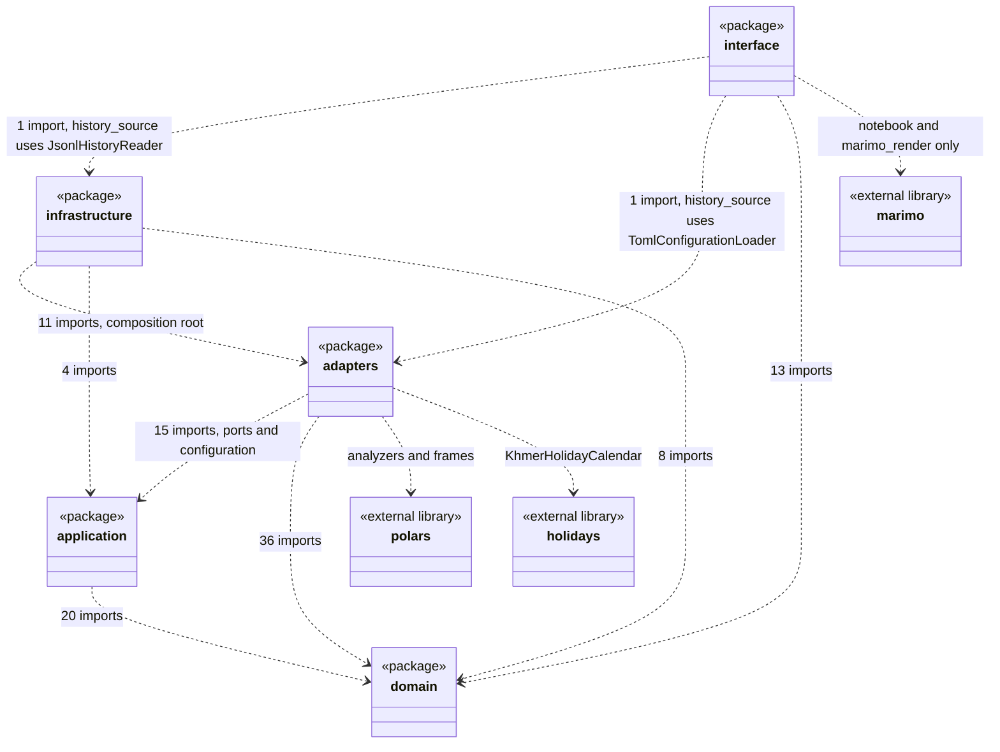
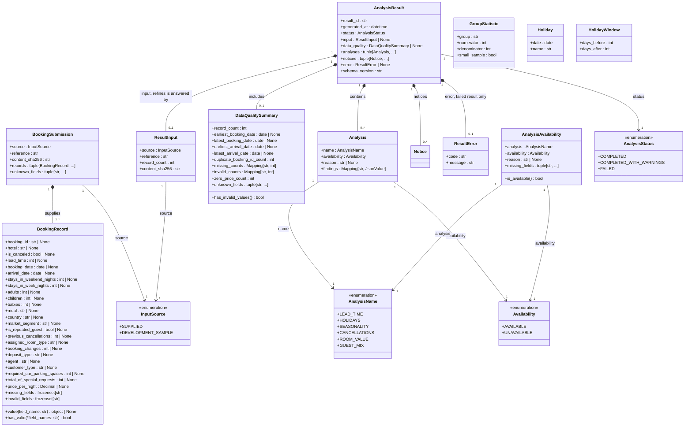
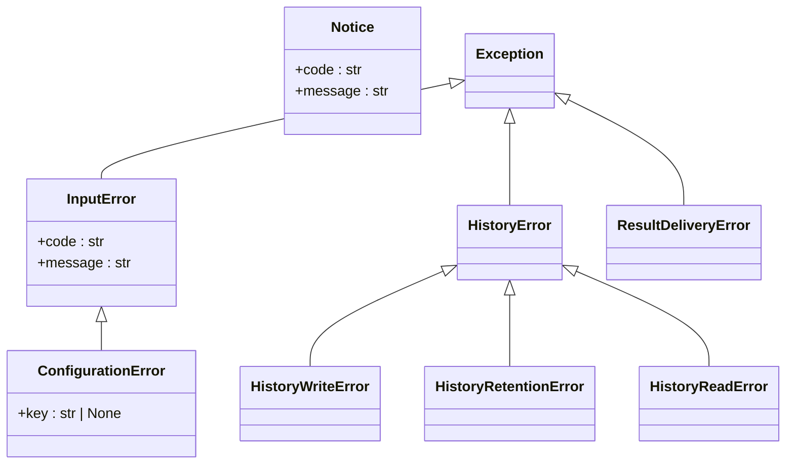

# Design Class Diagram

## Metadata
| Key | Value |
| --- | --- |
| ID | DCD-001 |
| CrossReference | [DM-001], [SD-001] |
| DomainLanguages | IT Professional English |

## Version History
| Date | Status | Author | Reviewer |
| --- | --- | --- | --- |
| 2026-09-29 | Proposed | Jens Tirsvad Nielsen | Team2 (S04) |

---

## Purpose and Scope

This document is the Design Class Diagram of the application **as built** (gateway MIL-007, sequence caveat: the code exists and the document describes it). It shows the classes, `Protocol` ports, enumerations and module-level function groups of `src/hotel_booking_analysis` in the five layers `domain`, `application`, `adapters`, `infrastructure` and `interface`, with their attributes, method signatures and relationships. It refines the concepts of [DM-001], takes its method signatures from the messages of [SD-001] and traces them to the operation contracts of [OC-001] (which realize the system operations of [SSD-001] for [UC-001] and [UC-002]).

Scope and conventions:

- Names, attributes and signatures were taken from the source with a script (`ast`), not typed from memory, and the result was checked mechanically (see Verification Note). A class name is the same in the diagram and in `src/`, and it sits in the layer package named in its diagram.
- Every class, `Protocol` and enumeration of the `domain` layer is drawn. For the other layers every public class is drawn; the classes that are deliberately not drawn are listed under Omitted classes.
- A box marked `<<module>>` stands for a Python module of functions (Pure Fabrication, for example `quality` or `bootstrap`), not for a class. Its operations are the public functions of the module.
- Differences between the built code and [ADR-0001] to [ADR-0007], [DM-001], [SSD-001], [OC-001] or [SD-001] are listed in the section As-Built Deviations (DD-1 and following, continuing AD-1 to AD-5, OD-1 and SD-1 to SD-7 of the earlier documents). They are not corrected in the diagrams.

## Diagram

### Reading guide

- **Visibility:** `+` public, `-` private (a Python name that starts with an underscore), `#` protected. No built member is protected because Python has no protected keyword and the code does not use a single leading underscore for subclass access; `#` therefore does not appear.
- **Types** are written as in the code (`X | None` is an optional value, `tuple[X, ...]` a tuple of any length). A trailing `$` marks a static method. A `Protocol` method without a body is an operation of the port. A `@property` is drawn as an operation: `name()` of `Analyzer` is the read-only property `name`. Constructors (`__init__`, `__post_init__`) are not drawn; the constructor arguments of a frozen dataclass are its attributes.
- **Relationships:** realization (`..|>`, dotted line with hollow triangle) is an adapter class implementing a `Protocol` port; inheritance (`<|--`) is used only for the exception hierarchy; composition (`*--`, filled diamond) means the part is created for and dies with the whole (immutable value objects held in a tuple or field); aggregation (`o--`, hollow diamond) means the part is created elsewhere and shared (injected ports); directed association (`-->`) is a reference to another value; dependency (`..>`, dashed arrow) is a use or creation without holding a reference (`creates` means the source constructs the target).
- **Navigability and multiplicity:** every association, aggregation and composition carries a multiplicity on both ends and is navigable from the left class (whole or referrer) to the right class (part or referred), which is the direction of the arrow or, for the diamond arrows, from the diamond end to the other end; there is no back reference in any of them (a frozen value object does not know its owner). Dependencies carry no multiplicity.
- A class that appears only in a relationship in one diagram (an empty box) is declared in the diagram of its own layer and is drawn empty here only to show the link across diagrams or layers.
- **Patterns** are annotated in the Pattern Annotations section and, in the class diagrams, by the stereotypes `<<Protocol>>` (port), `<<enumeration>>` and `<<module>>`.

### Package overview and dependency direction

The overview shows the import dependencies between the five packages, counted from the imports in `src/` (one dependency per imported module name, so the number is a measure of coupling and not of classes). Every arrow points from the outer layer to the inner one; there is no arrow against the direction. `__main__` (the entry module) imports only `infrastructure.cli`.



The five layers are ordered `interface` (outermost), `infrastructure`, `adapters`, `application`, `domain` (innermost), as in the `layers` contract of `pyproject.toml`; the layer dependency rule and its enforcement are in the Dependency Check.

### Domain layer, part 1: booking, analysis and result

Entities and value objects of the analysis core. `Notice` is drawn in part 3 with the errors. `GroupStatistic`, `Holiday` and `HolidayWindow` have no association in the built code (deviations DD-3 and DD-4).



### Domain layer, part 2: rules, history and day classification

Value objects for the retention rule and the history readout, the field requirements, the bands and buckets of [ADR-0007], the day classification, and four modules of pure functions (Pure Fabrication) that hold the rules without library use. `Result History` itself has no class (deviation DD-2).

```mermaid
classDiagram
    class RetentionPolicy {
        +limit : int
    }
    class HistoryReadout {
        +results : tuple[Mapping[str, JsonValue], ...]
        +malformed_line_count : int
    }
    class AnalysisRequirement {
        +analysis : AnalysisName
        +all_of : tuple[str, ...]
        +any_of : tuple[str, ...]
    }
    class LeadTimeBand {
        +label : str
        +lower : int
        +upper : int | None
    }
    class Bucket {
        +label : str
        +lower : int
        +upper : int | None
    }
    class DayKind {
        <<enumeration>>
        +HOLIDAY
        +BEFORE
        +AFTER
        +BASELINE
    }
    class DayClass {
        +day : date
        +kind : DayKind
        +distance : int | None
        +in_window(kind: DayKind, window_days: int) bool
    }
    class quality {
        <<module>>
        +records_with_valid(records: Iterable[BookingRecord], *field_names: str) tuple[BookingRecord, ...]
        +summarize(records: tuple[BookingRecord, ...], unknown_fields: tuple[str, ...] = ...) DataQualitySummary
        +usable_fields(records: tuple[BookingRecord, ...]) frozenset[str]
        +assess_availability(records: tuple[BookingRecord, ...]) tuple[AnalysisAvailability, ...]
    }
    class analysis_rules {
        <<module>>
        +lead_time_band(days: int) str
        +stay_bucket(nights: int) str
        +capped_label(value: int, cap: int) str
        +capped_labels(cap: int) tuple[str, ...]
        +is_small_sample(group_size: int, min_group_size: int) bool
        +rate_statistic(group: str, numerator: int, denominator: int, min_group_size: int) GroupStatistic
        +count_statistic(group: str, count: int, total: int, min_group_size: int) GroupStatistic
        +figure_to_json(statistic: GroupStatistic) dict[str, JsonValue]
        +month_bounds(year: int, month: int) tuple[date, date]
        +is_partial_period(period_start: date, period_end: date, first_observed: date, last_observed: date) bool
        +iso_week_bounds(iso_year: int, iso_week: int) tuple[date, date]
        +is_partial_month(label: str, first_observed: date, last_observed: date) bool
        +is_partial_iso_week(label: str, first_observed: date, last_observed: date) bool
        +decimal_string(value: Decimal) str
        +mean_decimal_string(total: Decimal, count: int) str
        +unavailable_marker(reason: str) dict[str, JsonValue]
        +missing_field_reason(*field_names: str) str
    }
    class holiday_days {
        <<module>>
        +classify_days(first: date, last: date, holidays: Iterable[date], windows: tuple[int, ...]) tuple[DayClass, ...]
    }
    class wording {
        <<module>>
        +forbidden_words_in(text: str) tuple[str, ...]
        +finding_texts(value: JsonValue) list[str]
        +forbidden_words_in_findings(findings: Mapping[str, JsonValue]) tuple[str, ...]
    }
    DayClass "1" --> "1" DayKind : kind
    AnalysisRequirement "1" --> "1" AnalysisName : analysis
    quality ..> DataQualitySummary : creates
    quality ..> AnalysisAvailability : creates
    quality ..> AnalysisRequirement : reads ANALYSIS_REQUIREMENTS
    analysis_rules ..> LeadTimeBand : reads LEAD_TIME_BANDS
    analysis_rules ..> Bucket : reads STAY_BUCKETS
    analysis_rules ..> GroupStatistic : creates
    holiday_days ..> DayClass : creates
```



### Domain layer, part 3: errors and notices

The exception hierarchy that realizes the exceptions of [OC-001] and the `Notice` value object. `Exception` is the Python built-in.



### Application layer, part 1: use case, configuration and data

The use case controller `AnalyzeBookings` holds its collaborators as ports (aggregation: the objects are created and owned by the composition root and shared, not by the use case) and creates only its outcome. The classes `Notice`, `RetentionPolicy`, `BookingSubmission`, `DataQualitySummary`, `AnalysisAvailability`, `AnalysisResult` and `Analysis` are drawn in the domain diagrams, and the ports in part 2.

```mermaid
classDiagram
    class AnalyzeBookings {
        +configuration_loader : ConfigurationLoader
        +booking_loader : BookingLoader
        +serializer : ResultSerializer
        +history_writer : HistoryWriter
        +history_reader : HistoryReader
        +sink : ResultSink
        +clock : Clock
        +ids : ResultIdGenerator
        +analyzers : tuple[Analyzer, ...]
        +run(input_path: Path | None, config_path: Path | None) AnalyzeOutcome
        -_store_and_deliver(result: AnalysisResult, configuration: AppConfiguration) AnalyzeOutcome
        -_history_failure(result: AnalysisResult, error: HistoryError)$ AnalyzeOutcome
        -_deliver_failure(error: InputError, notices: tuple[Notice, ...]) AnalyzeOutcome
        -_malformed_lines(configuration: AppConfiguration) int | None
    }
    class AnalyzeOutcome {
        +status : RunStatus
        +result_id : str
        +serialized : str | None
        +message : str | None
        +malformed_history_lines : int | None
    }
    class RunStatus {
        <<enumeration>>
        +SUCCEEDED
        +INPUT_FAILED
        +HISTORY_FAILED
        +DELIVERY_FAILED
    }
    class AppConfiguration {
        +environment : Environment
        +history_path : Path
        +retention : RetentionPolicy
        +holiday_windows_days : tuple[int, ...]
        +min_group_size : int
    }
    class LoadedConfiguration {
        +configuration : AppConfiguration
        +notices : tuple[Notice, ...]
    }
    class Environment {
        <<enumeration>>
        +PRODUCTION
        +DEVELOPMENT
    }
    class BookingLoader {
        +supplied_reader : BookingReader
        +development_reader : BookingReader
        +development_sample_path : Path
        +load(input_path: Path | None, environment: Environment) BookingSubmission
    }
    class ValidatedBookings {
        +submission : BookingSubmission
        +summary : DataQualitySummary
        +availability : tuple[AnalysisAvailability, ...]
        +usable_fields : frozenset[str]
        +availability_of(analysis: AnalysisName) AnalysisAvailability
        +records_for(*field_names: str) tuple[BookingRecord, ...]
    }
    class validate_bookings {
        <<module>>
        +validate_bookings(submission: BookingSubmission) ValidatedBookings
    }
    class build_result {
        <<module>>
        +build_result(validated: ValidatedBookings, config_notices: tuple[Notice, ...], result_id: str, generated_at: datetime, configuration: AppConfiguration | None = None, analyzers: tuple[Analyzer, ...] = ...) AnalysisResult
        +build_failed_result(error: InputError, notices: tuple[Notice, ...], result_id: str, generated_at: datetime) AnalysisResult
    }
    class placeholder_analyses {
        <<module>>
        +run_analyses(validated: ValidatedBookings, configuration: AppConfiguration, analyzers: tuple[Analyzer, ...] = ...) tuple[tuple[Analysis, ...], tuple[Notice, ...]]
    }
    AnalyzeBookings o-- "1" ConfigurationLoader : configuration_loader
    AnalyzeBookings o-- "1" BookingLoader : booking_loader
    AnalyzeBookings o-- "1" ResultSerializer : serializer
    AnalyzeBookings o-- "1" HistoryWriter : history_writer
    AnalyzeBookings o-- "1" HistoryReader : history_reader
    AnalyzeBookings o-- "1" ResultSink : sink
    AnalyzeBookings o-- "1" Clock : clock
    AnalyzeBookings o-- "1" ResultIdGenerator : ids
    AnalyzeBookings o-- "0..*" Analyzer : analyzers
    AnalyzeBookings ..> AnalyzeOutcome : creates
    AnalyzeBookings ..> validate_bookings : calls
    AnalyzeBookings ..> build_result : calls
    AnalyzeOutcome "1" --> "1" RunStatus : status
    LoadedConfiguration "1" *-- "1" AppConfiguration : configuration
    LoadedConfiguration "1" *-- "0..*" Notice : notices
    AppConfiguration "1" --> "1" Environment : environment
    AppConfiguration "1" *-- "1" RetentionPolicy : retention
    BookingLoader o-- "2" BookingReader : supplied_reader and development_reader
    BookingLoader ..> Environment : reads
    BookingLoader ..> BookingSubmission : returns
    ValidatedBookings "1" o-- "1" BookingSubmission : submission
    ValidatedBookings "1" *-- "1" DataQualitySummary : summary
    ValidatedBookings "1" *-- "6" AnalysisAvailability : availability
    validate_bookings ..> ValidatedBookings : creates
    build_result ..> AnalysisResult : creates
    build_result ..> placeholder_analyses : calls run_analyses
    placeholder_analyses ..> Analysis : creates
```



### Application layer, part 2: ports

The `Protocol` ports (structural interfaces) that the use case needs. They live in `application` so the use case depends on them and the outer layers implement them (Dependency Inversion).

```mermaid
classDiagram
    class ConfigurationLoader {
        <<Protocol>>
        +load(explicit_path: Path | None) LoadedConfiguration
    }
    class BookingReader {
        <<Protocol>>
        +read(location: Path) BookingSubmission
    }
    class ResultSerializer {
        <<Protocol>>
        +serialize(result: AnalysisResult) str
    }
    class HistoryWriter {
        <<Protocol>>
        +append(location: Path, line: str, retention: RetentionPolicy) None
    }
    class HistoryReader {
        <<Protocol>>
        +read(location: Path) HistoryReadout
    }
    class ResultSink {
        <<Protocol>>
        +write(line: str) None
    }
    class Clock {
        <<Protocol>>
        +now() datetime
    }
    class ResultIdGenerator {
        <<Protocol>>
        +new_id() str
    }
    class Analyzer {
        <<Protocol>>
        +name() AnalysisName
        +analyze(validated: ValidatedBookings, configuration: AppConfiguration) Analysis
    }
    class HolidayCalendar {
        <<Protocol>>
        +holidays_in_year(year: int) tuple[Holiday, ...]
    }
    ConfigurationLoader ..> LoadedConfiguration : returns
    BookingReader ..> BookingSubmission : returns
    ResultSerializer ..> AnalysisResult : reads
    HistoryWriter ..> RetentionPolicy : reads
    HistoryReader ..> HistoryReadout : returns
    Analyzer ..> ValidatedBookings : reads
    Analyzer ..> AppConfiguration : reads
    Analyzer ..> Analysis : returns
    HolidayCalendar ..> Holiday : returns
```



### Adapters layer

Adapters implement the ports. The six analyzers are the concrete strategies of the `Analyzer` port and use polars inside their methods; `HolidayAnalyzer` receives a `HolidayCalendar` (aggregation, injected and shared). Private helper classes are omitted (see Omitted classes).

```mermaid
classDiagram
    class TomlConfigurationLoader {
        -_working_directory : Path
        -_environ : Mapping[str, str]
        +resolve_path(explicit_path: Path | None) Path
        +load(explicit_path: Path | None) LoadedConfiguration
        -_parse(path: Path)$ dict[str, object]
    }
    class JsonBookingReader {
        +read(location: Path) BookingSubmission
        -_decode(content: bytes)$ object
    }
    class DevelopmentCsvReader {
        +read(location: Path) BookingSubmission
    }
    class JsonResultSerializer {
        +serialize(result: AnalysisResult) str
    }
    class KhmerHolidayCalendar {
        +holidays_in_year(year: int) tuple[Holiday, ...]
    }
    class LeadTimeAnalyzer {
        +name() AnalysisName
        +analyze(validated: ValidatedBookings, configuration: AppConfiguration) Analysis
    }
    class HolidayAnalyzer {
        -_calendar : HolidayCalendar
        +name() AnalysisName
        +analyze(validated: ValidatedBookings, configuration: AppConfiguration) Analysis
        -_side(validated: ValidatedBookings, side: _Side, windows: tuple[int, ...], minimum: int) dict[str, JsonValue]
    }
    class SeasonalityAnalyzer {
        +name() AnalysisName
        +analyze(validated: ValidatedBookings, configuration: AppConfiguration) Analysis
    }
    class CancellationAnalyzer {
        +name() AnalysisName
        +analyze(validated: ValidatedBookings, configuration: AppConfiguration) Analysis
    }
    class RoomValueAnalyzer {
        +name() AnalysisName
        +analyze(validated: ValidatedBookings, configuration: AppConfiguration) Analysis
    }
    class GuestMixAnalyzer {
        +name() AnalysisName
        +analyze(validated: ValidatedBookings, configuration: AppConfiguration) Analysis
    }
    TomlConfigurationLoader ..|> ConfigurationLoader : realizes
    JsonBookingReader ..|> BookingReader : realizes
    DevelopmentCsvReader ..|> BookingReader : realizes
    JsonResultSerializer ..|> ResultSerializer : realizes
    KhmerHolidayCalendar ..|> HolidayCalendar : realizes
    LeadTimeAnalyzer ..|> Analyzer : realizes
    HolidayAnalyzer ..|> Analyzer : realizes
    SeasonalityAnalyzer ..|> Analyzer : realizes
    CancellationAnalyzer ..|> Analyzer : realizes
    RoomValueAnalyzer ..|> Analyzer : realizes
    GuestMixAnalyzer ..|> Analyzer : realizes
    HolidayAnalyzer o-- "1" HolidayCalendar : calendar
    TomlConfigurationLoader ..> LoadedConfiguration : creates
    JsonBookingReader ..> BookingSubmission : creates
    DevelopmentCsvReader ..> BookingSubmission : creates
    JsonResultSerializer ..> AnalysisResult : reads
    LeadTimeAnalyzer ..> Analysis : creates
    HolidayAnalyzer ..> Analysis : creates
    SeasonalityAnalyzer ..> Analysis : creates
    CancellationAnalyzer ..> Analysis : creates
    RoomValueAnalyzer ..> Analysis : creates
    GuestMixAnalyzer ..> Analysis : creates
```



### Infrastructure layer

Adapters for file, clock, identifier and stream, the command-line entry `cli`, and the composition root `bootstrap` (Factory). `bootstrap` is the only module that names the concrete adapter classes; `cli` calls it.


### Interface layer, part 1: the history list

The read-only entry of the notebook. `history_notebook` is the marimo notebook file (its cells are functions of the `app` object, not classes). `history_source` is the only module of the interface that touches adapters and infrastructure classes.


### Interface layer, part 2: shared view helpers and rendering

Helpers shared by the six analysis views: the tolerant accessor of findings, the limitation notes, the data-quality view and the single module that imports marimo for rendering (`marimo_render`).


### Interface layer, part 3: the analysis views

One view model per Analysis (a frozen dataclass) and one module with its `build_*_view` function that creates it from the stored result. The view models answer the option lists and the tables that the notebook shows.


## Class Table

One row per class, `Protocol`, enumeration or module drawn above (`layer` after the kind). The column Attributes lists the attribute names (enumeration members for enums) and Operations the method names; the types and signatures are in the diagrams, and the signatures of the operations are repeated in Method Traceability. Rows marked (module) are function groups. SOLID was applied as follows: single responsibility (each class has one sentence of responsibility; the widest class, `BookingRecord`, is a pure data holder with the 24 fields of the input contract and two lookup methods, and the use case `AnalyzeBookings` has one public method and four private steps); open/closed (a new analysis is a new `Analyzer` class added to `build_analyzers` without changing `AnalyzeBookings` or `run_analyses`); Liskov (the six analyzers, the two readers and the JSONL and stream adapters are interchangeable through their ports); interface segregation (one method per port, and the history port is split into `HistoryWriter` and `HistoryReader` because the run writes and the notebook reads); dependency inversion (`application` depends on the ports it declares, and `adapters` and `infrastructure` implement them). No class has more than one axis of change, so no god class exists.

| Class | Refines (Domain Model concept) | Responsibility | Attributes | Operations |
| --- | --- | --- | --- | --- |
| `BookingSubmission` (class, domain) | Booking Submission | Holds the source, reference, content hash and records of one submission. | `source`, `reference`, `content_sha256`, `records`, `unknown_fields` | none |
| `BookingRecord` (class, domain) | Booking Record | Holds the validated fields of one booking and which fields are missing or invalid. | `booking_id`, `hotel`, `is_canceled`, `lead_time`, `booking_date`, `arrival_date`, `stays_in_weekend_nights`, `stays_in_week_nights`, `adults`, `children`, `babies`, `meal`, `country`, `market_segment`, `is_repeated_guest`, `previous_cancellations`, `assigned_room_type`, `booking_changes`, `deposit_type`, `agent`, `customer_type`, `required_car_parking_spaces`, `total_of_special_requests`, `price_per_night`, `missing_fields`, `invalid_fields` | `value`, `has_valid` |
| `InputSource` (enum, domain) | Booking Submission (source) | States whether a submission was supplied or the development sample. | `SUPPLIED`, `DEVELOPMENT_SAMPLE` | none |
| `DataQualitySummary` (class, domain) | Data Quality Summary | Holds record count, date coverage, duplicate IDs and missing and invalid counts. | `record_count`, `earliest_booking_date`, `latest_booking_date`, `earliest_arrival_date`, `latest_arrival_date`, `duplicate_booking_id_count`, `missing_counts`, `invalid_counts`, `zero_price_count`, `unknown_fields` | `has_invalid_values` |
| `AnalysisResult` (class, domain) | Analysis Result | Holds the complete outcome of one run and checks its own consistency. | `result_id`, `generated_at`, `status`, `input`, `data_quality`, `analyses`, `notices`, `error`, `schema_version` | none |
| `ResultInput` (class, domain) | Analysis Result, is answered by Booking Submission (DD-5) | Holds the input metadata of a result without the records. | `source`, `reference`, `record_count`, `content_sha256` | none |
| `ResultError` (class, domain) | Analysis Result (failed status) | Holds the error code and message of a failed result. | `code`, `message` | none |
| `AnalysisStatus` (enum, domain) | Analysis Result (status) | States how a run ended: completed, completed with warnings or failed. | `COMPLETED`, `COMPLETED_WITH_WARNINGS`, `FAILED` | none |
| `Analysis` (class, domain) | Analysis (and its six kinds through `name`, DD-1) | Holds name, availability, reason and findings of one analysis in a result. | `name`, `availability`, `reason`, `findings` | none |
| `AnalysisName` (enum, domain) | Analysis (name; the six kinds Lead Time to Guest Mix Analysis) | Names the six analyses of UC-001 step 4. | `LEAD_TIME`, `HOLIDAYS`, `SEASONALITY`, `CANCELLATIONS`, `ROOM_VALUE`, `GUEST_MIX` | none |
| `Availability` (enum, domain) | Analysis (availability) | States whether an analysis could run. | `AVAILABLE`, `UNAVAILABLE` | none |
| `AnalysisAvailability` (class, domain) | Analysis (availability, unavailable reason) | Holds availability, reason and missing fields of one analysis derived from the required fields before it runs. | `analysis`, `availability`, `reason`, `missing_fields` | `is_available` |
| `GroupStatistic` (class, domain) | Group Statistic | Holds group, numerator, denominator and small-sample flag of one count-based figure. | `group`, `numerator`, `denominator`, `small_sample` | none |
| `Holiday` (class, domain) | Holiday | Holds the date and name of one public holiday. | `date`, `name` | none |
| `HolidayWindow` (class, domain) | Holiday Window (defined but unused, DD-3) | Holds the days before and after a holiday. | `days_before`, `days_after` | none |
| `RetentionPolicy` (class, domain) | Retention Policy | Holds the retention limit and rejects a value below 1. | `limit` | none |
| `HistoryReadout` (class, domain) | Result History (readable content) | Holds the valid retained results in file order and the count of malformed lines. | `results`, `malformed_line_count` | none |
| `AnalysisRequirement` (class, domain) | Analysis (required fields, ADR-0001 matrix) | Holds the fields one analysis needs. | `analysis`, `all_of`, `any_of` | none |
| `LeadTimeBand` (class, domain) | none (design value object of the bands in ADR-0007) | Holds one lead-time band with its bounds. | `label`, `lower`, `upper` | none |
| `Bucket` (class, domain) | none (design value object of the stay buckets in ADR-0007) | Holds one whole-number bucket with its bounds. | `label`, `lower`, `upper` | none |
| `DayKind` (enum, domain) | Holiday Window (design value object) | Classifies a calendar day as holiday, before, after or baseline. | `HOLIDAY`, `BEFORE`, `AFTER`, `BASELINE` | none |
| `DayClass` (class, domain) | Holiday Window (design value object) | Holds the class and the distance to the closest holiday of one day. | `day`, `kind`, `distance` | `in_window` |
| `quality` (module, domain) | Data Quality Summary, Analysis (availability) | Summarizes records and assesses availability with no library. | none | records_with_valid, summarize, usable_fields, assess_availability |
| `analysis_rules` (module, domain) | Group Statistic, Lead Time Analysis, Room Value Analysis | Holds the count, band, bucket and partial-period rules. | none | lead_time_band, stay_bucket, capped_label, capped_labels, is_small_sample, rate_statistic, count_statistic, figure_to_json, month_bounds, is_partial_period, iso_week_bounds, is_partial_month, is_partial_iso_week, decimal_string, mean_decimal_string, unavailable_marker, missing_field_reason |
| `holiday_days` (module, domain) | Holiday, Holiday Window | Classifies calendar days relative to holidays. | none | classify_days |
| `wording` (module, domain) | Analysis (association wording, ADR-0007) | Holds the fixed wording and the forbidden-word check. | none | forbidden_words_in, finding_texts, forbidden_words_in_findings |
| `Notice` (class, domain) | none (notices of the Analysis Result, ADR-0002) | Holds a code and message of a non-fatal condition. | `code`, `message` | none |
| `InputError` (class, domain) | none (exception of OC-001 analyzeBookings) | Signals that the input or configuration cannot be used, with a code. | `code`, `message` | none |
| `ConfigurationError` (class, domain) | none (exception of OC-001 analyzeBookings) | Signals an invalid configuration file or value, naming the key. | `key` | none |
| `HistoryError` (class, domain) | none (exception of OC-001) | Base of the errors of the Result History. | none | none |
| `HistoryWriteError` (class, domain) | none (exception of OC-001) | Signals that the result was not appended or the lock was not taken. | none | none |
| `HistoryRetentionError` (class, domain) | none (exception of OC-001) | Signals that retention failed after a successful append. | none | none |
| `HistoryReadError` (class, domain) | none (exception of OC-001) | Signals that an existing history file cannot be read. | none | none |
| `ResultDeliveryError` (class, domain) | none (exception of OC-001) | Signals that the result cannot be written to the caller. | none | none |
| `AnalyzeBookings` (class, application) | none (use case controller of UC-001) | Runs one analysis end to end and delegates each step. | `configuration_loader`, `booking_loader`, `serializer`, `history_writer`, `history_reader`, `sink`, `clock`, `ids`, `analyzers` | `run`, `_store_and_deliver`, `_history_failure`, `_deliver_failure`, `_malformed_lines` |
| `AnalyzeOutcome` (class, application) | none (return value of the use case) | Carries status, result identifier, serialized line and message from the use case to the command line. | `status`, `result_id`, `serialized`, `message`, `malformed_history_lines` | none |
| `RunStatus` (enum, application) | none (outcome of a run, [ADR-0005]) | States how a run ended, one value per exit code. | `SUCCEEDED`, `INPUT_FAILED`, `HISTORY_FAILED`, `DELIVERY_FAILED` | none |
| `AppConfiguration` (class, application) | Retention Policy and Result History location as configuration (DD-2) | Holds the validated settings with the [ADR-0004] defaults. | `environment`, `history_path`, `retention`, `holiday_windows_days`, `min_group_size` | none |
| `LoadedConfiguration` (class, application) | none | Holds the settings and the notices raised while reading them. | `configuration`, `notices` | none |
| `Environment` (enum, application) | none (configuration value) | States production or development; only development allows the CSV fallback. | `PRODUCTION`, `DEVELOPMENT` | none |
| `BookingLoader` (class, application) | Booking Submission (chooses the source) | Chooses the supplied file or the development sample and loads it. | `supplied_reader`, `development_reader`, `development_sample_path` | `load` |
| `ValidatedBookings` (class, application) | Booking Submission with Data Quality Summary and Analysis availability | Holds a submission with its summary and availability and hands out records with valid values. | `submission`, `summary`, `availability`, `usable_fields` | `availability_of`, `records_for` |
| `validate_bookings` (module, application) | Data Quality Summary | Validates a submission and summarizes its quality. | none | validate_bookings |
| `build_result` (module, application) | Analysis Result | Assembles the result or the failed result. | none | build_result, build_failed_result |
| `placeholder_analyses` (module, application) | Analysis | Applies the analyzers to the six analyses and reports placeholders. | none | run_analyses |
| `ConfigurationLoader` (Protocol, application) | none (port) | Reads the configuration once at the start of a run. | none | `load` |
| `BookingReader` (Protocol, application) | Booking Submission (port) | Reads booking records from one file. | none | `read` |
| `ResultSerializer` (Protocol, application) | Analysis Result (port) | Turns a result into one compact JSON line. | none | `serialize` |
| `HistoryWriter` (Protocol, application) | Result History and Retention Policy (port) | Appends a serialized result and applies retention. | none | `append` |
| `HistoryReader` (Protocol, application) | Result History (port) | Reads the history tolerantly without changing it. | none | `read` |
| `ResultSink` (Protocol, application) | none (port) | Hands the serialized result to the caller. | none | `write` |
| `Clock` (Protocol, application) | none (port) | Supplies the current timezone-aware time. | none | `now` |
| `ResultIdGenerator` (Protocol, application) | Analysis Result (result identifier, port) | Supplies unique result identifiers. | none | `new_id` |
| `Analyzer` (Protocol, application) | Analysis (port of the six kinds, DD-1) | Computes one analysis from validated bookings. | none | `name`, `analyze` |
| `HolidayCalendar` (Protocol, application) | Holiday (port) | Supplies the public holidays of one year. | none | `holidays_in_year` |
| `TomlConfigurationLoader` (class, adapters) | none (adapter of ConfigurationLoader) | Reads and validates the TOML configuration file. | `_working_directory`, `_environ` | `resolve_path`, `load`, `_parse` |
| `JsonBookingReader` (class, adapters) | Booking Submission (adapter) | Reads a JSON array of bookings into a submission. | none | `read`, `_decode` |
| `DevelopmentCsvReader` (class, adapters) | Booking Submission (adapter) | Reads the development sample CSV into a submission. | none | `read` |
| `JsonResultSerializer` (class, adapters) | Analysis Result (adapter) | Serializes a result to one line of compact JSON. | none | `serialize` |
| `KhmerHolidayCalendar` (class, adapters) | Holiday (adapter) | Supplies Cambodian public holidays from the holidays package. | none | `holidays_in_year` |
| `LeadTimeAnalyzer` (class, adapters) | Lead Time Analysis (strategy, DD-1) | Computes the lead-time analysis. | none | `name`, `analyze` |
| `HolidayAnalyzer` (class, adapters) | Holiday Analysis, Holiday Window (strategy, DD-1) | Computes the holiday analysis with the calendar. | `_calendar` | `name`, `analyze`, `_side` |
| `SeasonalityAnalyzer` (class, adapters) | Seasonality Analysis (strategy, DD-1) | Computes the seasonality analysis. | none | `name`, `analyze` |
| `CancellationAnalyzer` (class, adapters) | Cancellation Analysis (strategy, DD-1) | Computes the cancellation analysis. | none | `name`, `analyze` |
| `RoomValueAnalyzer` (class, adapters) | Room Value Analysis (strategy, DD-1) | Computes stay length and the estimated booking value. | none | `name`, `analyze` |
| `GuestMixAnalyzer` (class, adapters) | Guest Mix Analysis (strategy, DD-1) | Computes the guest and booking mix. | none | `name`, `analyze` |
| `FileLock` (class, infrastructure) | none (locking of the Result History, [ADR-0003]) | Holds the exclusive lock file during an append. | `_path`, `_wait_seconds`, `_stale_after_seconds`, `_poll_seconds`, `_clock`, `_held` | `acquire`, `release`, `_try_create`, `_remove_if_stale` |
| `JsonlHistoryReader` (class, infrastructure) | Result History (adapter) | Reads the JSONL history and counts malformed lines. | `_base_directory` | `read` |
| `JsonlHistoryWriter` (class, infrastructure) | Result History and Retention Policy (adapter) | Appends one line under the lock and applies retention. | `_lock_wait_seconds`, `_lock_stale_after_seconds`, `_replace`, `_base_directory` | `append`, `_payload`, `_append` |
| `SystemClock` (class, infrastructure) | none (adapter of Clock) | Returns the current UTC time. | none | `now` |
| `UuidGenerator` (class, infrastructure) | Analysis Result (adapter) | Returns random UUID identifiers. | none | `new_id` |
| `StreamResultSink` (class, infrastructure) | none (adapter of ResultSink) | Writes the result line to a binary stream and flushes. | `_stream` | `write` |
| `cli` (module, infrastructure) | none | Parses arguments, runs the use case and maps the outcome to the exit code. | none | build_parser, main |
| `bootstrap` (module, infrastructure) | none | Composition root: creates the adapters and the use case. | none | build_analyze_bookings, build_analyzers |
| `jsonl_format` (module, infrastructure) | Result History (line format) | Holds the line-level rules of the JSONL history. | none | split_lines, parse_valid_result, is_blank |
| `jsonl_retention` (module, infrastructure) | Retention Policy | Removes the oldest valid results beyond the limit. | none | enforce_retention |
| `LoadedHistory` (class, interface) | Result History (read outcome) | Holds the readout, the location and an error message of the history read. | `readout`, `location`, `error` | none |
| `HistoryRow` (class, interface) | Analysis Result (list row) | Holds the listed fields of one retained result. | `result_id`, `generated_at`, `status`, `source`, `record_count`, `schema_version`, `fully_supported` | `label`, `as_table_row` |
| `HistoryView` (class, interface) | Result History (list view model) | Holds rows, empty and malformed messages and the parsed results. | `rows`, `empty_message`, `malformed_message`, `results` | `labels` |
| `history_notebook` (module, interface) | none (marimo notebook of UC-002) | Wires the cells: read the history, pick a result, show the views. | none | none (notebook cells) |
| `history_source` (module, interface) | Result History (read access) | Reads the configured history and turns failures into a message. | none | load_history |
| `history_view` (module, interface) | Result History (list view model) | Builds the newest-first list and the version notice. | none | major_version, is_fully_supported, version_notice, malformed_message, build_history_view |
| `json_access` (module, interface) | none | Gives tolerant access to parsed result parts. | none | as_mapping, as_list, as_int, as_text |
| `Figure` (class, interface) | Group Statistic (view of the stored figure) | Holds one stored figure read from a finding. | `group`, `numerator`, `denominator`, `small_sample` | `share`, `count_text`, `denominator_text`, `ratio_text` |
| `AnalysisFindings` (class, interface) | Analysis (stored findings) | Holds the findings of one stored Analysis or the reason there are none. | `findings`, `message` | none |
| `LimitationsNotice` (class, interface) | Analysis (limitation notes) | Holds the limitation statements shown with the views. | `analysis`, `data_limitations`, `association_statement`, `estimate_label` | `lines`, `markdown` |
| `FieldQuality` (class, interface) | Data Quality Summary (per field) | Holds missing and invalid counts of one field. | `field`, `missing`, `invalid` | none |
| `UnavailableAnalysis` (class, interface) | Analysis (unavailable reason) | Holds an unavailable analysis and its reason. | `analysis`, `reason` | none |
| `DataQualityView` (class, interface) | Data Quality Summary (view model) | Holds what the data-quality section shows. | `record_count`, `booking_dates`, `arrival_dates`, `fields`, `duplicate_booking_id_count`, `zero_price_count`, `unknown_fields`, `unavailable_analyses`, `notices` | `field_table`, `unavailable_table`, `summary_lines` |
| `figures` (module, interface) | Group Statistic (stored figures) | Reads stored figures and findings into rows. | none | count_text, read_figure, small_sample_text, share_row, figure_rows, unavailable_reason, analysis_findings |
| `limitations` (module, interface) | Analysis (limitation notes) | Builds the limitation notes of a view. | none | build_limitations |
| `quality_view` (module, interface) | Data Quality Summary (view model) | Builds the data-quality view. | none | build_quality_view |
| `marimo_render` (module, interface) | none | Renders view models with marimo, the only module beside the notebook that imports it. | none | render_limitations, render_quality, render_lead_time, render_seasonality, render_holidays, render_cancellations, render_room_value, render_guest_mix |
| `LeadTimeGroup` (class, interface) | Group Statistic (lead time group) | Holds one lead-time group with median and bands. | `group`, `records`, `median_days`, `small_sample`, `partial_period`, `bands` | none |
| `LeadTimeView` (class, interface) | Lead Time Analysis (view model) | Holds what the lead-time section shows and its split options. | `message`, `splits`, `unavailable_splits`, `date_comparison`, `summary` | `split_options`, `summary_table`, `band_table`, `statements` |
| `SeasonalitySeries` (class, interface) | Seasonality Analysis (series) | Holds one seasonality series with periods per granularity. | `summary`, `span`, `unavailable`, `periods`, `incomplete_years`, `unavailable_parts` | none |
| `SeasonalityView` (class, interface) | Seasonality Analysis (view model) | Holds what the seasonality section shows and its options. | `message`, `note`, `series` | `series_options`, `granularity_options`, `table`, `statements` |
| `Side` (class, interface) | Group Statistic (group or baseline side) | Holds one side of a holiday comparison. | `figure`, `mean_per_day`, `cancellation` | `days`, `records`, `small` |
| `Comparison` (class, interface) | Holiday Window (comparison) | Holds one comparison of a holiday or window against the baseline. | `day_kind`, `window_days`, `group`, `baseline`, `by_weekday`, `statement` | `label` |
| `HolidaySection` (class, interface) | Holiday Analysis (booking or arrival side) | Holds one side of the holiday analysis with coverage. | `title`, `unavailable`, `measure`, `span`, `years_used`, `years_unavailable`, `records_used`, `records_left_out`, `days_left_out`, `holiday`, `windows` | `comparisons`, `comparison_table`, `weekday_table`, `statements`, `coverage_lines` |
| `HolidayView` (class, interface) | Holiday Analysis (view model) | Holds what the holiday section shows and its window options. | `message`, `note`, `calendar`, `windows_days`, `sections` | `window_options` |
| `CancellationSplit` (class, interface) | Cancellation Analysis (split) | Holds one split of the cancellation rates. | `summary`, `records_used`, `records_left_out`, `rows` | none |
| `CancellationView` (class, interface) | Cancellation Analysis (view model) | Holds what the cancellation section shows and its split options. | `message`, `note`, `overall`, `splits`, `unavailable_splits` | `split_options`, `table`, `statements` |
| `RoomValueView` (class, interface) | Room Value Analysis (view model) | Holds the stay-length and estimated-value tables with the estimate label. | `message`, `estimate_label`, `estimate_code`, `unit`, `value_rows`, `value_unavailable`, `value_note`, `value_summaries`, `stay_length_rows`, `total_nights`, `zero_night_records`, `zero_price_records`, `records_without_price` | `value_table`, `stay_length_table`, `count_lines`, `statements` |
| `Distribution` (class, interface) | Group Statistic (guest mix attribute) | Holds the distribution of one guest-mix attribute. | `records_used`, `rows`, `omitted` | none |
| `GuestMixView` (class, interface) | Guest Mix Analysis (view model) | Holds what the guest-mix section shows and its attribute options. | `message`, `note`, `distributions`, `unavailable_attributes` | `attribute_options`, `table`, `statements` |
| `lead_time_view` (module, interface) | Lead Time Analysis (view model) | Builds the lead-time view. | none | build_lead_time_view |
| `seasonality_view` (module, interface) | Seasonality Analysis (view model) | Builds the seasonality view. | none | build_seasonality_view |
| `holiday_view` (module, interface) | Holiday Analysis (view model) | Builds the holiday view. | none | build_holiday_view |
| `cancellation_view` (module, interface) | Cancellation Analysis (view model) | Builds the cancellation view. | none | build_cancellation_view |
| `room_value_view` (module, interface) | Room Value Analysis (view model) | Builds the room-value view. | none | build_room_value_view |
| `guest_mix_view` (module, interface) | Guest Mix Analysis (view model) | Builds the guest-mix view. | none | build_guest_mix_view |

### Domain Model concepts and their design classes

Every concept of [DM-001] is listed. The concepts that are **not** a class as built are marked and say how they are represented (deviations DD-1 to DD-5).

| DM-001 concept | As built | Design class or representation |
| --- | --- | --- |
| Booking Submission | class | `BookingSubmission` (domain); `InputSource` for its source; `BookingLoader` (application) chooses the source |
| Booking Record | class | `BookingRecord` (domain) |
| Data Quality Summary | class | `DataQualitySummary` (domain), created by `quality.summarize` |
| Analysis | class | `Analysis` (domain) with `AnalysisName`, `Availability`, `AnalysisAvailability` and `AnalysisRequirement` |
| Lead Time Analysis, Holiday Analysis, Seasonality Analysis, Cancellation Analysis, Room Value Analysis, Guest Mix Analysis | **not classes in the domain** | One `Analysis` instance whose `name` is the matching `AnalysisName` member and whose `findings` are a JSON mapping (`Mapping[str, JsonValue]`); the computation is in the six strategy classes `LeadTimeAnalyzer`, `HolidayAnalyzer`, `SeasonalityAnalyzer`, `CancellationAnalyzer`, `RoomValueAnalyzer` and `GuestMixAnalyzer` (adapters). The generalization of DM-001 is realized by the `Analyzer` port (DD-1) |
| Group Statistic | class, used only transiently | `GroupStatistic` (domain) is created by `analysis_rules.count_statistic` and `rate_statistic` and converted at once by `figure_to_json` into a JSON figure inside `Analysis.findings`; a stored result holds it as JSON, and the read side reads it as `Figure` (interface) (DD-4) |
| Holiday | class | `Holiday` (domain), supplied by the `HolidayCalendar` port and `KhmerHolidayCalendar` |
| Holiday Window | class defined, **not used** | `HolidayWindow` (domain) is not referenced by the production code; a window is an integer number of days (`AppConfiguration.holiday_windows_days`), each day is classified by `DayClass` and `DayKind`, and the windows appear as JSON in the holiday findings (DD-3) |
| Analysis Result | class | `AnalysisResult` (domain) with `AnalysisStatus`, `ResultInput` and `ResultError` |
| Result History | **not a class** | The JSONL file, the ports `HistoryWriter` and `HistoryReader`, their adapters `JsonlHistoryWriter` and `JsonlHistoryReader`, and the read result `HistoryReadout` (domain) (DD-2) |
| Retention Policy | class | `RetentionPolicy` (domain), passed to `HistoryWriter.append` and applied by `jsonl_retention.enforce_retention` |

| DM-001 association | As built |
| --- | --- |
| supplies (Booking Submission to Booking Record, 1 to 1..*) | composition `BookingSubmission *-- BookingRecord` |
| is answered by (Booking Submission to Analysis Result, 1 to 1) | not an association: `ResultInput` copies the source, reference, record count and content hash into the result (DD-5) |
| includes (Analysis Result to Data Quality Summary) | composition `AnalysisResult *-- DataQualitySummary`, multiplicity 0..1 because a `failed` result has none |
| contains (Analysis Result to Analysis, 1 to 0..*) | composition `AnalysisResult *-- Analysis` |
| reports (Analysis to Group Statistic) | not an association: figures are JSON inside `Analysis.findings` (DD-4) |
| compares, surrounds (Holiday Analysis, Holiday Window, Holiday) | not associations: windows are integers and JSON findings (DD-3) |
| retains (Result History to Analysis Result, 0..1 to 0..*) | the JSONL file holds the serialized results; there is no object association (DD-2) |
| is limited by (Result History to Retention Policy) | `RetentionPolicy` is a parameter of `HistoryWriter.append` (DD-2) |

### Omitted classes

The following classes exist in `src/` and are deliberately not drawn (private helpers, named with a leading underscore). They are implementation detail of one module, not part of a port, and no other module uses them.

- `application`: none.
- `adapters`: `_FieldReader`, `_Grain`, `_Side`, `_Split`, `_Summary`, `_Tally`.
- `infrastructure`: none.
- `interface`: `_Flags`.
- `domain`: none, every domain class is drawn.

The module-level functions of the adapters (`record_parsing`, `analysis_frames` and the private functions of each module) and the private functions of the other layers are not classes and are not drawn; the public functions that matter are the `<<module>>` boxes.

## Method Traceability

Every operation drawn above appears once, with the operation contract of [OC-001] and the sequence diagram message of [SD-001] it comes from (block number and message number, for example `SD 1.1 message 8` is message 8 of block 1.1). The last column reads `contract / SD message`. An operation with contract `none` is defined in the code but not called by the production flow; it is listed as deviation DD-3.

| Method signature | Operation Contract / SD message |
| --- | --- |
| `BookingRecord.value(field_name: str) -> object \| None` | `analyzeBookings` / SD 1.1 message 31 (`records_with_valid`) |
| `BookingRecord.has_valid(*field_names: str) -> bool` | `analyzeBookings` / SD 1.1 message 31 (`records_with_valid`) |
| `DataQualitySummary.has_invalid_values() -> bool` | `analyzeBookings` / SD 1.1 message 36 (`_status`) |
| `AnalysisAvailability.is_available() -> bool` | `analyzeBookings` / SD 1.1 messages 27 and 28 |
| `DayClass.in_window(kind: DayKind, window_days: int) -> bool` | none / no SD message: not called in the production flow (DD-3) |
| `quality.records_with_valid(records: Iterable[BookingRecord], *field_names: str) -> tuple[BookingRecord, ...]` | `analyzeBookings` / SD 1.1 message 31 |
| `quality.summarize(records: tuple[BookingRecord, ...], unknown_fields: tuple[str, ...] = ...) -> DataQualitySummary` | `analyzeBookings` / SD 1.1 message 18 |
| `quality.usable_fields(records: tuple[BookingRecord, ...]) -> frozenset[str]` | `analyzeBookings` / SD 1.1 message 17 |
| `quality.assess_availability(records: tuple[BookingRecord, ...]) -> tuple[AnalysisAvailability, ...]` | `analyzeBookings` / SD 1.1 message 17 |
| `analysis_rules.lead_time_band(days: int) -> str` | `analyzeBookings` / SD 1.1 messages 28 to 33 (called inside `Analyzer.analyze`) |
| `analysis_rules.stay_bucket(nights: int) -> str` | none / no SD message: not called by the production code (DD-3) |
| `analysis_rules.capped_label(value: int, cap: int) -> str` | `analyzeBookings` / SD 1.1 messages 28 to 33 (called inside `Analyzer.analyze`) |
| `analysis_rules.capped_labels(cap: int) -> tuple[str, ...]` | `analyzeBookings` / SD 1.1 messages 28 to 33 (called inside `Analyzer.analyze`) |
| `analysis_rules.is_small_sample(group_size: int, min_group_size: int) -> bool` | `analyzeBookings` / SD 1.1 messages 28 to 33 (called inside `Analyzer.analyze`) |
| `analysis_rules.rate_statistic(group: str, numerator: int, denominator: int, min_group_size: int) -> GroupStatistic` | `analyzeBookings` / SD 1.1 messages 28 to 33 (called inside `Analyzer.analyze`) |
| `analysis_rules.count_statistic(group: str, count: int, total: int, min_group_size: int) -> GroupStatistic` | `analyzeBookings` / SD 1.1 messages 28 to 33 (called inside `Analyzer.analyze`) |
| `analysis_rules.figure_to_json(statistic: GroupStatistic) -> dict[str, JsonValue]` | `analyzeBookings` / SD 1.1 messages 28 to 33 (called inside `Analyzer.analyze`) |
| `analysis_rules.month_bounds(year: int, month: int) -> tuple[date, date]` | `analyzeBookings` / SD 1.1 messages 28 to 33 (called inside `Analyzer.analyze`) |
| `analysis_rules.is_partial_period(period_start: date, period_end: date, first_observed: date, last_observed: date) -> bool` | `analyzeBookings` / SD 1.1 messages 28 to 33 (called inside `Analyzer.analyze`) |
| `analysis_rules.iso_week_bounds(iso_year: int, iso_week: int) -> tuple[date, date]` | `analyzeBookings` / SD 1.1 messages 28 to 33 (called inside `Analyzer.analyze`) |
| `analysis_rules.is_partial_month(label: str, first_observed: date, last_observed: date) -> bool` | `analyzeBookings` / SD 1.1 messages 28 to 33 (called inside `Analyzer.analyze`) |
| `analysis_rules.is_partial_iso_week(label: str, first_observed: date, last_observed: date) -> bool` | `analyzeBookings` / SD 1.1 messages 28 to 33 (called inside `Analyzer.analyze`) |
| `analysis_rules.decimal_string(value: Decimal) -> str` | `analyzeBookings` / SD 1.1 messages 28 to 33 (called inside `Analyzer.analyze`) |
| `analysis_rules.mean_decimal_string(total: Decimal, count: int) -> str` | `analyzeBookings` / SD 1.1 messages 28 to 33 (called inside `Analyzer.analyze`) |
| `analysis_rules.unavailable_marker(reason: str) -> dict[str, JsonValue]` | `analyzeBookings` / SD 1.1 messages 28 to 33 (called inside `Analyzer.analyze`) |
| `analysis_rules.missing_field_reason(*field_names: str) -> str` | `analyzeBookings` / SD 1.1 messages 28 to 33 (called inside `Analyzer.analyze`) |
| `holiday_days.classify_days(first: date, last: date, holidays: Iterable[date], windows: tuple[int, ...]) -> tuple[DayClass, ...]` | `analyzeBookings` / SD 1.1 messages 28 to 33 (inside `HolidayAnalyzer.analyze`) |
| `wording.forbidden_words_in(text: str) -> tuple[str, ...]` | none / no SD message: used by the tests of the analyzers to check the wording rule (DD-3) |
| `wording.finding_texts(value: JsonValue) -> list[str]` | none / no SD message: used by the tests of the analyzers to check the wording rule (DD-3) |
| `wording.forbidden_words_in_findings(findings: Mapping[str, JsonValue]) -> tuple[str, ...]` | none / no SD message: used by the tests of the analyzers to check the wording rule (DD-3) |
| `AnalyzeBookings.run(input_path: Path \| None, config_path: Path \| None) -> AnalyzeOutcome` | `analyzeBookings` / SD 1.1 message 1, SD 1.0 message 21 |
| `AnalyzeBookings._store_and_deliver(result: AnalysisResult, configuration: AppConfiguration) -> AnalyzeOutcome` | `analyzeBookings` / SD 1.2 message 1, SD 1.4 message 1, SD 1.5 message 1 |
| `AnalyzeBookings._history_failure(result: AnalysisResult, error: HistoryError) -> AnalyzeOutcome` | `analyzeBookings` / SD 1.4 message 19 |
| `AnalyzeBookings._deliver_failure(error: InputError, notices: tuple[Notice, ...]) -> AnalyzeOutcome` | `analyzeBookings` / SD 1.3 message 17 |
| `AnalyzeBookings._malformed_lines(configuration: AppConfiguration) -> int \| None` | `analyzeBookings` / SD 1.2 message 20, SD 1.5 message 7 |
| `BookingLoader.load(input_path: Path \| None, environment: Environment) -> BookingSubmission` | `analyzeBookings` / SD 1.1 message 8, SD 1.3 message 6 |
| `ValidatedBookings.availability_of(analysis: AnalysisName) -> AnalysisAvailability` | none / no SD message: not called in the production flow (DD-3) |
| `ValidatedBookings.records_for(*field_names: str) -> tuple[BookingRecord, ...]` | `analyzeBookings` / SD 1.1 message 31 |
| `validate_bookings.validate_bookings(submission: BookingSubmission) -> ValidatedBookings` | `analyzeBookings` / SD 1.1 message 16 |
| `build_result.build_result(validated: ValidatedBookings, config_notices: tuple[Notice, ...], result_id: str, generated_at: datetime, configuration: AppConfiguration \| None = None, analyzers: tuple[Analyzer, ...] = ...) -> AnalysisResult` | `analyzeBookings` / SD 1.1 message 25 |
| `build_result.build_failed_result(error: InputError, notices: tuple[Notice, ...], result_id: str, generated_at: datetime) -> AnalysisResult` | `analyzeBookings` / SD 1.3 message 22 |
| `placeholder_analyses.run_analyses(validated: ValidatedBookings, configuration: AppConfiguration, analyzers: tuple[Analyzer, ...] = ...) -> tuple[tuple[Analysis, ...], tuple[Notice, ...]]` | `analyzeBookings` / SD 1.1 message 26 |
| `ConfigurationLoader.load(explicit_path: Path \| None) -> LoadedConfiguration` | `analyzeBookings` / SD 1.1 message 2 |
| `BookingReader.read(location: Path) -> BookingSubmission` | `analyzeBookings` / SD 1.1 message 11 |
| `ResultSerializer.serialize(result: AnalysisResult) -> str` | `analyzeBookings` / SD 1.2 message 2 |
| `HistoryWriter.append(location: Path, line: str, retention: RetentionPolicy) -> None` | `analyzeBookings` / SD 1.2 message 5 |
| `HistoryReader.read(location: Path) -> HistoryReadout` | `analyzeBookings` / SD 1.2 message 20 (also OC listRetainedResults, SD 2.1 message 10) |
| `ResultSink.write(line: str) -> None` | `analyzeBookings` / SD 1.2 message 17 |
| `Clock.now() -> datetime` | `analyzeBookings` / SD 1.1 message 23 |
| `ResultIdGenerator.new_id() -> str` | `analyzeBookings` / SD 1.1 message 21 |
| `Analyzer.name() -> AnalysisName` | `analyzeBookings` / SD 1.1 message 26 (`run_analyses` selects by name) |
| `Analyzer.analyze(validated: ValidatedBookings, configuration: AppConfiguration) -> Analysis` | `analyzeBookings` / SD 1.1 message 28 |
| `HolidayCalendar.holidays_in_year(year: int) -> tuple[Holiday, ...]` | `analyzeBookings` / SD 1.1 message 29 |
| `TomlConfigurationLoader.resolve_path(explicit_path: Path \| None) -> Path` | `analyzeBookings` / SD 1.1 message 3 |
| `TomlConfigurationLoader.load(explicit_path: Path \| None) -> LoadedConfiguration` | `analyzeBookings` / SD 1.1 message 2, SD 2.1 message 5 |
| `TomlConfigurationLoader._parse(path: Path) -> dict[str, object]` | `analyzeBookings` / SD 1.1 message 5 |
| `JsonBookingReader.read(location: Path) -> BookingSubmission` | `analyzeBookings` / SD 1.1 message 11 |
| `JsonBookingReader._decode(content: bytes) -> object` | `analyzeBookings` / SD 1.1 message 12 |
| `DevelopmentCsvReader.read(location: Path) -> BookingSubmission` | `analyzeBookings` / SD 1.1 message 11 |
| `JsonResultSerializer.serialize(result: AnalysisResult) -> str` | `analyzeBookings` / SD 1.2 message 3 |
| `KhmerHolidayCalendar.holidays_in_year(year: int) -> tuple[Holiday, ...]` | `analyzeBookings` / SD 1.1 message 29 |
| `LeadTimeAnalyzer.name() -> AnalysisName` | `analyzeBookings` / SD 1.1 message 28 (Analyzer.analyze) |
| `LeadTimeAnalyzer.analyze(validated: ValidatedBookings, configuration: AppConfiguration) -> Analysis` | `analyzeBookings` / SD 1.1 message 28 (Analyzer.analyze) |
| `HolidayAnalyzer.name() -> AnalysisName` | `analyzeBookings` / SD 1.1 messages 28 to 33 |
| `HolidayAnalyzer.analyze(validated: ValidatedBookings, configuration: AppConfiguration) -> Analysis` | `analyzeBookings` / SD 1.1 messages 28 to 33 |
| `HolidayAnalyzer._side(validated: ValidatedBookings, side: _Side, windows: tuple[int, ...], minimum: int) -> dict[str, JsonValue]` | `analyzeBookings` / SD 1.1 messages 29 to 32 |
| `SeasonalityAnalyzer.name() -> AnalysisName` | `analyzeBookings` / SD 1.1 message 28 |
| `SeasonalityAnalyzer.analyze(validated: ValidatedBookings, configuration: AppConfiguration) -> Analysis` | `analyzeBookings` / SD 1.1 message 28 |
| `CancellationAnalyzer.name() -> AnalysisName` | `analyzeBookings` / SD 1.1 message 28 |
| `CancellationAnalyzer.analyze(validated: ValidatedBookings, configuration: AppConfiguration) -> Analysis` | `analyzeBookings` / SD 1.1 message 28 |
| `RoomValueAnalyzer.name() -> AnalysisName` | `analyzeBookings` / SD 1.1 message 28 |
| `RoomValueAnalyzer.analyze(validated: ValidatedBookings, configuration: AppConfiguration) -> Analysis` | `analyzeBookings` / SD 1.1 message 28 |
| `GuestMixAnalyzer.name() -> AnalysisName` | `analyzeBookings` / SD 1.1 message 28 |
| `GuestMixAnalyzer.analyze(validated: ValidatedBookings, configuration: AppConfiguration) -> Analysis` | `analyzeBookings` / SD 1.1 message 28 |
| `FileLock.acquire() -> None` | `analyzeBookings` / SD 1.2 message 9, SD 1.4 message 9 |
| `FileLock.release() -> None` | `analyzeBookings` / SD 1.2 message 15, SD 1.4 message 17 |
| `FileLock._try_create() -> bool` | `analyzeBookings` / SD 1.2 message 9 (inside `acquire`) |
| `FileLock._remove_if_stale() -> bool` | `analyzeBookings` / SD 1.2 message 9 (inside `acquire`) |
| `JsonlHistoryReader.read(location: Path) -> HistoryReadout` | `listRetainedResults` / SD 2.1 message 10 (also OC analyzeBookings, SD 1.2 message 20) |
| `JsonlHistoryWriter.append(location: Path, line: str, retention: RetentionPolicy) -> None` | `analyzeBookings` / SD 1.2 message 5, SD 1.4 message 4 |
| `JsonlHistoryWriter._payload(line: str) -> bytes` | `analyzeBookings` / SD 1.2 message 6 |
| `JsonlHistoryWriter._append(location: Path, payload: bytes) -> None` | `analyzeBookings` / SD 1.2 message 11, SD 1.4 message 13 |
| `SystemClock.now() -> datetime` | `analyzeBookings` / SD 1.1 message 23 |
| `UuidGenerator.new_id() -> str` | `analyzeBookings` / SD 1.1 message 21 |
| `StreamResultSink.write(line: str) -> None` | `analyzeBookings` / SD 1.2 message 18, SD 1.5 message 5 |
| `cli.build_parser() -> argparse.ArgumentParser` | `analyzeBookings` / SD 1.0 message 2 |
| `cli.main(argv: Sequence[str], stdout: BinaryIO, stderr: TextIO, working_directory: Path, environ: Mapping[str, str], lock_wait_seconds: float = LOCK_WAIT_SECONDS) -> int` | `analyzeBookings` / SD 1.0 message 1, SD 1.2 message 25, SD 1.3 message 36 |
| `bootstrap.build_analyze_bookings(stdout: BinaryIO, working_directory: Path, environ: Mapping[str, str], lock_wait_seconds: float = LOCK_WAIT_SECONDS) -> AnalyzeBookings` | `analyzeBookings` / SD 1.0 message 4 |
| `bootstrap.build_analyzers() -> tuple[Analyzer, ...]` | `analyzeBookings` / SD 1.0 message 15 |
| `jsonl_format.split_lines(content: bytes) -> list[bytes]` | `analyzeBookings` / SD 2.1 message 14 and SD 1.2 message 13 (line splitting) |
| `jsonl_format.parse_valid_result(line: bytes) -> dict[str, JsonValue] \| None` | `listRetainedResults` / SD 2.1 message 14 (also SD 1.2 message 6) |
| `jsonl_format.is_blank(line: bytes) -> bool` | `listRetainedResults` / SD 2.1 message 14 (also SD 1.2 message 13) |
| `jsonl_retention.enforce_retention(path: Path, limit: int, replace: Callable[[Path, Path], None] = os.replace) -> int` | `analyzeBookings` / SD 1.2 message 12, SD 1.4 message 14 |
| `HistoryRow.label(position: int) -> str` | `selectResult` / SD 2.2 message 4 |
| `HistoryRow.as_table_row() -> dict[str, str \| int]` | `listRetainedResults` / SD 2.1 message 29 (the table of retained results) |
| `HistoryView.labels() -> list[str]` | `selectResult` / SD 2.2 message 3 |
| `history_source.load_history(working_directory: Path, environ: Mapping[str, str]) -> LoadedHistory` | `listRetainedResults` / SD 2.1 message 3 |
| `history_view.major_version(schema_version: str) -> int \| None` | `selectResult` / SD 2.2 message 8 |
| `history_view.is_fully_supported(result: Result) -> bool` | `selectResult` / SD 2.2 message 8 (also SD 2.1 message 22) |
| `history_view.version_notice(result: Result) -> str \| None` | `selectResult` / SD 2.2 message 7 |
| `history_view.malformed_message(count: int) -> str \| None` | `listRetainedResults` / SD 2.1 message 23 |
| `history_view.build_history_view(readout: HistoryReadout) -> HistoryView` | `listRetainedResults` / SD 2.1 message 20 |
| `json_access.as_mapping(value: JsonValue \| None) -> Mapping[str, JsonValue]` | `selectResult` / SD 2.2 message 24 (also SD 2.1 message 22) |
| `json_access.as_list(value: JsonValue \| None) -> list[JsonValue]` | `selectResult` / SD 2.2 message 24 |
| `json_access.as_int(value: JsonValue \| None) -> int \| None` | `selectResult` / SD 2.2 message 24 (also SD 2.1 message 22) |
| `json_access.as_text(value: JsonValue \| None) -> str \| None` | `selectResult` / SD 2.2 message 24 (also SD 2.1 message 22) |
| `Figure.share() -> str` | `selectResult` / SD 2.2 message 27 (used by the renderers) |
| `Figure.count_text() -> str` | `selectResult` / SD 2.2 message 27 (used by the renderers) |
| `Figure.denominator_text() -> str` | `selectResult` / SD 2.2 message 27 (used by the renderers) |
| `Figure.ratio_text() -> str` | `selectResult` / SD 2.2 message 27 (used by the renderers) |
| `LimitationsNotice.lines() -> list[str]` | `selectResult` / SD 2.2 message 29 (`lines`, `markdown`), SD 2.3 message 22 |
| `LimitationsNotice.markdown() -> str` | `selectResult` / SD 2.2 message 29 (`lines`, `markdown`), SD 2.3 message 22 |
| `DataQualityView.field_table() -> list[dict[str, str \| int]]` | `selectResult` / SD 2.2 message 19 (`field_table`, `unavailable_table`, `summary_lines`) |
| `DataQualityView.unavailable_table() -> list[dict[str, str]]` | `selectResult` / SD 2.2 message 19 (`field_table`, `unavailable_table`, `summary_lines`) |
| `DataQualityView.summary_lines() -> list[str]` | `selectResult` / SD 2.2 message 19 (`field_table`, `unavailable_table`, `summary_lines`) |
| `figures.count_text(value: int \| None) -> str` | `selectResult` / SD 2.2 message 25 |
| `figures.read_figure(value: JsonValue \| None) -> Figure \| None` | `selectResult` / SD 2.2 message 25 |
| `figures.small_sample_text(is_small: bool) -> str` | `selectResult` / SD 2.2 message 25 |
| `figures.share_row(label_key: str, label: str, figure: Figure, of_name: str = 'of') -> Row` | `selectResult` / SD 2.2 message 25 |
| `figures.figure_rows(label_key: str, groups: list[JsonValue], of_name: str = 'of') -> list[Row]` | `selectResult` / SD 2.2 message 25 |
| `figures.unavailable_reason(entry: Mapping[str, JsonValue]) -> str \| None` | `selectResult` / SD 2.2 message 24 |
| `figures.analysis_findings(result: Mapping[str, JsonValue], name: str) -> AnalysisFindings` | `selectResult` / SD 2.2 message 24 |
| `limitations.build_limitations(result: Result, analysis: str \| None = None) -> LimitationsNotice` | `selectResult` / SD 2.2 messages 17 and 29, SD 2.3 message 22 |
| `quality_view.build_quality_view(result: Result) -> DataQualityView` | `selectResult` / SD 2.2 message 14 |
| `marimo_render.render_limitations(notice: LimitationsNotice) -> mo.Html` | `selectResult` / SD 2.2 messages 19 and 29, SD 2.3 message 22 |
| `marimo_render.render_quality(view: DataQualityView) -> mo.Html` | `selectResult` / SD 2.2 message 19 |
| `marimo_render.render_lead_time(view: LeadTimeView, split: str \| None) -> mo.Html` | `selectResult` / SD 2.2 message 27 |
| `marimo_render.render_seasonality(view: SeasonalityView, series: str \| None, granularity: str \| None) -> mo.Html` | `selectResult` / SD 2.2 message 27 |
| `marimo_render.render_holidays(view: HolidayView, window: int \| None) -> mo.Html` | `chooseViewOption` / SD 2.3 message 18, SD 2.2 message 27 |
| `marimo_render.render_cancellations(view: CancellationView, split: str \| None) -> mo.Html` | `selectResult` / SD 2.2 message 27 |
| `marimo_render.render_room_value(view: RoomValueView) -> mo.Html` | `selectResult` / SD 2.2 message 27 |
| `marimo_render.render_guest_mix(view: GuestMixView, attribute: str \| None) -> mo.Html` | `selectResult` / SD 2.2 message 27 |
| `LeadTimeView.split_options() -> dict[str, str]` | `chooseViewOption` / SD 2.3 message 7 |
| `LeadTimeView.summary_table(split: str) -> list[Row]` | `chooseViewOption` / SD 2.3 message 7 (`split_options`), SD 2.2 message 27 (tables and statements) |
| `LeadTimeView.band_table(split: str) -> list[Row]` | `chooseViewOption` / SD 2.3 message 7 (`split_options`), SD 2.2 message 27 (tables and statements) |
| `LeadTimeView.statements() -> list[str]` | `chooseViewOption` / SD 2.3 message 7 (`split_options`), SD 2.2 message 27 (tables and statements) |
| `SeasonalityView.series_options() -> dict[str, str]` | `chooseViewOption` / SD 2.3 message 8 |
| `SeasonalityView.granularity_options() -> dict[str, str]` | `chooseViewOption` / SD 2.3 message 8 |
| `SeasonalityView.table(series: str, granularity: str) -> list[Row]` | `chooseViewOption` / SD 2.3 message 8 (options), SD 2.2 message 27 (tables and statements) |
| `SeasonalityView.statements(series: str) -> list[str]` | `chooseViewOption` / SD 2.3 message 8 (options), SD 2.2 message 27 (tables and statements) |
| `Side.days() -> str` | `chooseViewOption` / SD 2.3 messages 19 and 20 (`days`, `records`, `small`) |
| `Side.records() -> str` | `chooseViewOption` / SD 2.3 messages 19 and 20 (`days`, `records`, `small`) |
| `Side.small() -> str` | `chooseViewOption` / SD 2.3 messages 19 and 20 (`days`, `records`, `small`) |
| `Comparison.label() -> str` | `chooseViewOption` / SD 2.3 messages 19 and 20 (`label`) |
| `HolidaySection.comparisons(window: int \| None) -> list[Comparison]` | `chooseViewOption` / SD 2.3 messages 19 and 20 (tables, statements and coverage lines for a window) |
| `HolidaySection.comparison_table(window: int \| None) -> list[Row]` | `chooseViewOption` / SD 2.3 messages 19 and 20 (tables, statements and coverage lines for a window) |
| `HolidaySection.weekday_table(window: int \| None) -> list[Row]` | `chooseViewOption` / SD 2.3 messages 19 and 20 (tables, statements and coverage lines for a window) |
| `HolidaySection.statements(window: int \| None) -> list[str]` | `chooseViewOption` / SD 2.3 messages 19 and 20 (tables, statements and coverage lines for a window) |
| `HolidaySection.coverage_lines() -> list[str]` | `chooseViewOption` / SD 2.3 messages 19 and 20 (tables, statements and coverage lines for a window) |
| `HolidayView.window_options() -> dict[str, int]` | `chooseViewOption` / SD 2.3 message 5 |
| `CancellationView.split_options() -> dict[str, str]` | `chooseViewOption` / SD 2.3 message 7 |
| `CancellationView.table(split: str) -> list[Row]` | `chooseViewOption` / SD 2.3 message 7 (`split_options`), SD 2.2 message 27 |
| `CancellationView.statements(split: str) -> list[str]` | `chooseViewOption` / SD 2.3 message 7 (`split_options`), SD 2.2 message 27 |
| `RoomValueView.value_table() -> list[Row]` | `selectResult` / SD 2.2 message 27 (`render_room_value`, no option list) |
| `RoomValueView.stay_length_table() -> list[Row]` | `selectResult` / SD 2.2 message 27 (`render_room_value`, no option list) |
| `RoomValueView.count_lines() -> list[str]` | `selectResult` / SD 2.2 message 27 (`render_room_value`, no option list) |
| `RoomValueView.statements() -> list[str]` | `selectResult` / SD 2.2 message 27 (`render_room_value`, no option list) |
| `GuestMixView.attribute_options() -> dict[str, str]` | `chooseViewOption` / SD 2.3 message 9 |
| `GuestMixView.table(attribute: str) -> list[Row]` | `chooseViewOption` / SD 2.3 message 9 (`attribute_options`), SD 2.2 message 27 |
| `GuestMixView.statements(attribute: str) -> list[str]` | `chooseViewOption` / SD 2.3 message 9 (`attribute_options`), SD 2.2 message 27 |
| `lead_time_view.build_lead_time_view(result: Result) -> LeadTimeView` | `selectResult` / SD 2.2 message 23 |
| `seasonality_view.build_seasonality_view(result: Result) -> SeasonalityView` | `selectResult` / SD 2.2 message 23, SD 2.3 message 2 |
| `holiday_view.build_holiday_view(result: Result) -> HolidayView` | `chooseViewOption` / SD 2.3 messages 2 and 16, SD 2.2 message 23 |
| `cancellation_view.build_cancellation_view(result: Result) -> CancellationView` | `selectResult` / SD 2.2 message 23, SD 2.3 message 2 |
| `room_value_view.build_room_value_view(result: Result) -> RoomValueView` | `selectResult` / SD 2.2 message 23 |
| `guest_mix_view.build_guest_mix_view(result: Result) -> GuestMixView` | `selectResult` / SD 2.2 message 23, SD 2.3 message 2 |

## Pattern Annotations

| Pattern | Classes | Rationale |
| --- | --- | --- |
| Strategy (GoF) | `Analyzer` (port), `LeadTimeAnalyzer`, `HolidayAnalyzer`, `SeasonalityAnalyzer`, `CancellationAnalyzer`, `RoomValueAnalyzer`, `GuestMixAnalyzer`; applied by `placeholder_analyses.run_analyses` | The six analyses are interchangeable algorithms behind one operation `analyze(validated, configuration)`; the context picks the strategy by `name`, so adding an analysis does not change the context (open/closed). |
| Adapter (GoF) | `TomlConfigurationLoader`, `JsonBookingReader`, `DevelopmentCsvReader`, `JsonResultSerializer`, `KhmerHolidayCalendar`, `JsonlHistoryWriter`, `JsonlHistoryReader`, `StreamResultSink`, `SystemClock`, `UuidGenerator` | Each adapts a format, library or stream to a `Protocol` port of `application/ports.py`. |
| Factory / composition root | `bootstrap` (`build_analyze_bookings`, `build_analyzers`) | The one module that names the concrete classes and creates the object graph; a Factory function in the sense of GoF Factory Method, and a Pure Fabrication in GRASP terms. |
| Repository-like ports | `HistoryWriter`, `HistoryReader`, `JsonlHistoryWriter`, `JsonlHistoryReader`, `HistoryReadout` | The application reads and appends results through a port that hides the JSONL file; not a full repository (no query by identifier), and split into write and read (interface segregation). |
| Dependency Injection and Protected Variations (GRASP) | `AnalyzeBookings`, `BookingLoader`, `HolidayAnalyzer` (constructor injection of ports) | Collaborators arrive as ports, so the use case can be tested with fakes and the adapters replaced. |
| Controller (GRASP) | `AnalyzeBookings` (use case), `cli` (command-line entry) | Each receives a system event and delegates; `AnalyzeBookings` is the use case controller of UC-001. |
| Information Expert (GRASP) | `BookingLoader`, `ValidatedBookings`, `RetentionPolicy`, `AnalysisResult` (checks its own consistency), `BookingRecord.has_valid` | The class that has the data owns the rule. |
| Pure Fabrication (GRASP) | `quality`, `analysis_rules`, `holiday_days`, `wording`, `validate_bookings`, `build_result`, `placeholder_analyses`, `jsonl_format`, `jsonl_retention`, the view builders | Modules of functions that hold a rule without a domain counterpart. |
| Value Object | `BookingSubmission`, `BookingRecord`, `DataQualitySummary`, `Analysis`, `AnalysisResult`, `AppConfiguration`, `RetentionPolicy`, `AnalyzeOutcome`, `LoadedHistory` and all view models (frozen dataclasses) | Immutable, compared by value; a result is built once and never changed. |
| Enumeration | `AnalysisName`, `Availability`, `InputSource`, `AnalysisStatus`, `RunStatus`, `Environment`, `DayKind` | Closed sets of values written as `StrEnum` members. |
| Facade (GoF) | `history_source.load_history` | One call hides the configuration loader and the history reader from the notebook and turns failures into a message. |
| Exception hierarchy | `InputError`, `ConfigurationError`, `HistoryError`, `HistoryWriteError`, `HistoryRetentionError`, `HistoryReadError`, `ResultDeliveryError` | The subclass tells the controller which outcome and message applies. |
| Scoped resource | `FileLock` | Holds the lock for the length of a `with` block and releases it on exit. |
| View model and Tolerant Reader | `HistoryView`, `LeadTimeView` and the other views, `json_access`, `figures.analysis_findings` | The notebook shows what the view models hold; a stored result of another schema version yields neutral values, not an exception. |

## Dependency Check

### Layer dependency rule

The dependency rule of [ADR-0006], extended by the fifth layer `interface`: **a package may import only packages that are closer to `domain`; nothing imports a package that is closer to `interface`.** The order is `interface` -> `infrastructure` -> `adapters` -> `application` -> `domain`. `domain` imports nothing from another layer of the project; `application` imports only `domain`; `adapters` import `application` and `domain`; `infrastructure` imports `adapters`, `application` and `domain`; `interface` imports `infrastructure`, `adapters` and `domain` (not `application`). The package overview shows exactly these edges, and every relationship arrow between layer diagrams points from the outer to the inner class (checked by the script below).

The import-linter contracts of `pyproject.toml` enforce the rule:

| Contract in `pyproject.toml` | What it enforces | DCD-001 statement it agrees with | Result |
| --- | --- | --- | --- |
| Layers point inward (`layers`) | A layer may import only layers below it in the order interface, infrastructure, adapters, application, domain | The whole overview and every cross-layer arrow | kept |
| Domain and application use no dataframe or framework libraries (`forbidden`) | `domain` and `application` do not import `polars`, `pandas`, `marimo` or `holidays` | `polars` and `holidays` are used only in `adapters`; `marimo` only in `interface`; the domain and application diagrams contain no library | kept |
| Domain imports nothing from other layers (`forbidden`) | `domain` does not import `application`, `adapters` or `infrastructure` | Domain diagrams have no arrow to another layer | kept |
| Application imports only domain (`forbidden`) | `application` does not import `adapters` or `infrastructure` | Application diagrams reference only domain classes and their own ports | kept |
| Only the composition root imports adapters and infrastructure (`forbidden`) | `domain`, `application` and `adapters` do not import `infrastructure` | Only `bootstrap` (infrastructure) creates adapter classes; see DD-6 about the name of this contract | kept |
| Only the interface package uses marimo (`forbidden`) | `domain`, `application`, `adapters` and `infrastructure` do not import `marimo` | `marimo` appears only as a dependency of `interface` | kept |

### Result of the import-linter run

Command: `.venv/Scripts/lint-imports.exe` from the repository root, run for this document.

```text
Analyzed 83 files, 326 dependencies.
------------------------------------
Layers point inward KEPT
Domain and application use no dataframe or framework libraries KEPT
Domain imports nothing from other layers KEPT
Application imports only domain KEPT
Only the composition root imports adapters and infrastructure KEPT
Only the interface package uses marimo KEPT
Contracts: 6 kept, 0 broken.
```

### Cycle check

A second check does not rely on import-linter: a small `ast` script reads every import of `src/` (57 modules including `__main__`, 189 import edges between project modules) and finds the strongly connected components of the module import graph. Result: **0 cycles** (no component with more than one module). The graph of the five layers, built from the same imports, has only these edges, all pointing inward: `interface` -> `infrastructure`, `adapters`, `domain`; `infrastructure` -> `adapters`, `application`, `domain`; `adapters` -> `application`, `domain`; `application` -> `domain`. There is therefore no circular dependency between packages either. The only external libraries imported are `polars` and `holidays` (adapters), `marimo` (interface, notebook and `marimo_render` only) and the standard library.

The class relationships drawn in the layer diagrams form no cycle either: the verification script (Verification Note) builds the graph of all relationship arrows except inheritance and finds no strongly connected component with more than one node. The only bidirectional-looking pairs are a port and its realizing adapter, which are one arrow each (adapter to port), and a view and its builder module (builder to view).

## Verification Note

The script `verify_dcd.py` (a throw-away check that is not committed to the repository) reads this document and `src/` with Python `ast` and compares them. It was run with `.venv/Scripts/python.exe` on the version of this document you are reading; the outcome is:

| Check | Result |
| --- | --- |
| Mermaid blocks read (layer diagrams; the overview is excluded) | 10 |
| Classes, ports and enumerations drawn per layer (domain, application, adapters, infrastructure, interface) | domain 30, application 18, adapters 11, infrastructure 6, interface 22, total 87 |
| Module boxes (`<<module>>`) per layer | domain 4, application 3, adapters 0, infrastructure 4, interface 14, total 25 |
| Domain classes in `src/hotel_booking_analysis/domain` versus drawn | 30 in src, 30 drawn, 0 missing, 0 not in src |
| Drawn class exists in `src/` under the same name and layer | all 87 found, 0 mismatches |
| Drawn module exists as `<layer>/<name>.py` | all 25 found, 0 mismatches |
| Attributes and operations drawn (members checked against the class body or module functions) | 436 checked, 0 mismatches |
| Relationship end names that are not declared in any diagram | 1 (the built-in `Exception` only); every other referenced class is declared, and found in `src/`, in the diagram of its own layer |
| Public classes of `application`, `adapters`, `infrastructure` and `interface` not drawn | 0 (the omitted classes are the private helpers listed above) |
| Relationship arrows read / arrows between different layers / arrows against the layer direction | 150 / 58 / 0 |
| Class graph nodes / strongly connected components with more than one node | 103 / 0 |
| Problems reported | 0 |

Mermaid check: every `mermaid` block of this document and of [SD-001] was parsed and rendered with Mermaid 11 in a browser without error.

## As-Built Deviations

Differences found while drawing the built classes, continuing the numbering of the earlier documents. They are recorded here and are not corrected in the diagrams; each is to be raised as an open issue or a new task through the MIL-007 review (Go/No-Go criterion 6). Those that repeat a deviation of [SSD-001], [OC-001] or [SD-001] say so.

| ID | Earlier decision | As built | Proposed follow-up |
| --- | --- | --- | --- |
| DD-1 | [DM-001] Generalizations: Lead Time Analysis, Holiday Analysis, Seasonality Analysis, Cancellation Analysis, Room Value Analysis and Guest Mix Analysis are kinds (subclasses) of Analysis. [ADR-0006] puts "polars-based analyzers implementing the analyzer ports" in `adapters`. | No subclass of `Analysis` exists. One `Analysis` value class plus `AnalysisName` represents all six; six `Analyzer` strategy classes in `adapters` compute them. The six kinds are therefore not domain classes (same as SD-4). | Open issue: amend DM-001 (kinds are analyzers, not entity subclasses) or accept the Strategy realization. |
| DD-2 | [DM-001] Result History (with location) is a concept that retains Analysis Results and is limited by a Retention Policy; [ADR-0006] speaks of one "history repository" port. | There is no `ResultHistory` class. The history is the JSONL file reached through two ports `HistoryWriter` (append and retention, the policy is an argument of `append`) and `HistoryReader` (read, never modifies); `HistoryReadout` holds a read result; `AppConfiguration.history_path` holds the location. | Open issue: state in DM-001 or ADR-0006 that the Result History is a file behind two ports. |
| DD-3 | [DM-001] Holiday Window is a concept with days before and after; [ADR-0006] and the design work assume everything defined is used. | `HolidayWindow` (domain) is defined but not referenced by any production module; windows are integers and `DayClass` and `DayKind` classify days. Also not called by the production flow: `ValidatedBookings.availability_of`, `DayClass.in_window`, `analysis_rules.stay_bucket`; `wording.forbidden_words_in`, `wording.finding_texts` and `wording.forbidden_words_in_findings` are used by the tests only. | New task: remove the unused definitions or use them; if kept, state that they are test support. |
| DD-4 | [DM-001] Analysis reports Group Statistic (association 1 to 0..*), and [ADR-0002] defines the numerator and denominator. | `GroupStatistic` exists but is transient: it is created by `count_statistic` or `rate_statistic` and converted at once to JSON by `figure_to_json`; `Analysis.findings` holds `Mapping[str, JsonValue]`, and the read side reads the stored figure as `Figure` (interface). The association is not drawn. | Open issue: accept that statistics are JSON inside findings, or type the findings. |
| DD-5 | [DM-001] Booking Submission is answered by Analysis Result (1 to 1). | `AnalysisResult` has `input: ResultInput | None`, a copy of the source, reference, record count and content hash; no reference to the submission or its records exists (the result holds no raw record, [ADR-0002]). Repeats SD-7. | Open issue: accept as the realization of "no raw records in the result". |
| DD-6 | [ADR-0006] lists four layers, puts the marimo notebook in `infrastructure` and says the notebook reads through the same history reader port as the command line. | There are five layers; the notebook and its view models are in the outermost `interface` package (the `pyproject.toml` comment states this). `interface/history_source.py` imports the concrete `TomlConfigurationLoader` (adapters) and `JsonlHistoryReader` (infrastructure), which the `layers` contract allows. The contract named "Only the composition root imports adapters and infrastructure" forbids only `domain`, `application` and `adapters` from importing `infrastructure`; it does not restrict `interface`, so its name says more than it enforces. Repeats AD-4, SD-1 and SD-2. | Open issue: amend ADR-0006 for the fifth layer and rename or extend the contract; decide whether `history_source` should use the `HistoryReader` port. |
| DD-7 | [ADR-0006] application layer holds the use cases "analyze bookings, list results, load a result". | Only `AnalyzeBookings` exists; there are no list-results or load-result use cases. The UC-002 operations are realized by functions and view models in `interface` (same as AD-4 and SD-1). | Open issue: add the use cases, or amend ADR-0006. |
| DD-8 | [ADR-0006] names the ports "booking reader, holiday calendar, analyzers, history repository, result serializer, clock". | Ten ports are built: additionally `ConfigurationLoader`, `ResultSink` and `ResultIdGenerator`, and the history repository is `HistoryWriter` plus `HistoryReader`. Also `ValidatedBookings`, `AppConfiguration`, `LoadedConfiguration`, `Environment`, `AnalyzeOutcome` and `RunStatus` are application-layer classes that no earlier document names. | Open issue: update ADR-0006 or record the ports in a later ADR. |
| DD-9 | [OC-001] postconditions of UC-002 speak of Analysis Result instances retained by the Result History. | On the read side `HistoryReadout.results` and the notebook hold parsed JSON mappings (`Result` in `json_access`), not `AnalysisResult` instances; no code rebuilds the domain objects from a stored line. Repeats SD-6. | Open issue: state in DM-001 or the ADRs that the retained result is a JSON document on the read side. |
| DD-10 | [ADR-0007] fixes six analyses; no decision covers an analysis without an analyzer. | `placeholder_analyses.run_analyses` creates a placeholder `Analysis` with the notice `ANALYSIS_NOT_IMPLEMENTED` when no analyzer is registered; with the six analyzers of `build_analyzers` this path is not used in production. Repeats SD-5. | Open issue: keep as an extension point or remove. |

---

[DM-001]: ./domain-model.md
[SD-001]: ./sequence-diagrams.md
[OC-001]: ./operation-contracts.md
[SSD-001]: ./ssd.md
[UC-001]: ./use-cases/uc-001-analyze-hotel-bookings.md
[UC-002]: ./use-cases/uc-002-review-analysis-history.md
[ADR-0001]: ./adr/adr-0001-input-json-contract.md
[ADR-0002]: ./adr/adr-0002-result-json-contract.md
[ADR-0003]: ./adr/adr-0003-jsonl-history-and-retention.md
[ADR-0004]: ./adr/adr-0004-configuration-file.md
[ADR-0005]: ./adr/adr-0005-delivery-and-failure-semantics.md
[ADR-0006]: ./adr/adr-0006-architecture-and-invocation.md
[ADR-0007]: ./adr/adr-0007-analysis-methods.md
