# Design Class Diagram

## Metadata
| Key | Value |
| --- | --- |
| ID | DCD-001 |
| CrossReference | [DM-001], [SD-001], [OC-001], [SSD-001] |
| DomainLanguages | IT Professional English |

## Version History
| Date | Status | Author | Reviewer |
| --- | --- | --- | --- |
| 2026-09-29 | Approved | Jens Tirsvad Nielsen | Team2 (S04) |
| 2026-09-30 | Approved | Jens Tirsvad Nielsen | Team2 (S04) |
| 2026-09-30 | Approved | Jens Tirsvad Nielsen | Team2 (S04) |
| 2026-09-30 | Approved | Jens Tirsvad Nielsen | Team2 (S04) |
| 2026-09-30 | Approved | Jens Tirsvad Nielsen | Team2 (S04) |
| 2026-09-30 | Approved | Jens Tirsvad Nielsen | Team2 (S04) |

---

## Purpose and Scope

This document is the Design Class Diagram of the application **as built** (gateway MIL-007, sequence caveat: the code exists and the document describes it). It shows the classes, `Protocol` ports, enumerations and module-level function groups of `src/hotel_booking_analysis` in the five layers `domain`, `application`, `adapters`, `infrastructure` and `interface`, with their attributes, method signatures and relationships. It refines the concepts of [DM-001], takes its method signatures from the messages of [SD-001] and traces them to the operation contracts of [OC-001] (which realize the system operations of [SSD-001] for [UC-001] and [UC-002]).

**Scope note (MIL-009, 2026-09-30).** The sections up to and including the As-Built Deviations describe the code as built and are checked mechanically against `src/`. The last part of this document, **Designed Additions (MIL-009, not yet built)**, is a design made before the code for the holiday listing ([UC-003]), the provider listing ([UC-004]) and the AI insights ([UC-005], and their display in [UC-002]). Its classes are marked `<<planned>>`, are implemented in MIL-010 and MIL-011, and are excluded from the mechanical check until then (see the Verification Note).

Scope and conventions:

- Names, attributes and signatures were taken from the source with a script (`ast`), not typed from memory, and the result was checked mechanically (see Verification Note). A class name is the same in the diagram and in `src/`, and it sits in the layer package named in its diagram.
- Every class, `Protocol` and enumeration of the `domain` layer is drawn. For the other layers every public class is drawn; the classes that are deliberately not drawn are listed under Omitted classes.
- A box marked `<<module>>` stands for a Python module of functions (Pure Fabrication, for example `quality` or `bootstrap`), not for a class. Its operations are the public functions of the module.
- Differences between the built code and [ADR-0001] to [ADR-0007], [DM-001], [SSD-001], [OC-001] or [SD-001] are listed in the section As-Built Deviations (DD-1 and following, continuing AD-1 to AD-5, OD-1 and SD-1 to SD-7 of the earlier documents). They are not corrected in the diagrams.

## Diagram

### Reading guide

- **Visibility:** `+` public, `-` private (a Python name that starts with an underscore), `#` protected. No built member is protected because Python has no protected keyword and the code does not use a single leading underscore for subclass access; `#` therefore does not appear.
- **Types** are written as in the code (`X | None` is an optional value, `tuple[X, ...]` a tuple of any length). A trailing `$` marks a static method. A `Protocol` method without a body is an operation of the port. A `@property` is drawn as an operation: `name()` of `Analyzer` is the read-only property `name`. Constructors (`__init__`, `__post_init__`) are not drawn; the constructor arguments of a frozen dataclass are its attributes.
- **Relationships:** realization (`..|>`, dotted line with hollow triangle) is an adapter class implementing a `Protocol` port; inheritance (`<|--`) is used only for the exception hierarchy; composition (`*--`, filled diamond) means the part is created for and dies with the whole (immutable value objects held in a tuple or field); aggregation (`o--`, hollow diamond) means the part is created elsewhere and shared (injected ports); directed association (`-->`) is a reference to another value; dependency (`..>`, dashed arrow) is a use or creation without holding a reference (`creates` means the source constructs the target).
- **Navigability and multiplicity:** every association, aggregation and composition carries a multiplicity on both ends and is navigable from the left class (whole or referrer) to the right class (part or referred), which is the direction of the arrow or, for the diamond arrows, from the diamond end to the other end; there is no back reference in any of them (a frozen value object does not know its owner). Dependencies carry no multiplicity.
- A class that appears only in a relationship in one diagram (an empty box) is declared in the diagram of its own layer and is drawn empty here only to show the link across diagrams or layers.
- **Patterns** are annotated in the Pattern Annotations section and, in the class diagrams, by the stereotypes `<<Protocol>>` (port), `<<enumeration>>` and `<<module>>`.

### Package overview and dependency direction

The overview shows the import dependencies between the five packages, counted from the imports in `src/` (one dependency per imported module name, so the number is a measure of coupling and not of classes). Every arrow points from the outer layer to the inner one; there is no arrow against the direction. `__main__` (the entry module) imports only `infrastructure.cli`.

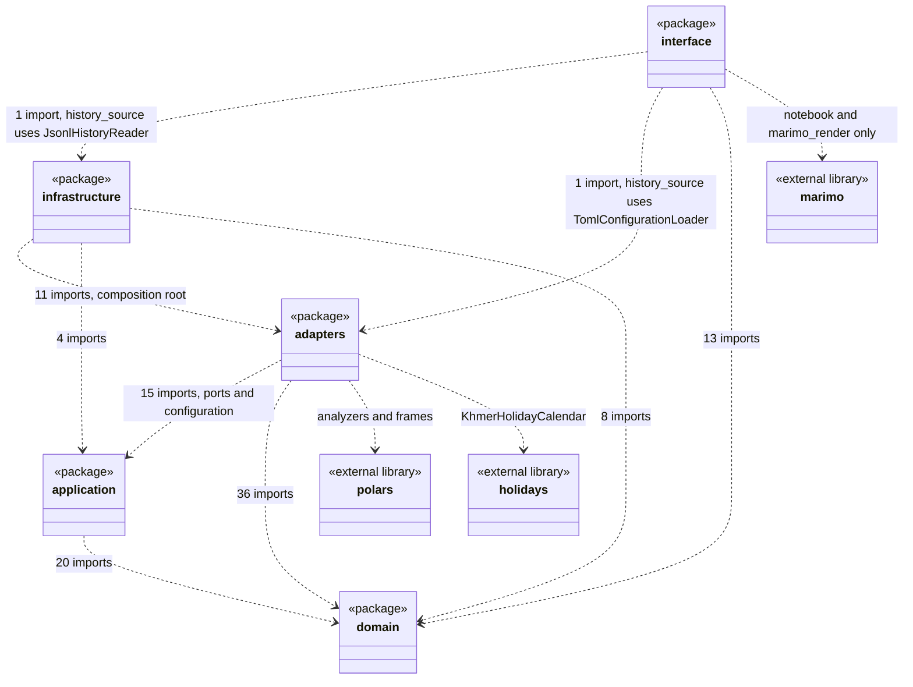

The five layers are ordered `interface` (outermost), `infrastructure`, `adapters`, `application`, `domain` (innermost), as in the `layers` contract of `pyproject.toml`; the layer dependency rule and its enforcement are in the Dependency Check.

### Domain layer, part 1: booking, analysis and result

Entities and value objects of the analysis core. `Notice` is drawn in part 3 with the errors. `GroupStatistic` and `Holiday` have no association in the built code (deviations DD-3 and DD-4); `HolidayWindow` was removed on 2026-09-30.

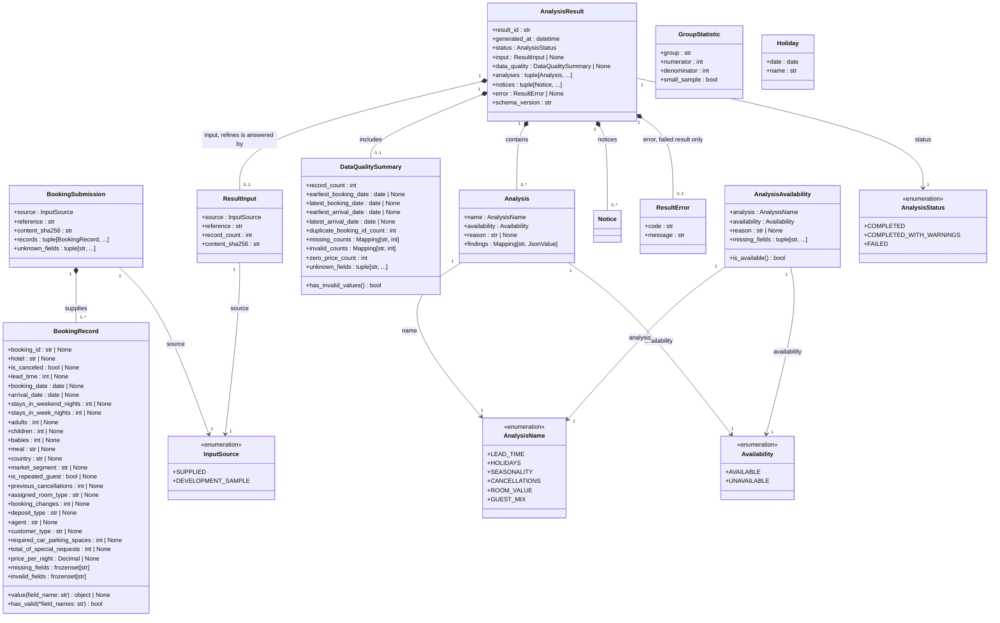

### Domain layer, part 2: rules, history and day classification

Value objects for the retention rule and the history readout, the field requirements, the bands and buckets of [ADR-0007], the day classification, and four modules of pure functions (Pure Fabrication) that hold the rules without library use. `Result History` itself has no class (deviation DD-2).

```mermaid
classDiagram
    class RetentionPolicy {
        +limit : int
    }
    class HistoryReadout {
        +results : tuple[Mapping[str, JsonValue], ...]
        +malformed_line_count : int
    }
    class AnalysisRequirement {
        +analysis : AnalysisName
        +all_of : tuple[str, ...]
        +any_of : tuple[str, ...]
    }
    class LeadTimeBand {
        +label : str
        +lower : int
        +upper : int | None
    }
    class Bucket {
        +label : str
        +lower : int
        +upper : int | None
    }
    class DayKind {
        <<enumeration>>
        +HOLIDAY
        +BEFORE
        +AFTER
        +BASELINE
    }
    class DayClass {
        +day : date
        +kind : DayKind
        +distance : int | None
    }
    class quality {
        <<module>>
        +records_with_valid(records: Iterable[BookingRecord], *field_names: str) tuple[BookingRecord, ...]
        +summarize(records: tuple[BookingRecord, ...], unknown_fields: tuple[str, ...] = ...) DataQualitySummary
        +usable_fields(records: tuple[BookingRecord, ...]) frozenset[str]
        +assess_availability(records: tuple[BookingRecord, ...]) tuple[AnalysisAvailability, ...]
    }
    class analysis_rules {
        <<module>>
        +capped_labels(cap: int) tuple[str, ...]
        +is_small_sample(group_size: int, min_group_size: int) bool
        +rate_statistic(group: str, numerator: int, denominator: int, min_group_size: int) GroupStatistic
        +count_statistic(group: str, count: int, total: int, min_group_size: int) GroupStatistic
        +figure_to_json(statistic: GroupStatistic) dict[str, JsonValue]
        +month_bounds(year: int, month: int) tuple[date, date]
        +is_partial_period(period_start: date, period_end: date, first_observed: date, last_observed: date) bool
        +iso_week_bounds(iso_year: int, iso_week: int) tuple[date, date]
        +is_partial_month(label: str, first_observed: date, last_observed: date) bool
        +is_partial_iso_week(label: str, first_observed: date, last_observed: date) bool
        +decimal_string(value: Decimal) str
        +mean_decimal_string(total: Decimal, count: int) str
        +unavailable_marker(reason: str) dict[str, JsonValue]
        +missing_field_reason(*field_names: str) str
    }
    class holiday_days {
        <<module>>
        +classify_days(first: date, last: date, holidays: Iterable[date], windows: tuple[int, ...]) tuple[DayClass, ...]
    }
    class wording {
        <<module>>
        +forbidden_words_in(text: str) tuple[str, ...]
        +finding_texts(value: JsonValue) list[str]
        +forbidden_words_in_findings(findings: Mapping[str, JsonValue]) tuple[str, ...]
    }
    DayClass "1" --> "1" DayKind : kind
    AnalysisRequirement "1" --> "1" AnalysisName : analysis
    quality ..> DataQualitySummary : creates
    quality ..> AnalysisAvailability : creates
    quality ..> AnalysisRequirement : reads ANALYSIS_REQUIREMENTS
    analysis_rules ..> LeadTimeBand : reads LEAD_TIME_BANDS
    analysis_rules ..> Bucket : reads STAY_BUCKETS
    analysis_rules ..> GroupStatistic : creates
    holiday_days ..> DayClass : creates
```

### Domain layer, part 3: errors and notices

The exception hierarchy that realizes the exceptions of [OC-001] and the `Notice` value object. `Exception` is the Python built-in.

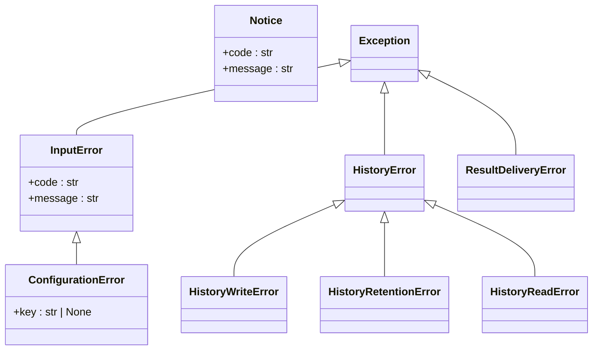

### Application layer, part 1: use case, configuration and data

The use case controller `AnalyzeBookings` holds its collaborators as ports (aggregation: the objects are created and owned by the composition root and shared, not by the use case) and creates only its outcome. The classes `Notice`, `RetentionPolicy`, `BookingSubmission`, `DataQualitySummary`, `AnalysisAvailability`, `AnalysisResult` and `Analysis` are drawn in the domain diagrams, and the ports in part 2.

```mermaid
classDiagram
    class AnalyzeBookings {
        +configuration_loader : ConfigurationLoader
        +booking_loader : BookingLoader
        +serializer : ResultSerializer
        +history_writer : HistoryWriter
        +history_reader : HistoryReader
        +sink : ResultSink
        +clock : Clock
        +ids : ResultIdGenerator
        +analyzers : tuple[Analyzer, ...]
        +run(input_path: Path | None, config_path: Path | None) AnalyzeOutcome
        -_store_and_deliver(result: AnalysisResult, configuration: AppConfiguration) AnalyzeOutcome
        -_history_failure(result: AnalysisResult, error: HistoryError)$ AnalyzeOutcome
        -_deliver_failure(error: InputError, notices: tuple[Notice, ...]) AnalyzeOutcome
        -_malformed_lines(configuration: AppConfiguration) int | None
    }
    class AnalyzeOutcome {
        +status : RunStatus
        +result_id : str
        +serialized : str | None
        +message : str | None
        +malformed_history_lines : int | None
    }
    class RunStatus {
        <<enumeration>>
        +SUCCEEDED
        +INPUT_FAILED
        +HISTORY_FAILED
        +DELIVERY_FAILED
    }
    class AppConfiguration {
        +environment : Environment
        +history_path : Path
        +retention : RetentionPolicy
        +holiday_windows_days : tuple[int, ...]
        +min_group_size : int
    }
    class LoadedConfiguration {
        +configuration : AppConfiguration
        +notices : tuple[Notice, ...]
    }
    class Environment {
        <<enumeration>>
        +PRODUCTION
        +DEVELOPMENT
    }
    class BookingLoader {
        +supplied_reader : BookingReader
        +development_reader : BookingReader
        +development_sample_path : Path
        +load(input_path: Path | None, environment: Environment) BookingSubmission
    }
    class ValidatedBookings {
        +submission : BookingSubmission
        +summary : DataQualitySummary
        +availability : tuple[AnalysisAvailability, ...]
        +usable_fields : frozenset[str]
        +records_for(*field_names: str) tuple[BookingRecord, ...]
    }
    class validate_bookings {
        <<module>>
        +validate_bookings(submission: BookingSubmission) ValidatedBookings
    }
    class build_result {
        <<module>>
        +build_result(validated: ValidatedBookings, config_notices: tuple[Notice, ...], result_id: str, generated_at: datetime, configuration: AppConfiguration | None = None, analyzers: tuple[Analyzer, ...] = ...) AnalysisResult
        +build_failed_result(error: InputError, notices: tuple[Notice, ...], result_id: str, generated_at: datetime) AnalysisResult
    }
    class placeholder_analyses {
        <<module>>
        +run_analyses(validated: ValidatedBookings, configuration: AppConfiguration, analyzers: tuple[Analyzer, ...] = ...) tuple[tuple[Analysis, ...], tuple[Notice, ...]]
    }
    AnalyzeBookings "1" o-- "1" ConfigurationLoader : configuration_loader
    AnalyzeBookings "1" o-- "1" BookingLoader : booking_loader
    AnalyzeBookings "1" o-- "1" ResultSerializer : serializer
    AnalyzeBookings "1" o-- "1" HistoryWriter : history_writer
    AnalyzeBookings "1" o-- "1" HistoryReader : history_reader
    AnalyzeBookings "1" o-- "1" ResultSink : sink
    AnalyzeBookings "1" o-- "1" Clock : clock
    AnalyzeBookings "1" o-- "1" ResultIdGenerator : ids
    AnalyzeBookings "1" o-- "0..*" Analyzer : analyzers
    AnalyzeBookings ..> AnalyzeOutcome : creates
    AnalyzeBookings ..> validate_bookings : calls
    AnalyzeBookings ..> build_result : calls
    AnalyzeOutcome "1" --> "1" RunStatus : status
    LoadedConfiguration "1" *-- "1" AppConfiguration : configuration
    LoadedConfiguration "1" o-- "0..*" Notice : notices
    AppConfiguration "1" --> "1" Environment : environment
    AppConfiguration "1" *-- "1" RetentionPolicy : retention
    BookingLoader "1" o-- "2" BookingReader : supplied_reader and development_reader
    BookingLoader ..> Environment : reads
    BookingLoader ..> BookingSubmission : returns
    ValidatedBookings "1" o-- "1" BookingSubmission : submission
    ValidatedBookings "1" o-- "1" DataQualitySummary : summary
    ValidatedBookings "1" *-- "6" AnalysisAvailability : availability
    validate_bookings ..> ValidatedBookings : creates
    build_result ..> AnalysisResult : creates
    build_result ..> placeholder_analyses : calls run_analyses
    placeholder_analyses ..> Analysis : creates
```

### Application layer, part 2: ports

The `Protocol` ports (structural interfaces) that the use case needs. They live in `application` so the use case depends on them and the outer layers implement them (Dependency Inversion).

```mermaid
classDiagram
    class ConfigurationLoader {
        <<Protocol>>
        +load(explicit_path: Path | None) LoadedConfiguration
    }
    class BookingReader {
        <<Protocol>>
        +read(location: Path) BookingSubmission
    }
    class ResultSerializer {
        <<Protocol>>
        +serialize(result: AnalysisResult) str
    }
    class HistoryWriter {
        <<Protocol>>
        +append(location: Path, line: str, retention: RetentionPolicy) None
    }
    class HistoryReader {
        <<Protocol>>
        +read(location: Path) HistoryReadout
    }
    class ResultSink {
        <<Protocol>>
        +write(line: str) None
    }
    class Clock {
        <<Protocol>>
        +now() datetime
    }
    class ResultIdGenerator {
        <<Protocol>>
        +new_id() str
    }
    class Analyzer {
        <<Protocol>>
        +name() AnalysisName
        +analyze(validated: ValidatedBookings, configuration: AppConfiguration) Analysis
    }
    class HolidayCalendar {
        <<Protocol>>
        +holidays_in_year(year: int) tuple[Holiday, ...]
    }
    ConfigurationLoader ..> LoadedConfiguration : returns
    BookingReader ..> BookingSubmission : returns
    ResultSerializer ..> AnalysisResult : reads
    HistoryWriter ..> RetentionPolicy : reads
    HistoryReader ..> HistoryReadout : returns
    Analyzer ..> ValidatedBookings : reads
    Analyzer ..> AppConfiguration : reads
    Analyzer ..> Analysis : returns
    HolidayCalendar ..> Holiday : returns
```

### Adapters layer

Adapters implement the ports. The six analyzers are the concrete strategies of the `Analyzer` port and use polars inside their methods; `HolidayAnalyzer` receives a `HolidayCalendar` (aggregation, injected and shared). Private helper classes are omitted (see Omitted classes).


### Infrastructure layer

Adapters for file, clock, identifier and stream, the command-line entry `cli`, and the composition root `bootstrap` (Factory). `bootstrap` is the only module that names the concrete adapter classes; `cli` calls it.

```mermaid
classDiagram
    class FileLock {
        -_path : Path
        -_wait_seconds : float
        -_stale_after_seconds : float
        -_poll_seconds : float
        -_clock : Callable[[], float]
        -_held : bool
        +acquire() None
        +release() None
        -_try_create() bool
        -_remove_if_stale() bool
    }
    class JsonlHistoryReader {
        -_base_directory : Path
        +read(location: Path) HistoryReadout
    }
    class JsonlHistoryWriter {
        -_lock_wait_seconds : float
        -_lock_stale_after_seconds : float
        -_replace : Callable[[Path, Path], None]
        -_base_directory : Path
        +append(location: Path, line: str, retention: RetentionPolicy) None
        -_payload(line: str)$ bytes
        -_append(location: Path, payload: bytes)$ None
    }
    class SystemClock {
        +now() datetime
    }
    class UuidGenerator {
        +new_id() str
    }
    class StreamResultSink {
        -_stream : BinaryIO
        +write(line: str) None
    }
    class cli {
        <<module>>
        +build_parser() argparse.ArgumentParser
        +main(argv: Sequence[str], stdout: BinaryIO, stderr: TextIO, working_directory: Path, environ: Mapping[str, str], lock_wait_seconds: float = LOCK_WAIT_SECONDS) int
    }
    class bootstrap {
        <<module>>
        +build_analyze_bookings(stdout: BinaryIO, working_directory: Path, environ: Mapping[str, str], lock_wait_seconds: float = LOCK_WAIT_SECONDS) AnalyzeBookings
        +build_analyzers() tuple[Analyzer, ...]
    }
    class jsonl_format {
        <<module>>
        +split_lines(content: bytes) list[bytes]
        +parse_valid_result(line: bytes) dict[str, JsonValue] | None
        +is_blank(line: bytes) bool
    }
    class jsonl_retention {
        <<module>>
        +enforce_retention(path: Path, limit: int, replace: Callable[[Path, Path], None] = os.replace) int
    }
    JsonlHistoryWriter ..|> HistoryWriter : realizes
    JsonlHistoryReader ..|> HistoryReader : realizes
    SystemClock ..|> Clock : realizes
    UuidGenerator ..|> ResultIdGenerator : realizes
    StreamResultSink ..|> ResultSink : realizes
    JsonlHistoryWriter ..> FileLock : creates for each append
    JsonlHistoryWriter ..> jsonl_retention : calls enforce_retention
    JsonlHistoryWriter ..> jsonl_format : calls
    JsonlHistoryReader ..> jsonl_format : calls
    jsonl_retention ..> jsonl_format : calls
    cli ..> bootstrap : calls build_analyze_bookings
    cli ..> AnalyzeOutcome : reads status and message
    bootstrap ..> AnalyzeBookings : creates
    bootstrap ..> BookingLoader : creates
    bootstrap ..> TomlConfigurationLoader : creates
    bootstrap ..> JsonBookingReader : creates
    bootstrap ..> DevelopmentCsvReader : creates
    bootstrap ..> JsonResultSerializer : creates
    bootstrap ..> KhmerHolidayCalendar : creates
    bootstrap ..> HolidayAnalyzer : creates
    bootstrap ..> LeadTimeAnalyzer : creates
    bootstrap ..> SeasonalityAnalyzer : creates
    bootstrap ..> CancellationAnalyzer : creates
    bootstrap ..> RoomValueAnalyzer : creates
    bootstrap ..> GuestMixAnalyzer : creates
    bootstrap ..> JsonlHistoryWriter : creates
    bootstrap ..> JsonlHistoryReader : creates
    bootstrap ..> StreamResultSink : creates
    bootstrap ..> SystemClock : creates
    bootstrap ..> UuidGenerator : creates
```

### Interface layer, part 1: the history list

The read-only entry of the notebook. `history_notebook` is the marimo notebook file (its cells are functions of the `app` object, not classes). `history_source` is the only module of the interface that touches adapters and infrastructure classes.

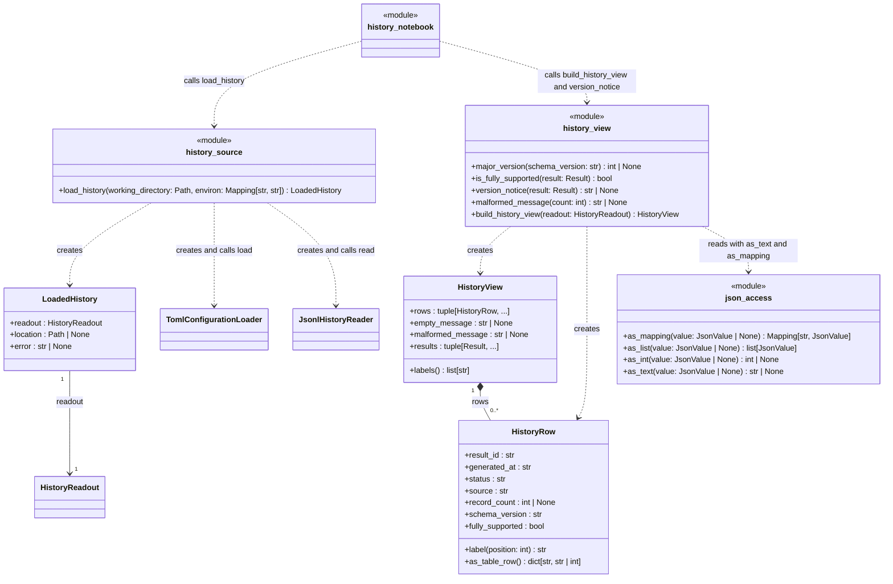

### Interface layer, part 2: shared view helpers and rendering

Helpers shared by the six analysis views: the tolerant accessor of findings, the limitation notes, the data-quality view and the single module that imports marimo for rendering (`marimo_render`).

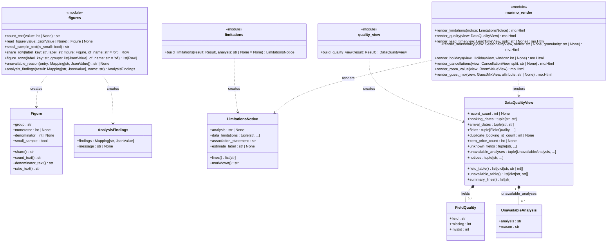

### Interface layer, part 3: the analysis views

One view model per Analysis (a frozen dataclass) and one module with its `build_*_view` function that creates it from the stored result. The view models answer the option lists and the tables that the notebook shows.

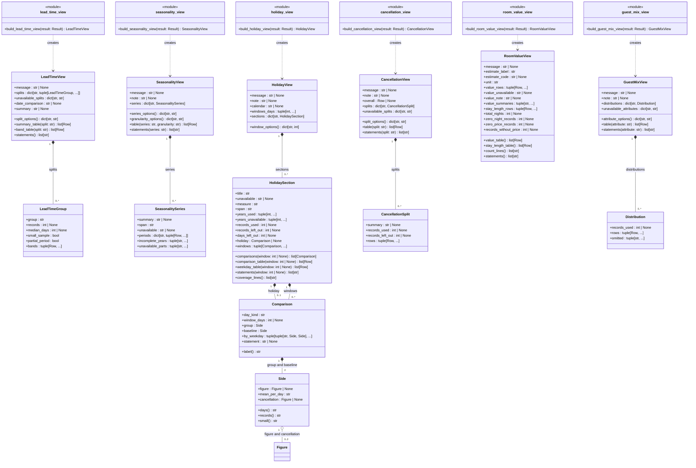

## Class Table

One row per class, `Protocol`, enumeration or module drawn above (`layer` after the kind). The column Attributes lists the attribute names (enumeration members for enums) and Operations the method names; the types and signatures are in the diagrams, and the signatures of the operations are repeated in Method Traceability. Rows marked (module) are function groups. SOLID was applied as follows: single responsibility (each class has one sentence of responsibility; the widest class, `BookingRecord`, is a pure data holder with the 24 fields of the input contract and two lookup methods, and the use case `AnalyzeBookings` has one public method and four private steps); open/closed (a new analysis is a new `Analyzer` class added to `build_analyzers` without changing `AnalyzeBookings` or `run_analyses`); Liskov (the six analyzers, the two readers and the JSONL and stream adapters are interchangeable through their ports); interface segregation (one method per port, and the history port is split into `HistoryWriter` and `HistoryReader` because the run writes and the notebook reads); dependency inversion (`application` depends on the ports it declares, and `adapters` and `infrastructure` implement them). No class has more than one axis of change, so no god class exists.

| Class | Refines (Domain Model concept) | Responsibility | Attributes | Operations |
| --- | --- | --- | --- | --- |
| `BookingSubmission` (class, domain) | Booking Submission | Holds the source, reference, content hash and records of one submission. | `source`, `reference`, `content_sha256`, `records`, `unknown_fields` | none |
| `BookingRecord` (class, domain) | Booking Record | Holds the validated fields of one booking and which fields are missing or invalid. | `booking_id`, `hotel`, `is_canceled`, `lead_time`, `booking_date`, `arrival_date`, `stays_in_weekend_nights`, `stays_in_week_nights`, `adults`, `children`, `babies`, `meal`, `country`, `market_segment`, `is_repeated_guest`, `previous_cancellations`, `assigned_room_type`, `booking_changes`, `deposit_type`, `agent`, `customer_type`, `required_car_parking_spaces`, `total_of_special_requests`, `price_per_night`, `missing_fields`, `invalid_fields` | `value`, `has_valid` |
| `InputSource` (enum, domain) | Booking Submission (source) | States whether a submission was supplied or the development sample. | `SUPPLIED`, `DEVELOPMENT_SAMPLE` | none |
| `DataQualitySummary` (class, domain) | Data Quality Summary | Holds record count, date coverage, duplicate IDs and missing and invalid counts. | `record_count`, `earliest_booking_date`, `latest_booking_date`, `earliest_arrival_date`, `latest_arrival_date`, `duplicate_booking_id_count`, `missing_counts`, `invalid_counts`, `zero_price_count`, `unknown_fields` | `has_invalid_values` |
| `AnalysisResult` (class, domain) | Analysis Result | Holds the complete outcome of one run and checks its own consistency. | `result_id`, `generated_at`, `status`, `input`, `data_quality`, `analyses`, `notices`, `error`, `schema_version` | none |
| `ResultInput` (class, domain) | Analysis Result, is answered by Booking Submission (DD-5) | Holds the input metadata of a result without the records. | `source`, `reference`, `record_count`, `content_sha256` | none |
| `ResultError` (class, domain) | Analysis Result (failed status) | Holds the error code and message of a failed result. | `code`, `message` | none |
| `AnalysisStatus` (enum, domain) | Analysis Result (status) | States how a run ended: completed, completed with warnings or failed. | `COMPLETED`, `COMPLETED_WITH_WARNINGS`, `FAILED` | none |
| `Analysis` (class, domain) | Analysis (and its six kinds through `name`, DD-1) | Holds name, availability, reason and findings of one analysis in a result. | `name`, `availability`, `reason`, `findings` | none |
| `AnalysisName` (enum, domain) | Analysis (name; the six kinds Lead Time to Guest Mix Analysis) | Names the six analyses of UC-001 step 4. | `LEAD_TIME`, `HOLIDAYS`, `SEASONALITY`, `CANCELLATIONS`, `ROOM_VALUE`, `GUEST_MIX` | none |
| `Availability` (enum, domain) | Analysis (availability) | States whether an analysis could run. | `AVAILABLE`, `UNAVAILABLE` | none |
| `AnalysisAvailability` (class, domain) | Analysis (availability, unavailable reason) | Holds availability, reason and missing fields of one analysis derived from the required fields before it runs. | `analysis`, `availability`, `reason`, `missing_fields` | `is_available` |
| `GroupStatistic` (class, domain) | Group Statistic | Holds group, numerator, denominator and small-sample flag of one count-based figure. | `group`, `numerator`, `denominator`, `small_sample` | none |
| `Holiday` (class, domain) | Holiday | Holds the date and name of one public holiday. | `date`, `name` | none |
| `RetentionPolicy` (class, domain) | Retention Policy | Holds the retention limit and rejects a value below 1. | `limit` | none |
| `HistoryReadout` (class, domain) | Result History (readable content) | Holds the valid retained results in file order and the count of malformed lines. | `results`, `malformed_line_count` | none |
| `AnalysisRequirement` (class, domain) | Analysis (required fields, ADR-0001 matrix) | Holds the fields one analysis needs. | `analysis`, `all_of`, `any_of` | none |
| `LeadTimeBand` (class, domain) | none (design value object of the bands in ADR-0007) | Holds one lead-time band with its bounds. | `label`, `lower`, `upper` | none |
| `Bucket` (class, domain) | none (design value object of the stay buckets in ADR-0007) | Holds one whole-number bucket with its bounds. | `label`, `lower`, `upper` | none |
| `DayKind` (enum, domain) | Holiday Window (design value object) | Classifies a calendar day as holiday, before, after or baseline. | `HOLIDAY`, `BEFORE`, `AFTER`, `BASELINE` | none |
| `DayClass` (class, domain) | Holiday Window (design value object) | Holds the class and the distance to the closest holiday of one day. | `day`, `kind`, `distance` | none |
| `quality` (module, domain) | Data Quality Summary, Analysis (availability) | Summarizes records and assesses availability with no library. | none | records_with_valid, summarize, usable_fields, assess_availability |
| `analysis_rules` (module, domain) | Group Statistic, Lead Time Analysis, Room Value Analysis | Holds the count, band, bucket and partial-period rules. | none | capped_labels, is_small_sample, rate_statistic, count_statistic, figure_to_json, month_bounds, is_partial_period, iso_week_bounds, is_partial_month, is_partial_iso_week, decimal_string, mean_decimal_string, unavailable_marker, missing_field_reason |
| `holiday_days` (module, domain) | Holiday, Holiday Window | Classifies calendar days relative to holidays. | none | classify_days |
| `wording` (module, domain) | Analysis (association wording, ADR-0007) | Holds the fixed wording and the forbidden-word check. | none | forbidden_words_in, finding_texts, forbidden_words_in_findings |
| `Notice` (class, domain) | none (notices of the Analysis Result, ADR-0002) | Holds a code and message of a non-fatal condition. | `code`, `message` | none |
| `InputError` (class, domain) | none (exception of OC-001 analyzeBookings) | Signals that the input or configuration cannot be used, with a code. | `code`, `message` | none |
| `ConfigurationError` (class, domain) | none (exception of OC-001 analyzeBookings) | Signals an invalid configuration file or value, naming the key. | `key` | none |
| `HistoryError` (class, domain) | none (exception of OC-001) | Base of the errors of the Result History. | none | none |
| `HistoryWriteError` (class, domain) | none (exception of OC-001) | Signals that the result was not appended or the lock was not taken. | none | none |
| `HistoryRetentionError` (class, domain) | none (exception of OC-001) | Signals that retention failed after a successful append. | none | none |
| `HistoryReadError` (class, domain) | none (exception of OC-001) | Signals that an existing history file cannot be read. | none | none |
| `ResultDeliveryError` (class, domain) | none (exception of OC-001) | Signals that the result cannot be written to the caller. | none | none |
| `AnalyzeBookings` (class, application) | none (use case controller of UC-001) | Runs one analysis end to end and delegates each step. | `configuration_loader`, `booking_loader`, `serializer`, `history_writer`, `history_reader`, `sink`, `clock`, `ids`, `analyzers` | `run`, `_store_and_deliver`, `_history_failure`, `_deliver_failure`, `_malformed_lines` |
| `AnalyzeOutcome` (class, application) | none (return value of the use case) | Carries status, result identifier, serialized line and message from the use case to the command line. | `status`, `result_id`, `serialized`, `message`, `malformed_history_lines` | none |
| `RunStatus` (enum, application) | none (outcome of a run, [ADR-0005]) | States how a run ended, one value per exit code. | `SUCCEEDED`, `INPUT_FAILED`, `HISTORY_FAILED`, `DELIVERY_FAILED` | none |
| `AppConfiguration` (class, application) | Retention Policy and Result History location as configuration (DD-2) | Holds the validated settings with the [ADR-0004] defaults. | `environment`, `history_path`, `retention`, `holiday_windows_days`, `min_group_size` | none |
| `LoadedConfiguration` (class, application) | none | Holds the settings and the notices raised while reading them. | `configuration`, `notices` | none |
| `Environment` (enum, application) | none (configuration value) | States production or development; only development allows the CSV fallback. | `PRODUCTION`, `DEVELOPMENT` | none |
| `BookingLoader` (class, application) | Booking Submission (chooses the source) | Chooses the supplied file or the development sample and loads it. | `supplied_reader`, `development_reader`, `development_sample_path` | `load` |
| `ValidatedBookings` (class, application) | Booking Submission with Data Quality Summary and Analysis availability | Holds a submission with its summary and availability and hands out records with valid values. | `submission`, `summary`, `availability`, `usable_fields` | `records_for` |
| `validate_bookings` (module, application) | Data Quality Summary | Validates a submission and summarizes its quality. | none | validate_bookings |
| `build_result` (module, application) | Analysis Result | Assembles the result or the failed result. | none | build_result, build_failed_result |
| `placeholder_analyses` (module, application) | Analysis | Applies the analyzers to the six analyses and reports placeholders. | none | run_analyses |
| `ConfigurationLoader` (Protocol, application) | none (port) | Reads the configuration once at the start of a run. | none | `load` |
| `BookingReader` (Protocol, application) | Booking Submission (port) | Reads booking records from one file. | none | `read` |
| `ResultSerializer` (Protocol, application) | Analysis Result (port) | Turns a result into one compact JSON line. | none | `serialize` |
| `HistoryWriter` (Protocol, application) | Result History and Retention Policy (port) | Appends a serialized result and applies retention. | none | `append` |
| `HistoryReader` (Protocol, application) | Result History (port) | Reads the history tolerantly without changing it. | none | `read` |
| `ResultSink` (Protocol, application) | none (port) | Hands the serialized result to the caller. | none | `write` |
| `Clock` (Protocol, application) | none (port) | Supplies the current timezone-aware time. | none | `now` |
| `ResultIdGenerator` (Protocol, application) | Analysis Result (result identifier, port) | Supplies unique result identifiers. | none | `new_id` |
| `Analyzer` (Protocol, application) | Analysis (port of the six kinds, DD-1) | Computes one analysis from validated bookings. | none | `name`, `analyze` |
| `HolidayCalendar` (Protocol, application) | Holiday (port) | Supplies the public holidays of one year. | none | `holidays_in_year` |
| `TomlConfigurationLoader` (class, adapters) | none (adapter of ConfigurationLoader) | Reads and validates the TOML configuration file. | `_working_directory`, `_environ` | `resolve_path`, `load`, `_parse` |
| `JsonBookingReader` (class, adapters) | Booking Submission (adapter) | Reads a JSON array of bookings into a submission. | none | `read`, `_decode` |
| `DevelopmentCsvReader` (class, adapters) | Booking Submission (adapter) | Reads the development sample CSV into a submission. | none | `read` |
| `JsonResultSerializer` (class, adapters) | Analysis Result (adapter) | Serializes a result to one line of compact JSON. | none | `serialize` |
| `KhmerHolidayCalendar` (class, adapters) | Holiday (adapter) | Supplies Cambodian public holidays from the holidays package. | none | `holidays_in_year` |
| `LeadTimeAnalyzer` (class, adapters) | Lead Time Analysis (strategy, DD-1) | Computes the lead-time analysis. | none | `name`, `analyze` |
| `HolidayAnalyzer` (class, adapters) | Holiday Analysis, Holiday Window (strategy, DD-1) | Computes the holiday analysis with the calendar. | `_calendar` | `name`, `analyze`, `_side` |
| `SeasonalityAnalyzer` (class, adapters) | Seasonality Analysis (strategy, DD-1) | Computes the seasonality analysis. | none | `name`, `analyze` |
| `CancellationAnalyzer` (class, adapters) | Cancellation Analysis (strategy, DD-1) | Computes the cancellation analysis. | none | `name`, `analyze` |
| `RoomValueAnalyzer` (class, adapters) | Room Value Analysis (strategy, DD-1) | Computes stay length and the estimated booking value. | none | `name`, `analyze` |
| `GuestMixAnalyzer` (class, adapters) | Guest Mix Analysis (strategy, DD-1) | Computes the guest and booking mix. | none | `name`, `analyze` |
| `FileLock` (class, infrastructure) | none (locking of the Result History, [ADR-0003]) | Holds the exclusive lock file during an append. | `_path`, `_wait_seconds`, `_stale_after_seconds`, `_poll_seconds`, `_clock`, `_held` | `acquire`, `release`, `_try_create`, `_remove_if_stale` |
| `JsonlHistoryReader` (class, infrastructure) | Result History (adapter) | Reads the JSONL history and counts malformed lines. | `_base_directory` | `read` |
| `JsonlHistoryWriter` (class, infrastructure) | Result History and Retention Policy (adapter) | Appends one line under the lock and applies retention. | `_lock_wait_seconds`, `_lock_stale_after_seconds`, `_replace`, `_base_directory` | `append`, `_payload`, `_append` |
| `SystemClock` (class, infrastructure) | none (adapter of Clock) | Returns the current UTC time. | none | `now` |
| `UuidGenerator` (class, infrastructure) | Analysis Result (adapter) | Returns random UUID identifiers. | none | `new_id` |
| `StreamResultSink` (class, infrastructure) | none (adapter of ResultSink) | Writes the result line to a binary stream and flushes. | `_stream` | `write` |
| `cli` (module, infrastructure) | none | Parses arguments, runs the use case and maps the outcome to the exit code. | none | build_parser, main |
| `bootstrap` (module, infrastructure) | none | Composition root: creates the adapters and the use case. | none | build_analyze_bookings, build_analyzers |
| `jsonl_format` (module, infrastructure) | Result History (line format) | Holds the line-level rules of the JSONL history. | none | split_lines, parse_valid_result, is_blank |
| `jsonl_retention` (module, infrastructure) | Retention Policy | Removes the oldest valid results beyond the limit. | none | enforce_retention |
| `LoadedHistory` (class, interface) | Result History (read outcome) | Holds the readout, the location and an error message of the history read. | `readout`, `location`, `error` | none |
| `HistoryRow` (class, interface) | Analysis Result (list row) | Holds the listed fields of one retained result. | `result_id`, `generated_at`, `status`, `source`, `record_count`, `schema_version`, `fully_supported` | `label`, `as_table_row` |
| `HistoryView` (class, interface) | Result History (list view model) | Holds rows, empty and malformed messages and the parsed results. | `rows`, `empty_message`, `malformed_message`, `results` | `labels` |
| `history_notebook` (module, interface) | none (marimo notebook of UC-002) | Wires the cells: read the history, pick a result, show the views. | none | none (notebook cells) |
| `history_source` (module, interface) | Result History (read access) | Reads the configured history and turns failures into a message. | none | load_history |
| `history_view` (module, interface) | Result History (list view model) | Builds the newest-first list and the version notice. | none | major_version, is_fully_supported, version_notice, malformed_message, build_history_view |
| `json_access` (module, interface) | none | Gives tolerant access to parsed result parts. | none | as_mapping, as_list, as_int, as_text |
| `Figure` (class, interface) | Group Statistic (view of the stored figure) | Holds one stored figure read from a finding. | `group`, `numerator`, `denominator`, `small_sample` | `share`, `count_text`, `denominator_text`, `ratio_text` |
| `AnalysisFindings` (class, interface) | Analysis (stored findings) | Holds the findings of one stored Analysis or the reason there are none. | `findings`, `message` | none |
| `LimitationsNotice` (class, interface) | Analysis (limitation notes) | Holds the limitation statements shown with the views. | `analysis`, `data_limitations`, `association_statement`, `estimate_label` | `lines`, `markdown` |
| `FieldQuality` (class, interface) | Data Quality Summary (per field) | Holds missing and invalid counts of one field. | `field`, `missing`, `invalid` | none |
| `UnavailableAnalysis` (class, interface) | Analysis (unavailable reason) | Holds an unavailable analysis and its reason. | `analysis`, `reason` | none |
| `DataQualityView` (class, interface) | Data Quality Summary (view model) | Holds what the data-quality section shows. | `record_count`, `booking_dates`, `arrival_dates`, `fields`, `duplicate_booking_id_count`, `zero_price_count`, `unknown_fields`, `unavailable_analyses`, `notices` | `field_table`, `unavailable_table`, `summary_lines` |
| `figures` (module, interface) | Group Statistic (stored figures) | Reads stored figures and findings into rows. | none | count_text, read_figure, small_sample_text, share_row, figure_rows, unavailable_reason, analysis_findings |
| `limitations` (module, interface) | Analysis (limitation notes) | Builds the limitation notes of a view. | none | build_limitations |
| `quality_view` (module, interface) | Data Quality Summary (view model) | Builds the data-quality view. | none | build_quality_view |
| `marimo_render` (module, interface) | none | Renders view models with marimo, the only module beside the notebook that imports it. | none | render_limitations, render_quality, render_lead_time, render_seasonality, render_holidays, render_cancellations, render_room_value, render_guest_mix |
| `LeadTimeGroup` (class, interface) | Group Statistic (lead time group) | Holds one lead-time group with median and bands. | `group`, `records`, `median_days`, `small_sample`, `partial_period`, `bands` | none |
| `LeadTimeView` (class, interface) | Lead Time Analysis (view model) | Holds what the lead-time section shows and its split options. | `message`, `splits`, `unavailable_splits`, `date_comparison`, `summary` | `split_options`, `summary_table`, `band_table`, `statements` |
| `SeasonalitySeries` (class, interface) | Seasonality Analysis (series) | Holds one seasonality series with periods per granularity. | `summary`, `span`, `unavailable`, `periods`, `incomplete_years`, `unavailable_parts` | none |
| `SeasonalityView` (class, interface) | Seasonality Analysis (view model) | Holds what the seasonality section shows and its options. | `message`, `note`, `series` | `series_options`, `granularity_options`, `table`, `statements` |
| `Side` (class, interface) | Group Statistic (group or baseline side) | Holds one side of a holiday comparison. | `figure`, `mean_per_day`, `cancellation` | `days`, `records`, `small` |
| `Comparison` (class, interface) | Holiday Window (comparison) | Holds one comparison of a holiday or window against the baseline. | `day_kind`, `window_days`, `group`, `baseline`, `by_weekday`, `statement` | `label` |
| `HolidaySection` (class, interface) | Holiday Analysis (booking or arrival side) | Holds one side of the holiday analysis with coverage. | `title`, `unavailable`, `measure`, `span`, `years_used`, `years_unavailable`, `records_used`, `records_left_out`, `days_left_out`, `holiday`, `windows` | `comparisons`, `comparison_table`, `weekday_table`, `statements`, `coverage_lines` |
| `HolidayView` (class, interface) | Holiday Analysis (view model) | Holds what the holiday section shows and its window options. | `message`, `note`, `calendar`, `windows_days`, `sections` | `window_options` |
| `CancellationSplit` (class, interface) | Cancellation Analysis (split) | Holds one split of the cancellation rates. | `summary`, `records_used`, `records_left_out`, `rows` | none |
| `CancellationView` (class, interface) | Cancellation Analysis (view model) | Holds what the cancellation section shows and its split options. | `message`, `note`, `overall`, `splits`, `unavailable_splits` | `split_options`, `table`, `statements` |
| `RoomValueView` (class, interface) | Room Value Analysis (view model) | Holds the stay-length and estimated-value tables with the estimate label. | `message`, `estimate_label`, `estimate_code`, `unit`, `value_rows`, `value_unavailable`, `value_note`, `value_summaries`, `stay_length_rows`, `total_nights`, `zero_night_records`, `zero_price_records`, `records_without_price` | `value_table`, `stay_length_table`, `count_lines`, `statements` |
| `Distribution` (class, interface) | Group Statistic (guest mix attribute) | Holds the distribution of one guest-mix attribute. | `records_used`, `rows`, `omitted` | none |
| `GuestMixView` (class, interface) | Guest Mix Analysis (view model) | Holds what the guest-mix section shows and its attribute options. | `message`, `note`, `distributions`, `unavailable_attributes` | `attribute_options`, `table`, `statements` |
| `lead_time_view` (module, interface) | Lead Time Analysis (view model) | Builds the lead-time view. | none | build_lead_time_view |
| `seasonality_view` (module, interface) | Seasonality Analysis (view model) | Builds the seasonality view. | none | build_seasonality_view |
| `holiday_view` (module, interface) | Holiday Analysis (view model) | Builds the holiday view. | none | build_holiday_view |
| `cancellation_view` (module, interface) | Cancellation Analysis (view model) | Builds the cancellation view. | none | build_cancellation_view |
| `room_value_view` (module, interface) | Room Value Analysis (view model) | Builds the room-value view. | none | build_room_value_view |
| `guest_mix_view` (module, interface) | Guest Mix Analysis (view model) | Builds the guest-mix view. | none | build_guest_mix_view |

### Domain Model concepts and their design classes

Every concept of [DM-001] is listed. The concepts that are **not** a class as built are marked and say how they are represented (deviations DD-1 to DD-5).

| DM-001 concept | As built | Design class or representation |
| --- | --- | --- |
| Booking Submission | class | `BookingSubmission` (domain); `InputSource` for its source; `BookingLoader` (application) chooses the source |
| Booking Record | class | `BookingRecord` (domain) |
| Data Quality Summary | class | `DataQualitySummary` (domain), created by `quality.summarize` |
| Analysis | class | `Analysis` (domain) with `AnalysisName`, `Availability`, `AnalysisAvailability` and `AnalysisRequirement` |
| Lead Time Analysis, Holiday Analysis, Seasonality Analysis, Cancellation Analysis, Room Value Analysis, Guest Mix Analysis | **not classes in the domain** | One `Analysis` instance whose `name` is the matching `AnalysisName` member and whose `findings` are a JSON mapping (`Mapping[str, JsonValue]`); the computation is in the six strategy classes `LeadTimeAnalyzer`, `HolidayAnalyzer`, `SeasonalityAnalyzer`, `CancellationAnalyzer`, `RoomValueAnalyzer` and `GuestMixAnalyzer` (adapters). The generalization of DM-001 is realized by the `Analyzer` port (DD-1) |
| Group Statistic | class, used only transiently | `GroupStatistic` (domain) is created by `analysis_rules.count_statistic` and `rate_statistic` and converted at once by `figure_to_json` into a JSON figure inside `Analysis.findings`; a stored result holds it as JSON, and the read side reads it as `Figure` (interface) (DD-4) |
| Holiday | class | `Holiday` (domain), supplied by the `HolidayCalendar` port and `KhmerHolidayCalendar` |
| Holiday Window | **not a class** | the unused class `HolidayWindow` was removed on 2026-09-30; a window is an integer number of days (`AppConfiguration.holiday_windows_days`), each day is classified by `DayClass` and `DayKind`, and the windows appear as JSON in the holiday findings (DD-3) |
| Analysis Result | class | `AnalysisResult` (domain) with `AnalysisStatus`, `ResultInput` and `ResultError` |
| Result History | **not a class** | The JSONL file, the ports `HistoryWriter` and `HistoryReader`, their adapters `JsonlHistoryWriter` and `JsonlHistoryReader`, and the read result `HistoryReadout` (domain) (DD-2) |
| Retention Policy | class | `RetentionPolicy` (domain), passed to `HistoryWriter.append` and applied by `jsonl_retention.enforce_retention` |

| DM-001 association | As built |
| --- | --- |
| supplies (Booking Submission to Booking Record, 1 to 1..*) | composition `BookingSubmission *-- BookingRecord` |
| is answered by (Booking Submission to Analysis Result, 1 to 1) | not an association: `ResultInput` copies the source, reference, record count and content hash into the result (DD-5) |
| includes (Analysis Result to Data Quality Summary) | composition `AnalysisResult *-- DataQualitySummary`, multiplicity 0..1 because a `failed` result has none |
| contains (Analysis Result to Analysis, 1 to 0..*) | composition `AnalysisResult *-- Analysis` |
| reports (Analysis to Group Statistic) | not an association: figures are JSON inside `Analysis.findings` (DD-4) |
| compares, surrounds (Holiday Analysis, Holiday Window, Holiday) | not associations: windows are integers and JSON findings (DD-3) |
| retains (Result History to Analysis Result, 0..1 to 0..*) | the JSONL file holds the serialized results; there is no object association (DD-2) |
| is limited by (Result History to Retention Policy) | `RetentionPolicy` is a parameter of `HistoryWriter.append` (DD-2) |

### Omitted classes

The following classes exist in `src/` and are deliberately not drawn (private helpers, named with a leading underscore). They are implementation detail of one module, not part of a port, and no other module uses them.

- `application`: none.
- `adapters`: `_FieldReader`, `_Grain`, `_Side`, `_Split`, `_Summary`, `_Tally`.
- `infrastructure`: none.
- `interface`: `_Flags`.
- `domain`: none, every domain class is drawn.

The module-level functions of the adapters (`record_parsing`, `analysis_frames` and the private functions of each module) and the private functions of the other layers are not classes and are not drawn; the public functions that matter are the `<<module>>` boxes.

## Method Traceability

Every operation drawn above appears once, with the operation contract of [OC-001] and the sequence diagram message of [SD-001] it comes from (block number and message number, for example `SD 1.1 message 8` is message 8 of block 1.1). The last column reads `contract / SD message`. An operation with contract `none` is defined in the code but not called by the production flow; it is listed as deviation DD-3.

| Method signature | Operation Contract / SD message |
| --- | --- |
| `BookingRecord.value(field_name: str) -> object \| None` | `analyzeBookings` / SD 1.1 message 31 (`records_with_valid`) |
| `BookingRecord.has_valid(*field_names: str) -> bool` | `analyzeBookings` / SD 1.1 message 31 (`records_with_valid`) |
| `DataQualitySummary.has_invalid_values() -> bool` | `analyzeBookings` / SD 1.1 message 36 (`_status`) |
| `AnalysisAvailability.is_available() -> bool` | `analyzeBookings` / SD 1.1 messages 27 and 28 |
| `quality.records_with_valid(records: Iterable[BookingRecord], *field_names: str) -> tuple[BookingRecord, ...]` | `analyzeBookings` / SD 1.1 message 31 |
| `quality.summarize(records: tuple[BookingRecord, ...], unknown_fields: tuple[str, ...] = ...) -> DataQualitySummary` | `analyzeBookings` / SD 1.1 message 18 |
| `quality.usable_fields(records: tuple[BookingRecord, ...]) -> frozenset[str]` | `analyzeBookings` / SD 1.1 message 17 |
| `quality.assess_availability(records: tuple[BookingRecord, ...]) -> tuple[AnalysisAvailability, ...]` | `analyzeBookings` / SD 1.1 message 17 |
| `analysis_rules.capped_labels(cap: int) -> tuple[str, ...]` | `analyzeBookings` / SD 1.1 messages 28 to 33 (called inside `Analyzer.analyze`) |
| `analysis_rules.is_small_sample(group_size: int, min_group_size: int) -> bool` | `analyzeBookings` / SD 1.1 messages 28 to 33 (called inside `Analyzer.analyze`) |
| `analysis_rules.rate_statistic(group: str, numerator: int, denominator: int, min_group_size: int) -> GroupStatistic` | `analyzeBookings` / SD 1.1 messages 28 to 33 (called inside `Analyzer.analyze`) |
| `analysis_rules.count_statistic(group: str, count: int, total: int, min_group_size: int) -> GroupStatistic` | `analyzeBookings` / SD 1.1 messages 28 to 33 (called inside `Analyzer.analyze`) |
| `analysis_rules.figure_to_json(statistic: GroupStatistic) -> dict[str, JsonValue]` | `analyzeBookings` / SD 1.1 messages 28 to 33 (called inside `Analyzer.analyze`) |
| `analysis_rules.month_bounds(year: int, month: int) -> tuple[date, date]` | `analyzeBookings` / SD 1.1 messages 28 to 33 (called inside `Analyzer.analyze`) |
| `analysis_rules.is_partial_period(period_start: date, period_end: date, first_observed: date, last_observed: date) -> bool` | `analyzeBookings` / SD 1.1 messages 28 to 33 (called inside `Analyzer.analyze`) |
| `analysis_rules.iso_week_bounds(iso_year: int, iso_week: int) -> tuple[date, date]` | `analyzeBookings` / SD 1.1 messages 28 to 33 (called inside `Analyzer.analyze`) |
| `analysis_rules.is_partial_month(label: str, first_observed: date, last_observed: date) -> bool` | `analyzeBookings` / SD 1.1 messages 28 to 33 (called inside `Analyzer.analyze`) |
| `analysis_rules.is_partial_iso_week(label: str, first_observed: date, last_observed: date) -> bool` | `analyzeBookings` / SD 1.1 messages 28 to 33 (called inside `Analyzer.analyze`) |
| `analysis_rules.decimal_string(value: Decimal) -> str` | `analyzeBookings` / SD 1.1 messages 28 to 33 (called inside `Analyzer.analyze`) |
| `analysis_rules.mean_decimal_string(total: Decimal, count: int) -> str` | `analyzeBookings` / SD 1.1 messages 28 to 33 (called inside `Analyzer.analyze`) |
| `analysis_rules.unavailable_marker(reason: str) -> dict[str, JsonValue]` | `analyzeBookings` / SD 1.1 messages 28 to 33 (called inside `Analyzer.analyze`) |
| `analysis_rules.missing_field_reason(*field_names: str) -> str` | `analyzeBookings` / SD 1.1 messages 28 to 33 (called inside `Analyzer.analyze`) |
| `holiday_days.classify_days(first: date, last: date, holidays: Iterable[date], windows: tuple[int, ...]) -> tuple[DayClass, ...]` | `analyzeBookings` / SD 1.1 messages 28 to 33 (inside `HolidayAnalyzer.analyze`) |
| `wording.forbidden_words_in(text: str) -> tuple[str, ...]` | none / no SD message: used by the tests of the analyzers to check the wording rule (DD-3) |
| `wording.finding_texts(value: JsonValue) -> list[str]` | none / no SD message: used by the tests of the analyzers to check the wording rule (DD-3) |
| `wording.forbidden_words_in_findings(findings: Mapping[str, JsonValue]) -> tuple[str, ...]` | none / no SD message: used by the tests of the analyzers to check the wording rule (DD-3) |
| `AnalyzeBookings.run(input_path: Path \| None, config_path: Path \| None) -> AnalyzeOutcome` | `analyzeBookings` / SD 1.1 message 1, SD 1.0 message 21 |
| `AnalyzeBookings._store_and_deliver(result: AnalysisResult, configuration: AppConfiguration) -> AnalyzeOutcome` | `analyzeBookings` / SD 1.2 message 1, SD 1.4 message 1, SD 1.5 message 1 |
| `AnalyzeBookings._history_failure(result: AnalysisResult, error: HistoryError) -> AnalyzeOutcome` | `analyzeBookings` / SD 1.4 message 19 |
| `AnalyzeBookings._deliver_failure(error: InputError, notices: tuple[Notice, ...]) -> AnalyzeOutcome` | `analyzeBookings` / SD 1.3 message 17 |
| `AnalyzeBookings._malformed_lines(configuration: AppConfiguration) -> int \| None` | `analyzeBookings` / SD 1.2 message 20, SD 1.5 message 7 |
| `BookingLoader.load(input_path: Path \| None, environment: Environment) -> BookingSubmission` | `analyzeBookings` / SD 1.1 message 8, SD 1.3 message 6 |
| `ValidatedBookings.records_for(*field_names: str) -> tuple[BookingRecord, ...]` | `analyzeBookings` / SD 1.1 message 31 |
| `validate_bookings.validate_bookings(submission: BookingSubmission) -> ValidatedBookings` | `analyzeBookings` / SD 1.1 message 16 |
| `build_result.build_result(validated: ValidatedBookings, config_notices: tuple[Notice, ...], result_id: str, generated_at: datetime, configuration: AppConfiguration \| None = None, analyzers: tuple[Analyzer, ...] = ...) -> AnalysisResult` | `analyzeBookings` / SD 1.1 message 25 |
| `build_result.build_failed_result(error: InputError, notices: tuple[Notice, ...], result_id: str, generated_at: datetime) -> AnalysisResult` | `analyzeBookings` / SD 1.3 message 22 |
| `placeholder_analyses.run_analyses(validated: ValidatedBookings, configuration: AppConfiguration, analyzers: tuple[Analyzer, ...] = ...) -> tuple[tuple[Analysis, ...], tuple[Notice, ...]]` | `analyzeBookings` / SD 1.1 message 26 |
| `ConfigurationLoader.load(explicit_path: Path \| None) -> LoadedConfiguration` | `analyzeBookings` / SD 1.1 message 2 |
| `BookingReader.read(location: Path) -> BookingSubmission` | `analyzeBookings` / SD 1.1 message 11 |
| `ResultSerializer.serialize(result: AnalysisResult) -> str` | `analyzeBookings` / SD 1.2 message 2 |
| `HistoryWriter.append(location: Path, line: str, retention: RetentionPolicy) -> None` | `analyzeBookings` / SD 1.2 message 5 |
| `HistoryReader.read(location: Path) -> HistoryReadout` | `analyzeBookings` / SD 1.2 message 20 (also OC listRetainedResults, SD 2.1 message 10) |
| `ResultSink.write(line: str) -> None` | `analyzeBookings` / SD 1.2 message 17 |
| `Clock.now() -> datetime` | `analyzeBookings` / SD 1.1 message 23 |
| `ResultIdGenerator.new_id() -> str` | `analyzeBookings` / SD 1.1 message 21 |
| `Analyzer.name() -> AnalysisName` | `analyzeBookings` / SD 1.1 message 26 (`run_analyses` selects by name) |
| `Analyzer.analyze(validated: ValidatedBookings, configuration: AppConfiguration) -> Analysis` | `analyzeBookings` / SD 1.1 message 28 |
| `HolidayCalendar.holidays_in_year(year: int) -> tuple[Holiday, ...]` | `analyzeBookings` / SD 1.1 message 29 |
| `TomlConfigurationLoader.resolve_path(explicit_path: Path \| None) -> Path` | `analyzeBookings` / SD 1.1 message 3 |
| `TomlConfigurationLoader.load(explicit_path: Path \| None) -> LoadedConfiguration` | `analyzeBookings` / SD 1.1 message 2, SD 2.1 message 5 |
| `TomlConfigurationLoader._parse(path: Path) -> dict[str, object]` | `analyzeBookings` / SD 1.1 message 5 |
| `JsonBookingReader.read(location: Path) -> BookingSubmission` | `analyzeBookings` / SD 1.1 message 11 |
| `JsonBookingReader._decode(content: bytes) -> object` | `analyzeBookings` / SD 1.1 message 12 |
| `DevelopmentCsvReader.read(location: Path) -> BookingSubmission` | `analyzeBookings` / SD 1.1 message 11 |
| `JsonResultSerializer.serialize(result: AnalysisResult) -> str` | `analyzeBookings` / SD 1.2 message 3 |
| `KhmerHolidayCalendar.holidays_in_year(year: int) -> tuple[Holiday, ...]` | `analyzeBookings` / SD 1.1 message 29 |
| `LeadTimeAnalyzer.name() -> AnalysisName` | `analyzeBookings` / SD 1.1 message 28 (Analyzer.analyze) |
| `LeadTimeAnalyzer.analyze(validated: ValidatedBookings, configuration: AppConfiguration) -> Analysis` | `analyzeBookings` / SD 1.1 message 28 (Analyzer.analyze) |
| `HolidayAnalyzer.name() -> AnalysisName` | `analyzeBookings` / SD 1.1 messages 28 to 33 |
| `HolidayAnalyzer.analyze(validated: ValidatedBookings, configuration: AppConfiguration) -> Analysis` | `analyzeBookings` / SD 1.1 messages 28 to 33 |
| `HolidayAnalyzer._side(validated: ValidatedBookings, side: _Side, windows: tuple[int, ...], minimum: int) -> dict[str, JsonValue]` | `analyzeBookings` / SD 1.1 messages 29 to 32 |
| `SeasonalityAnalyzer.name() -> AnalysisName` | `analyzeBookings` / SD 1.1 message 28 |
| `SeasonalityAnalyzer.analyze(validated: ValidatedBookings, configuration: AppConfiguration) -> Analysis` | `analyzeBookings` / SD 1.1 message 28 |
| `CancellationAnalyzer.name() -> AnalysisName` | `analyzeBookings` / SD 1.1 message 28 |
| `CancellationAnalyzer.analyze(validated: ValidatedBookings, configuration: AppConfiguration) -> Analysis` | `analyzeBookings` / SD 1.1 message 28 |
| `RoomValueAnalyzer.name() -> AnalysisName` | `analyzeBookings` / SD 1.1 message 28 |
| `RoomValueAnalyzer.analyze(validated: ValidatedBookings, configuration: AppConfiguration) -> Analysis` | `analyzeBookings` / SD 1.1 message 28 |
| `GuestMixAnalyzer.name() -> AnalysisName` | `analyzeBookings` / SD 1.1 message 28 |
| `GuestMixAnalyzer.analyze(validated: ValidatedBookings, configuration: AppConfiguration) -> Analysis` | `analyzeBookings` / SD 1.1 message 28 |
| `FileLock.acquire() -> None` | `analyzeBookings` / SD 1.2 message 9, SD 1.4 message 9 |
| `FileLock.release() -> None` | `analyzeBookings` / SD 1.2 message 15, SD 1.4 message 17 |
| `FileLock._try_create() -> bool` | `analyzeBookings` / SD 1.2 message 9 (inside `acquire`) |
| `FileLock._remove_if_stale() -> bool` | `analyzeBookings` / SD 1.2 message 9 (inside `acquire`) |
| `JsonlHistoryReader.read(location: Path) -> HistoryReadout` | `listRetainedResults` / SD 2.1 message 10 (also OC analyzeBookings, SD 1.2 message 20) |
| `JsonlHistoryWriter.append(location: Path, line: str, retention: RetentionPolicy) -> None` | `analyzeBookings` / SD 1.2 message 5, SD 1.4 message 4 |
| `JsonlHistoryWriter._payload(line: str) -> bytes` | `analyzeBookings` / SD 1.2 message 6 |
| `JsonlHistoryWriter._append(location: Path, payload: bytes) -> None` | `analyzeBookings` / SD 1.2 message 11, SD 1.4 message 13 |
| `SystemClock.now() -> datetime` | `analyzeBookings` / SD 1.1 message 23 |
| `UuidGenerator.new_id() -> str` | `analyzeBookings` / SD 1.1 message 21 |
| `StreamResultSink.write(line: str) -> None` | `analyzeBookings` / SD 1.2 message 18, SD 1.5 message 5 |
| `cli.build_parser() -> argparse.ArgumentParser` | `analyzeBookings` / SD 1.0 message 2 |
| `cli.main(argv: Sequence[str], stdout: BinaryIO, stderr: TextIO, working_directory: Path, environ: Mapping[str, str], lock_wait_seconds: float = LOCK_WAIT_SECONDS) -> int` | `analyzeBookings` / SD 1.0 message 1, SD 1.2 message 25, SD 1.3 message 36 |
| `bootstrap.build_analyze_bookings(stdout: BinaryIO, working_directory: Path, environ: Mapping[str, str], lock_wait_seconds: float = LOCK_WAIT_SECONDS) -> AnalyzeBookings` | `analyzeBookings` / SD 1.0 message 4 |
| `bootstrap.build_analyzers() -> tuple[Analyzer, ...]` | `analyzeBookings` / SD 1.0 message 15 |
| `jsonl_format.split_lines(content: bytes) -> list[bytes]` | `analyzeBookings` / SD 2.1 message 14 and SD 1.2 message 13 (line splitting) |
| `jsonl_format.parse_valid_result(line: bytes) -> dict[str, JsonValue] \| None` | `listRetainedResults` / SD 2.1 message 14 (also SD 1.2 message 6) |
| `jsonl_format.is_blank(line: bytes) -> bool` | `listRetainedResults` / SD 2.1 message 14 (also SD 1.2 message 13) |
| `jsonl_retention.enforce_retention(path: Path, limit: int, replace: Callable[[Path, Path], None] = os.replace) -> int` | `analyzeBookings` / SD 1.2 message 12, SD 1.4 message 14 |
| `HistoryRow.label(position: int) -> str` | `selectResult` / SD 2.2 message 4 |
| `HistoryRow.as_table_row() -> dict[str, str \| int]` | `listRetainedResults` / SD 2.1 message 29 (the table of retained results) |
| `HistoryView.labels() -> list[str]` | `selectResult` / SD 2.2 message 3 |
| `history_source.load_history(working_directory: Path, environ: Mapping[str, str]) -> LoadedHistory` | `listRetainedResults` / SD 2.1 message 3 |
| `history_view.major_version(schema_version: str) -> int \| None` | `selectResult` / SD 2.2 message 8 |
| `history_view.is_fully_supported(result: Result) -> bool` | `selectResult` / SD 2.2 message 8 (also SD 2.1 message 22) |
| `history_view.version_notice(result: Result) -> str \| None` | `selectResult` / SD 2.2 message 7 |
| `history_view.malformed_message(count: int) -> str \| None` | `listRetainedResults` / SD 2.1 message 23 |
| `history_view.build_history_view(readout: HistoryReadout) -> HistoryView` | `listRetainedResults` / SD 2.1 message 20 |
| `json_access.as_mapping(value: JsonValue \| None) -> Mapping[str, JsonValue]` | `selectResult` / SD 2.2 message 24 (also SD 2.1 message 22) |
| `json_access.as_list(value: JsonValue \| None) -> list[JsonValue]` | `selectResult` / SD 2.2 message 24 |
| `json_access.as_int(value: JsonValue \| None) -> int \| None` | `selectResult` / SD 2.2 message 24 (also SD 2.1 message 22) |
| `json_access.as_text(value: JsonValue \| None) -> str \| None` | `selectResult` / SD 2.2 message 24 (also SD 2.1 message 22) |
| `Figure.share() -> str` | `selectResult` / SD 2.2 message 27 (used by the renderers) |
| `Figure.count_text() -> str` | `selectResult` / SD 2.2 message 27 (used by the renderers) |
| `Figure.denominator_text() -> str` | `selectResult` / SD 2.2 message 27 (used by the renderers) |
| `Figure.ratio_text() -> str` | `selectResult` / SD 2.2 message 27 (used by the renderers) |
| `LimitationsNotice.lines() -> list[str]` | `selectResult` / SD 2.2 message 29 (`lines`, `markdown`), SD 2.3 message 22 |
| `LimitationsNotice.markdown() -> str` | `selectResult` / SD 2.2 message 29 (`lines`, `markdown`), SD 2.3 message 22 |
| `DataQualityView.field_table() -> list[dict[str, str \| int]]` | `selectResult` / SD 2.2 message 19 (`field_table`, `unavailable_table`, `summary_lines`) |
| `DataQualityView.unavailable_table() -> list[dict[str, str]]` | `selectResult` / SD 2.2 message 19 (`field_table`, `unavailable_table`, `summary_lines`) |
| `DataQualityView.summary_lines() -> list[str]` | `selectResult` / SD 2.2 message 19 (`field_table`, `unavailable_table`, `summary_lines`) |
| `figures.count_text(value: int \| None) -> str` | `selectResult` / SD 2.2 message 25 |
| `figures.read_figure(value: JsonValue \| None) -> Figure \| None` | `selectResult` / SD 2.2 message 25 |
| `figures.small_sample_text(is_small: bool) -> str` | `selectResult` / SD 2.2 message 25 |
| `figures.share_row(label_key: str, label: str, figure: Figure, of_name: str = 'of') -> Row` | `selectResult` / SD 2.2 message 25 |
| `figures.figure_rows(label_key: str, groups: list[JsonValue], of_name: str = 'of') -> list[Row]` | `selectResult` / SD 2.2 message 25 |
| `figures.unavailable_reason(entry: Mapping[str, JsonValue]) -> str \| None` | `selectResult` / SD 2.2 message 24 |
| `figures.analysis_findings(result: Mapping[str, JsonValue], name: str) -> AnalysisFindings` | `selectResult` / SD 2.2 message 24 |
| `limitations.build_limitations(result: Result, analysis: str \| None = None) -> LimitationsNotice` | `selectResult` / SD 2.2 messages 17 and 29, SD 2.3 message 22 |
| `quality_view.build_quality_view(result: Result) -> DataQualityView` | `selectResult` / SD 2.2 message 14 |
| `marimo_render.render_limitations(notice: LimitationsNotice) -> mo.Html` | `selectResult` / SD 2.2 messages 19 and 29, SD 2.3 message 22 |
| `marimo_render.render_quality(view: DataQualityView) -> mo.Html` | `selectResult` / SD 2.2 message 19 |
| `marimo_render.render_lead_time(view: LeadTimeView, split: str \| None) -> mo.Html` | `selectResult` / SD 2.2 message 27 |
| `marimo_render.render_seasonality(view: SeasonalityView, series: str \| None, granularity: str \| None) -> mo.Html` | `selectResult` / SD 2.2 message 27 |
| `marimo_render.render_holidays(view: HolidayView, window: int \| None) -> mo.Html` | `chooseViewOption` / SD 2.3 message 18, SD 2.2 message 27 |
| `marimo_render.render_cancellations(view: CancellationView, split: str \| None) -> mo.Html` | `selectResult` / SD 2.2 message 27 |
| `marimo_render.render_room_value(view: RoomValueView) -> mo.Html` | `selectResult` / SD 2.2 message 27 |
| `marimo_render.render_guest_mix(view: GuestMixView, attribute: str \| None) -> mo.Html` | `selectResult` / SD 2.2 message 27 |
| `LeadTimeView.split_options() -> dict[str, str]` | `chooseViewOption` / SD 2.3 message 7 |
| `LeadTimeView.summary_table(split: str) -> list[Row]` | `chooseViewOption` / SD 2.3 message 7 (`split_options`), SD 2.2 message 27 (tables and statements) |
| `LeadTimeView.band_table(split: str) -> list[Row]` | `chooseViewOption` / SD 2.3 message 7 (`split_options`), SD 2.2 message 27 (tables and statements) |
| `LeadTimeView.statements() -> list[str]` | `chooseViewOption` / SD 2.3 message 7 (`split_options`), SD 2.2 message 27 (tables and statements) |
| `SeasonalityView.series_options() -> dict[str, str]` | `chooseViewOption` / SD 2.3 message 8 |
| `SeasonalityView.granularity_options() -> dict[str, str]` | `chooseViewOption` / SD 2.3 message 8 |
| `SeasonalityView.table(series: str, granularity: str) -> list[Row]` | `chooseViewOption` / SD 2.3 message 8 (options), SD 2.2 message 27 (tables and statements) |
| `SeasonalityView.statements(series: str) -> list[str]` | `chooseViewOption` / SD 2.3 message 8 (options), SD 2.2 message 27 (tables and statements) |
| `Side.days() -> str` | `chooseViewOption` / SD 2.3 messages 19 and 20 (`days`, `records`, `small`) |
| `Side.records() -> str` | `chooseViewOption` / SD 2.3 messages 19 and 20 (`days`, `records`, `small`) |
| `Side.small() -> str` | `chooseViewOption` / SD 2.3 messages 19 and 20 (`days`, `records`, `small`) |
| `Comparison.label() -> str` | `chooseViewOption` / SD 2.3 messages 19 and 20 (`label`) |
| `HolidaySection.comparisons(window: int \| None) -> list[Comparison]` | `chooseViewOption` / SD 2.3 messages 19 and 20 (tables, statements and coverage lines for a window) |
| `HolidaySection.comparison_table(window: int \| None) -> list[Row]` | `chooseViewOption` / SD 2.3 messages 19 and 20 (tables, statements and coverage lines for a window) |
| `HolidaySection.weekday_table(window: int \| None) -> list[Row]` | `chooseViewOption` / SD 2.3 messages 19 and 20 (tables, statements and coverage lines for a window) |
| `HolidaySection.statements(window: int \| None) -> list[str]` | `chooseViewOption` / SD 2.3 messages 19 and 20 (tables, statements and coverage lines for a window) |
| `HolidaySection.coverage_lines() -> list[str]` | `chooseViewOption` / SD 2.3 messages 19 and 20 (tables, statements and coverage lines for a window) |
| `HolidayView.window_options() -> dict[str, int]` | `chooseViewOption` / SD 2.3 message 5 |
| `CancellationView.split_options() -> dict[str, str]` | `chooseViewOption` / SD 2.3 message 7 |
| `CancellationView.table(split: str) -> list[Row]` | `chooseViewOption` / SD 2.3 message 7 (`split_options`), SD 2.2 message 27 |
| `CancellationView.statements(split: str) -> list[str]` | `chooseViewOption` / SD 2.3 message 7 (`split_options`), SD 2.2 message 27 |
| `RoomValueView.value_table() -> list[Row]` | `selectResult` / SD 2.2 message 27 (`render_room_value`, no option list) |
| `RoomValueView.stay_length_table() -> list[Row]` | `selectResult` / SD 2.2 message 27 (`render_room_value`, no option list) |
| `RoomValueView.count_lines() -> list[str]` | `selectResult` / SD 2.2 message 27 (`render_room_value`, no option list) |
| `RoomValueView.statements() -> list[str]` | `selectResult` / SD 2.2 message 27 (`render_room_value`, no option list) |
| `GuestMixView.attribute_options() -> dict[str, str]` | `chooseViewOption` / SD 2.3 message 9 |
| `GuestMixView.table(attribute: str) -> list[Row]` | `chooseViewOption` / SD 2.3 message 9 (`attribute_options`), SD 2.2 message 27 |
| `GuestMixView.statements(attribute: str) -> list[str]` | `chooseViewOption` / SD 2.3 message 9 (`attribute_options`), SD 2.2 message 27 |
| `lead_time_view.build_lead_time_view(result: Result) -> LeadTimeView` | `selectResult` / SD 2.2 message 23 |
| `seasonality_view.build_seasonality_view(result: Result) -> SeasonalityView` | `selectResult` / SD 2.2 message 23, SD 2.3 message 2 |
| `holiday_view.build_holiday_view(result: Result) -> HolidayView` | `chooseViewOption` / SD 2.3 messages 2 and 16, SD 2.2 message 23 |
| `cancellation_view.build_cancellation_view(result: Result) -> CancellationView` | `selectResult` / SD 2.2 message 23, SD 2.3 message 2 |
| `room_value_view.build_room_value_view(result: Result) -> RoomValueView` | `selectResult` / SD 2.2 message 23 |
| `guest_mix_view.build_guest_mix_view(result: Result) -> GuestMixView` | `selectResult` / SD 2.2 message 23, SD 2.3 message 2 |

## Pattern Annotations

| Pattern | Classes | Rationale |
| --- | --- | --- |
| Strategy (GoF) | `Analyzer` (port), `LeadTimeAnalyzer`, `HolidayAnalyzer`, `SeasonalityAnalyzer`, `CancellationAnalyzer`, `RoomValueAnalyzer`, `GuestMixAnalyzer`; applied by `placeholder_analyses.run_analyses` | The six analyses are interchangeable algorithms behind one operation `analyze(validated, configuration)`; the context picks the strategy by `name`, so adding an analysis does not change the context (open/closed). |
| Adapter (GoF) | `TomlConfigurationLoader`, `JsonBookingReader`, `DevelopmentCsvReader`, `JsonResultSerializer`, `KhmerHolidayCalendar`, `JsonlHistoryWriter`, `JsonlHistoryReader`, `StreamResultSink`, `SystemClock`, `UuidGenerator` | Each adapts a format, library or stream to a `Protocol` port of `application/ports.py`. |
| Factory / composition root | `bootstrap` (`build_analyze_bookings`, `build_analyzers`) | The one module that names the concrete classes and creates the object graph; a Factory function in the sense of GoF Factory Method, and a Pure Fabrication in GRASP terms. |
| Repository-like ports | `HistoryWriter`, `HistoryReader`, `JsonlHistoryWriter`, `JsonlHistoryReader`, `HistoryReadout` | The application reads and appends results through a port that hides the JSONL file; not a full repository (no query by identifier), and split into write and read (interface segregation). |
| Dependency Injection and Protected Variations (GRASP) | `AnalyzeBookings`, `BookingLoader`, `HolidayAnalyzer` (constructor injection of ports) | Collaborators arrive as ports, so the use case can be tested with fakes and the adapters replaced. |
| Controller (GRASP) | `AnalyzeBookings` (use case), `cli` (command-line entry) | Each receives a system event and delegates; `AnalyzeBookings` is the use case controller of UC-001. |
| Information Expert (GRASP) | `BookingLoader`, `ValidatedBookings`, `RetentionPolicy`, `AnalysisResult` (checks its own consistency), `BookingRecord.has_valid` | The class that has the data owns the rule. |
| Pure Fabrication (GRASP) | `quality`, `analysis_rules`, `holiday_days`, `wording`, `validate_bookings`, `build_result`, `placeholder_analyses`, `jsonl_format`, `jsonl_retention`, the view builders | Modules of functions that hold a rule without a domain counterpart. |
| Value Object | `BookingSubmission`, `BookingRecord`, `DataQualitySummary`, `Analysis`, `AnalysisResult`, `AppConfiguration`, `RetentionPolicy`, `AnalyzeOutcome`, `LoadedHistory` and all view models (frozen dataclasses) | Immutable, compared by value; a result is built once and never changed. |
| Enumeration | `AnalysisName`, `Availability`, `InputSource`, `AnalysisStatus`, `RunStatus`, `Environment`, `DayKind` | Closed sets of values written as `StrEnum` members. |
| Facade (GoF) | `history_source.load_history` | One call hides the configuration loader and the history reader from the notebook and turns failures into a message. |
| Exception hierarchy | `InputError`, `ConfigurationError`, `HistoryError`, `HistoryWriteError`, `HistoryRetentionError`, `HistoryReadError`, `ResultDeliveryError` | The subclass tells the controller which outcome and message applies. |
| Scoped resource | `FileLock` | Holds the lock for the length of a `with` block and releases it on exit. |
| View model and Tolerant Reader | `HistoryView`, `LeadTimeView` and the other views, `json_access`, `figures.analysis_findings` | The notebook shows what the view models hold; a stored result of another schema version yields neutral values, not an exception. |

## Dependency Check

### Layer dependency rule

The dependency rule of [ADR-0006], extended by the fifth layer `interface`: **a package may import only packages that are closer to `domain`; nothing imports a package that is closer to `interface`.** The order is `interface` -> `infrastructure` -> `adapters` -> `application` -> `domain`. `domain` imports nothing from another layer of the project; `application` imports only `domain`; `adapters` import `application` and `domain`; `infrastructure` imports `adapters`, `application` and `domain`; `interface` imports `infrastructure`, `adapters` and `domain` (not `application`). The package overview shows exactly these edges, and every relationship arrow between layer diagrams points from the outer to the inner class (checked by the script below).

The import-linter contracts of `pyproject.toml` enforce the rule:

| Contract in `pyproject.toml` | What it enforces | DCD-001 statement it agrees with | Result |
| --- | --- | --- | --- |
| Layers point inward (`layers`) | A layer may import only layers below it in the order interface, infrastructure, adapters, application, domain | The whole overview and every cross-layer arrow | kept |
| Domain and application use no dataframe or framework libraries (`forbidden`) | `domain` and `application` do not import `polars`, `pandas`, `marimo` or `holidays` | `polars` and `holidays` are used only in `adapters`; `marimo` only in `interface`; the domain and application diagrams contain no library | kept |
| Domain imports nothing from other layers (`forbidden`) | `domain` does not import `application`, `adapters` or `infrastructure` | Domain diagrams have no arrow to another layer | kept |
| Application imports only domain (`forbidden`) | `application` does not import `adapters` or `infrastructure` | Application diagrams reference only domain classes and their own ports | kept |
| Only the composition root imports adapters and infrastructure (`forbidden`) | `domain`, `application` and `adapters` do not import `infrastructure` | Only `bootstrap` (infrastructure) creates adapter classes; see DD-6 about the name of this contract | kept |
| Only the interface package uses marimo (`forbidden`) | `domain`, `application`, `adapters` and `infrastructure` do not import `marimo` | `marimo` appears only as a dependency of `interface` | kept |

### Result of the import-linter run

Command: `.venv/Scripts/lint-imports.exe` from the repository root, run for this document.

```text
Analyzed 83 files, 326 dependencies.
------------------------------------
Layers point inward KEPT
Domain and application use no dataframe or framework libraries KEPT
Domain imports nothing from other layers KEPT
Application imports only domain KEPT
Only the composition root imports adapters and infrastructure KEPT
Only the interface package uses marimo KEPT
Contracts: 6 kept, 0 broken.
```

### Cycle check

A second check does not rely on import-linter: a small `ast` script reads every import of `src/` (57 modules including `__main__`, 189 import edges between project modules) and finds the strongly connected components of the module import graph. Result: **0 cycles** (no component with more than one module). The graph of the five layers, built from the same imports, has only these edges, all pointing inward: `interface` -> `infrastructure`, `adapters`, `domain`; `infrastructure` -> `adapters`, `application`, `domain`; `adapters` -> `application`, `domain`; `application` -> `domain`. There is therefore no circular dependency between packages either. The only external libraries imported are `polars` and `holidays` (adapters), `marimo` (interface, notebook and `marimo_render` only) and the standard library.

The class relationships drawn in the layer diagrams form no cycle either: the verification script (Verification Note) builds the graph of all relationship arrows except inheritance and finds no strongly connected component with more than one node. The only bidirectional-looking pairs are a port and its realizing adapter, which are one arrow each (adapter to port), and a view and its builder module (builder to view).

## Verification Note

The script `verify_dcd.py` (a throw-away check that is not committed to the repository, so the result is reproducible only by an equivalent `ast` script; the independent review [RC-017] re-ran such a check and agreed) reads this document and `src/` with Python `ast` and compares them. It was run with `.venv/Scripts/python.exe` on the version of this document you are reading; the outcome is:

| Check | Result |
| --- | --- |
| Mermaid blocks read (layer diagrams; the overview is excluded) | 10 |
| Classes, ports and enumerations drawn per layer (domain, application, adapters, infrastructure, interface) | domain 29, application 18, adapters 11, infrastructure 6, interface 22, total 86 |
| Module boxes (`<<module>>`) per layer | domain 4, application 3, adapters 0, infrastructure 4, interface 14, total 25 |
| Domain classes in `src/hotel_booking_analysis/domain` versus drawn | 29 in src, 29 drawn, 0 missing, 0 not in src |
| Drawn class exists in `src/` under the same name and layer | all 86 found, 0 mismatches |
| Drawn module exists as `<layer>/<name>.py` | all 25 found, 0 mismatches |
| Attributes and operations drawn (members checked against the class body or module functions) | 429 checked, 0 mismatches |
| Relationship end names that are not declared in any diagram | 1 (the built-in `Exception` only); every other referenced class is declared, and found in `src/`, in the diagram of its own layer |
| Public classes of `application`, `adapters`, `infrastructure` and `interface` not drawn | 0 (the omitted classes are the private helpers listed above) |
| Relationship arrows read / arrows between different layers / arrows against the layer direction | 150 / 58 / 0 |
| Class graph nodes / strongly connected components with more than one node | 103 / 0 |
| Problems reported | 0 |

Update 2026-09-30: after the removal of the unused definitions (DD-3) the counts were recomputed with `ast` over `src/`: 29 domain classes, all drawn; the members drawn fell by seven (`HolidayWindow` with two attributes, `DayClass.in_window`, `ValidatedBookings.availability_of`, `analysis_rules.lead_time_band`, `stay_bucket` and `capped_label`), giving 429.

Mermaid check: every `mermaid` block of the built parts of this document and of the built blocks of [SD-001] (above their headings Designed Additions) was parsed and rendered with Mermaid 11 in a browser without error. The Mermaid blocks of the designed parts of both documents (below those headings) had their structure checked with a script (balanced `alt`, `opt`, `loop` and `end`, balanced `activate` and `deactivate`, every class name declared once); their rendering is not verified.

**Update 2026-09-30 (MIL-009): the split between built and designed parts.** The table and the counts above cover the **built parts only**, that is every diagram, table and note above the heading **Designed Additions (MIL-009, not yet built)**. The check was repeated with an equivalent `ast` script on the version of this document you are reading, restricted to the text before that heading: 10 Mermaid blocks (the package overview excluded), classes drawn per layer domain 29, application 18, adapters 11, infrastructure 6, interface 22 (total 86), module boxes domain 4, application 3, infrastructure 4, interface 14 (total 25), 429 attributes and operations checked, 0 mismatches, 0 public classes of `src/` not drawn. The import-linter run of the Dependency Check was repeated as well and gave the same result (6 contracts kept, 0 broken; 83 files, 326 dependencies). The designed part contains **38 planned classes and 7 planned modules** that are not in `src/`; they are listed in the section Excluded from the mechanical check and will be checked by the same script when they are built. The Mermaid blocks of the designed part are marked `<<planned>>` and are not counted above; their rendering is not verified (see the Mermaid check above).

## As-Built Deviations

Differences found while drawing the built classes, continuing the numbering of the earlier documents. They are recorded here and are not corrected in the diagrams; each was raised as an open issue in the project plan (OI-21 to OI-27) through the MIL-007 review (Go/No-Go criterion 6), and the last column gives its status. Those that repeat a deviation of [SSD-001], [OC-001] or [SD-001] say so.

| ID | Earlier decision | As built | Proposed follow-up |
| --- | --- | --- | --- |
| DD-1 | [DM-001] Generalizations: Lead Time Analysis, Holiday Analysis, Seasonality Analysis, Cancellation Analysis, Room Value Analysis and Guest Mix Analysis are kinds (subclasses) of Analysis. [ADR-0006] puts "polars-based analyzers implementing the analyzer ports" in `adapters`. | No subclass of `Analysis` exists. One `Analysis` value class plus `AnalysisName` represents all six; six `Analyzer` strategy classes in `adapters` compute them. The six kinds are therefore not domain classes (same as SD-4). | Open issue OI-25: resolved by the DM-001 revision of MIL-009 task 1 (analysis kinds are analyzers, not entity subclasses); pending. |
| DD-2 | [DM-001] Result History (with location) is a concept that retains Analysis Results and is limited by a Retention Policy; [ADR-0006] speaks of one "history repository" port. | There is no `ResultHistory` class. The history is the JSONL file reached through two ports `HistoryWriter` (append and retention, the policy is an argument of `append`) and `HistoryReader` (read, never modifies); `HistoryReadout` holds a read result; `AppConfiguration.history_path` holds the location. | Open issue OI-25: resolved by the DM-001 revision of MIL-009 task 1 (the Result History is a file behind two ports); pending. |
| DD-3 | [DM-001] Holiday Window is a concept with days before and after; [ADR-0006] and the design work assume everything defined is used. | **Resolved 2026-09-30 (MIL-007 task 13):** the unused definitions were removed from the code and this document: `HolidayWindow`, `ValidatedBookings.availability_of`, `DayClass.in_window`, `analysis_rules.stay_bucket`, `analysis_rules.lead_time_band` and `analysis_rules.capped_label`. Kept on purpose: `wording.forbidden_words_in`, `wording.finding_texts` and `wording.forbidden_words_in_findings`, which only the tests call today and which back the wording guardrail. | None: the differences are resolved. |
| DD-4 | [DM-001] Analysis reports Group Statistic (association 1 to 0..*), and [ADR-0002] defines the numerator and denominator. | `GroupStatistic` exists but is transient: it is created by `count_statistic` or `rate_statistic` and converted at once to JSON by `figure_to_json`; `Analysis.findings` holds `Mapping[str, JsonValue]`, and the read side reads the stored figure as `Figure` (interface). The association is not drawn. | Open issue OI-25: resolved by the DM-001 revision of MIL-009 task 1 (statistics are JSON inside findings); pending. |
| DD-5 | [DM-001] Booking Submission is answered by Analysis Result (1 to 1). | `AnalysisResult` has `input: ResultInput | None`, a copy of the source, reference, record count and content hash; no reference to the submission or its records exists (the result holds no raw record, [ADR-0002]). Repeats SD-7. | Open issue OI-25: resolved by the DM-001 revision of MIL-009 task 1 (a copy of the input metadata keeps raw records out of the result); pending. |
| DD-6 | [ADR-0006] lists four layers, puts the marimo notebook in `infrastructure` and says the notebook reads through the same history reader port as the command line. | There are five layers; the notebook and its view models are in the outermost `interface` package (the `pyproject.toml` comment states this). `interface/history_source.py` imports the concrete `TomlConfigurationLoader` (adapters) and `JsonlHistoryReader` (infrastructure), which the `layers` contract allows. The contract named "Only the composition root imports adapters and infrastructure" forbids only `domain`, `application` and `adapters` from importing `infrastructure`; it does not restrict `interface`, so its name says more than it enforces. Repeats AD-4, SD-1 and SD-2. | Open issue OI-24: resolved by the amendment of ADR-0006 (MIL-007 task 12), which records the fifth layer; acceptance pending. |
| DD-7 | [ADR-0006] application layer holds the use cases "analyze bookings, list results, load a result". | Only `AnalyzeBookings` exists; there are no list-results or load-result use cases. The UC-002 operations are realized by functions and view models in `interface` (same as AD-4 and SD-1). | Open issue OI-24: resolved by the amendment of ADR-0006, which accepts that the use cases were not built and says when to add one; acceptance pending. |
| DD-8 | [ADR-0006] names the ports "booking reader, holiday calendar, analyzers, history repository, result serializer, clock". | Ten ports are built: additionally `ConfigurationLoader`, `ResultSink` and `ResultIdGenerator`, and the history repository is `HistoryWriter` plus `HistoryReader`. Also `ValidatedBookings`, `AppConfiguration`, `LoadedConfiguration`, `Environment`, `AnalyzeOutcome` and `RunStatus` are application-layer classes that no earlier document names. | Open issue OI-24: resolved by the amendment of ADR-0006, which lists the ten built ports; acceptance pending. |
| DD-9 | [OC-001] postconditions of UC-002 speak of Analysis Result instances retained by the Result History. | On the read side `HistoryReadout.results` and the notebook hold parsed JSON mappings (`Result` in `json_access`), not `AnalysisResult` instances; no code rebuilds the domain objects from a stored line. Repeats SD-6. | Open issue OI-25: resolved by the DM-001 revision of MIL-009 task 1 (the retained result is a JSON document on the read side); pending. |
| DD-10 | [ADR-0007] fixes six analyses; no decision covers an analysis without an analyzer. | `placeholder_analyses.run_analyses` creates a placeholder `Analysis` with the notice `ANALYSIS_NOT_IMPLEMENTED` when no analyzer is registered; with the six analyzers of `build_analyzers` this path is not used in production. Repeats SD-5. | Open issue OI-26: resolved by the amendment of ADR-0006 (the placeholder analysis is kept as an extension point). |
| DD-11 | MIL-010. [DCD-001] planned `LlmProvider.generate` and `http_json.post_json` with `InsightPrompt` for the provider adapters ([ADR-0009]). | Built only what MIL-010 needs: `LlmProvider` has `provider()` and `list_models(timeout_seconds)`, and `http_json` has `get_json`. `generate`, `post_json` and `InsightPrompt` need the MIL-011 domain types and are not stubbed. | Built in MIL-011 (AI insights). |
| DD-12 | MIL-010. [ADR-0009] says the providers are queried with `urllib`, with the remaining-time socket timeout, chunked reads and a deadline check. | `http_json` uses `http.client` (still standard library, no dependency) because `urllib` gives no access to the socket between reads. It also has a daemon `threading.Timer` that shuts the socket down at the deadline, so trickled headers cannot hold the call open, and a 1 MiB response cap (over the cap gives `UNEXPECTED_ANSWER`). No proxy or redirect is used, so a 3xx answer is `UNEXPECTED_ANSWER`. `HttpFailure` carries `# noqa: N818` because the name is fixed by this document. | Done: [ADR-0009] amended 2026-09-30 (acceptance pending). |
| DD-13 | MIL-010. [ADR-0011] and [OC-001] name the notices of the two listings: `CALENDAR_SOURCE`, `DEFAULT_YEAR_USED` and `NO_PROVIDER_REACHABLE`. The planned use cases receive `LoadedConfiguration` with its notices. | `ListHolidays` and `ListLlmProviders` do not copy the configuration notices (`CONFIG_FILE_NOT_FOUND`, `CONFIG_UNKNOWN_KEYS`) into the listing, so the output holds only the notices of [ADR-0011] and stays deterministic. The loader still computes them (`llm.<key>` included). [ADR-0011] allows one or two providers in the provider listing (schema `minItems` 1, `maxItems` 2); the code always writes two. | None: no caller needs the configuration notices in a listing; revisit if one does. |
| DD-14 | MIL-010. [DCD-001] planned `JsonHolidayListingSerializer` and `JsonProviderListingSerializer` in one module `json_listing_serializers.py`, `ConfigurationLoader.load(explicit_path)` and no shared listing helpers. | Two modules, `json_holiday_listing_serializer.py` and `json_provider_listing_serializer.py`, on the shared `adapters/listing_json.py` (envelope, failure document, timestamp, notices, schema loading); shared `adapters/provider_listing.py` (list request and parsing of both providers); shared `application/listing_delivery.py` (`deliver_listing`); `ConfigurationLoader.load(explicit_path, with_llm=False)` validates the `[llm]` values only when `with_llm` is true ([ADR-0012]); `HolidayCalendar.source()` names the calendar for the `CALENDAR_SOURCE` notice (`KhmerHolidayCalendar` reads the `holidays` version from `importlib.metadata`). Removes duplication found by the quality gate. | None: the modules and the flag are added to the Planned Class Table when MIL-010 is closed. |
| DD-15 | MIL-010. [DCD-001] listed the members of `HolidayCalendarYear`, `HolidayCalendarListing` and `ProviderStatus`. | Extra members: `HolidayCalendarYear.from_holidays`, `ProviderStatus.reachable_with` and `ProviderStatus.unreachable_because` (factory classmethods); `HolidayCalendarListing.country` defaults to `"KH"` and comes last; `ListHolidays` is a frozen dataclass like `AnalyzeBookings`. | None. |
| DD-16 | MIL-010. [ADR-0012] validation rules for the `[llm]` table. | Also: an unknown `llm.<key>` is reported in `CONFIG_UNKNOWN_KEYS` in both modes (with and without `with_llm`), otherwise `llm` would appear as an unknown top-level key; `llm.allow_remote` is validated before the two URLs, so an invalid value is reported for its own key; `inf` and `nan` are rejected as numbers. Separately, `--years` accepts ASCII digits only ([ADR-0011]). | Done: [ADR-0012] amended 2026-09-30 (acceptance pending). |
| DD-17 | MIL-011. [DCD-001] planned `ModelSelection`, the prompt, the validator and the two providers' `generate`. | `ModelSelection` has defaults and two factories (`chosen`, `none_because`). `insight_validation` has a public `sample_sizes(data)` and pinned constants (`MAX_SUMMARY_CHARS`, `MAX_SUGGESTION_CHARS`, `MAX_EVIDENCE_CHARS`, `MIN_SUGGESTIONS`, `MAX_SUGGESTIONS`, `SAMPLE_SIZE_FIELDS`). `wording` gains `PROMISE_WORDS`, `HYPOTHESIS_WORDS` and `SMALL_SAMPLE_PHRASE`, shared by the prompt and the validator. A new module `adapters/chat_generation.py` (`chat_messages`, `request_text`) holds the request and error mapping of both providers, whose `_chat_body` stays static and sends the instruction as the system message and the data block as the user message. `http_json.post_json` and `get_json` share one private `_request_json`. Every `HttpFailure` other than `TIMEOUT` becomes `LlmError`; a missing or non-string text is `LlmError`, an empty string is left to the validator (`BAD_STRUCTURE`). | None: add the module and constants to the Planned Class Table when MIL-011 is closed. |
| DD-18 | MIL-011. [ADR-0010] validator rules 3 to 5 and the prompt contents. | Sample sizes are the values of `numerator`, `denominator` and `records_used`, integers in fields ending `_days` (not `median_` or `mean_` fields, because medians are not sample sizes) and the data-quality record count. Percentages and amounts are compared as `Decimal` against every plain number in the data block (`19` matches `19.0`); currency is one of `$ € £ ¥ ₹` or 15 listed codes. Promise words match the stem with any suffix (`will increas\w*`, `ensur\w*`); hypothesis words match on word boundaries. Values under `group` are cut to 60 characters, and a finding sentence that repeats a long label gets the same cut. The data-coverage dates that [ADR-0010] allows are not sent. With neither provider nor model set, a first reachable provider that lists no model gives `NO_MODEL` and does not fall through to the next one. | Done: [ADR-0010] amended 2026-09-30 (acceptance pending). |
| DD-19 | MIL-011. [DCD-001] Designed changes: `Analysis.insight`, `AnalysisResult.insights`, `assemble_result`, `AnalyzeBookings.run`. | Extra members: `Analysis.with_insight()`, `AnalysisResult.unavailable_insight_count()`, `AnalyzeOutcome.insights_unavailable` (the CLI writes a warning to standard error from it). `AnalysisResult.__post_init__` also rejects `schema_version` 1.1 without insights and insights on a 1.0 or failed result. `AnalyzeBookings._assemble_with_insights` runs the analyses, `generate` and `assemble_result` when `insights` is true (without a generator the result is a plain 1.0 result). `result_id` and `generated_at` are taken before the generator runs, so an insight's `generated_at` is slightly later than the result's. `INSIGHTS_UNAVAILABLE` is a warning notice code placed after the estimate notice. `GenerateInsights` and `InsightBatch` are frozen dataclasses and the generator logs each failure reason at INFO. | None. |
| DD-20 | MIL-011. [ADR-0011] result 1.1 and its JSON Schema. | `analysis_result_1_1.schema.json` refers to the 1.0 schema by its `$id` for `input`, `data_quality` and `notices` instead of copying them, so a validator needs both files registered (the tests do this with `referencing`; `load_result_schema_1_1()` returns the 1.1 file only). It is stricter than the ADR text: the status enum, per-status conditions on the insight fields, at most 5 suggestions and the text limits. Every analysis of a 1.1 result has an `insight`, an unavailable analysis has `not_applicable`. | None. |
| DD-21 | MIL-011. [DCD-001] Interface layer (planned): `insight_view` reads only `json_access`; `InsightView` has the listed fields. | `insight_view` also imports `AI_LABEL`, `InsightStatus` and `InsightReason` from `domain.insight` and `Row` and `count_text` from `figures` (inward, allowed by the layer contract). `InsightView` gives every field after `analysis` and `state` a default and has an extra `attribution()`. The state `saved without insights` covers a missing, non-mapping or unknown-status `insight`. The view is shown inside each analysis cell of the notebook, not in a cell of its own, under the heading "AI insight"; model text is escaped and shown as plain text; a fixed statement says the text is a hypothesis and not a forecast. An unknown reason code gets a fixed text and the code is not echoed. The history reader needed no change: it never looks at `schema_version`. | None: add the imports to the Interface layer diagram when MIL-011 is closed. |

## Designed Additions (MIL-009, not yet built)

Design made before the code (gateway MIL-009, task 10). Everything above this heading describes the built system and is checked mechanically against `src/`. Everything below is **designed, not yet built**: it is implemented in MIL-010 (holiday and provider listings) and MIL-011 (AI insights) and will be checked against `src/` when built. It sits in this one section so that the check of the built parts stays exact (see the Verification Note).

### Purpose and scope of the designed part

The designed classes realize the sequence diagrams of [SD-001] (Designed Additions, blocks 3.0 to 5.2 and 2.4), which realize the contracts of [OC-001] (Designed Additions) for the system operations of [SSD-001] (UC-003 message 1, UC-004 message 1, UC-005 message 1, and the revised return of UC-002 message 2). They refine the concepts added to [DM-001] on 2026-09-30 (AI Insight, Executive Summary, Improvement Suggestion, Language Model Provider, Provider Status, Language Model, LLM Provider Listing, Notice, Holiday Calendar Listing, Holiday Calendar Year) and follow [ADR-0008] to [ADR-0012] and the layers of [ADR-0006] (as amended). The designed part adds **38 planned classes** and **7 planned modules**, and lists the **Designed changes** to built elements.

Conventions of this part:

- **`<<planned>>` marks a planned class.** A planned `Protocol`, enumeration or module carries the stereotype `<<planned Protocol>>`, `<<planned enumeration>>` or `<<planned module>>` (Mermaid allows one stereotype per class). Every planned box in the diagrams below carries it; a box without it is a built element drawn empty only to show a link, and it keeps the members it has in the diagrams above.
- **A Designed change to a built class or module is not drawn with members.** The built diagrams above stay true (they describe the code as it is). The change is listed in the table Designed changes to built elements, and the new relationships that the change adds are drawn as arrows from or to the built element drawn empty.
- Names, attributes and signatures are taken from the messages of [SD-001] and are not yet in `src/`. The reading guide above (visibility, types, relationships, multiplicity, navigability) applies unchanged.
- Each planned class names the module where it will live (for example `domain/insight.py`) in the Class Table, so that the layer of ADR-0006 is fixed before the code is written.

### Layer diagram of the designed part

The planned classes sit on the same five layers. The only new dependencies between packages are the ones drawn; every arrow points from the outer layer to the inner one.

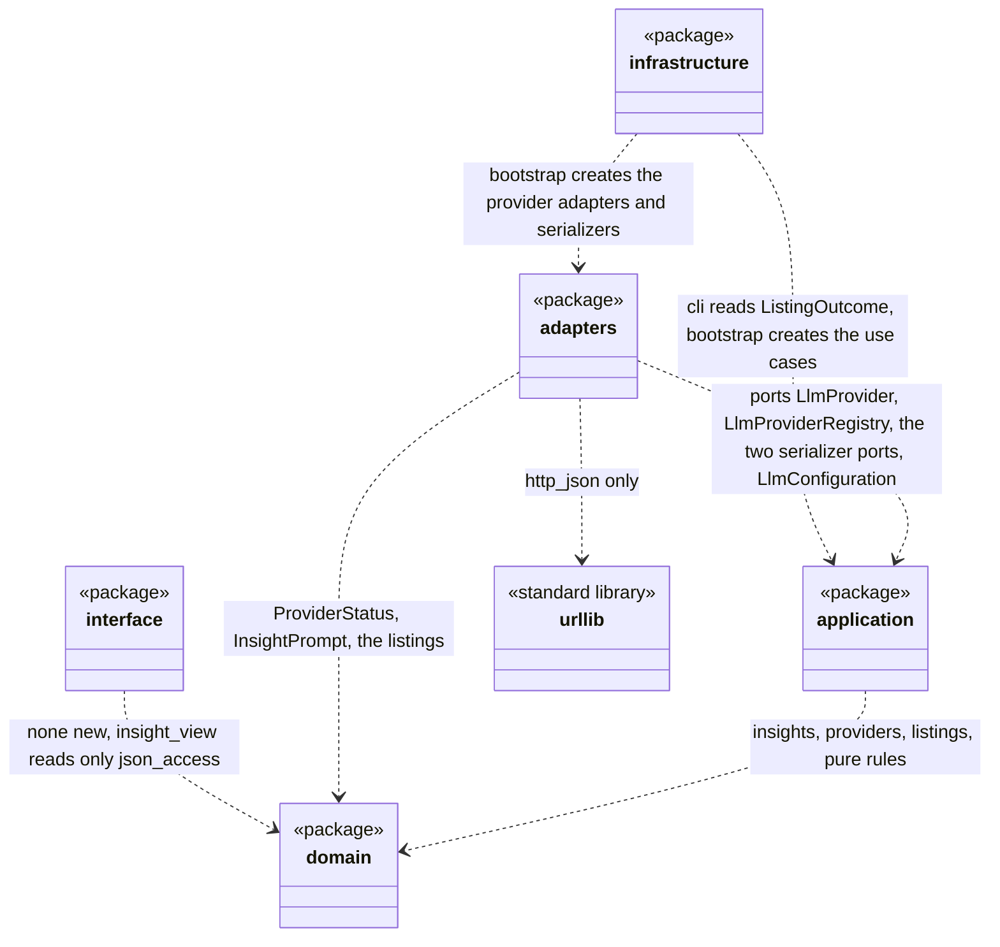

### Domain layer (planned), part 1: the AI insight

Value objects of [UC-005] and its status and reason enumerations. `AiInsight` has no reference to the analysis it belongs to; the built `Analysis` holds it (Designed change), which keeps the import one-directional.

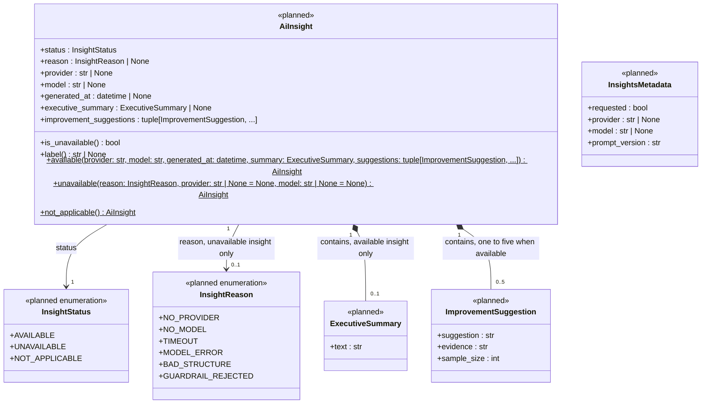

### Domain layer (planned), part 2: providers, models and listings

The Language Model Provider concepts of [UC-004] and the two listings. `ProviderListing` is the design class of the concept LLM Provider Listing in [DM-001] (an answer, like `HolidayCalendarListing`); see Design Note DN-2.

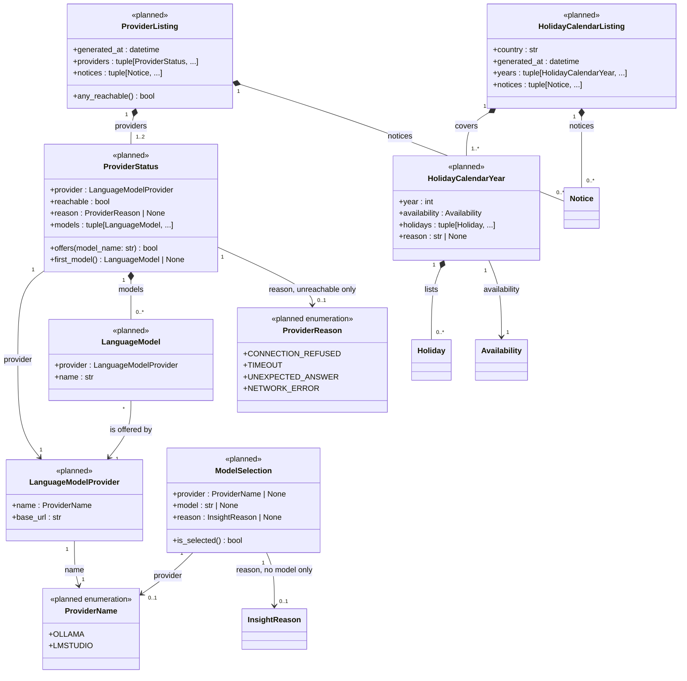

### Domain layer (planned), part 3: prompt, validation, selection, years and errors

The pure rules (Pure Fabrication and Information Expert) and the new errors. Each module is a function group without any library. `wording` is the built module whose word list the validator reuses ([ADR-0010]).

```mermaid
classDiagram
    class InsightPrompt {
        <<planned>>
        +instruction : str
        +data_json : str
        +prompt_version : str
    }
    class insight_prompt {
        <<planned module>>
        +build_prompt(analysis: Analysis, summary: DataQualitySummary) InsightPrompt
        +data_block(analysis: Analysis, summary: DataQualitySummary) dict[str, JsonValue]
    }
    class insight_validation {
        <<planned module>>
        +validate_answer(answer_text: str, prompt: InsightPrompt, min_group_size: int) tuple[ExecutiveSummary, tuple[ImprovementSuggestion, ...]]
        +parse_structure(answer_text: str) tuple[ExecutiveSummary, tuple[ImprovementSuggestion, ...]]
        +check_guardrails(summary: ExecutiveSummary, suggestions: tuple[ImprovementSuggestion, ...], prompt: InsightPrompt, min_group_size: int) None
    }
    class model_selection {
        <<planned module>>
        +select_model(statuses: tuple[ProviderStatus, ...], provider: ProviderName | None, model: str | None) ModelSelection
    }
    class year_selection {
        <<planned module>>
        +parse_years(text: str | None, current_year: int) tuple[int, ...]
    }
    class InvalidYearsError {
        <<planned>>
    }
    class InsightRejectedError {
        <<planned>>
        +reason : InsightReason
        +detail : str
    }
    class LlmError {
        <<planned>>
    }
    class LlmTimeoutError {
        <<planned>>
    }
    insight_prompt ..> InsightPrompt : creates
    insight_prompt ..> Analysis : reads findings
    insight_prompt ..> DataQualitySummary : reads counts
    insight_validation ..> InsightPrompt : reads data_json
    insight_validation ..> ExecutiveSummary : creates
    insight_validation ..> ImprovementSuggestion : creates
    insight_validation ..> InsightRejectedError : raises
    insight_validation ..> wording : reads forbidden_words_in
    model_selection ..> ModelSelection : creates
    model_selection ..> ProviderStatus : reads
    year_selection ..> InvalidYearsError : raises
    InputError <|-- InvalidYearsError
    Exception <|-- InsightRejectedError
    Exception <|-- LlmError
    LlmError <|-- LlmTimeoutError
    InsightRejectedError "1" --> "1" InsightReason : reason
```

### Application layer (planned), part 1: use cases and data

`ListHolidays` and `ListLlmProviders` are the use case controllers of [UC-003] and [UC-004], `GenerateInsights` is the application service that creates the `AiInsight` instances of [UC-005] (Creator). They hold their collaborators as ports (aggregation: created and owned by the composition root). `LlmConfiguration` is the `[llm]` table of [ADR-0012] as a value.

```mermaid
classDiagram
    class ListHolidays {
        <<planned>>
        +configuration_loader : ConfigurationLoader
        +calendar : HolidayCalendar
        +serializer : HolidayListingSerializer
        +sink : ResultSink
        +clock : Clock
        +run(years: str | None, config_path: Path | None) ListingOutcome
        -_failure_line(error: InputError, notices: tuple[Notice, ...]) str
        -_deliver(line: str, failure: InputError | None) ListingOutcome
    }
    class ListLlmProviders {
        <<planned>>
        +configuration_loader : ConfigurationLoader
        +registry : LlmProviderRegistry
        +serializer : ProviderListingSerializer
        +sink : ResultSink
        +clock : Clock
        +run(config_path: Path | None) ListingOutcome
        -_failure_line(error: InputError, notices: tuple[Notice, ...]) str
        -_deliver(line: str, failure: InputError | None) ListingOutcome
    }
    class GenerateInsights {
        <<planned>>
        +registry : LlmProviderRegistry
        +clock : Clock
        +generate(analyses: tuple[Analysis, ...], summary: DataQualitySummary, configuration: AppConfiguration) InsightBatch
        -_insight_for(analysis: Analysis, summary: DataQualitySummary, selection: ModelSelection, provider: LlmProvider | None, configuration: AppConfiguration) AiInsight
    }
    class ListingOutcome {
        <<planned>>
        +status : RunStatus
        +serialized : str | None
        +message : str | None
    }
    class InsightBatch {
        <<planned>>
        +metadata : InsightsMetadata
        +insights : Mapping[AnalysisName, AiInsight]
        +insight_for(name: AnalysisName) AiInsight | None
        +unavailable_count() int
    }
    class LlmConfiguration {
        <<planned>>
        +ollama_url : str
        +lmstudio_url : str
        +discovery_timeout_seconds : float
        +generation_timeout_seconds : float
        +provider : ProviderName | None
        +model : str | None
        +allow_remote : bool
        +temperature : float
    }
    class provider_discovery {
        <<planned module>>
        +discover_providers(providers: tuple[LlmProvider, ...], discovery_timeout_seconds: float) tuple[ProviderStatus, ...]
        +find_provider(providers: tuple[LlmProvider, ...], name: ProviderName) LlmProvider | None
    }
    ListHolidays "1" o-- "1" ConfigurationLoader : configuration_loader
    ListHolidays "1" o-- "1" HolidayCalendar : calendar
    ListHolidays "1" o-- "1" HolidayListingSerializer : serializer
    ListHolidays "1" o-- "1" ResultSink : sink
    ListHolidays "1" o-- "1" Clock : clock
    ListHolidays ..> ListingOutcome : creates
    ListHolidays ..> HolidayCalendarListing : creates
    ListHolidays ..> HolidayCalendarYear : creates
    ListHolidays ..> year_selection : calls parse_years
    ListLlmProviders "1" o-- "1" ConfigurationLoader : configuration_loader
    ListLlmProviders "1" o-- "1" LlmProviderRegistry : registry
    ListLlmProviders "1" o-- "1" ProviderListingSerializer : serializer
    ListLlmProviders "1" o-- "1" ResultSink : sink
    ListLlmProviders "1" o-- "1" Clock : clock
    ListLlmProviders ..> ListingOutcome : creates
    ListLlmProviders ..> ProviderListing : creates
    ListLlmProviders ..> provider_discovery : calls discover_providers
    GenerateInsights "1" o-- "1" LlmProviderRegistry : registry
    GenerateInsights "1" o-- "1" Clock : clock
    GenerateInsights ..> InsightBatch : creates
    GenerateInsights ..> AiInsight : creates
    GenerateInsights ..> provider_discovery : calls discover_providers and find_provider
    GenerateInsights ..> model_selection : calls select_model
    GenerateInsights ..> insight_prompt : calls build_prompt
    GenerateInsights ..> insight_validation : calls validate_answer
    ListingOutcome "1" --> "1" RunStatus : status
    InsightBatch "1" --> "1" InsightsMetadata : metadata
    InsightBatch "1" o-- "0..6" AiInsight : insights, one per Analysis, owned by the Analysis after attachment
    LlmConfiguration "1" --> "0..1" ProviderName : provider
```

### Application layer (planned), part 2: ports

New `Protocol` ports in `application/ports.py`. The application depends on them and `adapters` implement them (Dependency Inversion). The two serializer ports are separate because the two listings change independently (interface segregation).

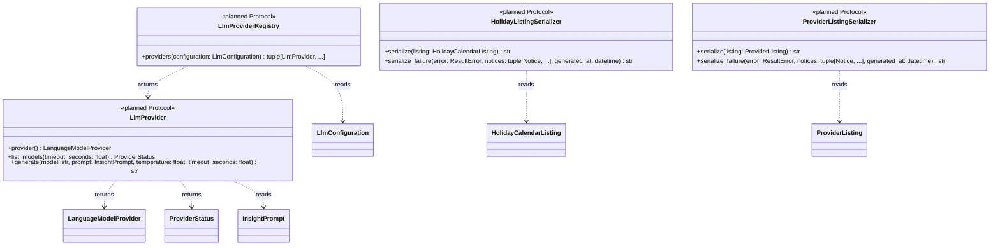

### Adapters layer (planned)

The two provider adapters are the concrete strategies of `LlmProvider`, one per provider, using the standard-library HTTP helper `http_json` ([ADR-0009]); the registry creates them from the configured addresses; the two serializers adapt the listings to JSON ([ADR-0011]).

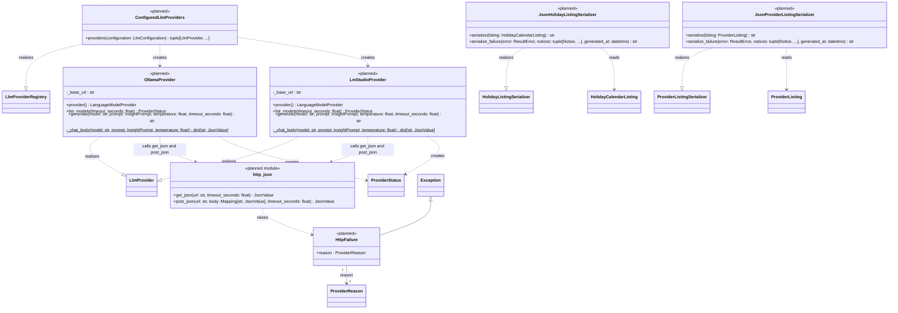

### Infrastructure layer (planned changes)

No new class: `cli` and `bootstrap` are built modules and gain functions (see Designed changes to built elements). The arrows show what the two modules will reference.

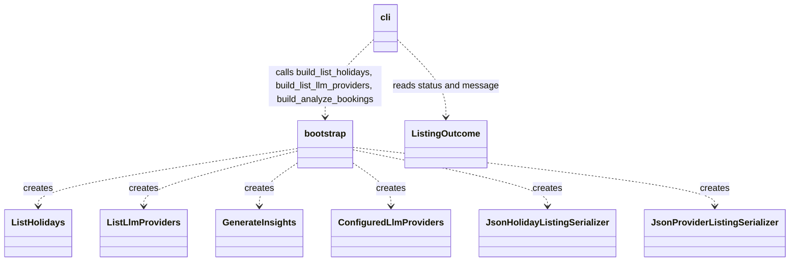

### Interface layer (planned)

The insight view of the notebook: a view model per Analysis and the module that builds it from the stored result with the tolerant accessors, in the style of the built analysis views. `marimo_render` gains `render_insight` (Designed change).

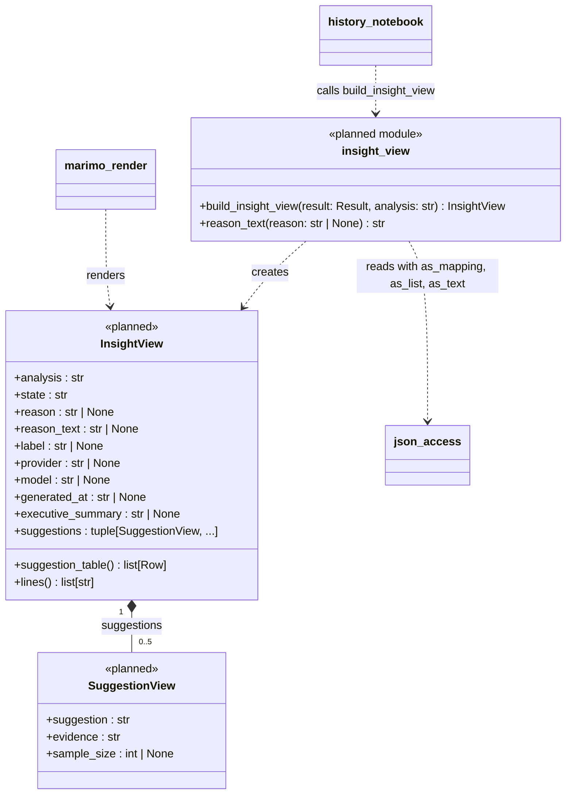

### Designed changes to built elements

The built diagrams above are not altered. These changes are made to built classes and modules in MIL-010 or MIL-011 and are described here as `Designed change`; the arrows they add are drawn here (built elements drawn empty).

```mermaid
classDiagram
    Analysis "1" *-- "0..1" AiInsight : insight
    AnalysisResult "1" *-- "0..1" InsightsMetadata : insights
    AppConfiguration "1" *-- "1" LlmConfiguration : llm
    AnalyzeBookings "1" o-- "0..1" GenerateInsights : insight_generator
    build_result ..> InsightBatch : reads in assemble_result
    JsonResultSerializer ..> AiInsight : reads
    JsonResultSerializer ..> InsightsMetadata : reads
    TomlConfigurationLoader ..> LlmConfiguration : creates
    KhmerHolidayCalendar ..|> HolidayCalendar : realizes source
```

| Built element (layer) | Designed change | Contract / SD message |
| --- | --- | --- |
| `Analysis` (domain) | New optional attribute `insight : AiInsight \| None = None` (composition, 0..1); the six analyzers do not set it; the constructor calls of the built code stay valid | `analyzeBookings` (Designed change) / SD 5.1 message 25 |
| `AnalysisResult` (domain) | New optional attribute `insights : InsightsMetadata \| None = None`; `schema_version` keeps the default `"1.0"` and is set to `"1.1"` by `assemble_result` when `insights` is present; the consistency check states that a `failed` result has no `insights` | `analyzeBookings` (Designed change) / SD 5.1 message 26 |
| `AppConfiguration` (application) | New attribute `llm : LlmConfiguration` (default: the defaults of [ADR-0012]); the existing five attributes and their defaults are unchanged | `getLlmProviders` / SD 4.1 message 4; `analyzeBookings` / SD 5.1 message 5 |
| `AnalyzeBookings` (application) | New optional attribute `insight_generator : GenerateInsights \| None = None`; `run(input_path, config_path, insights: bool = False)`; new private step `_assemble_with_insights(validated: ValidatedBookings, notices: tuple[Notice, ...], result_id: str, generated_at: datetime, configuration: AppConfiguration) -> AnalysisResult`, used only when `insights` is true and a generator is present; when `insights` is false the built path is unchanged | `analyzeBookings` (Designed change) / SD 5.1 messages 1 to 4 and 24 |
| `build_result` (application module) | New function `assemble_result(validated, config_notices, result_id, generated_at, analyses, analysis_notices, insights: InsightBatch \| None = None) -> AnalysisResult` (the second half of `build_result`, now public) and a private `_insight_notices(batch: InsightBatch) -> tuple[Notice, ...]` (the notice `INSIGHTS_UNAVAILABLE`); `build_result` calls `run_analyses` and then `assemble_result` and behaves as built | `analyzeBookings` (Designed change) / SD 5.1 messages 24 and 25, SD 5.2 messages 22 to 25 |
| `HolidayCalendar` (application port) and `KhmerHolidayCalendar` (adapters) | New operation `source() -> str` (the calendar source and its version, for the notice `CALENDAR_SOURCE`) | `getHolidayCalendar` / SD 3.1 messages 14 and 15 |
| `ConfigurationLoader` (application port) and `TomlConfigurationLoader` (adapters) | `load(explicit_path: Path \| None, with_llm: bool = False) -> LoadedConfiguration`: the new optional parameter is true for `llm-providers` and for `analyze --insights`. Only then is the `[llm]` table read and validated (loopback rule, ranges; unknown keys as `llm.<key>`) by the new private `_llm_section(data: Mapping[str, object]) -> LlmConfiguration`; otherwise the file is only parsed and `AppConfiguration.llm` holds the defaults ([ADR-0012]) | `getLlmProviders` / SD 4.1 messages 3 and 4, SD 4.2 messages 3 and 4; `analyzeBookings` / block 1.1 message 2 with `with_llm = insights` (SD 5.1 note); `getHolidayCalendar` / SD 3.1 message 3 (default false) |
| `JsonResultSerializer` (adapters) | Writes the top-level `insights` object and the per-analysis `insight` object when present, and takes `schema_version` from the result; a result without them is byte-for-byte the built output | `analyzeBookings` (Designed change) / SD 1.2 message 2 with insights |
| `cli` (infrastructure module) | `build_parser` gains the option `--insights` of `analyze` and the subcommands `holidays` (`--years`, `--config`) and `llm-providers` (`--config`); `main` dispatches on the subcommand and reuses `_EXIT_CODES`; new private `_report_listing(outcome: ListingOutcome) -> None` | all three new operations / SD 3.0 messages 1 to 3, 14; SD 3.1 message 24; SD 4.1 message 28 |
| `bootstrap` (infrastructure module) | `build_analyze_bookings` also creates the registry and `GenerateInsights` and passes it to `AnalyzeBookings`; new functions `build_list_holidays(stdout: BinaryIO, working_directory: Path, environ: Mapping[str, str]) -> ListHolidays`, `build_list_llm_providers(stdout: BinaryIO, working_directory: Path, environ: Mapping[str, str]) -> ListLlmProviders`, `build_llm_registry() -> LlmProviderRegistry` | SD 3.0 message 4, SD 4.0 messages 4 and 6, SD 5.0 messages 4 to 9 |
| `marimo_render` (interface module) | New function `render_insight(view: InsightView) -> mo.Html` | `selectResult` (Designed change) / SD 2.4 message 12 |
| `history_notebook` (interface module) | Each of the six analysis cells also calls `build_insight_view` and `render_insight` and shows the result under the analysis view and its limitation notes | `selectResult` (Designed change) / SD 2.4 messages 2 and 3 |
| `history_view`, `figures`, `json_access`, `marimo` cells other than the six | Unchanged; `history_view.is_fully_supported` already accepts schema version 1.1 because it decides by the major part | `selectResult` / SD 2.2 message 8, unchanged |

## Planned Class Table

One row per planned class, `Protocol`, enumeration or module (layer and target module after the kind). Designed, not yet built: these rows are not checked against `src/` until MIL-010 and MIL-011. Columns as in the Class Table above. SOLID: single responsibility (each class has one sentence of responsibility; the widest, `GenerateInsights`, has one public method and one private step; the two provider adapters differ only in the endpoints and the body shape of their provider); open/closed (a third provider is a new `LlmProvider` class added to `ConfiguredLlmProviders`; a new guardrail rule is one function in `insight_validation`; neither changes a use case); Liskov (the two providers, the two serializers and the registry are interchangeable through their ports); interface segregation (`LlmProvider` has the two operations both users need, `LlmProviderRegistry` one, the two serializer ports are separate because the listings change independently); dependency inversion (the use cases depend on the ports they declare, the adapters implement them and `bootstrap` alone names them). No planned class has more than one axis of change.

| Class | Refines (Domain Model concept) | Responsibility | Attributes | Operations |
| --- | --- | --- | --- | --- |
| `InsightStatus` (enum, domain/insight.py) | AI Insight (status) | States whether an insight is available, unavailable or not applicable. | `AVAILABLE`, `UNAVAILABLE`, `NOT_APPLICABLE` | none |
| `InsightReason` (enum, domain/insight.py) | AI Insight (reason of an unavailable insight) | Names the six reasons of [ADR-0010]. | `NO_PROVIDER`, `NO_MODEL`, `TIMEOUT`, `MODEL_ERROR`, `BAD_STRUCTURE`, `GUARDRAIL_REJECTED` | none |
| `ExecutiveSummary` (class, domain/insight.py) | Executive Summary | Holds the accepted summary text. | `text` | none |
| `ImprovementSuggestion` (class, domain/insight.py) | Improvement Suggestion | Holds one hypothesis, its evidence and its sample size. | `suggestion`, `evidence`, `sample_size` | none |
| `AiInsight` (class, domain/insight.py) | AI Insight | Holds the status, reason, provider and model names, time, summary and suggestions of one analysis's insight and knows its label. | `status`, `reason`, `provider`, `model`, `generated_at`, `executive_summary`, `improvement_suggestions` | `is_unavailable`, `label`, `available`, `unavailable`, `not_applicable` |
| `InsightsMetadata` (class, domain/insight.py) | AI Insight (result level: provider, model, prompt version) | Holds the `insights` object of result 1.1. | `requested`, `provider`, `model`, `prompt_version` | none |
| `InsightPrompt` (class, domain/insight_prompt.py) | AI Insight (what is sent) | Holds the fixed instruction and the JSON data block of one request. | `instruction`, `data_json`, `prompt_version` | none |
| `ProviderName` (enum, domain/llm.py) | Language Model Provider (name) | Names Ollama and LM Studio. | `OLLAMA`, `LMSTUDIO` | none |
| `ProviderReason` (enum, domain/llm.py) | Provider Status (reason) | Names the four reasons a provider is unreachable ([ADR-0009]). | `CONNECTION_REFUSED`, `TIMEOUT`, `UNEXPECTED_ANSWER`, `NETWORK_ERROR` | none |
| `LanguageModelProvider` (class, domain/llm.py) | Language Model Provider | Holds the name and the configured address of a provider. | `name`, `base_url` | none |
| `LanguageModel` (class, domain/llm.py) | Language Model | Holds a model name and the provider that offers it. | `provider`, `name` | none |
| `ProviderStatus` (class, domain/llm.py) | Provider Status | Holds whether a provider was reachable, the reason when not, and the models it lists. | `provider`, `reachable`, `reason`, `models` | `offers`, `first_model` |
| `ProviderListing` (class, domain/llm.py) | LLM Provider Listing (answer of UC-004, DN-2) | Holds the two provider statuses and the notices of one listing. | `generated_at`, `providers`, `notices` | `any_reachable` |
| `ModelSelection` (class, domain/model_selection.py) | Language Model (the model chosen for insights) | Holds the chosen provider and model, or the reason none was chosen. | `provider`, `model`, `reason` | `is_selected` |
| `HolidayCalendarYear` (class, domain/listing.py) | Holiday Calendar Year | Holds one requested year with its holidays or its unavailable reason. | `year`, `availability`, `holidays`, `reason` | none |
| `HolidayCalendarListing` (class, domain/listing.py) | Holiday Calendar Listing | Holds the country, time, years and notices of one holiday answer. | `country`, `generated_at`, `years`, `notices` | none |
| `InvalidYearsError` (class, domain/errors.py) | none (exception of OC-001 getHolidayCalendar) | Signals that the `--years` value is not valid; an `InputError` with the code `INVALID_YEARS`. | none | none |
| `InsightRejectedError` (class, domain/errors.py) | none (exception of OC-001 analyzeBookings, Designed change) | Signals that an answer was rejected, with the reason `BAD_STRUCTURE` or `GUARDRAIL_REJECTED`. | `reason`, `detail` | none |
| `LlmError` (class, domain/errors.py) | none (exception of OC-001 analyzeBookings, Designed change) | Signals a model failure during generation (`MODEL_ERROR`). | none | none |
| `LlmTimeoutError` (class, domain/errors.py) | none (exception of OC-001 analyzeBookings, Designed change) | Signals that no complete answer came within the total generation deadline (`TIMEOUT`). | none | none |
| `insight_prompt` (module, domain) | AI Insight (what is sent) | Builds the prompt from the findings and the data-quality counts only. | none | build_prompt, data_block |
| `insight_validation` (module, domain) | AI Insight, Improvement Suggestion (guardrails) | Parses the answer and applies the rules 1 to 7 of [ADR-0010]. | none | validate_answer, parse_structure, check_guardrails |
| `model_selection` (module, domain) | Language Model, Language Model Provider (choice) | Applies the order and rules of [ADR-0009] to the provider statuses. | none | select_model |
| `year_selection` (module, domain) | Holiday Calendar Year (requested years) | Parses the `--years` value into a sorted list of years. | none | parse_years |
| `LlmProvider` (Protocol, application) | Language Model Provider (port) | Lists the models of one provider and generates text with one model. | none | `provider`, `list_models`, `generate` |
| `LlmProviderRegistry` (Protocol, application) | Language Model Provider (port) | Supplies the provider adapters for a configuration. | none | `providers` |
| `HolidayListingSerializer` (Protocol, application) | Holiday Calendar Listing (port) | Turns a holiday listing or a failure into one JSON line. | none | `serialize`, `serialize_failure` |
| `ProviderListingSerializer` (Protocol, application) | Provider Status (port) | Turns a provider listing or a failure into one JSON line. | none | `serialize`, `serialize_failure` |
| `LlmConfiguration` (class, application/configuration.py) | none (configuration value, [ADR-0012]) | Holds the validated `[llm]` settings with their defaults. | `ollama_url`, `lmstudio_url`, `discovery_timeout_seconds`, `generation_timeout_seconds`, `provider`, `model`, `allow_remote`, `temperature` | none |
| `ListingOutcome` (class, application/listing_outcome.py) | none (return value of the two listing use cases, DN-4) | Carries status, serialized line and message from a listing use case to the command line. | `status`, `serialized`, `message` | none |
| `InsightBatch` (class, application/generate_insights.py) | AI Insight (one per Analysis) | Holds the insights of one run by analysis name and the `insights` metadata. | `metadata`, `insights` | `insight_for`, `unavailable_count` |
| `ListHolidays` (class, application/list_holidays.py) | none (use case controller of UC-003) | Produces the holiday listing of the requested years or a failed document and delivers it. | `configuration_loader`, `calendar`, `serializer`, `sink`, `clock` | `run`, `_failure_line`, `_deliver` |
| `ListLlmProviders` (class, application/list_llm_providers.py) | none (use case controller of UC-004) | Produces the provider listing or a failed document and delivers it. | `configuration_loader`, `registry`, `serializer`, `sink`, `clock` | `run`, `_failure_line`, `_deliver` |
| `GenerateInsights` (class, application/generate_insights.py) | AI Insight (Creator; UC-005 steps 2 to 8) | Selects the model and creates one insight per analysis, never letting a failure escape. | `registry`, `clock` | `generate`, `_insight_for` |
| `provider_discovery` (module, application) | Provider Status (discovery of UC-004) | Checks the providers in order, each within the total discovery deadline; shared by the listing and the insights. | none | discover_providers, find_provider |
| `listing_delivery` (module, application) | none (shared by the two listing use cases, DD-14) | Writes a serialized listing to the sink and turns a delivery failure into the `ListingOutcome` with exit-code status 4. | none | deliver_listing |
| `OllamaProvider` (class, adapters/ollama_provider.py) | Language Model Provider (adapter) | Lists models and generates text through Ollama's HTTP interface. | `_base_url` | `provider`, `list_models`, `generate`, `_chat_body` |
| `LmStudioProvider` (class, adapters/lmstudio_provider.py) | Language Model Provider (adapter) | Lists models and generates text through LM Studio's OpenAI-compatible interface. | `_base_url` | `provider`, `list_models`, `generate`, `_chat_body` |
| `ConfiguredLlmProviders` (class, adapters/llm_registry.py) | Language Model Provider (adapter, Factory) | Creates the provider adapters from the configured addresses. | none | `providers` |
| `JsonHolidayListingSerializer` (class, adapters/json_holiday_listing_serializer.py) | Holiday Calendar Listing (adapter) | Serializes the holiday listing and its failed document to compact JSON. | none | `serialize`, `serialize_failure` |
| `JsonProviderListingSerializer` (class, adapters/json_provider_listing_serializer.py) | Provider Status (adapter) | Serializes the provider listing and its failed document to compact JSON. | none | `serialize`, `serialize_failure` |
| `HttpFailure` (class, adapters/http_json.py) | Provider Status (reason) | Signals a failed HTTP request with its provider reason; never leaves the adapters. | `reason` | none |
| `http_json` (module, adapters) | none | Makes one JSON GET or POST with the standard library within a total deadline (socket timeout set to the time left, answer read in chunks, deadline checked before each read; [ADR-0009]). | none | get_json, post_json (post_json is built in MIL-011, DD-11) |
| `listing_json` (module, adapters) | Holiday Calendar Listing, Provider Status (shared adapter code, DD-14) | Builds the common envelope of both listings (`schema_version`, `kind`, `status`, `generated_at`, `notices`), the failed document and the compact UTF-8 line, and loads the JSON Schemas. | none | envelope, failure_document, to_line, load_schema |
| `provider_listing` (module, adapters) | Provider Status (shared adapter code, DD-14) | Makes the read-only list request of one provider and turns the answer or the `HttpFailure` into a `ProviderStatus`; used by `OllamaProvider` and `LmStudioProvider`. | none | request_status |
| `SuggestionView` (class, interface/insight_view.py) | Improvement Suggestion (view model) | Holds one suggestion as it is shown. | `suggestion`, `evidence`, `sample_size` | none |
| `InsightView` (class, interface/insight_view.py) | AI Insight (view model) | Holds what the insight of one analysis shows: state, reason, label, provider, model, texts. | `analysis`, `state`, `reason`, `reason_text`, `label`, `provider`, `model`, `generated_at`, `executive_summary`, `suggestions` | `suggestion_table`, `lines` |
| `insight_view` (module, interface) | AI Insight (view model) | Builds the insight view from the stored result. | none | build_insight_view, reason_text |

Counts of the planned classes by layer (modules in brackets): domain 20 (4), application 10 (1), adapters 6 (1), infrastructure 0 (0 new; `cli` and `bootstrap` are changed), interface 2 (1); total 38 classes and 7 modules.

### Domain Model concepts and their planned design classes

Every concept added to [DM-001] on 2026-09-30 and how it is designed (the prompt version of the result is `InsightsMetadata.prompt_version`, not an attribute of an insight).

| DM-001 concept | Design class or representation (planned) |
| --- | --- |
| AI Insight | `AiInsight` (domain) with `InsightStatus`, `InsightReason`; result-level data in `InsightsMetadata`; created by `GenerateInsights`; view model `InsightView` (interface) |
| Executive Summary | `ExecutiveSummary` (domain) |
| Improvement Suggestion | `ImprovementSuggestion` (domain); view model `SuggestionView` (interface) |
| Language Model Provider | `LanguageModelProvider` and `ProviderName` (domain); port `LlmProvider` and adapters `OllamaProvider`, `LmStudioProvider` |
| Provider Status | `ProviderStatus` and `ProviderReason` (domain), created by the adapters' `list_models` |
| Language Model | `LanguageModel` (domain); the chosen one is `ModelSelection` |
| LLM Provider Listing | `ProviderListing` (domain), created by `ListLlmProviders` |
| Notice | the built `Notice` (domain), carried by both listings and the result |
| Holiday Calendar Listing | `HolidayCalendarListing` (domain), created by `ListHolidays` |
| Holiday Calendar Year | `HolidayCalendarYear` (domain) |

| DM-001 association | Planned design |
| --- | --- |
| has (Analysis 1 to 0..1 AI Insight) | composition `Analysis *-- AiInsight` (Designed change, 0..1); the Analysis owns the insight. `InsightBatch` only collects the insights until they are attached, so it holds them by aggregation `o--` (DN-3) |
| contains (AI Insight to Executive Summary, 1 to 0..1) | composition `AiInsight *-- ExecutiveSummary` |
| contains (AI Insight to Improvement Suggestion, 1 to 0..*) | composition `AiInsight *-- ImprovementSuggestion`, multiplicity 0..5 because [ADR-0010] allows one to five and an unavailable insight has none |
| is produced by (AI Insight * to 0..1 Language Model) | not an association: the stored insight keeps the provider and model names as text (`AiInsight.provider`, `AiInsight.model`, [DM-001] states the same); DN-3 |
| is offered by (Language Model * to 1 Language Model Provider) | `LanguageModel --> LanguageModelProvider` |
| reports (Language Model Provider 1 to 1 Provider Status) | reversed to `ProviderStatus --> LanguageModelProvider`, and `ProviderStatus *-- LanguageModel`; DN-2 |
| covers, reports (LLM Provider Listing 1 to 1..* Language Model Provider and 1 to 1..* Provider Status) | composition `ProviderListing *-- ProviderStatus` (one or two statuses, ADR-0011; each status refers to its provider) |
| covers (Holiday Calendar Listing 1 to 1..* Holiday Calendar Year) | composition `HolidayCalendarListing *-- HolidayCalendarYear` |
| lists (Holiday Calendar Year 1 to 0..* Holiday) | composition `HolidayCalendarYear *-- Holiday` (the built `Holiday`) |

## Designed Method Traceability

Every planned operation and every operation added by a Designed change appears once, with the contract of [OC-001] and the message of [SD-001] it comes from (block and message number, for example `SD 5.1 message 9`). Designed, not yet built. Private operations are traced to the messages that they perform inside a public operation.

| Method signature | Operation Contract / SD message |
| --- | --- |
| `AiInsight.is_unavailable() -> bool` | `analyzeBookings` (Designed change) / SD 5.2 message 23 (the count of unavailable insights) |
| `AiInsight.label() -> str \| None` | `analyzeBookings` (Designed change) / SD 5.1 message 21 (the label of an available insight) |
| `AiInsight.available(provider: str, model: str, generated_at: datetime, summary: ExecutiveSummary, suggestions: tuple[ImprovementSuggestion, ...]) -> AiInsight` | `analyzeBookings` (Designed change) / SD 5.1 message 21, SD 5.2 message 19 |
| `AiInsight.unavailable(reason: InsightReason, provider: str \| None = None, model: str \| None = None) -> AiInsight` | `analyzeBookings` (Designed change) / SD 5.1 message 12, SD 5.2 messages 3, 4, 9, 11, 15, 17 |
| `AiInsight.not_applicable() -> AiInsight` | `analyzeBookings` (Designed change) / SD 5.1 message 11 |
| `ProviderStatus.offers(model_name: str) -> bool` | `analyzeBookings` (Designed change) / SD 5.1 message 9 (inside `select_model`), SD 5.2 message 1 |
| `ProviderStatus.first_model() -> LanguageModel \| None` | `analyzeBookings` (Designed change) / SD 5.1 message 9 (inside `select_model`), SD 5.2 message 1 |
| `ProviderListing.any_reachable() -> bool` | `getLlmProviders` / SD 4.1 message 19 (the condition of the notice) |
| `ModelSelection.is_selected() -> bool` | `analyzeBookings` (Designed change) / SD 5.1 messages 12 and 13 (the branch condition), SD 5.2 message 2 |
| `insight_prompt.build_prompt(analysis: Analysis, summary: DataQualitySummary) -> InsightPrompt` | `analyzeBookings` (Designed change) / SD 5.1 message 13, SD 5.2 message 5 |
| `insight_prompt.data_block(analysis: Analysis, summary: DataQualitySummary) -> dict[str, JsonValue]` | `analyzeBookings` (Designed change) / SD 5.1 message 14 (inside `build_prompt`) |
| `insight_validation.validate_answer(answer_text: str, prompt: InsightPrompt, min_group_size: int) -> tuple[ExecutiveSummary, tuple[ImprovementSuggestion, ...]]` | `analyzeBookings` (Designed change) / SD 5.1 message 17, SD 5.2 message 13 |
| `insight_validation.parse_structure(answer_text: str) -> tuple[ExecutiveSummary, tuple[ImprovementSuggestion, ...]]` | `analyzeBookings` (Designed change) / SD 5.2 message 14 (`BAD_STRUCTURE`, inside `validate_answer`) |
| `insight_validation.check_guardrails(summary: ExecutiveSummary, suggestions: tuple[ImprovementSuggestion, ...], prompt: InsightPrompt, min_group_size: int) -> None` | `analyzeBookings` (Designed change) / SD 5.2 message 16 (`GUARDRAIL_REJECTED`, inside `validate_answer`) |
| `model_selection.select_model(statuses: tuple[ProviderStatus, ...], provider: ProviderName \| None, model: str \| None) -> ModelSelection` | `analyzeBookings` (Designed change) / SD 5.1 message 9, SD 5.2 message 1 |
| `year_selection.parse_years(text: str \| None, current_year: int) -> tuple[int, ...]` | `getHolidayCalendar` / SD 3.1 message 7, SD 3.2 message 9 |
| `LlmProvider.provider() -> LanguageModelProvider` | `analyzeBookings` (Designed change) / SD 5.1 messages 14a and 14b (`find_provider` compares the name before `generate`) |
| `LlmProvider.list_models(timeout_seconds: float) -> ProviderStatus` | `getLlmProviders` / SD 4.1 message 9; `analyzeBookings` (Designed change) / SD 5.1 message 8 |
| `LlmProvider.generate(model: str, prompt: InsightPrompt, temperature: float, timeout_seconds: float) -> str` | `analyzeBookings` (Designed change) / SD 5.1 message 15, SD 5.2 message 7 |
| `LlmProviderRegistry.providers(configuration: LlmConfiguration) -> tuple[LlmProvider, ...]` | `getLlmProviders` / SD 4.1 message 5; `analyzeBookings` (Designed change) / SD 5.1 message 5 |
| `HolidayListingSerializer.serialize(listing: HolidayCalendarListing) -> str` | `getHolidayCalendar` / SD 3.1 message 17 |
| `HolidayListingSerializer.serialize_failure(error: ResultError, notices: tuple[Notice, ...], generated_at: datetime) -> str` | `getHolidayCalendar` / SD 3.2 message 13 |
| `ProviderListingSerializer.serialize(listing: ProviderListing) -> str` | `getLlmProviders` / SD 4.1 message 21 |
| `ProviderListingSerializer.serialize_failure(error: ResultError, notices: tuple[Notice, ...], generated_at: datetime) -> str` | `getLlmProviders` / SD 4.2 message 9 |
| `InsightBatch.insight_for(name: AnalysisName) -> AiInsight \| None` | `analyzeBookings` (Designed change) / SD 5.1 message 25 |
| `InsightBatch.unavailable_count() -> int` | `analyzeBookings` (Designed change) / SD 5.2 message 23 |
| `ListHolidays.run(years: str \| None, config_path: Path \| None) -> ListingOutcome` | `getHolidayCalendar` / SD 3.1 message 2, SD 3.0 message 12 |
| `ListHolidays._failure_line(error: InputError, notices: tuple[Notice, ...]) -> str` | `getHolidayCalendar` / SD 3.2 messages 13 and 14 (after the clock read of messages 7 and 8) |
| `ListHolidays._deliver(line: str, failure: InputError \| None) -> ListingOutcome` | `getHolidayCalendar` / SD 3.1 messages 19 to 22, SD 3.2 messages 16 to 22 |
| `ListLlmProviders.run(config_path: Path \| None) -> ListingOutcome` | `getLlmProviders` / SD 4.1 message 2, SD 4.0 message 14 |
| `ListLlmProviders._failure_line(error: InputError, notices: tuple[Notice, ...]) -> str` | `getLlmProviders` / SD 4.2 messages 7 to 10 |
| `ListLlmProviders._deliver(line: str, failure: InputError \| None) -> ListingOutcome` | `getLlmProviders` / SD 4.1 messages 23 to 26, SD 4.2 messages 12 to 18 |
| `GenerateInsights.generate(analyses: tuple[Analysis, ...], summary: DataQualitySummary, configuration: AppConfiguration) -> InsightBatch` | `analyzeBookings` (Designed change) / SD 5.1 message 4 |
| `GenerateInsights._insight_for(analysis: Analysis, summary: DataQualitySummary, selection: ModelSelection, provider: LlmProvider \| None, configuration: AppConfiguration) -> AiInsight` | `analyzeBookings` (Designed change) / SD 5.1 messages 11 to 21, SD 5.2 messages 3 to 19 |
| `provider_discovery.discover_providers(providers: tuple[LlmProvider, ...], discovery_timeout_seconds: float) -> tuple[ProviderStatus, ...]` | `getLlmProviders` / SD 4.1 message 8; `analyzeBookings` (Designed change) / SD 5.1 message 7 |
| `provider_discovery.find_provider(providers: tuple[LlmProvider, ...], name: ProviderName) -> LlmProvider \| None` | `analyzeBookings` (Designed change) / SD 5.1 messages 14a and 14b (returns the provider on which `generate` is called in message 15) |
| `OllamaProvider.provider() -> LanguageModelProvider` | `analyzeBookings` (Designed change) / SD 5.1 message 14a (inside `find_provider`) |
| `OllamaProvider.list_models(timeout_seconds: float) -> ProviderStatus` | `getLlmProviders` / SD 4.1 messages 9 to 15 |
| `OllamaProvider.generate(model: str, prompt: InsightPrompt, temperature: float, timeout_seconds: float) -> str` | `analyzeBookings` (Designed change) / SD 5.1 message 15, SD 5.2 messages 7 to 12 |
| `OllamaProvider._chat_body(model: str, prompt: InsightPrompt, temperature: float) -> dict[str, JsonValue]` | `analyzeBookings` (Designed change) / SD 5.2 message 7 (inside `generate`) |
| `LmStudioProvider.provider() -> LanguageModelProvider` | `analyzeBookings` (Designed change) / SD 5.1 message 14a (inside `find_provider`) |
| `LmStudioProvider.list_models(timeout_seconds: float) -> ProviderStatus` | `getLlmProviders` / SD 4.1 messages 9 to 15 |
| `LmStudioProvider.generate(model: str, prompt: InsightPrompt, temperature: float, timeout_seconds: float) -> str` | `analyzeBookings` (Designed change) / SD 5.1 message 15, SD 5.2 messages 7 to 12 |
| `LmStudioProvider._chat_body(model: str, prompt: InsightPrompt, temperature: float) -> dict[str, JsonValue]` | `analyzeBookings` (Designed change) / SD 5.2 message 7 (inside `generate`) |
| `ConfiguredLlmProviders.providers(configuration: LlmConfiguration) -> tuple[LlmProvider, ...]` | `getLlmProviders` / SD 4.1 messages 5 to 7; SD 5.1 message 5 |
| `JsonHolidayListingSerializer.serialize(listing: HolidayCalendarListing) -> str` | `getHolidayCalendar` / SD 3.1 message 17 |
| `JsonHolidayListingSerializer.serialize_failure(error: ResultError, notices: tuple[Notice, ...], generated_at: datetime) -> str` | `getHolidayCalendar` / SD 3.2 message 13 |
| `JsonProviderListingSerializer.serialize(listing: ProviderListing) -> str` | `getLlmProviders` / SD 4.1 message 21 |
| `JsonProviderListingSerializer.serialize_failure(error: ResultError, notices: tuple[Notice, ...], generated_at: datetime) -> str` | `getLlmProviders` / SD 4.2 message 9 |
| `http_json.get_json(url: str, timeout_seconds: float) -> JsonValue` | `getLlmProviders` / SD 4.1 message 10 |
| `http_json.post_json(url: str, body: Mapping[str, JsonValue], timeout_seconds: float) -> JsonValue` | `analyzeBookings` (Designed change) / SD 5.1 messages 15a and 15b, SD 5.2 messages 7a, 7b, 9a and 11a (inside `generate`; `HttpFailure` is raised in 7b and 9a and translated in 8 and 10) |
| `InsightView.suggestion_table() -> list[Row]` | `selectResult` (Designed change) / SD 2.4 message 13 |
| `InsightView.lines() -> list[str]` | `selectResult` (Designed change) / SD 2.4 message 13 |
| `insight_view.build_insight_view(result: Result, analysis: str) -> InsightView` | `selectResult` (Designed change) / SD 2.4 message 3 |
| `insight_view.reason_text(reason: str \| None) -> str` | `selectResult` (Designed change) / SD 2.4 message 8 |
| `AnalyzeBookings.run(input_path: Path \| None, config_path: Path \| None, insights: bool = False) -> AnalyzeOutcome` (Designed change) | `analyzeBookings` (Designed change) / SD 5.1 message 1, SD 5.0 message 11 |
| `AnalyzeBookings._assemble_with_insights(validated: ValidatedBookings, notices: tuple[Notice, ...], result_id: str, generated_at: datetime, configuration: AppConfiguration) -> AnalysisResult` | `analyzeBookings` (Designed change) / SD 5.1 messages 2 to 4 and 24 |
| `build_result.assemble_result(validated: ValidatedBookings, config_notices: tuple[Notice, ...], result_id: str, generated_at: datetime, analyses: tuple[Analysis, ...], analysis_notices: tuple[Notice, ...], insights: InsightBatch \| None = None) -> AnalysisResult` | `analyzeBookings` (Designed change) / SD 5.1 message 24, SD 5.2 message 22 |
| `build_result._insight_notices(batch: InsightBatch) -> tuple[Notice, ...]` | `analyzeBookings` (Designed change) / SD 5.1 message 25, SD 5.2 message 23 |
| `HolidayCalendar.source() -> str` and `KhmerHolidayCalendar.source() -> str` | `getHolidayCalendar` / SD 3.1 message 14 |
| `ConfigurationLoader.load(explicit_path: Path \| None, with_llm: bool = False) -> LoadedConfiguration` (Designed change: the parameter `with_llm`) | `getLlmProviders` / SD 4.1 message 3, SD 4.2 message 3; `analyzeBookings` / block 1.1 message 2 with `with_llm = insights` (SD 5.1 note); `getHolidayCalendar` / SD 3.1 message 3 and SD 3.2 message 3 (default false) |
| `TomlConfigurationLoader._llm_section(data: Mapping[str, object]) -> LlmConfiguration` | `getLlmProviders` / SD 4.1 message 4, SD 4.2 message 4 (inside `load` with `with_llm`); `analyzeBookings` / block 1.1 message 2 with `with_llm = insights` (SD 5.1 note); not called for `getHolidayCalendar` |
| `JsonResultSerializer.serialize(result: AnalysisResult) -> str` (Designed change: insight fields) | `analyzeBookings` (Designed change) / SD 1.2 message 2 with insights, after SD 5.1 message 27 |
| `cli.build_parser() -> argparse.ArgumentParser` (Designed change: subcommands and `--insights`) | all three operations / SD 3.0 message 2, SD 4.0 message 2, SD 5.0 message 2 |
| `cli.main(...) -> int` (Designed change: dispatch by subcommand) | all three operations / SD 3.0 message 1, SD 4.0 message 1, SD 5.0 message 1 |
| `cli._report_listing(outcome: ListingOutcome) -> None` | `getHolidayCalendar` / SD 3.1 message 24, SD 3.2 message 24; `getLlmProviders` / SD 4.1 message 28, SD 4.2 message 20 |
| `bootstrap.build_list_holidays(stdout: BinaryIO, working_directory: Path, environ: Mapping[str, str]) -> ListHolidays` | `getHolidayCalendar` / SD 3.0 message 4 |
| `bootstrap.build_list_llm_providers(stdout: BinaryIO, working_directory: Path, environ: Mapping[str, str]) -> ListLlmProviders` | `getLlmProviders` / SD 4.0 message 4 |
| `bootstrap.build_llm_registry() -> LlmProviderRegistry` | `getLlmProviders` / SD 4.0 message 6; `analyzeBookings` (Designed change) / SD 5.0 message 5 |
| `bootstrap.build_analyze_bookings(...) -> AnalyzeBookings` (Designed change: creates `GenerateInsights`) | `analyzeBookings` (Designed change) / SD 5.0 message 4 |
| `marimo_render.render_insight(view: InsightView) -> mo.Html` | `selectResult` (Designed change) / SD 2.4 message 12 |

## Designed Pattern Annotations

| Pattern | Classes | Rationale |
| --- | --- | --- |
| Strategy (GoF) | `LlmProvider` (port), `OllamaProvider`, `LmStudioProvider`; applied by `provider_discovery` and `GenerateInsights` | The two providers are interchangeable behind `list_models` and `generate`; the context picks one by name, so a third provider changes no use case (open/closed). |
| Adapter (GoF) | `OllamaProvider`, `LmStudioProvider`, `http_json`, `ConfiguredLlmProviders`, `JsonHolidayListingSerializer`, `JsonProviderListingSerializer` | Each adapts an external interface (two HTTP APIs, `urllib`, JSON) to a port; failures become domain errors or reasons and never library exceptions. |
| Factory / composition root | `bootstrap` (`build_list_holidays`, `build_list_llm_providers`, `build_llm_registry`, changed `build_analyze_bookings`), `ConfiguredLlmProviders` | `bootstrap` remains the one module that names concrete classes; the registry is an object factory for the provider adapters because their addresses are read from the configuration after construction. |
| Controller (GRASP) | `ListHolidays`, `ListLlmProviders`, changed `AnalyzeBookings`, `cli` | Each receives a system event and delegates; none holds a rule. |
| Creator (GRASP) | `GenerateInsights` creates `AiInsight` and `InsightBatch`; `ListHolidays` creates `HolidayCalendarYear` and `HolidayCalendarListing`; `ListLlmProviders` creates `ProviderListing`; the adapters create `ProviderStatus` | The creator holds the data that initializes the created object. |
| Information Expert (GRASP) | `model_selection.select_model`, `insight_validation`, `year_selection.parse_years`, `ProviderStatus.offers`, `AiInsight.label` | The function or class that holds the data owns the rule. |
| Pure Fabrication (GRASP) | `insight_prompt`, `insight_validation`, `model_selection`, `year_selection`, `provider_discovery`, `http_json`, `insight_view` | Modules of functions without a counterpart among the domain objects; the domain ones need no library, so the guardrails and the choice of a model are testable without a model. |
| Dependency Injection and Protected Variations (GRASP) | `ListHolidays`, `ListLlmProviders`, `GenerateInsights`, `AnalyzeBookings` (constructor injection of ports and of the generator) | Collaborators arrive as ports; tests use fake providers and no HTTP. |
| Value Object | `AiInsight`, `ExecutiveSummary`, `ImprovementSuggestion`, `InsightsMetadata`, `InsightPrompt`, `ProviderStatus`, `ProviderListing`, `LanguageModel`, `LanguageModelProvider`, `ModelSelection`, `HolidayCalendarYear`, `HolidayCalendarListing`, `ListingOutcome`, `InsightBatch`, `LlmConfiguration`, `InsightView`, `SuggestionView` | Frozen dataclasses: a result, a listing or a batch is built once and never changed. |
| Enumeration | `InsightStatus`, `InsightReason`, `ProviderName`, `ProviderReason` | Closed sets of values written as `StrEnum` members. |
| Exception hierarchy | `InvalidYearsError` (an `InputError`), `InsightRejectedError`, `LlmError`, `LlmTimeoutError`, `HttpFailure` | The class tells the controller which reason applies. |
| View model and Tolerant Reader | `InsightView`, `SuggestionView`, `insight_view` with `json_access` | A result without insights, of schema 1.0, or with a damaged insight part yields a state, never an exception. |

## Designed Dependency Check

### Layer dependency rule for the planned classes

The design respects the import-linter contracts of `pyproject.toml` (the six contracts listed in the Dependency Check above) and the direction `interface` -> `infrastructure` -> `adapters` -> `application` -> `domain`. The planned imports, by layer, are:

| Layer | Planned classes and modules import only | Contract that is respected |
| --- | --- | --- |
| domain | the standard library (`dataclasses`, `enum`, `datetime`, `json`, `re`) and other domain modules: `insight.py` imports nothing of the project; `llm.py` imports `errors.py` (`Notice`); `listing.py` imports `analysis.py` and `errors.py`; `insight_prompt.py` imports `analysis.py`, `quality.py` and `insight.py`; `insight_validation.py` imports `insight.py`, `insight_prompt.py`, `errors.py` and `wording.py`; `model_selection.py` imports `llm.py` and `insight.py`; `year_selection.py` imports `errors.py`; `errors.py` imports `insight.py` (the reason of `InsightRejectedError`) | Domain imports nothing from other layers; domain uses no framework library |
| application | domain and its own modules: `ports.py` (the four new ports), `configuration.py` (`LlmConfiguration`), `listing_outcome.py`, `list_holidays.py`, `list_llm_providers.py`, `generate_insights.py`, `provider_discovery.py`, and the changed `analyze_bookings.py` and `build_result.py` | Application imports only domain; no `polars`, `marimo`, `holidays` |
| adapters | application (ports, `LlmConfiguration`), domain, the standard library (`urllib`, `json`) | Layers point inward; the only new external library is the standard library |
| infrastructure | adapters, application, domain: `bootstrap` creates the new adapters and use cases, `cli` reads `ListingOutcome` | Only the composition root names the adapter classes; layers point inward |
| interface | `interface` modules only (`insight_view` uses `json_access`; `marimo_render` and `history_notebook` are changed) | Only the interface package uses marimo; layers point inward |

No planned class imports a layer closer to `interface`. The class relationships of the planned diagrams point from the outer to the inner class: adapters realize application ports, application classes use domain classes, and `bootstrap` creates adapters; the only relationship from a domain class to another layer does not exist.

### Cycle check for the planned classes

The planned class graph (all relationship arrows except inheritance, plus the arrows of the Designed changes) has no cycle: `AiInsight` refers to no analysis (the name is the key of `InsightBatch`), `Analysis` refers to `AiInsight` and never the reverse, `AnalysisResult` refers to `InsightsMetadata`, the use cases refer to ports and to domain classes, the ports refer to domain classes, and the adapters refer to ports and domain classes. The module import graph of the domain is acyclic by the table above (`insight.py` is a leaf; `errors.py` imports `insight.py` and `insight.py` does not import `errors.py`; `analysis.py` and `result.py` will import `insight.py` only). This is a design check; the mechanical check by `ast` and the import-linter is repeated when the code exists.

## Design Notes

Choices that [ADR-0008] to [ADR-0012] left open. They are not deviations, because nothing is built yet; the decisions that the ADRs fix are followed exactly.

| ID | Note |
| --- | --- |
| DN-1 | The designed messages keep the option `--config` as the parameter `configFile` of `getHolidayCalendar` and `getLlmProviders`, as [ADR-0008] gives it to every subcommand and as `analyzeBookings` has it. `holidays` uses no configuration value and only checks that the file parses; the `[llm]` values are validated only by `llm-providers` and `analyze --insights`, through the parameter `with_llm` of `ConfigurationLoader.load` ([ADR-0011], [ADR-0012]). |
| DN-2 | `ProviderListing` is the design class of the concept LLM Provider Listing in [DM-001] (an answer like the holiday listing, not stored). `ProviderStatus` refers to its provider (and holds its models), instead of the provider holding its status as the association "reports" reads, because a status is created by a check of one provider and is immutable. |
| DN-3 | `AiInsight` keeps the provider and the model as text, as [DM-001] and [ADR-0011] state for a stored insight, so the association "is produced by" is not drawn. `AiInsight` does not refer to its analysis; `InsightBatch` maps `AnalysisName` to `AiInsight`, and the Designed change to `Analysis` holds the insight. This keeps the module imports of `domain` acyclic. The `Analysis` owns its `AiInsight` (composition, one owner); `InsightBatch` is a transient collection of the insights of one run and holds them by aggregation `o--`, so that no `AiInsight` has two composite owners. |
| DN-4 | `ListingOutcome` reuses the built `RunStatus`: `SUCCEEDED`, `INPUT_FAILED` (invalid years or configuration, exit code 2) and `DELIVERY_FAILED` (exit code 4). `HISTORY_FAILED` cannot occur for a listing, because it never touches the history, and `cli` reuses `_EXIT_CODES`. |
| DN-5 | The `HolidayCalendar` port gains `source()` so that the notice `CALENDAR_SOURCE` can name the calendar source and its version ([ADR-0011]); it is the only change to a built port and adds one operation. |
| DN-6 | `build_result` is split: its second half becomes the public `assemble_result`, and `AnalyzeBookings` runs the analyses itself only when insights are requested, so that the built path and the built diagrams (blocks 1.1 to 1.5) do not change. |
| DN-7 | `GenerateInsights` is injected into `AnalyzeBookings` as a concrete application class, optional and absent by default; no port is defined for it because both are in `application`. |
| DN-8 | Provider discovery runs once per run when insights are requested, before the first analysis, and is not skipped when every analysis is unavailable (the simplest rule; [ADR-0009] is silent). |
| DN-9 | The choice of a model (`model_selection`), the prompt (`insight_prompt`) and the validator (`insight_validation`) are pure functions in `domain` and not methods of a class, so that the rules of [ADR-0009] and [ADR-0010] are testable without HTTP and without a model. `InsightPrompt` carries the data block as text; the validator derives the allowed numbers and figures from it. |
| DN-10 | The provider adapters hold their base address, and the registry `ConfiguredLlmProviders` creates them from `LlmConfiguration` when asked, because the configuration is read after the composition root has run; the port methods therefore carry no address. |
| DN-11 | The standard-library HTTP calls are in one module `http_json` with one internal error `HttpFailure` that carries the provider reason; the adapters translate it into a `ProviderStatus` (listing) or into `LlmTimeoutError` and `LlmError` (generation). |
| DN-12 | The notebook shows the insight below each analysis view through the existing six analysis cells and a new pure `insight_view` module, not through a separate insights cell, so the insight always stays next to the findings it belongs to ([ADR-0010] residual risk, [UC-002]). |
| DN-13 | Planned modules of the layers: `domain` gets `insight.py`, `llm.py`, `listing.py`, `insight_prompt.py`, `insight_validation.py`, `model_selection.py`, `year_selection.py` and additions to `errors.py`; `application` gets `listing_outcome.py`, `list_holidays.py`, `list_llm_providers.py`, `generate_insights.py`, `provider_discovery.py` and additions to `ports.py` and `configuration.py`; `adapters` gets `ollama_provider.py`, `lmstudio_provider.py`, `llm_registry.py`, `json_listing_serializers.py`, `http_json.py`; `interface` gets `insight_view.py`. The module of each class is in the Planned Class Table. |
| DN-14 | The reason is typed differently on purpose: `AiInsight.reason` is the enumeration `InsightReason` (six closed codes of [ADR-0010] that the code branches on), while `HolidayCalendarYear.reason` is a single text code `NO_CALENDAR_DATA` ([ADR-0011]) because it has one value and no branch; `ProviderStatus.reason` is the enumeration `ProviderReason`. If a second holiday reason is added, `HolidayCalendarYear.reason` becomes an enumeration. |

## Excluded from the mechanical check

The mechanical check of this document against `src/` (see the Verification Note) covers the built parts above this section only. The following are planned, are not in `src/`, and are excluded from that check until they are built (they are listed so that the exclusion is exact, and each will be checked by the same script when MIL-010 or MIL-011 adds it):

- **Planned classes (38):** domain 20: `InsightStatus`, `InsightReason`, `ExecutiveSummary`, `ImprovementSuggestion`, `AiInsight`, `InsightsMetadata`, `InsightPrompt`, `ProviderName`, `ProviderReason`, `LanguageModelProvider`, `LanguageModel`, `ProviderStatus`, `ProviderListing`, `ModelSelection`, `HolidayCalendarYear`, `HolidayCalendarListing`, `InvalidYearsError`, `InsightRejectedError`, `LlmError`, `LlmTimeoutError`; application 10: `LlmProvider`, `LlmProviderRegistry`, `HolidayListingSerializer`, `ProviderListingSerializer`, `LlmConfiguration`, `ListingOutcome`, `InsightBatch`, `ListHolidays`, `ListLlmProviders`, `GenerateInsights`; adapters 6: `OllamaProvider`, `LmStudioProvider`, `ConfiguredLlmProviders`, `JsonHolidayListingSerializer`, `JsonProviderListingSerializer`, `HttpFailure`; infrastructure 0; interface 2: `SuggestionView`, `InsightView`.
- **Planned modules (7):** `insight_prompt`, `insight_validation`, `model_selection`, `year_selection` (domain 4), `provider_discovery` (application 1), `http_json` (adapters 1) and `insight_view` (interface 1).
- **Designed changes** to the built classes and modules listed in the table Designed changes to built elements: the members they add are not in the built diagrams and are not checked until built.

---

[DM-001]: ./domain-model.md
[SD-001]: ./sequence-diagrams.md
[OC-001]: ./operation-contracts.md
[SSD-001]: ./ssd.md
[UC-001]: ./use-cases/uc-001-analyze-hotel-bookings.md
[UC-002]: ./use-cases/uc-002-review-analysis-history.md
[UC-003]: ./use-cases/uc-003-get-holiday-calendar.md
[UC-004]: ./use-cases/uc-004-get-available-llm-providers.md
[UC-005]: ./use-cases/uc-005-get-ai-insights-for-analyses.md
[ADR-0001]: ./adr/adr-0001-input-json-contract.md
[ADR-0002]: ./adr/adr-0002-result-json-contract.md
[ADR-0003]: ./adr/adr-0003-jsonl-history-and-retention.md
[ADR-0004]: ./adr/adr-0004-configuration-file.md
[ADR-0005]: ./adr/adr-0005-delivery-and-failure-semantics.md
[ADR-0006]: ./adr/adr-0006-architecture-and-invocation.md
[ADR-0007]: ./adr/adr-0007-analysis-methods.md
[RC-017]: ./sqa/reviews/rc-017-dcd.md
[ADR-0008]: ./adr/adr-0008-invocation-interface.md
[ADR-0009]: ./adr/adr-0009-llm-provider-discovery-and-connection.md
[ADR-0010]: ./adr/adr-0010-ai-insight-generation-and-guardrails.md
[ADR-0011]: ./adr/adr-0011-output-contracts-and-result-1-1.md
[ADR-0012]: ./adr/adr-0012-configuration-extension.md
