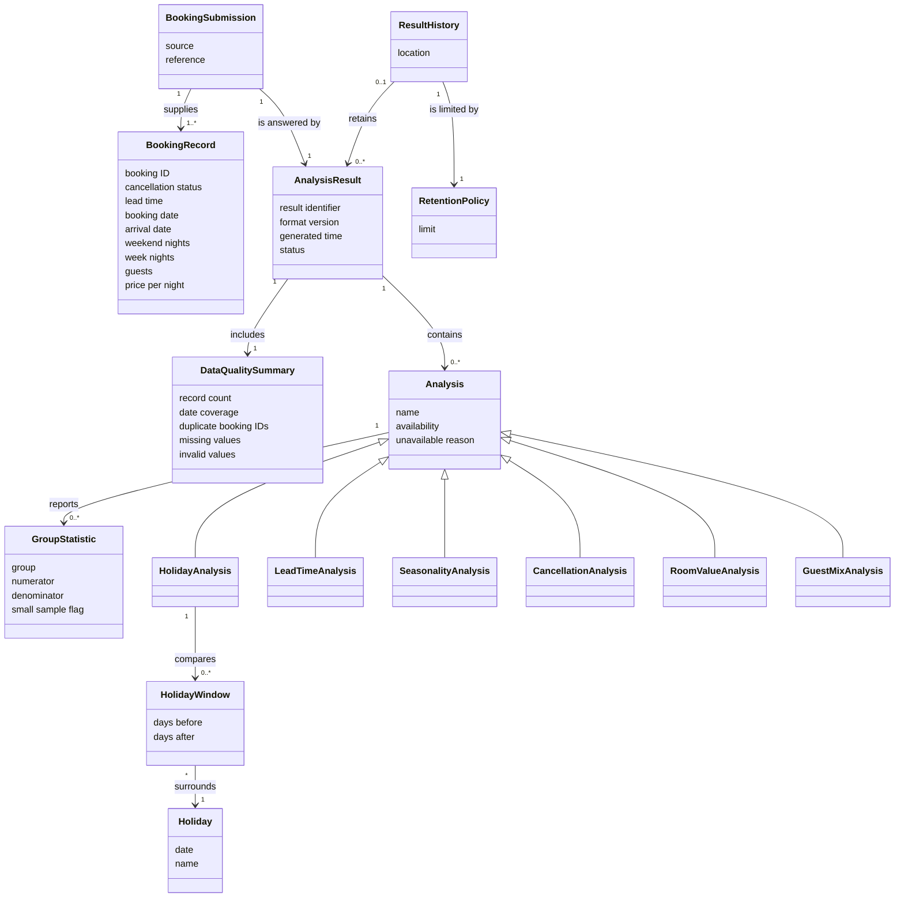

# Domain Model: Hotel Booking Analysis

## Metadata
| Key | Value |
| --- | --- |
| ID | DM-001 |
| CrossReference | [UC-001], [UC-002], [UCD-001] |
| DomainLanguages | IT Professional English |

## Version History
| Date | Status | Author | Reviewer |
| --- | --- | --- | --- |
| 2026-09-29 | Approved | Jens Tirsvad Nielsen | Team2 (S04) |
| 2026-09-29 | Proposed | Jens Tirsvad Nielsen | Team2 (S04) |

---

## Purpose and Scope

The vocabulary shared by the stories, use cases and decisions for the hotel-booking analysis. It covers [UC-001] (Analyze Hotel Bookings) and [UC-002] (Review Analysis History) and stays within the actors in [UCD-001]. It shows concepts, attributes and associations only.

## Diagram

## Concept Table

| Concept | Definition | Attributes | Source (use case noun phrase / glossary) |
| --- | --- | --- | --- |
| Booking Submission | One set of booking records supplied by the Calling system for analysis, or the development sample used in its place | source (supplied or development sample), reference (file name) | UC-001 "JSON file of booking records" |
| Booking Record | One hotel booking | booking ID, hotel, cancellation status, lead time, booking date, arrival date, weekend nights, week nights, adults, children, babies, meal, country, market segment, repeat-guest status, previous cancellations, assigned room type, booking changes, deposit type, agent, customer type, parking spaces, special requests, price per night | UC-001 "booking records" |
| Data Quality Summary | What is known about the completeness and validity of a submission | record count, earliest and latest booking date, earliest and latest arrival date, duplicate booking ID count, missing values per field, invalid values per field | UC-001 "data-quality summary" |
| Analysis | One kind of finding drawn from the bookings, available or unavailable | name, availability, unavailable reason | UC-001 "each analysis" |
| Lead Time Analysis | Analysis of how far ahead guests book | name, availability | UC-001 "lead time" |
| Holiday Analysis | Analysis of booking and arrival behavior around Cambodian holidays | name, availability | UC-001 "Cambodian holidays" |
| Seasonality Analysis | Analysis of bookings by booking date and arrivals by arrival date over time | name, availability | UC-001 "seasonality and booking pace" |
| Cancellation Analysis | Analysis of cancellation rates across booking attributes | name, availability | UC-001 "cancellations" |
| Room Value Analysis | Analysis of stay length and estimated booking value | name, availability | UC-001 "room value and stay patterns" |
| Guest Mix Analysis | Analysis of guest and booking composition | name, availability | UC-001 "guest and booking mix" |
| Group Statistic | A count-based figure for one group of bookings | group, numerator, denominator, small sample flag | UC-001 "numerator and denominator", "small samples" |
| Holiday | A Cambodian public holiday from the holiday calendar | date, name | UC-001 "Cambodian holidays" |
| Holiday Window | The days before and after a holiday that are compared with ordinary days | days before, days after | US-001.03 "windows before and after" a holiday |
| Analysis Result | The complete outcome of one analysis run | result identifier, format version, generated time, status | UC-001 "result", UC-002 "retained result" |
| Result History | The local record of retained results | location | UC-001 "history", UC-002 "history" |
| Retention Policy | The rule limiting how many results the history keeps | limit | UC-001 "retention limit" |

## Association Table

| From | Association name (with reading direction) | To | Multiplicity (both ends) |
| --- | --- | --- | --- |
| Booking Submission | supplies (submission supplies records) | Booking Record | 1 to 1..* |
| Booking Submission | is answered by (submission is answered by result) | Analysis Result | 1 to 1 |
| Analysis Result | includes (result includes summary) | Data Quality Summary | 1 to 1 |
| Analysis Result | contains (result contains analyses) | Analysis | 1 to 0..* |
| Analysis | reports (analysis reports statistics) | Group Statistic | 1 to 0..* |
| Holiday Analysis | compares (analysis compares windows) | Holiday Window | 1 to 0..* |
| Holiday Window | surrounds (window surrounds holiday) | Holiday | * to 1 |
| Result History | retains (history retains results) | Analysis Result | 0..1 to 0..* |
| Result History | is limited by (history is limited by policy) | Retention Policy | 1 to 1 |

An Analysis Result of a failed run has no Analysis and is not retained; the 0..* on the contains association and the 0..1 on the retains association cover this ([ADR-0003], [ADR-0005]).

## Generalizations

Lead Time Analysis, Holiday Analysis, Seasonality Analysis, Cancellation Analysis, Room Value Analysis and Guest Mix Analysis are each kinds of Analysis. Each is an "is-a" relationship: every one is available or unavailable and reports statistics.

---

[UC-001]: ./use-cases/uc-001-analyze-hotel-bookings.md
[UC-002]: ./use-cases/uc-002-review-analysis-history.md
[UCD-001]: ./use-case-diagram.md
[ADR-0003]: ./adr/adr-0003-jsonl-history-and-retention.md
[ADR-0005]: ./adr/adr-0005-delivery-and-failure-semantics.md
