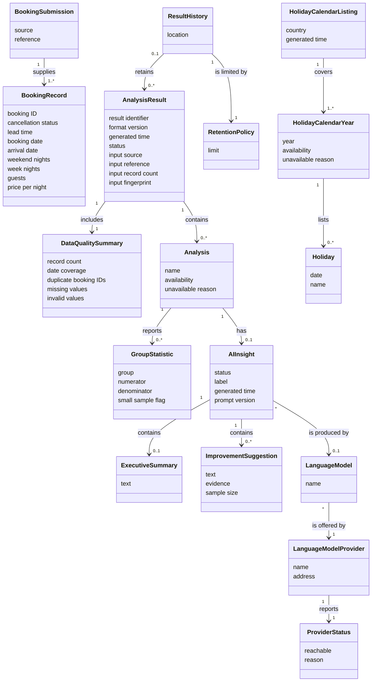

# Domain Model: Hotel Booking Analysis

## Metadata
| Key | Value |
| --- | --- |
| ID | DM-001 |
| CrossReference | [UC-001], [UC-002], [UC-003], [UC-004], [UC-005], [UCD-001], [SSD-001] |
| DomainLanguages | IT Professional English |

## Version History
| Date | Status | Author | Reviewer |
| --- | --- | --- | --- |
| 2026-09-29 | Approved | Jens Tirsvad Nielsen | Team2 (S04) |
| 2026-09-29 | Approved | Jens Tirsvad Nielsen | Team2 (S04) |
| 2026-09-29 | Approved | Jens Tirsvad Nielsen | TBD (S04 not yet named) |
| 2026-09-30 | Proposed | Jens Tirsvad Nielsen | Team2 (S04) |

---

## Purpose and Scope

The vocabulary shared by the stories, use cases and decisions for the hotel-booking analysis. It covers [UC-001] (Analyze Hotel Bookings), [UC-002] (Review Analysis History), [UC-003] (Get Holiday Calendar), [UC-004] (Get Available LLM Providers) and [UC-005] (Get AI Insights for Analyses), and stays within the actors in [UCD-001]. It shows concepts, attributes and associations only.

This revision (2026-09-30, MIL-009 task 1) does two things. It adds the concepts behind the holiday listing, the language-model providers and the AI insights, so that [ADR-0009], [ADR-0010] and [ADR-0011] use one vocabulary. It also states how the model differs from the earlier version now that the system has been built (open issue OI-25 in [PP-001]); the model below is the current truth and no longer contradicts the built system. The section Differences from the Earlier Model lists each change.

## Diagram

## Concept Table

| Concept | Definition | Attributes | Source (use case noun phrase / glossary) |
| --- | --- | --- | --- |
| Booking Submission | One set of booking records supplied by the Calling system for analysis, or the development sample used in its place. It exists during one run; the result keeps a copy of its description, not the submission itself | source (supplied or development sample), reference (file name) | UC-001 "JSON file of booking records" |
| Booking Record | One hotel booking | booking ID, hotel, cancellation status, lead time, booking date, arrival date, weekend nights, week nights, adults, children, babies, meal, country, market segment, repeat-guest status, previous cancellations, assigned room type, booking changes, deposit type, agent, customer type, parking spaces, special requests, price per night | UC-001 "booking records" |
| Data Quality Summary | What is known about the completeness and validity of a submission | record count, earliest and latest booking date, earliest and latest arrival date, duplicate booking ID count, missing values per field, invalid values per field | UC-001 "data-quality summary" |
| Analysis | One kind of finding drawn from the bookings, available or unavailable. There are six kinds, told apart by the name: lead time (how far ahead guests book), holidays (booking and arrival behavior around Cambodian holidays, compared over windows of a whole number of days before and after each holiday), seasonality (bookings by booking date and arrivals by arrival date over time), cancellations (cancellation rates across booking attributes), room value (stay length and estimated booking value) and guest mix (guest and booking composition) | name, availability, unavailable reason | UC-001 "each analysis", "lead time", "Cambodian holidays", "seasonality and booking pace", "cancellations", "room value and stay patterns", "guest and booking mix" |
| Group Statistic | A count-based figure for one group of bookings. It is worked out during the analysis and exists only as a figure inside the findings of its Analysis | group, numerator, denominator, small sample flag | UC-001 "numerator and denominator", "small samples" |
| Holiday | A Cambodian public holiday from the holiday calendar | date, name | UC-001 "Cambodian holidays"; UC-003 "Cambodian (KH) public holidays" |
| Analysis Result | The complete outcome of one analysis run. It holds a copy of the description of the input, not a link to it, and contains no booking record. Once retained it is a stored document | result identifier, format version, generated time, status, input source, input reference, input record count, input fingerprint | UC-001 "result", "input reference", UC-002 "retained result"; the input source, record count and fingerprint are the input description defined in [ADR-0002] |
| Result History | The local record of retained results, kept as a file | location | UC-001 "history", UC-002 "history" |
| Retention Policy | The rule limiting how many results the history keeps | limit | UC-001 "retention limit" |
| AI Insight | The AI-generated commentary on one Analysis: available, unavailable with a reason, or not applicable when the Analysis itself is unavailable. Always labeled as AI-generated and never a finding | status, label, generated time, prompt version | UC-005 "insight", "AI-generated", UC-002 "AI insights" |
| Executive Summary | A short AI-generated text that summarizes one Analysis at a glance | text | UC-005 "executive summary" |
| Improvement Suggestion | An AI-generated idea for testing, worded as a hypothesis, with the observed association it rests on and the number of bookings behind it | text, evidence, sample size | UC-005 "improvement suggestions", "sample sizes" |
| Language Model Provider | A service that offers language models, either Ollama or LM Studio | name, address | UC-004 "language-model (LLM) providers" |
| Provider Status | Whether a Language Model Provider could be reached at the time of a check, and the reason when it could not | reachable, reason | UC-004 "whether it is reachable", "the reason" |
| Language Model | A model that a Language Model Provider offers and that can produce an AI Insight | name | UC-004 "the models it offers", UC-005 "model" |
| Holiday Calendar Listing | The answer to a request for the Cambodian holidays of the requested years; it involves no analysis and no history | country, generated time | UC-003 "holiday calendar", "JSON answer" |
| Holiday Calendar Year | One requested year within a Holiday Calendar Listing, with its holidays or marked unavailable when the calendar has no data for it | year, availability, unavailable reason | UC-003 "for each requested year", "unavailable marker" |

## Association Table

| From | Association name (with reading direction) | To | Multiplicity (both ends) |
| --- | --- | --- | --- |
| Booking Submission | supplies (submission supplies records) | Booking Record | 1 to 1..* |
| Analysis Result | includes (result includes summary) | Data Quality Summary | 1 to 1 |
| Analysis Result | contains (result contains analyses) | Analysis | 1 to 0..* |
| Analysis | reports (analysis reports statistics) | Group Statistic | 1 to 0..* |
| Analysis | has (analysis has insight) | AI Insight | 1 to 0..1 |
| AI Insight | contains (insight contains summary) | Executive Summary | 1 to 0..1 |
| AI Insight | contains (insight contains suggestions) | Improvement Suggestion | 1 to 0..* |
| AI Insight | is produced by (insight is produced by model) | Language Model | * to 0..1 |
| Language Model | is offered by (model is offered by provider) | Language Model Provider | * to 1 |
| Language Model Provider | reports (provider reports status) | Provider Status | 1 to 1 |
| Holiday Calendar Listing | covers (listing covers years) | Holiday Calendar Year | 1 to 1..* |
| Holiday Calendar Year | lists (year lists holidays) | Holiday | 1 to 0..* |
| Result History | retains (history retains results) | Analysis Result | 0..1 to 0..* |
| Result History | is limited by (history is limited by policy) | Retention Policy | 1 to 1 |

An Analysis Result of a failed run has no Analysis and is not retained; the 0..* on the contains association and the 0..1 on the retains association cover this ([ADR-0003], [ADR-0005]).

An Analysis has no AI Insight (0) when insights were not asked for, which is the default, and one AI Insight (1) when they were, including an insight that is unavailable or not applicable. An AI Insight has an Executive Summary and Improvement Suggestions only when it is available, and a Language Model only when one was chosen; an insight that could not be produced because no provider or model was found has none ([ADR-0010]). A Holiday Calendar Year that is unavailable lists no Holiday (0), and a Holiday Calendar Listing of a failed request is not made ([ADR-0011]).

Language Model Provider, Provider Status and Language Model exist for the moment of a check or a run. A stored AI Insight keeps only the names of the provider and the model as text, not the provider itself ([ADR-0011]). A Holiday Calendar Listing and a provider listing are answers to a request; neither is stored in the history.

## Generalizations

None. Earlier versions showed Lead Time Analysis, Holiday Analysis, Seasonality Analysis, Cancellation Analysis, Room Value Analysis and Guest Mix Analysis as kinds of Analysis. The built system shows the kinds do not differ in what an Analysis is: each one is available or unavailable, has a name and reports statistics. They differ only in how each one is calculated. They are therefore six values of the name of one Analysis, not six specializations, and the calculation of each is a design matter ([DCD-001], deviation DD-1). No other is-a relationship exists among the concepts.

## Differences from the Earlier Model

The earlier DM-001 (2026-09-29) was written before the code. The build differs from it in the following ways; each difference is now the model, and each was raised as open issue OI-25 in [PP-001] and resolved by this revision (the deviation numbers are those of [OC-001], [SD-001] and [DCD-001]).

| Earlier model | Current model | Reference |
| --- | --- | --- |
| Six kinds of Analysis as specializations (Lead Time Analysis to Guest Mix Analysis) | One Analysis concept; the six kinds are its name. Each kind is calculated by its own rule in the design, which is not a domain specialization | SD-4; DD-1; Generalizations above |
| Result History as a concept with its own behavior | Result History remains a business concept, but it is a file of stored results, kept by two separate steps, one that appends a result and applies the retention limit and one that only reads it. The retention limit is given when a result is appended; nothing represents the history as an object | DD-2 |
| Booking Submission is answered by Analysis Result (1 to 1) | Removed as an association. The Analysis Result holds a copy of the description of its input (source, reference, record count and a fingerprint of the content) as its own attributes, so no submission and no booking record survives in the result | OD-2; SD-7; DD-5 |
| Group Statistic as a lasting part of an Analysis | Group Statistic is a figure worked out during the analysis and kept only inside the findings of the Analysis as part of the result document; nothing holds it separately | DD-4 |
| Retained results as Analysis Result concepts rebuilt from the history | A retained result is a stored document. The viewer reads its parts as they are stored and does not rebuild the concepts; the associations above describe what the document contains | SD-6; DD-9 |
| Holiday Window (days before, days after) compared by the Holiday Analysis | Not a concept: the windows are whole numbers of days taken from configuration, and each appears as a comparison inside the holiday findings. The associations compares and surrounds were removed with it | DD-3 (the definition was removed from the code and [DCD-001] on 2026-09-30); [ADR-0007] |

## Traceability of the New Concepts

The concepts added by this revision are used by the decisions as follows: Language Model Provider, Provider Status and Language Model by [ADR-0009]; AI Insight, Executive Summary and Improvement Suggestion by [ADR-0010]; Holiday Calendar Listing, Holiday Calendar Year and the fields of all of them in the JSON documents by [ADR-0011].

---

[UC-001]: ./use-cases/uc-001-analyze-hotel-bookings.md
[UC-002]: ./use-cases/uc-002-review-analysis-history.md
[UC-003]: ./use-cases/uc-003-get-holiday-calendar.md
[UC-004]: ./use-cases/uc-004-get-available-llm-providers.md
[UC-005]: ./use-cases/uc-005-get-ai-insights-for-analyses.md
[UCD-001]: ./use-case-diagram.md
[ADR-0002]: ./adr/adr-0002-result-json-contract.md
[ADR-0003]: ./adr/adr-0003-jsonl-history-and-retention.md
[ADR-0005]: ./adr/adr-0005-delivery-and-failure-semantics.md
[ADR-0007]: ./adr/adr-0007-analysis-methods.md
[ADR-0009]: ./adr/adr-0009-llm-provider-discovery-and-connection.md
[ADR-0010]: ./adr/adr-0010-ai-insight-generation-and-guardrails.md
[ADR-0011]: ./adr/adr-0011-output-contracts-and-result-1-1.md
[SSD-001]: ./ssd.md
[OC-001]: ./operation-contracts.md
[SD-001]: ./sequence-diagrams.md
[DCD-001]: ./dcd.md
[PP-001]: ./project-plan.md
