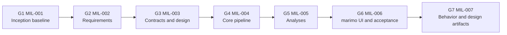

# Project Plan: Hotel Booking Analysis (marimo)

## Metadata
| Key | Value |
| --- | --- |
| ID | PP-001 |
| CrossReference | [MIL-001], [MIL-002], [MIL-003], [MIL-004], [MIL-005], [MIL-006], [BC-001], [SA-001], [US-001], [MIL-007] |
| DomainLanguages | IT Professional English |

## Version History
| Date | Status | Author | Reviewer |
| --- | --- | --- | --- |
| 2026-09-29 | Approved | Jens Tirsvad Nielsen | TBD (S-ID pending SA-001) |
| 2026-09-29 | Approved | Jens Tirsvad Nielsen | TBD (S04 not yet named) |
| 2026-09-29 | Approved | Jens Tirsvad Nielsen | TBD (S04 not yet named) |
| 2026-09-29 | Approved | Jens Tirsvad Nielsen | Team2 (S04) |
| 2026-09-29 | Approved | Jens Tirsvad Nielsen | Team2 (S04) |
| 2026-09-29 | Proposed | Jens Tirsvad Nielsen | Team2 (S04) |

---

## Purpose

Schedule the phases (gateways) that take the hotel-booking analysis application from an empty repository to a marimo app. A calling system supplies a JSON file of booking records and receives an analysis result as JSON. Each result is also appended to a local JSONL history that marimo can display, and only the latest N results are kept (N from a configuration file, default 10). No deadline is known, so the plan orders phases by dependency and leaves dates open (OI-01).

**Status of this activity:** planning only. This activity creates and revises planning artifacts (`docs/`) and defines future coding tasks. No marimo app, Python module, test, configuration file, dependency installation or `.venv` change is made until the required artifacts are completed and reviewed and the coding gateway (MIL-004) is authorized to start. The gateways and tasks were synced to GitHub as milestones and issues on 2026-09-29 (55 issues); planning artifacts are committed through pull requests.

## Planning Assumptions

- Start date and end date are unknown; no date in this plan is a commitment (OI-01).
- Phase length is not fixed; a phase ends when its Go/No-Go criteria are met.
- The Calling system is the primary actor. The person viewing history in marimo is not identified (OI-03).
- The production input is JSON. The example CSV `./data/example/nf_hotel_bookings.csv` (semicolon-delimited, 8538 data rows, columns listed in the prompt, dates such as `08-03-2021`) is development context only, not a production schema.
- Stakeholder IDs come from SA-001: S01 owns every gateway and S04 is the approving reviewer (OI-02 remains open until S02 to S05 are confirmed as named people).
- The repository is a Git repository with the GitHub remote `NF-Hotel/Notebook_Market_Analysis`; the milestone links below point to it.
- The Python environment `.venv` has none of marimo, polars, holidays or pytest installed; installing them is a MIL-004 task, not part of this activity.

## Gateway Schedule

| Gateway | Document | Window | Decision date | Owner | Stories | Main deliverable | Milestone |
| --- | --- | --- | --- | --- | --- | --- | --- |
| G1 Inception baseline | [MIL-001] | TBD (OI-01) | TBD | S01 | none | SA, BC, UCD, TM, plan and gateway reviews | [Milestone-1] |
| G2 Requirements | [MIL-002] | TBD | TBD | S01 | US-001.01 to US-001.10 | US-001, UC-001, UC-002 and reviews | [Milestone-2] |
| G3 Contracts and design | [MIL-003] | TBD | TBD | S01 | US-001.01 to US-001.10 | DM-001, ADR-0001 to ADR-0007 | [Milestone-3] |
| G4 Core pipeline (coding) | [MIL-004] | TBD | TBD | S01 | US-001.01, .08, .09 | Working input, result, history, retention, delivery | [Milestone-4] |
| G5 Analyses (coding) | [MIL-005] | TBD | TBD | S01 | US-001.02 to .07 | Six analyses in the result | [Milestone-5] |
| G6 marimo UI and acceptance (coding) | [MIL-006] | TBD | TBD | S01 | US-001.10, .01 to .07 | marimo notebook, history viewer, end-to-end test | [Milestone-6] |
| G7 Behavior and design artifacts | [MIL-007] | TBD | TBD | S01 | US-001.01 to US-001.10 | SSD-001, OC-001, SD-001, DCD-001 and reviews |  [Milestone-7] |



The Mermaid `gantt` chart recommended by the PP reference is deferred until dates exist (OI-01); the chart above shows order only.

## Scope Coverage

| Business Case scope item | Gateway |
| --- | --- |
| Load and understand data (record count, coverage, missing, invalid, duplicates) | G2 story, G3 input contract, G4 code, G6 view |
| Lead time, holidays (KH), seasonality, cancellations, room value, guest mix | G2 stories, G3 ADR-0007, G5 code, G6 views |
| Return the analysis result to the caller as JSON | G2 story and UC-001, G3 ADR-0002 and ADR-0005, G4 code |
| Append each result to a local JSONL history | G3 ADR-0003, G4 code |
| Retain only the latest N results, N from a configuration file, default 10 | G3 ADR-0003 and ADR-0004, G4 code |
| Display prior results from the history in marimo | G2 UC-002, G6 code |
| Visible data limitations and association-not-causation wording | G3 ADR-0007, G5 code, G6 notice component |
| Development-only CSV fallback | G3 ADR-0001, G4 code, G6 docs |
| Behavior and design of every use case (system sequence diagram, operation contracts, sequence diagrams, design class diagram) | G7, written as built |

No KPI document is planned, because no measurable success targets or baselines are supplied; gateways trace to BC-001 objectives instead.

## Dependencies

```
MIL-001 → MIL-002 → MIL-003 → MIL-004 → MIL-005 → MIL-006 → MIL-007
```

A No-Go at a gateway pauses every later gateway; dates cannot be stated until OI-01 is resolved. Coding gateways (MIL-004 to MIL-006) may not start before MIL-001 to MIL-003 are Go. MIL-007 documents the built design and follows MIL-006.

## Artifact Selection

Each selected artifact has exactly one task. Review records (RC) are separate artifacts and have separate tasks. ADR, PP and TM have no QC checklist, so no RC is planned for them (OI-07).

| Artifact | Purpose and why needed | Gateway, task | Depends on |
| --- | --- | --- | --- |
| PP-001 Project Plan | Schedules the gateways; required by convention | MIL-001 task 1 (drafted, review) | none |
| MIL-001 to MIL-006 | One gateway per phase, each holding its tasks; required by convention | MIL-001 tasks 2 to 7 (drafted, RC each) | PP-001 |
| SA-001 Stakeholder Analysis | Supplies the S-IDs every owner and reviewer needs; none exist | MIL-001 task 8 | none |
| BC-001 Business Case | States objectives, scope and constraints that gateways and stories trace to | MIL-001 task 9 | SA-001 |
| UCD-001 Use Case Diagram | Fixes actors and goals so story roles and use cases match | MIL-001 task 10 | SA-001, BC-001 |
| TM-001 Traceability Matrix | Tracks links and review status of every instance | MIL-001 task 11 | none |
| RC records for SA-001, BC-001, UCD-001 | Review evidence before requirements | MIL-001 tasks 12 to 14 | the reviewed artifact |
| RC records for MIL-001 to MIL-006 | Confirm objective Go/No-Go criteria | MIL-001 tasks 2 to 7 | the reviewed MIL |
| US-001 User Stories | Ten actor-goal stories (one document, one task) | MIL-002 task 1 | UCD-001, BC-001 |
| UC-001 Analyze Hotel Bookings | Primary use case, fully dressed | MIL-002 task 2 | UCD-001, US-001 |
| UC-002 Review Analysis History | Use case for displaying retained results | MIL-002 task 3 | UCD-001, US-001 |
| RC records for US-001, UC-001, UC-002 | Review evidence before design | MIL-002 tasks 4 to 6 | the reviewed artifact |
| DM-001 Domain Model | One vocabulary for contracts and code | MIL-003 task 1 | UC-001, UC-002 |
| ADR-0001 Input contract | Production JSON shape and required versus optional fields; the repository has none | MIL-003 task 2 | US-001, DM-001 |
| ADR-0002 Result contract | Result envelope, versioning and identification | MIL-003 task 3 | DM-001 |
| ADR-0003 History and retention | JSONL format, location, corruption handling, retention timing | MIL-003 task 4 | ADR-0002 |
| ADR-0004 Configuration file | Format, location, default 10, validation | MIL-003 task 5 | ADR-0003 |
| ADR-0005 Delivery and failure semantics | Return and history consistency, failure behavior | MIL-003 task 6 | ADR-0002, ADR-0003 |
| ADR-0006 Architecture and invocation | Layering, marimo boundary, invocation mechanism, dependencies | MIL-003 task 7 | ADR-0005 |
| ADR-0007 Analysis methods | Bands, holiday windows, baselines, sample sizes, labels | MIL-003 task 8 | US-001, ADR-0001 |
| RC record for DM-001 | Review evidence for the domain model | MIL-003 task 9 | DM-001 |
| SSD-001 System Sequence Diagrams | System operations of each use case (one document, a diagram per use case); required for every use case | MIL-007 task 1 | UC-001, UC-002 |
| OC-001 Operation Contracts | One contract per system operation in SSD-001 | MIL-007 task 2 | SSD-001, DM-001 |
| SD-001 Sequence Diagrams | How the built objects realize each contract | MIL-007 task 3 | OC-001 |
| DCD-001 Design Class Diagram | The built classes, ports and relationships per layer | MIL-007 task 4 | SD-001, DM-001 |
| RC records for SSD-001, OC-001, SD-001, DCD-001 | Review evidence for the behavior and design artifacts | MIL-007 tasks 5 to 8 | the reviewed artifact |

Types assessed and not selected: BMC, BPMN and RA (no business-model, process or risk questions that block implementation; risks are in this plan and BC-001); KPI (no measurable targets supplied); ERD (there is no relational store); GOV (no approval workflow information); a separate data-contract type does not exist in the catalog, so contracts are ADRs (OI-07).

## Planning Coverage Check

- Every artifact in the table above has exactly one task; the gateway documents hold 14 (G1), 6 (G2), 9 (G3), 10 (G4), 8 (G5) 8 (G6) and 8 (G7) tasks.
- Every user story traces to UC-001, UC-002 or a gateway: US-001.01 to .07 to UC-001 and MIL-002, US-001.08 and .09 to UC-001, US-001.10 to UC-002.
- Every coding task cites the ADR, story or use case it implements, and no coding task appears before MIL-004.
- Every gateway has a deliverable and numbered Go/No-Go criteria.

## Plan Risks

| Risk | Impact | Mitigation |
| --- | --- | --- |
| Production JSON schema stays unknown | ADR-0001 and validation cannot be finalized | Resolve with the calling-system owner in G3; No-Go on MIL-003 until decided |
| No stakeholders identified | Gateways lack owners and approving reviewers | SA-001 first in G1; No-Go criterion 1 |
| Invocation mechanism between caller and marimo unclear | Delivery design blocked | ADR-0006 must decide (OI-04) |
| Small or partial-year data makes holiday and seasonal findings weak | Misleading conclusions | ADR-0007 sample-size flags and association-only wording |
| Concurrent callers corrupt the history file | Lost or malformed results | Decide locking and atomic append in ADR-0003 (OI-10) |
| `holidays` lacks a needed KH year | Holiday analysis incomplete | Report the analysis unavailable rather than invent dates |
| Review effort (many RC records) slows the gateways | Schedule slip | Reviews are small and per artifact; batch reviewer time per gateway |
| Design artifacts written after the code (MIL-007) drift from it or hide design flaws | The diagrams describe what was built, not what was intended | Check every class and method against `src/`; list differences from the ADRs; turn flaws into new coding tasks |

## Review Notes

No QC checklist exists for the Project Plan, so it is checked against the Business Case constraints and each gateway's Go/No-Go criteria, as the PP reference prescribes. AI-assisted draft check, 2026-09-29; the approving reviewer S04 has not yet confirmed it.

| # | Check | Result |
| --- | --- | --- |
| 1 | Every gateway MIL-001 to MIL-006 appears in the Gateway Schedule with document, owner and deliverable | Pass |
| 2 | Owner is a stakeholder ID from SA-001 | Pass (S01) |
| 3 | The dependency chain matches the Dependencies section of each MIL document | Pass |
| 4 | Task counts stated in the coverage check match the MIL documents (14, 6, 9, 10, 8, 8) | Pass |
| 5 | Business Case constraints respected: coding gateways come after the requirement, contract and design gateways | Pass |
| 6 | Window and decision dates present | Fail: all TBD, because BC-001 states no deadline (OI-01) |
| 7 | Milestone links point to the GitHub milestones | Pass |
| 8 | Statements about repository state are current | Fixed in this review (Git status, sync status, OI-08) |

Verdict: Go-with-conditions. Conditions: S01 supplies dates or confirms none are required (OI-01); S04 confirms this check.

## Open Issues

- **OI-01:** No start date, deadline or gateway target dates are supplied. Resolve in G1.
- **OI-02:** Stakeholders: SA-001 defines S01 to S05 and all are now named (S02 Valdemar, S03 and S04 Team2, S05 PO). S01 owns every gateway and S04 is the approving reviewer. Still open: each named person confirming their entry, and the communication channels for S02, S03 and S05.
- **OI-03:** Who views history in marimo is unspecified; the prompt names only the Calling system as actor. UCD-001 provisionally adds an Analyst actor (S05) that S01 must confirm. Resolve in G1.
- **OI-04:** Invocation mechanism: proposed in ADR-0006 as a command-line entry writing JSON to standard output (exit codes in ADR-0005); awaiting confirmation by S02 and acceptance.
- **OI-05:** Production input schema: proposed in ADR-0001 (top-level array, sample field names, ISO dates); awaiting confirmation by S02 and acceptance.
- **OI-06:** Result envelope, history location and configuration: proposed in ADR-0002, ADR-0003 (`output/analysis_history.jsonl`) and ADR-0004 (`hotel_analysis.toml`); awaiting acceptance.
- **OI-07:** The catalog has no data-contract type, no QC checklist for ADR, PP or TM. Contracts are ADRs and their review is a stakeholder approval. Propose upstream changes to the framework rather than edit `framework/`.
- **OI-08:** `sync-project.sh` cannot create milestones while a gateway's Target Date is 'TBD' (it mistakes the Purpose text for a due date), so the six milestones were created by hand; each re-sync prints a harmless update warning. Resolved once target dates exist (OI-01) or the script is fixed upstream.
- **OI-09:** Sensitivity of booking data: ADR-0002 excludes raw records and person-level data from results; the sample has no guest names, but the production feed is unconfirmed. Awaiting S03.
- **OI-10:** Retained-result semantics, retention timing and concurrency: proposed in ADR-0003 (one valid line is one result, retention after append, lock file); awaiting acceptance.
- **OI-11:** `marimo`, `polars`, `holidays` and `pytest` are not installed and KH holiday coverage for the data's years is unverified. Verify at the start of G4 (MIL-004 task 1).
- **OI-12:** The input carries no currency, so estimated room values are labeled in the price units of the input (ADR-0007). Confirm the currency with S02 or S03.

---

[MIL-001]: ./milestones/mil-001-inception-baseline.md
[MIL-002]: ./milestones/mil-002-requirements-actor-goals.md
[MIL-003]: ./milestones/mil-003-contracts-and-design.md
[MIL-004]: ./milestones/mil-004-core-pipeline-implementation.md
[MIL-005]: ./milestones/mil-005-analyses-implementation.md
[MIL-006]: ./milestones/mil-006-marimo-ui-and-acceptance.md
[MIL-007]: ./milestones/mil-007-behavior-and-design-artifacts.md
[Milestone-7]: https://github.com/NF-Hotel/Notebook_Market_Analysis/milestone/7
[Milestone-1]: https://github.com/NF-Hotel/Notebook_Market_Analysis/milestone/1
[Milestone-2]: https://github.com/NF-Hotel/Notebook_Market_Analysis/milestone/2
[Milestone-3]: https://github.com/NF-Hotel/Notebook_Market_Analysis/milestone/3
[Milestone-4]: https://github.com/NF-Hotel/Notebook_Market_Analysis/milestone/4
[Milestone-5]: https://github.com/NF-Hotel/Notebook_Market_Analysis/milestone/5
[Milestone-6]: https://github.com/NF-Hotel/Notebook_Market_Analysis/milestone/6
[BC-001]: ./business-case.md
[SA-001]: ./stakeholder-analysis.md
[US-001]: ./user-stories.md
