# Sequence Diagrams

## Metadata
| Key | Value |
| --- | --- |
| ID | SD-001 |
| CrossReference | [OC-001], [DCD-001] |
| DomainLanguages | IT Professional English |

## Version History
| Date | Status | Author | Reviewer |
| --- | --- | --- | --- |
| 2026-09-29 | Approved | Jens Tirsvad Nielsen | Team2 (S04) |
| 2026-09-29 | Approved | Jens Tirsvad Nielsen | TBD (S04 not yet named) |
| 2026-09-30 | Approved | Jens Tirsvad Nielsen | Team2 (S04) |
| 2026-09-30 | Approved | Jens Tirsvad Nielsen | Team2 (S04) |
| 2026-09-30 | Proposed | Jens Tirsvad Nielsen | Team2 (S04) |

---

This document shows how the **built** objects of `src/hotel_booking_analysis` collaborate to realize the postconditions of the four operation contracts of [OC-001] (gateway MIL-007, sequence caveat: the documents describe the system as built and were checked against the code). Each block names the contract it realizes, gives one Mermaid `sequenceDiagram`, annotates the GRASP and GoF patterns, lists which message satisfies which postcondition, and checks that no object is a god object. Object and method names are the real names in the code; the class structure is in [DCD-001].

**Scope note (MIL-009, 2026-09-30).** Everything above the heading **Designed Additions (MIL-009, not yet built)** at the end of this document describes the built objects and is unchanged. That last part is a design made before the code: the collaborations that realize the contracts of `getHolidayCalendar`, `getLlmProviders`, the insights of `analyzeBookings` and the insight display of `selectResult`, implemented in MIL-010 and MIL-011.

The operation `analyzeBookings` has one block for the object construction (1.0) and one block per scenario of [SSD-001] diagrams 1.1 to 1.5 (1.1 to 1.5 below); the three operations of [UC-002] have one block each (2.1 to 2.3).

| Block | Realizes (contract in [OC-001]) | Scenario |
| --- | --- | --- |
| 1.0 | `analyzeBookings` (lifecycle: the System instance is created) | Object graph built by the composition root |
| 1.1 | `analyzeBookings` | Main success, steps 1 to 5: configuration, load, validate, analyze, assemble |
| 1.2 | `analyzeBookings` | Main success, steps 6 to 8: serialize, append, retention, deliver, exit code 0 |
| 1.3 | `analyzeBookings` | Input or configuration error: `failed` result, exit code 2 (or 4, AD-2) |
| 1.4 | `analyzeBookings` | History write or retention failure: exit code 3 |
| 1.5 | `analyzeBookings` | Delivery failure of a completed result: exit code 4 |
| 2.1 | `listRetainedResults` | Notebook reads the history and lists the results |
| 2.2 | `selectResult` | Analyst selects a result, older-schema notice, default views |
| 2.3 | `chooseViewOption` | Analyst chooses a view option, one view re-renders |

**Notation.** Solid line with filled arrowhead (`->>`) is a synchronous call; dashed line with filled arrowhead (`-->>`) is the return; a dashed line with a cross (`--x`) is an exception that ends the call; `create participant` marks the message that constructs an object, and `destroy` marks the end of a transient object. All calls are synchronous: the analysis run is a single-threaded call chain in one process and the marimo cells are run one after the other by the notebook runtime, so no asynchronous (open arrow) message occurs. Activation bars show the call nesting. Messages are numbered per diagram. A participant labelled `module` is a module of functions (Pure Fabrication) rather than a class. Layer names under a participant are the packages of `src/hotel_booking_analysis`.

## Sequence 1.0: analyzeBookings, object construction

**Realizes:** `analyzeBookings` in [OC-001] (the SSD-001 lifecycle note "created when the process starts (the composition root wires the adapters)"; a prerequisite of blocks 1.1 to 1.5).

### Diagram

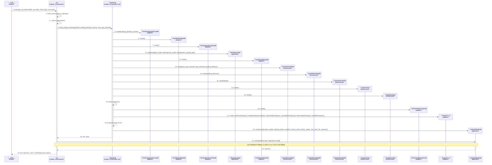

### Pattern Annotations

| Pattern (GRASP / GoF) | Applied to | Rationale |
| --- | --- | --- |
| Factory (creation in one place, GoF Factory Method style function) and Pure Fabrication (GRASP) | `bootstrap.build_analyze_bookings`, `bootstrap.build_analyzers` | The wiring of concrete adapters is a technical concern with no domain counterpart, so it is put in one module of the outermost non-notebook layer; the use case never names a concrete class. |
| Dependency Injection (constructor injection) and Protected Variations (GRASP) | `AnalyzeBookings` (message 19), `BookingLoader` (message 8), `HolidayAnalyzer` (message 17) | Collaborators are passed as `Protocol` ports, so an adapter can be replaced (tests use fakes) without changing the use case. |
| Adapter (GoF) | `TomlConfigurationLoader`, `JsonBookingReader`, `DevelopmentCsvReader`, `JsonResultSerializer`, `JsonlHistoryWriter`, `JsonlHistoryReader`, `StreamResultSink`, `SystemClock`, `UuidGenerator`, `KhmerHolidayCalendar` | Each adapts a file format, stream, clock or library to one port of `application/ports.py`. |
| Strategy (GoF) | `AZ` (the six analyzers, message 17) | The analyzers are interchangeable implementations of the `Analyzer` port; the use case receives them as a tuple and applies each by its `name`. |
| Controller (GRASP), command-line entry | `cli.main` | Receives the system event from the process boundary, delegates the work to the use case and translates the outcome to the exit code. |

### Postcondition Coverage

This block has no postcondition of its own; it realizes the lifecycle note of [SSD-001] (one operating-system process per call, adapters wired when the process starts) and the precondition "Standard output of the process can be written" (message 12 passes the stream to the sink).

| Postcondition (from contract) | Satisfied by message |
| --- | --- |
| Not applicable: construction only. It supplies the objects (messages 5 to 19) that realize every postcondition in blocks 1.1 to 1.5 | 5 to 19, and 21 to 23 for the hand-over to and the return from `run` |

### Responsibility Check

`cli.main` sends 5 of the 23 messages and `bootstrap` sends 16 (13 of them creations); neither computes anything of the analysis. `AnalyzeBookings` receives one message (`run`) in this block. Creation is separated from use (low coupling), so no object receives all messages.

## Sequence 1.1: analyzeBookings, assemble the Analysis Result (steps 1 to 5)

**Realizes:** `analyzeBookings` in [OC-001], main success postconditions on the Booking Submission, the Data Quality Summary, the Analyses and the Analysis Result (UC-001 steps 1 to 5), and the notice postcondition.

### Diagram

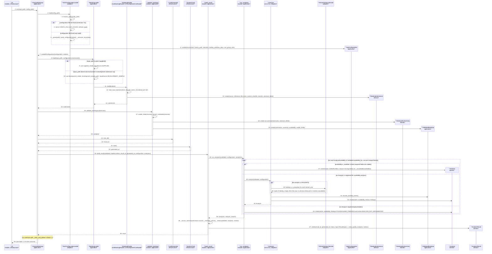

### Pattern Annotations

| Pattern (GRASP / GoF) | Applied to | Rationale |
| --- | --- | --- |
| Controller (GRASP), use-case controller | `AnalyzeBookings.run` (messages 1 to 39) | Receives the system event `analyzeBookings` and delegates each step to a specialist; it holds no analysis rule itself. |
| Strategy (GoF) | `AZ`, the `Analyzer` port (messages 28 to 33) | `run_analyses` selects the analyzer by `AnalysisName` and calls the same `analyze` operation; each of the six analyses is a separate class, so a new analysis is added without changing `run_analyses`. |
| Adapter (GoF) | `CL` (`TomlConfigurationLoader`), `RD` (`JsonBookingReader`, `DevelopmentCsvReader`), `HC` (`KhmerHolidayCalendar`) | They turn a TOML file, a JSON or CSV file and the `holidays` package into the `ConfigurationLoader`, `BookingReader` and `HolidayCalendar` ports. |
| Information Expert (GRASP) | `BookingLoader.load` (messages 8 to 10), `ValidatedBookings.records_for` (message 31), `summarize` (message 18), `_status` (message 36) | The class or function that holds the data decides: the loader knows the fallback rule, the validated bookings know which records hold valid values, the summary function sees all records, and the status depends on the analyses, the summary and the notices that `build_result` holds. |
| Creator (GRASP) | `RD` creates `BookingSubmission`; `validate_bookings` creates `DataQualitySummary` and `ValidatedBookings`; `build_result` creates `AnalysisResult`; analyzers and `run_analyses` create `Analysis` | The creating object contains, aggregates or has the initializing data of the created object. |
| Pure Fabrication (GRASP) | `validate_bookings`, `build_result`, `run_analyses` (modules of functions) | They are use-case steps with no counterpart in the Domain Model; keeping them out of `AnalyzeBookings` keeps it small and keeps the steps testable alone. |
| Value Object | `AppConfiguration`, `LoadedConfiguration`, `BookingSubmission`, `DataQualitySummary`, `ValidatedBookings`, `Analysis`, `AnalysisResult` | All are frozen dataclasses: the result is assembled once and never changed. |

### Postcondition Coverage

| Postcondition (from contract) | Satisfied by message |
| --- | --- |
| A Booking Submission instance was created, source `supplied` (or `development_sample`), reference the file name, supplies its Booking Records | 9 or 10 select the reader and source; 11 and 12 read the records; 13 creates the `BookingSubmission` with source, reference and records |
| A Data Quality Summary instance was created with the record count, date coverage, duplicate booking ID count, and missing and invalid values per field | 17 and 18: `summarize(records, unknown_fields)` creates `DataQualitySummary`; 19 attaches it to `ValidatedBookings` |
| One Analysis instance per kind was created; an Analysis whose required fields are not usable is unavailable with the missing fields as reason, and no values were estimated | 26 to 35: the loop creates one `Analysis` per `AnalysisAvailability` (27 unavailable with reason, 32 analyzed, 34 placeholder); 31 lets an analyzer use only records with valid values, and no message fills a missing value |
| An Analysis Result instance was created with a new result identifier, the format version, the generated time and status `completed` or `completed_with_warnings` | 21 and 22 (new identifier), 23 and 24 (generated time), 36 (`_status`: warnings when an Analysis is unavailable, a value is invalid or unknown configuration keys were ignored), 37 (creation; `schema_version` takes its default `SCHEMA_VERSION`) |
| The Analysis Result was associated with the Booking Submission (is answered by), the Data Quality Summary (includes) and its Analyses (contains); it holds no Booking Record | 37: the arguments are `ResultInput` (source, reference, record count and content hash of the submission, no records), the `DataQualitySummary` and the tuple of `Analysis`; the submission's records are not passed |
| When the configuration file was missing the result carries `CONFIG_FILE_NOT_FOUND`; when the fallback was used it carries `DEVELOPMENT_SAMPLE_USED` | 4 (notice in `LoadedConfiguration`, message 7), 10 and 36 (`_source_notices` adds `DEVELOPMENT_SAMPLE_USED`), 37 (notices stored in the result) |

The postconditions on the Result History, the Retention Policy and the delivery are realized in block 1.2.

### Responsibility Check

`AnalyzeBookings` sends 7 of the 39 messages (six calls to the configuration loader, the loader, the validator, the identifier generator, the clock and `build_result`, and the final return) and does no parsing, counting or statistics. `build_result` and `run_analyses` split the assembly from the analysis, the six analyzers hold the analysis computation (cohesion by analysis), `BookingLoader` holds the source rule, and the domain functions hold the counting rules. No participant sends more than 7 messages (the controller 7, the configuration loader 5), so the controller is not a god object.

## Sequence 1.2: analyzeBookings, store and deliver (steps 6 to 8)

**Realizes:** `analyzeBookings` in [OC-001], main success postconditions on the Result History (retains), the Retention Policy and the delivery to the Calling system (UC-001 steps 6 to 8), exit code 0.

### Diagram

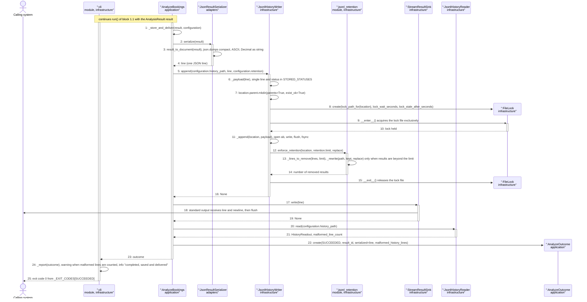

### Pattern Annotations

| Pattern (GRASP / GoF) | Applied to | Rationale |
| --- | --- | --- |
| Controller (GRASP) | `AnalyzeBookings._store_and_deliver` | Orders the steps serialize, append, deliver and only then reports success, so success is reported after both the history write and the hand-over. |
| Adapter (GoF) | `SER`, `HW`, `SNK`, `HR` | Adapt JSON text, the JSONL file with locking and standard output to the ports `ResultSerializer`, `HistoryWriter`, `ResultSink` and `HistoryReader`. |
| Repository-like port (split into writer and reader) | `HistoryWriter`, `HistoryReader` and their JSONL adapters | The application depends on the port, not on the file format; the read side is a separate class because the run writes and the notebook only reads. |
| Information Expert (GRASP) | `enforce_retention` (messages 12 to 14), `JsonlHistoryWriter._payload` (message 6) | The retention function sees the lines of the file and decides which valid results are beyond the limit; the writer knows the stored format (one line, stored status). |
| Scoped resource (context manager) with transient object | `FileLock` (messages 8 to 15) | The lock file of [ADR-0003] exists only for the append and the retention rewrite and is released when the `with` block ends; it is destroyed after `__exit__`. |
| Pure Fabrication (GRASP) | `enforce_retention`, `jsonl_format` helpers | Technical file handling without a domain counterpart, kept out of the writer class. |

### Postcondition Coverage

| Postcondition (from contract) | Satisfied by message |
| --- | --- |
| The Analysis Result was associated with the Result History (retains) as its newest retained result | 2 to 4 create the one serialized line; 6 to 11: `append` adds the line at the end of the file under the lock (`_append`), so it is the newest by file position |
| The Result History no longer retains its oldest Analysis Results beyond the Retention Policy limit; results not beyond the limit and lines that are not valid results were not removed | 12 to 14: `enforce_retention` removes only the oldest valid results beyond `retention.limit` and keeps malformed and blank lines in place |
| The Calling system received the serialized Analysis Result on standard output, identical to the retained one, and the exit code 0 | 4, 5 and 17: the same `line` is written to the history and to the sink; 18 delivers it on standard output; 25 returns exit code 0 |
| (Closing the run) the outcome is `SUCCEEDED` only after the append and the delivery both completed | 16 and 19 precede 22, which creates `AnalyzeOutcome(SUCCEEDED, ...)` |

The postcondition of a warning about malformed history lines (AD-5 of [SSD-001]) is message 20 to 24 and is not a postcondition of the contract.

### Responsibility Check

`AnalyzeBookings` sends 7 of the 25 messages here (one self call, five calls and the return) and delegates serialization, storage, locking, retention, delivery and the malformed-line count to different collaborators. `JsonlHistoryWriter` receives one operation (`append`) and delegates the lock to `FileLock` and the retention to `enforce_retention`. No participant receives all messages.

## Sequence 1.3: analyzeBookings, input or configuration error

**Realizes:** `analyzeBookings` in [OC-001], the exceptions "configuration cannot be read or a value is invalid" (`CONFIGURATION_ERROR`), "no `inputFile` outside development" (`NO_INPUT`), "`inputFile` cannot be used" (`INPUT_NOT_FOUND`, `INPUT_UNREADABLE`, `INPUT_INVALID_JSON`, `INPUT_NOT_ARRAY`, `INPUT_EMPTY`, `INPUT_RECORD_NOT_OBJECT`, `INPUT_INVALID_CSV`), "no valid record" (`NO_VALID_RECORDS`), and the last exception row (a `failed` result that cannot be delivered, AD-2).

### Diagram

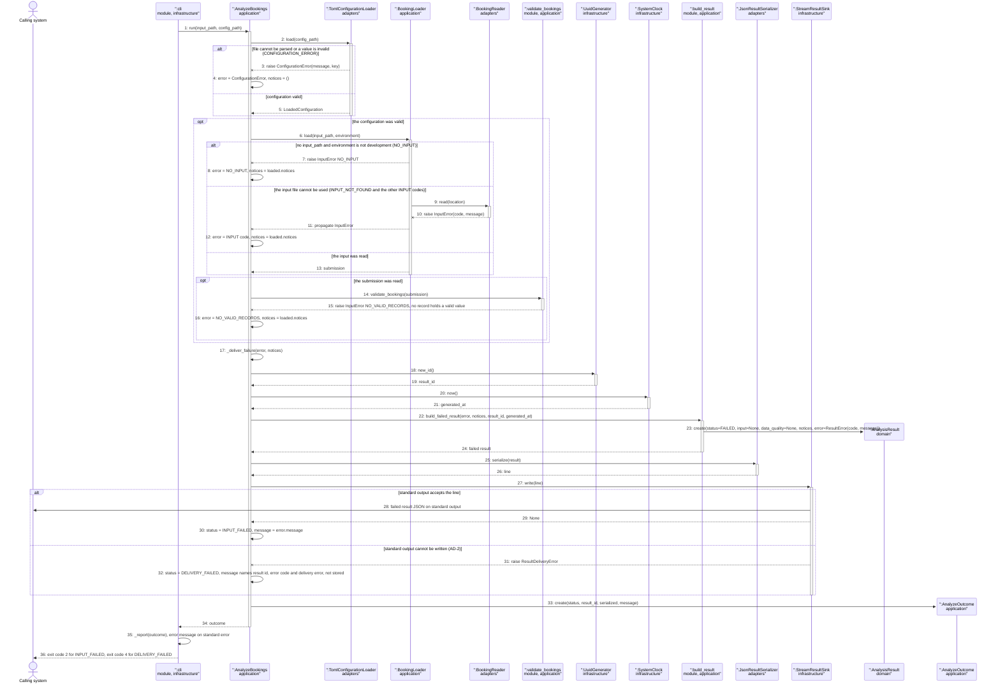

### Pattern Annotations

| Pattern (GRASP / GoF) | Applied to | Rationale |
| --- | --- | --- |
| Controller (GRASP) with exception translation | `AnalyzeBookings.run`, `_deliver_failure` | Domain exceptions (`InputError`, `ConfigurationError`, `ResultDeliveryError`) are caught at one place and turned into a `failed` `AnalysisResult` and an `AnalyzeOutcome` status; no exception reaches the command line. |
| Information Expert (GRASP) | `BookingLoader.load` (message 7), `validate_bookings` (message 15), `TomlConfigurationLoader` (message 3) | Each raises the error for the rule it owns: the fallback rule, the no-valid-record rule, the configuration rules. |
| Creator (GRASP) | `build_failed_result` creates the failed `AnalysisResult` (message 23) | It has the error, notices, identifier and time that initialize the result. |
| Adapter (GoF) | `CL`, `RD`, `SER`, `SNK` | Same adapters as in block 1.1 and 1.2; the file, format and stream problems appear as domain errors, not as library exceptions. |
| Value Object | `AnalyzeOutcome`, failed `AnalysisResult` | Frozen dataclasses; the outcome carries the status that `cli` maps to the exit code. |

### Postcondition Coverage

| Postcondition (from contract, exception row) | Satisfied by message |
| --- | --- |
| Configuration error: a `failed` Analysis Result with the error, no Booking Submission, no Data Quality Summary and no Analysis; not associated with the Result History; delivered on standard output; exit code 2 | 3, 4 (error), 17 to 24 (failed result built with `input=None`, `data_quality=None` and no analyses, message 23), 28 (delivered), 36 (exit code 2). No message reaches `JsonlHistoryWriter`, so the Result History is unchanged |
| `NO_INPUT`: as above | 7, 8, then 17 to 36 as above |
| Input file cannot be used (`INPUT_*`): as above | 9 to 12, then 17 to 36 as above |
| `NO_VALID_RECORDS`: as above | 13 to 16, then 17 to 36 as above |
| A `failed` result that cannot be written to standard output (AD-2): nothing stored, no result delivered, standard error names the result identifier, the error code and the delivery error; exit code 4 | 27, 31, 32, 33 to 36: the branch creates `AnalyzeOutcome(DELIVERY_FAILED, ...)` whose message contains those parts; the failed result was never sent to the history writer |

### Responsibility Check

`AnalyzeBookings` sends 17 of the 36 messages, of which 7 are self messages that only record the error or the status; the other calls go to seven collaborators. The error rules stay in the collaborators that own them (loader, reader, validator, configuration loader), the failed result is built by `build_failed_result`, serialization and delivery are delegated, and the exit code is chosen by `cli`. No participant receives all messages.

## Sequence 1.4: analyzeBookings, history write or retention failure

**Realizes:** `analyzeBookings` in [OC-001], the exceptions "the Result History cannot be extended" (directory, lock timeout, append) and "the Retention Policy could not be applied after the append", exit code 3.

### Diagram

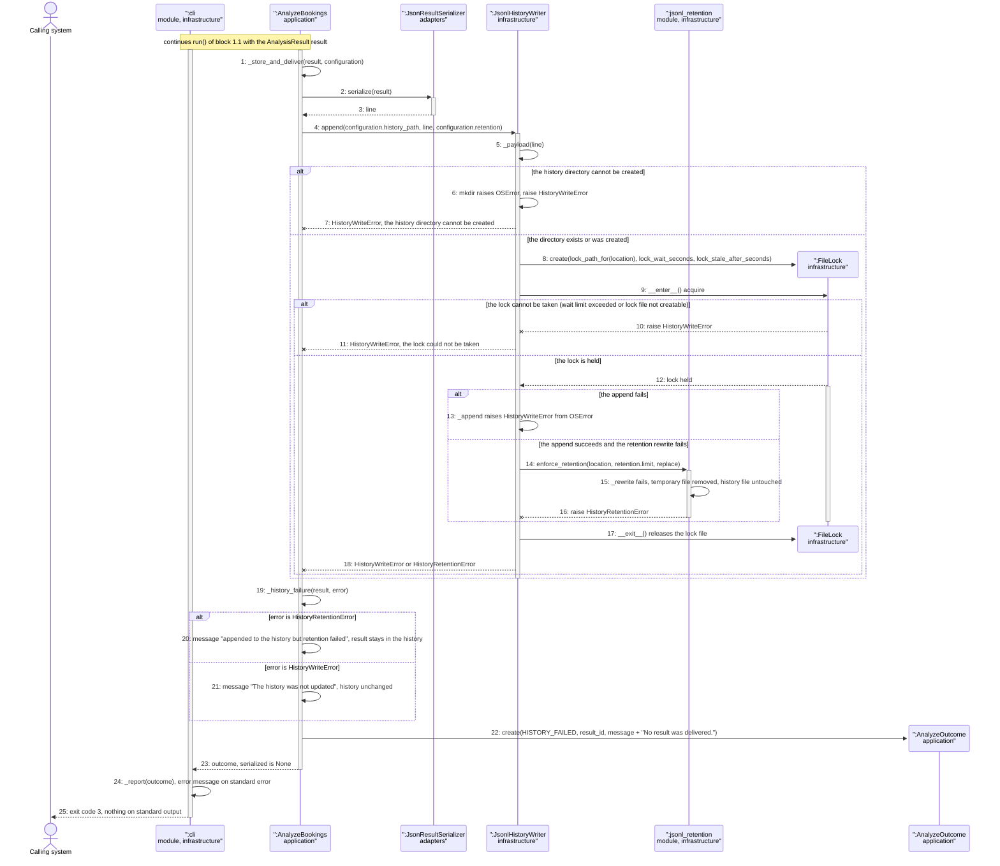

### Pattern Annotations

| Pattern (GRASP / GoF) | Applied to | Rationale |
| --- | --- | --- |
| Controller (GRASP) with exception translation | `AnalyzeBookings._history_failure` | Maps `HistoryWriteError` and `HistoryRetentionError` to one outcome status and chooses the message that states whether the result was appended. |
| Information Expert (GRASP) | `JsonlHistoryWriter.append`, `enforce_retention`, `FileLock.acquire` | The writer knows the storage steps, the retention function knows the file lines, the lock knows the wait limit; each raises the specific `HistoryError` subclass. |
| Scoped resource with transient object | `FileLock` (messages 8 to 17) | Released when the `with` block ends even on failure; destroyed after release. In the lock timeout branch the lock was never held and is dropped without release. |
| Adapter (GoF) | `HW` | Turns file-system errors (`OSError`) into the domain errors of the `HistoryWriter` port. |
| Exception hierarchy | `HistoryError`, `HistoryWriteError`, `HistoryRetentionError` | The subclass tells the controller whether the append happened, so the message and the state of the Result History are exact. |

### Postcondition Coverage

| Postcondition (from contract, exception row) | Satisfied by message |
| --- | --- |
| The Result History cannot be extended (directory, lock, append): the Analysis Result was not associated with the Result History, the Result History is unchanged, no result was delivered, standard error says the history was not updated, exit code 3 | 6 and 7 (directory), 10 and 11 (lock timeout), 13 and 18 (append failure); 19, 21 (message "The history was not updated"), 22 and 23 (outcome without `serialized`); 25 (exit code 3). No message reaches `StreamResultSink`, so nothing is delivered |
| The Retention Policy could not be applied after the append: the Analysis Result stays associated with the Result History, which may retain more results than the limit; no result was delivered; standard error says the result was appended but retention failed; exit code 3 | 14 to 16 (the append of the first branch did not fail, retention fails, and the append is not undone), 18, 19, 20 (message "appended to the history but retention failed"), 22, 23, 25 (exit code 3) |

### Responsibility Check

`AnalyzeBookings` sends 8 of the 25 messages (4 of them self messages that choose the failure message) and `JsonlHistoryWriter` sends 10 (mostly the failure exits). The error semantics are split by owner: the writer and lock raise, the controller translates, `cli` reports. No participant receives all messages.

## Sequence 1.5: analyzeBookings, delivery failure of a completed result

**Realizes:** `analyzeBookings` in [OC-001], the exception "standard output cannot be written for a completed Analysis Result", exit code 4. (The delivery failure of a `failed` result is the last branch of block 1.3.)

### Diagram

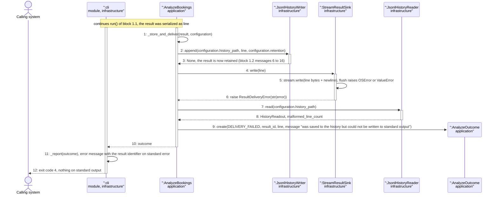

### Pattern Annotations

| Pattern (GRASP / GoF) | Applied to | Rationale |
| --- | --- | --- |
| Controller (GRASP) | `AnalyzeBookings._store_and_deliver` | The order append then deliver makes "saved but not delivered" a distinct, reportable outcome, so a retry by the Calling system can be reasoned about. |
| Adapter (GoF) | `StreamResultSink` | Turns `OSError` and `ValueError` of a binary stream into the domain error `ResultDeliveryError` of the `ResultSink` port. |
| Value Object | `AnalyzeOutcome` | Carries status, result identifier, the serialized line and the message to `cli`. |

### Postcondition Coverage

| Postcondition (from contract, exception row) | Satisfied by message |
| --- | --- |
| The Analysis Result stays associated with the Result History | 2 and 3: the append completed before the delivery was tried and nothing removes it |
| The Calling system received no result | 5 and 6: the write fails; 12 shows nothing on standard output |
| The message on standard error names the result identifier and says it was saved but not delivered; exit code 4 | 9 (message text with the result identifier), 11 (reported on standard error), 12 (exit code 4) |

### Responsibility Check

`AnalyzeBookings` sends 6 of the 12 messages (a self call, three calls, the creation of the outcome and the return), because the diagram shows only the delegation of the last steps; the sink, the writer and the reader each handle one concern and `cli` maps the outcome. No participant receives all messages.

## Sequence 2.1: listRetainedResults

**Realizes:** `listRetainedResults` in [OC-001] (`load_history` in `interface/history_source.py` and `build_history_view` in `interface/history_view.py`), including the exceptions "history does not exist or is empty", "configuration invalid", "history cannot be read" and "malformed lines".

### Diagram

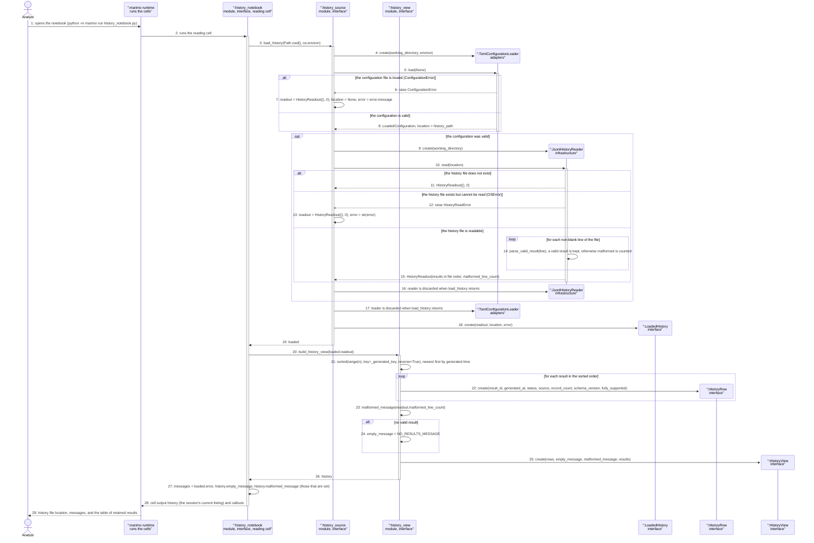

### Pattern Annotations

| Pattern (GRASP / GoF) | Applied to | Rationale |
| --- | --- | --- |
| Pure Fabrication (GRASP) | `history_source.load_history`, `history_view.build_history_view` | Module functions with no domain counterpart: the first is a read-only access facade that turns failures into a message, the second a pure function from `HistoryReadout` to view model. Neither touches marimo. |
| Facade (GoF) | `load_history` | Hides the configuration loader and the history reader behind one call that never raises for a configuration or read failure. |
| Adapter (GoF) | `CL`, `JR` | Concrete adapters reached directly (AD-4 of [SSD-001], deviation SD-1 below): the notebook does not go through the `HistoryReader` port. |
| Information Expert (GRASP) | `JsonlHistoryReader.read` (messages 14 and 15), `HistoryRow.label`, `history_view._generated_key` | The reader knows the line format and counts malformed lines; the view module knows how to order rows and to word the messages. |
| Creator (GRASP) | `load_history` creates `LoadedHistory`; `build_history_view` creates `HistoryRow` and `HistoryView` | They hold the data that initializes the created objects. |
| Value Object | `LoadedHistory`, `HistoryView`, `HistoryRow` | Frozen dataclasses; the listing is built once per session. |
| Transient objects | `CL` and `JR` (messages 16 and 17) | Created inside `load_history` and dropped when it returns. |

### Postcondition Coverage

| Postcondition (from contract) | Satisfied by message |
| --- | --- |
| The Result History and its Analysis Results are unchanged (no instance created, associated or removed) | 10 to 15: `JsonlHistoryReader.read` only reads (`read_bytes`) and never writes; no message in the diagram reaches `JsonlHistoryWriter` or `FileLock` |
| The session's current listing was set to the valid retained Analysis Results, newest first by generated time | 20 to 26 (`build_history_view` sorts and creates `HistoryView`), 28 (the cell output `history` is the session's current listing) |
| When the Result History has no valid Analysis Result the listing is empty and the empty message states that there are no saved results yet | 11 (missing file gives an empty readout), 24 (`empty_message = NO_RESULTS_MESSAGE`), 27 and 29 (shown). Also the exception rows: invalid configuration 6 and 7, unreadable history 12 and 13, both then 24 and 27 |
| When the Result History holds lines that are not valid results, the malformed count was set and a message states how many were skipped; the readable results are listed | 14 and 15 (count in the readout), 23 (`malformed_message`), 27 and 29 (shown); the results are listed by 22 and 25 and no line is removed |

### Responsibility Check

The notebook cell sends 4 of the 29 messages (two calls, the assembly of the messages and its return) and contains no parsing or sorting; `load_history` sends 10. Reading is in `JsonlHistoryReader`, configuration in `TomlConfigurationLoader`, ordering and messages in `history_view`. No participant receives all messages.

## Sequence 2.2: selectResult

**Realizes:** `selectResult` in [OC-001] (the picker cell and the dependent cells of `interface/history_notebook.py`, `version_notice` in `interface/history_view.py`), including the older-schema notice and the unavailable Analysis exceptions.

### Diagram

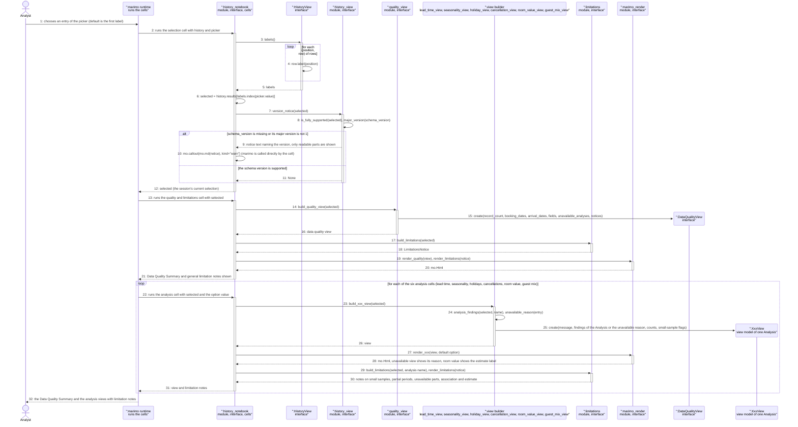

### Pattern Annotations

| Pattern (GRASP / GoF) | Applied to | Rationale |
| --- | --- | --- |
| Pure Fabrication (GRASP) | `version_notice`, `build_quality_view`, `build_xxx_view`, `build_limitations`, `render_xxx` (modules of functions) | View-model builders are pure functions from the stored result to display data; renderers are the only place that use marimo. |
| Model-View separation (view model) | `DataQualityView`, `LeadTimeView` and the other view models versus `marimo_render` | The view models hold what is shown, the renderer shows it; the builders can be tested without marimo. |
| Information Expert (GRASP) | `HistoryView.labels` and `HistoryRow.label` (messages 3 and 4), `figures.analysis_findings` (message 24) | The view holds the rows and knows the labels; the findings accessor knows the shape of a stored Analysis and is tolerant of missing parts. |
| Observer (reactive dependency, implemented by marimo) | `MR` re-runs the cells that depend on `selected` (messages 13 and 22) | Changing the picker re-runs exactly the dependent cells; the code only declares the dependency. Not written by the project. |
| Tolerant Reader | `json_access.as_mapping`, `as_list`, `as_int`, `as_text` used by the builders | A result from another schema version or with a missing part yields neutral values, so the view shows the readable parts (older-schema postcondition). |
| Value Object | all `*View`, `LimitationsNotice` | Frozen dataclasses built per selection. |

### Postcondition Coverage

| Postcondition (from contract) | Satisfied by message |
| --- | --- |
| The Result History and its Analysis Results are unchanged | No message reaches a writer or a lock: the cells only read `history.results` (3 to 6) and pure builders (23 to 26) |
| The session's current selection was set to the Analysis Result named by `resultLabel` | 3 to 6 (label to position to result), 12 (the cell output `selected`) |
| The Data Quality Summary of the selected Analysis Result is shown with record count, date coverage, duplicate booking IDs, missing and invalid values | 14 to 16 (`build_quality_view`), 19 and 20 (`render_quality`), 21 |
| Each Analysis is shown with its counts and limitation notes; an unavailable Analysis is shown as unavailable with its reason; room value figures are labelled as estimates | 22 to 31 (loop over the six Analyses): 24 and 25 produce the view with the counts or with the unavailable reason, 28 renders it with the estimate label for room value, 29 and 30 add the limitation notes |
| When the schema version does not have the supported major version a notice names that version and only the readable parts are shown | 7 to 10 (`version_notice`, callout); 24 and 25 build the views tolerantly from whatever parts exist |

### Responsibility Check

The notebook cells send 13 of the 32 messages (40 percent, the most of any participant) but hold no logic beyond wiring: label lookup, calling a builder, calling a renderer, and one return per cell. Each builder is responsible for one Analysis (high cohesion) and the renderer is separate from the view model (low coupling). No participant receives all messages.

## Sequence 2.3: chooseViewOption

**Realizes:** `chooseViewOption` in [OC-001] (the option dropdown cells of `interface/history_notebook.py` and the render functions of `interface/marimo_render.py`). The diagram shows the holidays window size; the other four Analyses with options follow the same shape (alternatives in the diagram).

### Diagram

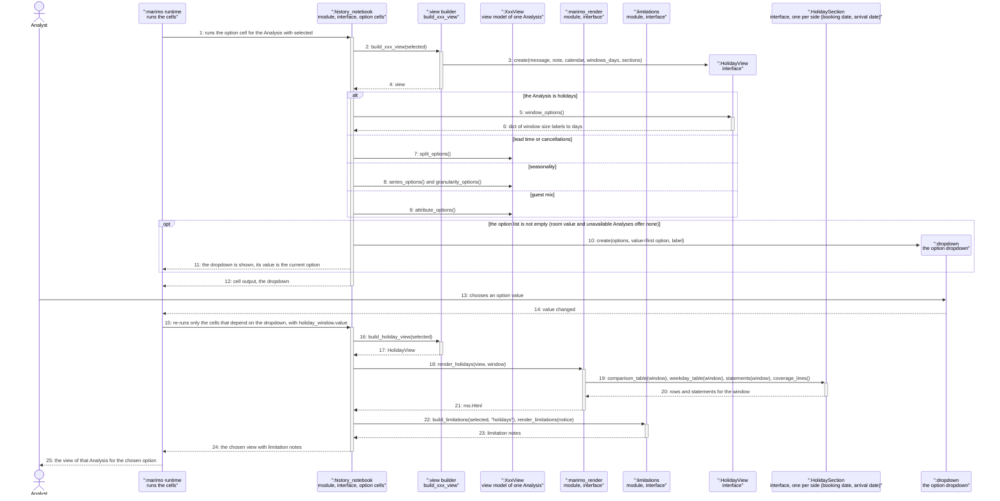

### Pattern Annotations

| Pattern (GRASP / GoF) | Applied to | Rationale |
| --- | --- | --- |
| Observer (reactive dependency, implemented by marimo) | `MR` and the dropdown (messages 14 and 15) | Only the cells that depend on the dropdown value are re-run, so no other Analysis view and no selection changes (postcondition). Not written by the project. |
| Information Expert (GRASP) | `HolidayView.window_options`, `LeadTimeView.split_options`, `SeasonalityView.series_options`, `GuestMixView.attribute_options` (messages 5 to 9) | Each view model knows which options its findings support, so the notebook never inspects the JSON. |
| Pure Fabrication (GRASP) | `render_holidays`, `build_limitations` | Rendering and limitation wording are functions, separate from the view model and the runtime. |
| Value Object | `HolidayView` and the other view models | The view is rebuilt from the unchanged selection; nothing is mutated. |

### Postcondition Coverage

| Postcondition (from contract) | Satisfied by message |
| --- | --- |
| The Result History and the selected Analysis Result are unchanged | Messages 15 to 24 only read `selected` and build new view objects; no writer is reached |
| The session's current option for the Analysis was set to `option` | 13 and 14 (the dropdown value is the session state), 15 (`holiday_window.value` passed to the dependent cell) |
| The view of that Analysis is shown for `option` with its limitation notes; no other Analysis view and no selection changed | 16 to 24: `render_holidays(view, window)` renders the Group Statistics of the chosen window (19 and 20), 22 and 23 add the limitation notes; 15 re-runs only the dependent cells |
| Exception: no Analysis Result is selected, or the Analysis is unavailable or offers no options: no option list is offered and the view shows the reason or the single default view | 10 is inside `opt`: it is skipped when the option list is empty, so no dropdown is created and 18 renders the default view or the unavailable reason |

### Responsibility Check

The notebook cells send 12 of the 25 messages, all wiring calls and returns; option knowledge is in the view models, rendering in `marimo_render`, wording in `limitations`, and re-running in the marimo runtime. No participant receives all messages.

## OC-001 Coverage Matrix

Every postcondition and exception of every contract of [OC-001] is realized by at least one block.

| Contract | Postcondition or exception (short name) | Realized by block |
| --- | --- | --- |
| `analyzeBookings` | Booking Submission created (source, reference) | 1.1 |
| `analyzeBookings` | Data Quality Summary created | 1.1 |
| `analyzeBookings` | One Analysis per kind, unavailable with reason, nothing estimated | 1.1 |
| `analyzeBookings` | Analysis Result created (identifier, version, time, status) | 1.1 |
| `analyzeBookings` | Result associated with submission, summary, analyses; no Booking Record | 1.1 |
| `analyzeBookings` | Result retained as newest in the Result History | 1.2 |
| `analyzeBookings` | Retention applied, only the oldest valid results removed | 1.2 |
| `analyzeBookings` | Serialized result on standard output identical to the retained one, exit code 0 | 1.2 |
| `analyzeBookings` | Notices `CONFIG_FILE_NOT_FOUND` and `DEVELOPMENT_SAMPLE_USED` | 1.1 |
| `analyzeBookings` | Exception: configuration error | 1.3 |
| `analyzeBookings` | Exception: `NO_INPUT` | 1.3 |
| `analyzeBookings` | Exception: input file cannot be used | 1.3 |
| `analyzeBookings` | Exception: `NO_VALID_RECORDS` | 1.3 |
| `analyzeBookings` | Exception: history cannot be extended (directory, lock, append) | 1.4 |
| `analyzeBookings` | Exception: retention fails after the append | 1.4 |
| `analyzeBookings` | Exception: completed result cannot be delivered | 1.5 |
| `analyzeBookings` | Exception: `failed` result cannot be delivered (AD-2) | 1.3 |
| `listRetainedResults` | Result History unchanged | 2.1 |
| `listRetainedResults` | Current listing set, newest first by generated time | 2.1 |
| `listRetainedResults` | Empty listing with the no-saved-results message | 2.1 |
| `listRetainedResults` | Malformed count and message, readable results listed | 2.1 |
| `listRetainedResults` | Exceptions: missing or empty history, invalid configuration, unreadable history, malformed lines | 2.1 |
| `selectResult` | Result History unchanged | 2.2 |
| `selectResult` | Current selection set | 2.2 |
| `selectResult` | Data Quality Summary shown | 2.2 |
| `selectResult` | Each Analysis shown with counts and notes, unavailable with reason, room value as estimate | 2.2 |
| `selectResult` | Older or unsupported schema version notice | 2.2 |
| `selectResult` | Exceptions: empty listing, unsupported schema version, unreadable Analysis | 2.2 (empty listing: no picker cell input, no message sent; unreadable Analysis: messages 24 and 25) |
| `chooseViewOption` | Result History and selected result unchanged | 2.3 |
| `chooseViewOption` | Current option set | 2.3 |
| `chooseViewOption` | View shown for the option with limitation notes, nothing else changes | 2.3 |
| `chooseViewOption` | Exceptions: no selection, unavailable Analysis or no options | 2.3 |

## As-Built Deviations

Differences between the built collaboration and earlier decisions ([ADR-0001] to [ADR-0007], [DM-001]) or [SSD-001] and [OC-001], continuing the numbering of the earlier documents (AD-1 to AD-5, OD-1). They are recorded here and are not corrected in the diagrams; each was raised as an open issue in the project plan (OI-21 to OI-27) through the MIL-007 review (Go/No-Go criterion 6), and the last column gives its status.

| ID | Earlier decision | As built (shown in) | Proposed follow-up |
| --- | --- | --- | --- |
| SD-1 | [ADR-0006]: the notebook reads the history "through the same history reader port as the CLI", and the application layer holds "list results" and "load a result" use cases (same as AD-4). | The notebook cell calls `history_source.load_history`, which creates `TomlConfigurationLoader` and `JsonlHistoryReader` directly; no application use case and no `HistoryReader` port variable is involved (block 2.1, messages 3 to 10). | Open issue OI-24: resolved by the amendment of ADR-0006 (MIL-007 task 12); acceptance pending. |
| SD-2 | [ADR-0006] lists the marimo notebook and the composition root in the infrastructure layer. | The composition root is `infrastructure/bootstrap.py` (block 1.0), but the notebook is in its own outermost `interface` layer (block 2.1). | Open issue OI-24: resolved by the amendment of ADR-0006, which records the fifth layer; acceptance pending. |
| SD-3 | [UC-001] steps 2 to 8 and [ADR-0005] outcome table do not mention re-reading the history after a successful append. | `AnalyzeBookings._malformed_lines` reads the history a second time through `HistoryReader.read` after the append (block 1.2 messages 20 and 21, block 1.5 messages 7 and 8), only to count malformed lines for a warning (same as AD-5). | Open issue OI-27: resolved, the history check after a run is kept on purpose and stated in UC-001 (MIL-007 tasks 9 and 13). |
| SD-4 | [DM-001] shows six kinds of Analysis (Lead Time Analysis to Guest Mix Analysis) as subclasses of Analysis, created as instances of their own kind. | One `Analysis` class is created for every kind (name in `AnalysisName`); the six kinds are six `Analyzer` strategies in `adapters` that create `Analysis` instances (block 1.1 messages 27 to 34). The generalization is not a class hierarchy. | Open issue OI-25: resolved by the DM-001 revision of MIL-009 task 1 (analysis kinds are analyzers); pending. |
| SD-5 | [ADR-0002] and [ADR-0007] define the six analyses; no decision covers a registered analysis without an analyzer. | `run_analyses` creates a placeholder `Analysis` with the notice `ANALYSIS_NOT_IMPLEMENTED` when no analyzer is registered (block 1.1 messages 34). With the six analyzers of `build_analyzers` this branch is not reached in production. | Open issue OI-26: resolved by the amendment of ADR-0006 (the placeholder analysis is kept as an extension point). |
| SD-6 | [OC-001] postconditions speak of Analysis Result instances retained by the Result History. | The Result History retains one JSON line per result and the read side never rebuilds `AnalysisResult` objects: `HistoryReadout.results` holds parsed JSON mappings and the notebook builds view models from them (block 2.1 messages 14 and 15, block 2.2 message 24). | Open issue OI-25: resolved by the DM-001 revision of MIL-009 task 1 (the retained result is a JSON document); pending. |
| SD-7 | [DM-001] association "Analysis Result is answered by Booking Submission". | The result does not point to the submission: `build_result` copies its source, reference, record count and content hash into `ResultInput` (block 1.1 message 37), so no submission object survives. | Open issue OI-25: resolved by the DM-001 revision of MIL-009 task 1 (a copy of the input metadata); pending. |

## Designed Additions (MIL-009, not yet built)

Design made before the code (gateway MIL-009, task 9). The blocks above show the built objects and stay true. The blocks below show the **intended** objects that realize the designed contracts of [OC-001]: `getHolidayCalendar`, `getLlmProviders`, the Designed change to `analyzeBookings` (insights) and the Designed change to `selectResult` (insight display). Every block is marked `Designed` in its heading and every planned object carries the word `planned` in its lifelines; the built objects it reuses (`cli`, `bootstrap`, `TomlConfigurationLoader`, `KhmerHolidayCalendar`, `StreamResultSink`, `SystemClock`, `AnalyzeBookings`, `build_result`, `run_analyses`, `history_notebook`, `json_access`, `marimo_render`) keep the names of the code. The planned objects are implemented in MIL-010 (blocks 3.x, 4.x) and MIL-011 (blocks 5.x, 2.4) and are checked against these diagrams then; the class structure is in the section Designed Additions of [DCD-001]. The notation is the one above.

| Block | Realizes (contract in [OC-001]) | Scenario |
| --- | --- | --- |
| 3.0 | `getHolidayCalendar` (lifecycle) | Composition root builds `ListHolidays` (Designed) |
| 3.1 | `getHolidayCalendar` | Main success: years, calendar, listing, delivery, exit code 0 (Designed) |
| 3.2 | `getHolidayCalendar` | Invalid years, invalid configuration (exit code 2), delivery failure (exit code 4) (Designed) |
| 4.0 | `getLlmProviders` (lifecycle) | Composition root builds `ListLlmProviders` and the provider registry (Designed) |
| 4.1 | `getLlmProviders` | Discovery of the two providers, listing, delivery, exit code 0, also none reachable (Designed) |
| 4.2 | `getLlmProviders` | Invalid configuration (exit code 2), delivery failure (exit code 4) (Designed) |
| 5.0 | `analyzeBookings` (lifecycle, Designed change) | Composition root builds `GenerateInsights` and hands it to `AnalyzeBookings` (Designed) |
| 5.1 | `analyzeBookings` (Designed change) | Insights requested: generate after the analyses, assemble result 1.1; not requested: unchanged path (Designed) |
| 5.2 | `analyzeBookings` (Designed change) | Failure alternatives per reason: `NO_PROVIDER`, `NO_MODEL`, `TIMEOUT`, `MODEL_ERROR`, `BAD_STRUCTURE`, `GUARDRAIL_REJECTED`, and the result status (Designed) |
| 2.4 | `selectResult` (Designed change) | The notebook shows the insight of each analysis, or that the result was saved without insights (Designed) |

## Sequence 3.0: getHolidayCalendar, object construction (Designed)

**Realizes:** `getHolidayCalendar` in [OC-001] (the [SSD-001] lifecycle note for UC-003: the composition root wires the calendar, the serializer, the clock and the stream when the process starts; a prerequisite of blocks 3.1 and 3.2).

### Diagram

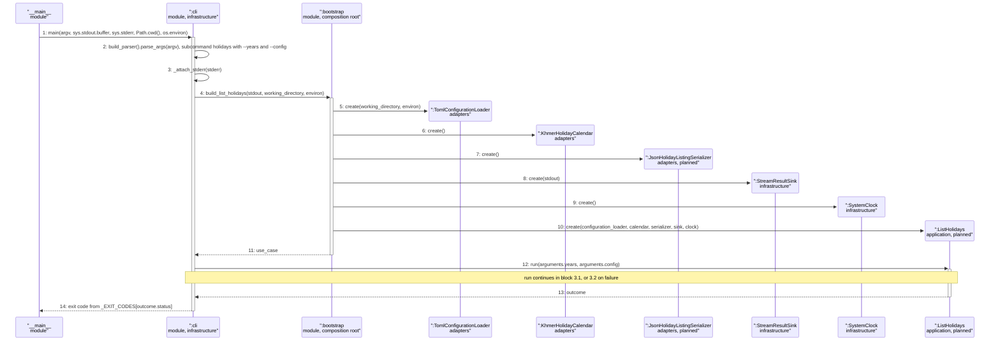

### Pattern Annotations

| Pattern (GRASP / GoF) | Applied to | Rationale |
| --- | --- | --- |
| Factory (Factory Method style function) and Pure Fabrication (GRASP) | `bootstrap.build_list_holidays` | Same role as `build_analyze_bookings` in block 1.0: the one place that names concrete adapter classes; the use case never does. |
| Dependency Injection and Protected Variations (GRASP) | `ListHolidays` (message 10) | Collaborators are passed as `Protocol` ports (`ConfigurationLoader`, `HolidayCalendar`, `HolidayListingSerializer`, `ResultSink`, `Clock`); tests use fakes. |
| Adapter (GoF) | `JsonHolidayListingSerializer`, reused `KhmerHolidayCalendar`, `StreamResultSink` | Each adapts a format, a library or a stream to a port. The calendar adapter is reused as built. |
| Controller (GRASP), command-line entry | `cli.main` | Receives the subcommand from the process boundary, delegates to the use case and maps the outcome to the exit code. |

### Postcondition Coverage

No postcondition of its own; it supplies the objects of blocks 3.1 and 3.2 and realizes the precondition "Standard output of the process can be written" (message 8 passes the stream to the sink).

| Postcondition (from contract) | Satisfied by message |
| --- | --- |
| Not applicable: construction only. It supplies the objects (messages 5 to 10) that realize every postcondition in blocks 3.1 and 3.2 | 5 to 10, and 12 to 14 for the hand-over to and the return from `run` |

### Responsibility Check

`cli.main` sends 5 of the 14 messages and `bootstrap` sends 7 (six creations and one return); neither computes anything. `ListHolidays` receives one message (`run`). No participant receives all messages.

## Sequence 3.1: getHolidayCalendar, main success (Designed)

**Realizes:** `getHolidayCalendar` in [OC-001], main success postconditions (UC-003 messages of [SSD-001] diagrams 3.1 and 3.2): exit code 0, including the year without calendar data.

### Diagram

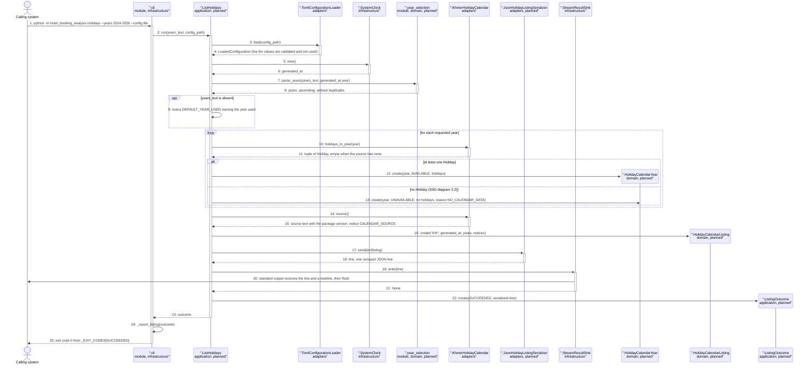

### Pattern Annotations

| Pattern (GRASP / GoF) | Applied to | Rationale |
| --- | --- | --- |
| Controller (GRASP), use-case controller | `ListHolidays.run` (messages 2 to 23) | Receives the system event `getHolidayCalendar` and delegates every step; it holds no rule of the year syntax, the calendar or the JSON. |
| Information Expert (GRASP) | `year_selection.parse_years` (message 7) | The function that knows the syntax and the limits of the `--years` value owns the rule and raises `InvalidYearsError`; `ListHolidays` does not parse. |
| Pure Fabrication (GRASP) | `year_selection` (a module of pure functions) | A rule with no counterpart among the domain objects; no library is needed, so it sits in `domain`. |
| Creator (GRASP) | `ListHolidays` creates `HolidayCalendarYear` and `HolidayCalendarListing` (messages 12, 13, 16) | It holds the years, the holidays, the time and the notices that initialize them. |
| Adapter (GoF) | `HC` (the `HolidayCalendar` port, reused as built), `HS` | The calendar package and the JSON format are reached through ports. |
| Value Object | `HolidayCalendarYear`, `HolidayCalendarListing`, `ListingOutcome` | Frozen dataclasses; the listing is assembled once. |

### Postcondition Coverage

| Postcondition (from contract) | Satisfied by message |
| --- | --- |
| A Holiday Calendar Listing instance was created with country `KH` and the generated time | 5 and 6 (time from the clock port), 16 (creation with `"KH"` and `generated_at`) |
| A Holiday Calendar Year instance per requested year, ascending, without duplicates, associated with the listing; the requested years are those selected by `years`, or the current year when absent | 7 and 8 (`parse_years` selects, sorts and removes duplicates, and uses the current year of the clock when the text is absent), 10 to 13 (one `HolidayCalendarYear` per year, in the loop), 16 (the tuple of years is passed to the listing) |
| An available year lists exactly the Holidays the source supplies, in date order, with date and name | 10 and 11 (`holidays_in_year` returns them in date order), 12 (created available with those holidays) |
| An unavailable year has reason `NO_CALENDAR_DATA`, lists no Holiday, and no Holiday was invented | 11 (empty tuple), 13 (created unavailable with the reason and no holidays); no message creates a `Holiday` outside the calendar port |
| Notices `CALENDAR_SOURCE` and, when `years` was absent, `DEFAULT_YEAR_USED` | 9 (default year notice), 14 and 15 (source and version), 16 (notices in the listing) |
| No Analysis, Analysis Result or AI Insight created, no analysis ran, the Result History unchanged, the listing not associated with it | The lifelines of the diagram hold no history writer, history reader, analyzer or booking loader; `ListHolidays` has no such collaborator (block 3.0 message 10) |
| The Calling system received the serialized listing on standard output and the exit code 0 | 17 and 18 (serialization), 19 to 21 (delivery), 22 (outcome `SUCCEEDED` only after the write returned), 25 (exit code 0) |

### Responsibility Check

`ListHolidays` sends 13 of the 25 messages (calls to the loader, the clock, the year parser, the calendar (once per requested year and once for the source), the serializer and the sink; one notice; the creation of three value objects; and the return); every one is a delegation or the creation of a value object, and it contains no parsing, no formatting and no file handling. Year rules are in `year_selection`, holidays in the calendar adapter, JSON in the serializer, delivery in the sink and the exit code in `cli`. No participant receives all messages (the controller receives one).

## Sequence 3.2: getHolidayCalendar, invalid request and delivery failure (Designed)

**Realizes:** `getHolidayCalendar` in [OC-001], the exceptions "`years` is not valid" (`INVALID_YEARS`), "the configuration is invalid" (`CONFIGURATION_ERROR`) and "standard output cannot be written" ([SSD-001] diagrams 3.3 and 3.4); exit codes 2 and 4.

### Diagram

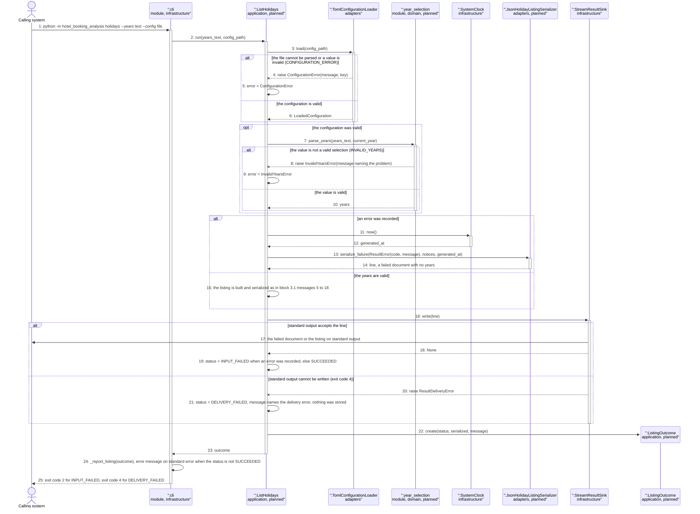

### Pattern Annotations

| Pattern (GRASP / GoF) | Applied to | Rationale |
| --- | --- | --- |
| Controller (GRASP) with exception translation | `ListHolidays.run` (messages 5, 9, 19, 21) | Domain exceptions (`ConfigurationError`, `InvalidYearsError`, `ResultDeliveryError`) are caught at one place and turned into a failed document and a status; none reaches `cli`. Same idea as block 1.3. |
| Information Expert (GRASP) | `TomlConfigurationLoader` (message 4), `year_selection.parse_years` (message 8) | Each raises the error for the rule it owns. |
| Adapter (GoF) | `HS`, `SNK` | The failed document is written by the same serializer and sink as the listing; a stream problem appears as `ResultDeliveryError`, not as a library exception. |
| Exception hierarchy | `InputError`, `ConfigurationError`, `InvalidYearsError` | `InvalidYearsError` is an `InputError` with the code `INVALID_YEARS`, so the controller catches both alike, as `AnalyzeBookings` does. |

### Postcondition Coverage

| Postcondition (from contract, exception row) | Satisfied by message |
| --- | --- |
| `INVALID_YEARS`: no listing was created; the Calling system received a failed listing with the code and a message naming the problem, no years, on standard output; exit code 2; the Result History unchanged | 7 to 9 (the error), 11 to 14 (`serialize_failure`, no years), 16 and 17 (delivered), 19, 25 (exit code 2). No message reaches a history port |
| `CONFIGURATION_ERROR`: as above | 3 to 5, then 11 to 25 as above |
| Standard output cannot be written: nothing stored, no document, standard error names the delivery error, exit code 4 | 16, 20, 21 (status `DELIVERY_FAILED`, the message), 22 to 25 (exit code 4); nothing was stored because no store is involved |
| A year without calendar data is not a failure | Block 3.1 messages 11 and 13 (exit code 0) |

### Responsibility Check

`ListHolidays` sends 12 of the 25 messages, 5 of them self messages that only record the error or the status; the rules stay in the loader, the year parser, the serializer and the sink, and `cli` chooses the exit code. No participant receives all messages.

## Sequence 4.0: getLlmProviders, object construction (Designed)

**Realizes:** `getLlmProviders` in [OC-001] (the [SSD-001] lifecycle note for UC-004: the composition root wires the configuration loader, the provider adapters, the serializer, the clock and the stream; a prerequisite of blocks 4.1 and 4.2).

### Diagram

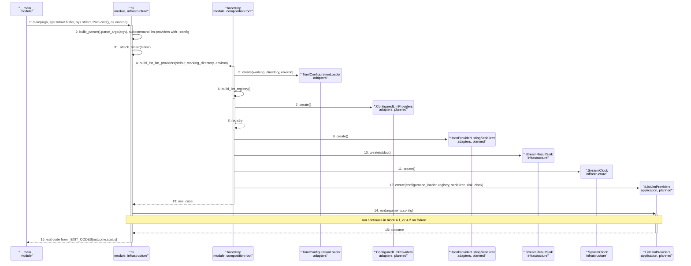

### Pattern Annotations

| Pattern (GRASP / GoF) | Applied to | Rationale |
| --- | --- | --- |
| Factory and Pure Fabrication | `bootstrap.build_list_llm_providers`, `bootstrap.build_llm_registry` | The composition root is the only module that names `ConfiguredLlmProviders`; the use cases see only the port `LlmProviderRegistry`. |
| Factory (registry as object factory) | `ConfiguredLlmProviders` (message 7) | The provider addresses come from the configuration, which is read inside `run`, after construction; the registry therefore creates the provider adapters from the configuration when asked (block 4.1 messages 5 to 7). |
| Dependency Injection and Protected Variations (GRASP) | `ListLlmProviders` (message 12) | Ports only; a fake registry serves the tests without any HTTP. |
| Controller (GRASP), command-line entry | `cli.main` | As in block 3.0. |

### Postcondition Coverage

| Postcondition (from contract) | Satisfied by message |
| --- | --- |
| Not applicable: construction only. It supplies the objects (messages 5 to 12) that realize the postconditions of blocks 4.1 and 4.2 | 5 to 12, and 14 to 16 for the hand-over to and the return from `run` |

### Responsibility Check

`cli.main` sends 5 of the 16 messages and `bootstrap` sends 9 (six creations, two self messages and one return); neither computes anything. No participant receives all messages.

## Sequence 4.1: getLlmProviders, discovery and listing (Designed)

**Realizes:** `getLlmProviders` in [OC-001], main success postconditions ([SSD-001] diagrams 4.1 and 4.2), exit code 0; a provider that cannot be reached is a normal entry.

### Diagram

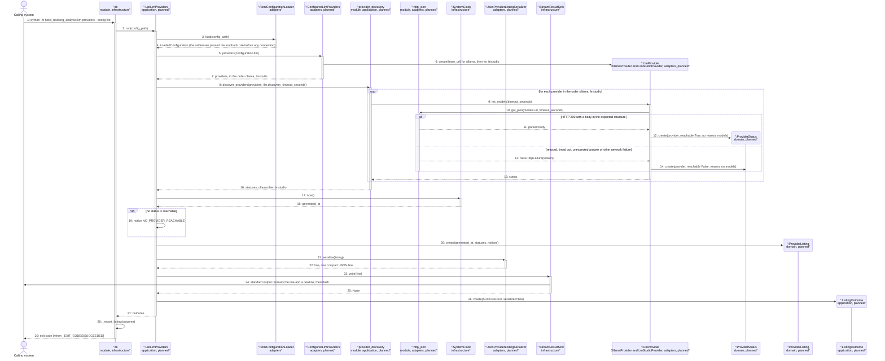

### Pattern Annotations

| Pattern (GRASP / GoF) | Applied to | Rationale |
| --- | --- | --- |
| Controller (GRASP), use-case controller | `ListLlmProviders.run` (messages 2 to 27) | Delegates the discovery, the timing and the serialization; holds no HTTP or JSON rule. |
| Strategy (GoF) | `PV`, the `LlmProvider` port (messages 9 to 15) | `OllamaProvider` and `LmStudioProvider` are interchangeable implementations of `list_models` and `generate`; the discovery treats them alike and adding a provider does not change it. |
| Adapter (GoF) | `PV`, `HJ`, `PS` | Ollama's and LM Studio's HTTP interfaces, the standard-library HTTP client and the JSON format are adapted to ports; a network problem becomes a `reason`, never an exception outside the adapter. |
| Factory (GoF) | `REG` (`ConfiguredLlmProviders.providers`, messages 5 to 7) | Creates the provider adapters from the configured addresses. |
| Pure Fabrication (GRASP) | `provider_discovery.discover_providers`, `http_json` | Shared by `ListLlmProviders` and `GenerateInsights` so that the listing and the choice made for insights cannot disagree ([ADR-0009]); the HTTP helper has no domain counterpart. |
| Information Expert (GRASP) | `OllamaProvider.list_models` (messages 12 and 14) | The adapter knows the endpoint and the shape of its answer and decides `reachable` and the reason. |
| Value Object | `ProviderStatus`, `ProviderListing`, `ListingOutcome` | Frozen dataclasses. |

### Postcondition Coverage

| Postcondition (from contract) | Satisfied by message |
| --- | --- |
| One Language Model Provider instance per supported provider, `ollama` then `lmstudio`, each with its name and configured address | 5 to 7 (the registry creates the two provider adapters from `configuration.llm`, each holding its name and address), 9 (the discovery visits them in that order) |
| Each provider is associated with a Provider Status: reachable with the Language Models it lists, or unreachable with one of the four reasons and no model | 9 to 15 (per provider: 12 reachable with `models`, 14 unreachable with `reason` from `HttpFailure`), 16 (all statuses) |
| When no status is reachable the listing carries `NO_PROVIDER_REACHABLE` and the operation still succeeds | 19 (notice), 26 and 29 (outcome `SUCCEEDED`, exit code 0) |
| No model was asked to generate text, no booking data was sent, no Analysis or AI Insight created, the Result History unchanged | Only `list_models` (message 9) and `get_json` (message 10) are sent to a provider; `generate` and `post_json` do not occur in the diagram; `ListLlmProviders` has no history, booking or analyzer collaborator (block 4.0 message 12) |
| The Calling system received the serialized listing, naming only providers and models, and exit code 0 | 20 to 22 (listing holds only providers, statuses, models and notices), 23 to 25 (delivery), 29 (exit code 0) |

### Responsibility Check

`ListLlmProviders` sends 10 of the 29 messages; the discovery, the two provider adapters and the HTTP helper carry the checks (`provider_discovery` sends the calls of the loop, the adapters the requests), `cli` the exit code. The two provider adapters are one lifeline here because they play the same role. No participant receives all messages.

## Sequence 4.2: getLlmProviders, invalid configuration and delivery failure (Designed)

**Realizes:** `getLlmProviders` in [OC-001], the exceptions "the configuration is invalid" (including a non-loopback address without `llm.allow_remote`) and "standard output cannot be written" ([SSD-001] diagrams 4.3 and 4.4); exit codes 2 and 4.

### Diagram

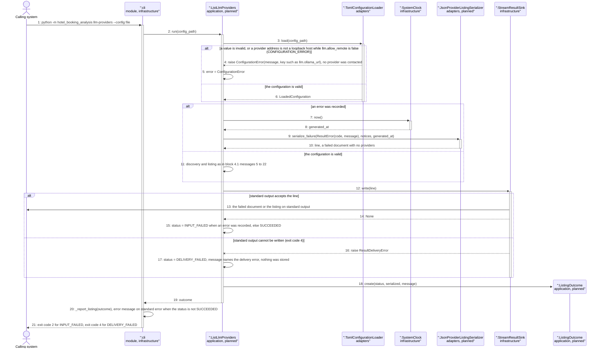

### Pattern Annotations

| Pattern (GRASP / GoF) | Applied to | Rationale |
| --- | --- | --- |
| Controller (GRASP) with exception translation | `ListLlmProviders.run` (messages 5, 15, 17) | Same translation as block 3.2: the exception becomes a failed document and a status. |
| Information Expert (GRASP) | `TomlConfigurationLoader` (message 4) | The loader owns the configuration rules, including the loopback rule of [ADR-0009], so the failure occurs before a registry or a connection exists. |
| Adapter (GoF) | `PS`, `SNK` | As in block 4.1. |

### Postcondition Coverage

| Postcondition (from contract, exception row) | Satisfied by message |
| --- | --- |
| Invalid configuration: no provider contacted and no instance created; a failed listing on standard output; exit code 2; Result History unchanged | 3 to 5 (the error; the diagram has no registry or provider lifeline, so none is contacted), 7 to 10 (failed document, no providers), 12 and 13 (delivered), 15, 21 (exit code 2) |
| Standard output cannot be written: nothing stored, no document, exit code 4 | 12, 16, 17, 18 to 21 |
| A provider that is not reachable is not a failure | Block 4.1 messages 13 and 14 (exit code 0) |

### Responsibility Check

`ListLlmProviders` sends 10 of the 21 messages, 4 of them self messages that record the error or the status. Rules stay in the loader (configuration), the serializer and the sink; `cli` chooses the exit code. No participant receives all messages.

## Sequence 5.0: analyzeBookings, construction with insights (Designed change)

**Realizes:** `analyzeBookings` in [OC-001], Designed change (the composition root wires the provider registry and `GenerateInsights` and hands them to `AnalyzeBookings`; a prerequisite of blocks 5.1 and 5.2). It continues block 1.0: messages 5 to 18 of that block create the built adapters unchanged.

### Diagram

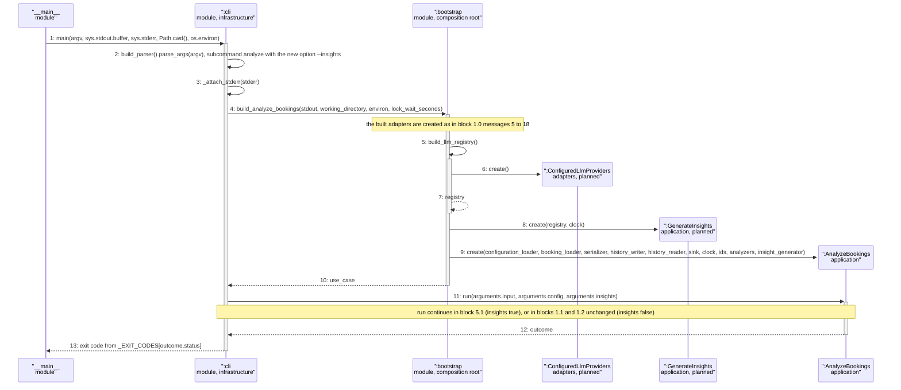

### Pattern Annotations

| Pattern (GRASP / GoF) | Applied to | Rationale |
| --- | --- | --- |
| Factory and Pure Fabrication | `bootstrap.build_analyze_bookings` (changed), `build_llm_registry` | The only module that names the concrete provider registry; it is built on every run, but no provider is contacted unless `insights` is true. |
| Dependency Injection (constructor injection) | `GenerateInsights` (message 8), `AnalyzeBookings` (message 9) | `AnalyzeBookings` receives the insight generator as a collaborator (optional, default none), so the built construction and the tests without insights are unchanged. |

### Postcondition Coverage

| Postcondition (from contract) | Satisfied by message |
| --- | --- |
| Not applicable: construction only. It supplies `GenerateInsights` and passes the request (`arguments.insights`) into `run` | 5 to 9 create the objects; 11 passes `insights`; the default `false` of the option keeps the built behavior |

### Responsibility Check

`cli.main` sends 5 of the 13 messages and `bootstrap` sends 6; neither computes anything. Creation is separated from use. No participant receives all messages.

## Sequence 5.1: analyzeBookings, insights requested (Designed change)

**Realizes:** `analyzeBookings` in [OC-001], the Designed change: the added postconditions on the AI Insight instances, their association with the Analyses, the labels, the format version 1.1 and the unchanged path when insights are not requested ([SSD-001] diagrams 5.1 and 5.5). It continues block 1.1: messages 2 to 24 of that block (configuration, load, validation, identifier, time) run first and are unchanged; this block replaces messages 25 to 38 of block 1.1 when `insights` is true.

### Diagram

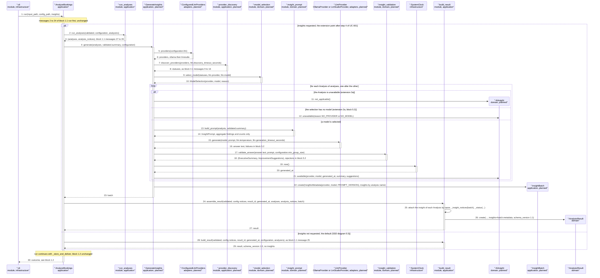

### Pattern Annotations

| Pattern (GRASP / GoF) | Applied to | Rationale |
| --- | --- | --- |
| Controller (GRASP), use-case controller | `AnalyzeBookings.run` (messages 1 to 30) | Still receives one system event and delegates; the extension is one added call (`generate`) at the extension point of [UC-001], guarded by the request. It holds no prompt, provider or guardrail rule. |
| Creator (GRASP) | `GenerateInsights` creates `AiInsight` and `InsightBatch` (messages 11, 12, 21, 22); `assemble_result` creates `AnalysisResult` (message 26) | The creator holds the analysis, the model selection, the validated answer and the time that initialize the created object. |
| Strategy (GoF) | `PV`, the `LlmProvider` port (messages 15 and 16) | Ollama and LM Studio are interchangeable behind `generate`; the service calls the selected one without knowing which. |
| Information Expert (GRASP) | `model_selection.select_model` (message 9), `insight_validation.validate_answer` (message 17) | The selector holds the order and the rules of [ADR-0009] and sees all statuses; the validator holds the rules 1 to 7 of [ADR-0010] and sees the answer and the data that was sent. |
| Pure Fabrication (GRASP) | `insight_prompt.build_prompt` (message 13), `model_selection`, `insight_validation`, `provider_discovery` | The prompt text, the choice of a model and the checks have no counterpart among the domain objects; as pure functions they are testable without a model, and the prompt builder is the single place where the data allowed to leave the analysis is defined ([ADR-0010]). |
| Adapter (GoF) | `REG`, `PV` | The two HTTP interfaces are adapted to the ports `LlmProviderRegistry` and `LlmProvider`; a failure becomes a domain error (block 5.2). |
| Dependency Injection and Protected Variations (GRASP) | `AnalyzeBookings` receiving `GenerateInsights`; `GenerateInsights` receiving the registry and the clock | The provider technology can change (or a fake can serve tests) without changing the use case; the analysis without insights does not depend on a provider. |
| Value Object | `AiInsight`, `InsightBatch`, `InsightsMetadata`, the changed `AnalysisResult` and `Analysis` | Frozen dataclasses; the insights are created once and attached, nothing is mutated. |

### Postcondition Coverage

| Postcondition (from contract, Designed change) | Satisfied by message |
| --- | --- |
| Insights not requested: no AI Insight, no provider contacted, format version 1.0, identical to the built result | 28 and 29 (the built `build_result`, block 1.1 message 25); messages 4 to 27 do not occur in this branch |
| One AI Insight instance per Analysis, associated with it (has); the Analyses and findings are identical to those of a run without insights | 11, 12 and 21 create one `AiInsight` per Analysis of the loop; 22 collects them; 25 attaches each to its Analysis by name; 2 and 3 produce the Analyses before any insight, and no message changes an `Analysis` except the attachment of its `insight` |
| Each AI Insight has exactly one status: available, unavailable with a reason, or not applicable | 11 (not applicable), 12 (unavailable, `NO_PROVIDER` or `NO_MODEL`), 21 (available); the other unavailable reasons are created in block 5.2 messages 9 to 17 |
| An available AI Insight has the label AI-generated, generated time and prompt version, one Executive Summary and one to five Improvement Suggestions, and the Language Model that produced it | 17 and 18 (the validator returns the summary and 1 to 5 suggestions only for an accepted answer), 19 and 20 (generated time), 21 (creation: `label()` is AI-generated for an available insight, provider and model as text), 22 (prompt version in the metadata) |
| Each suggestion has hypothesis wording, evidence, a sample size from the findings, no causal word, no promise of earnings, no invented figure, and a small-sample statement when needed | 17 and 18: `validate_answer` applies rules 1 to 7 of [ADR-0010] against the `InsightPrompt` (message 14) that holds exactly the data sent |
| An unavailable or not applicable insight has no label, no summary, no suggestion, and no text of a failed or rejected answer was kept | 11 and 12 create insights without texts; block 5.2 messages 9 to 17 create the others without texts and drop the answer |
| No Booking Record, booking identifier, input reference, fingerprint, file name, path or booking date was sent to any model | 13 and 14: `build_prompt` takes only one `Analysis` (its findings) and the `DataQualitySummary` (counts); no `BookingSubmission`, `BookingRecord` or `ResultInput` is a parameter of `build_prompt` or of `generate` (message 15) |
| The Analysis Result has format version 1.1 and insights information (requested true, provider, model or absent, prompt version) | 22 (metadata), 26 (`AnalysisResult` created with `insights` and `schema_version` 1.1) |
| Status `completed_with_warnings` and the notice `INSIGHTS_UNAVAILABLE` when an insight of an available Analysis is unavailable; the result is retained and delivered as before, exit code unchanged | 25 (`_insight_notices`, `_status`), block 5.2 messages 22 to 25; the run then continues with `_store_and_deliver` of block 1.2 unchanged (note before message 30), which appends, delivers and returns exit code 0 |

### Responsibility Check

`AnalyzeBookings` sends 5 of the 30 messages here (`run_analyses`, `generate`, `assemble_result`, `build_result` and the return). `GenerateInsights` sends 12 (the most of any participant, 40 percent), and every one is a delegation to the registry, the discovery, the selector, the prompt builder, the provider, the validator, the clock or the creation of a value object; it holds no HTTP, no prompt text and no guardrail rule. Selection, prompt, validation and HTTP are in four different collaborators (high cohesion), and `assemble_result` builds the result. No participant receives all messages.

## Sequence 5.2: analyzeBookings, insight failures per reason (Designed change)

**Realizes:** `analyzeBookings` in [OC-001], the added exceptions: no reachable provider (`NO_PROVIDER`), no usable model (`NO_MODEL`), timeout (`TIMEOUT`), model failure (`MODEL_ERROR`), answer not in the structure (`BAD_STRUCTURE`), answer rejected by a guardrail (`GUARDRAIL_REJECTED`), and the resulting status and notice ([SSD-001] diagrams 5.2, 5.3 and 5.4). It elaborates messages 9 to 27 of block 5.1.

### Diagram

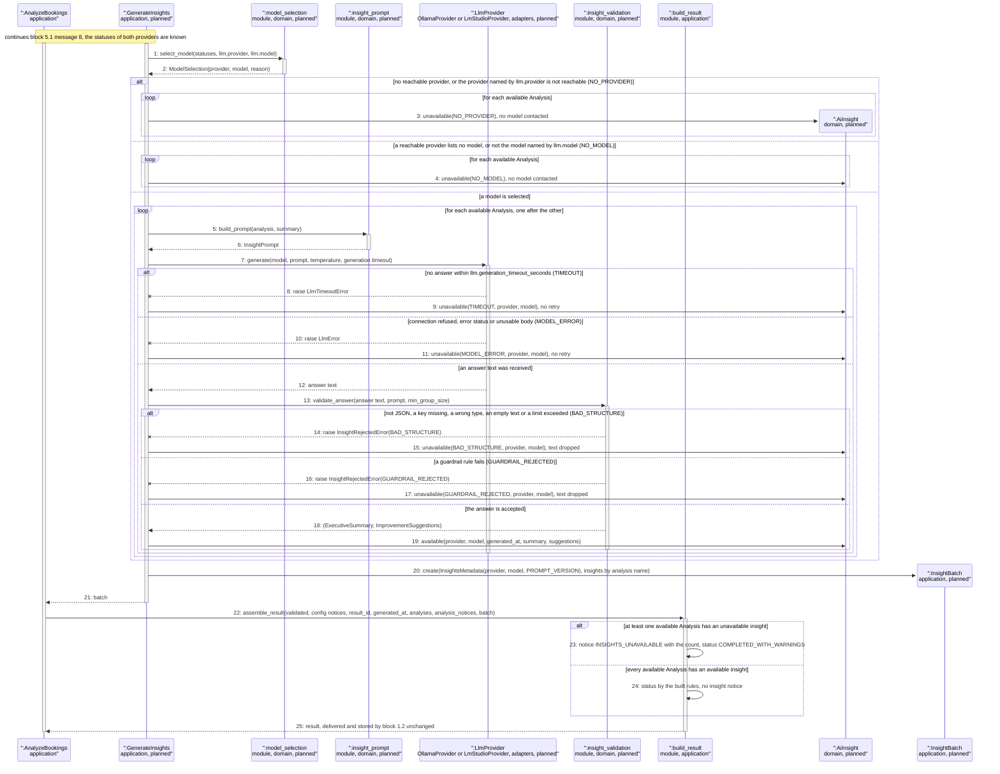

### Pattern Annotations

| Pattern (GRASP / GoF) | Applied to | Rationale |
| --- | --- | --- |
| Controller (GRASP) with exception translation | `GenerateInsights` (messages 9, 11, 15, 17) | `LlmTimeoutError`, `LlmError` and `InsightRejectedError` are caught at one place per analysis and turned into an unavailable `AiInsight` with one reason code; nothing propagates to `AnalyzeBookings`, so a failed insight never fails the run or changes the exit code ([ADR-0008]). |
| Information Expert (GRASP) | `model_selection.select_model` (messages 2 to 4), `OllamaProvider.generate` (messages 8, 10, 12), `insight_validation.validate_answer` (messages 14, 16, 18) | Each raises or decides for the rule it owns: the selection rules, the timeout and the meaning of a bad answer body, and the guardrails. |
| Exception hierarchy | `LlmError`, `LlmTimeoutError`, `InsightRejectedError` (carrying the reason code) | The class tells the controller which reason applies, so the reason is exact. |
| Strategy (GoF) | `PV` | The same failure behavior for both providers behind one port. |
| Information Expert (GRASP) | `build_result.assemble_result` (messages 23 and 24) | The function that holds the analyses, insights and notices decides the notice and the status. |

### Postcondition Coverage

| Postcondition (from contract, added exception row) | Satisfied by message |
| --- | --- |
| No reachable provider (or the named provider unreachable): every available Analysis has an unavailable insight `NO_PROVIDER`, no provider asked to generate text; exit code 0 | 1 to 3 (no `generate` occurs in this branch); 20 and 21, 22 to 25 (result assembled; delivery of block 1.2 gives exit code 0) |
| A reachable provider without a model or without the configured model: `NO_MODEL`, as above | 2 and 4 |
| No answer within the generation timeout: that Analysis `TIMEOUT`, no retry, the next is still tried | 7 to 9 (the loop continues with the next Analysis after message 9) |
| Connection refused, error status or unusable body: `MODEL_ERROR`, no retry | 7, 10, 11 |
| Answer not in the structure: `BAD_STRUCTURE`, the text dropped | 12 to 15 (the exception carries only the reason, the text is not passed on) |
| Answer fails a guardrail: `GUARDRAIL_REJECTED`, the text dropped | 12, 13, 16, 17 |
| An unavailable insight has no label, summary or suggestion | 3, 4, 9, 11, 15, 17 (`unavailable(...)` has no texts); only 19 (`available`) carries texts |
| `completed_with_warnings` and the notice `INSIGHTS_UNAVAILABLE` with the count; the result is still delivered as a completed result | 22, 23 (notice and status), 24 (no notice when all insights are available), 25 (delivery by block 1.2) |
| An unavailable Analysis is not applicable (no request made) | Block 5.1 message 11; the loops of this diagram range over the available Analyses only |

### Responsibility Check

`GenerateInsights` sends 13 of the 25 messages, of which 7 create an `AiInsight` in one of its states; the decisions (selection, wording rules, timeout, answer shape) are made by `model_selection`, `insight_validation` and the provider adapter. `AnalyzeBookings` sends 1 message and receives 2 in this block; `build_result.assemble_result` holds the status decision. No participant receives all messages.

## Sequence 2.4: selectResult, the insight view (Designed change)

**Realizes:** `selectResult` in [OC-001], the Designed change: the insight of each Analysis, the statement for a result saved without insights and the unavailable and unreadable cases ([SSD-001] diagrams 2.6 to 2.8). It continues block 2.2: messages 1 to 12 of that block set the selection; this block adds one step to each of the six analysis cells of messages 22 to 31.

### Diagram

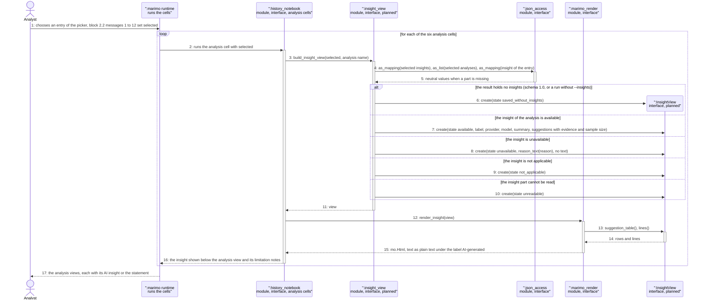

### Pattern Annotations

| Pattern (GRASP / GoF) | Applied to | Rationale |
| --- | --- | --- |
| Pure Fabrication (GRASP) | `insight_view.build_insight_view`, `marimo_render.render_insight` | As the other view builders and renderers of block 2.2: a pure function from the stored result to a view model, and the only marimo call in the renderer. |
| Model-View separation (view model) | `InsightView` versus `marimo_render` | The view model holds what is shown, the renderer shows it, so the builder is testable without marimo. |
| Tolerant Reader | `json_access` used by `build_insight_view` (messages 4 and 5) | A 1.0 result, a result without insights or a damaged insight part yields neutral values and one of the states, never an exception. |
| Information Expert (GRASP) | `InsightView.suggestion_table`, `insight_view.reason_text` | The view model knows how its suggestions are tabled and the module knows the wording of each reason code. |
| Observer (reactive dependency, implemented by marimo) | `MR` re-runs the analysis cells that depend on `selected` (message 2) | Not written by the project, as in block 2.2. |
| Value Object | `InsightView`, `SuggestionView` | Frozen dataclasses built per selection. |

### Postcondition Coverage

| Postcondition (from contract, Designed change) | Satisfied by message |
| --- | --- |
| The Result History and every Analysis Result are unchanged; no provider is contacted and no text is generated | No message reaches a writer, a lock or a provider; the cells only read `selected` (3 to 5) and build views (6 to 11) |
| A result that holds insights shows, per Analysis, an available insight with summary and suggestions marked AI-generated with provider and model, each suggestion with evidence and sample size; an unavailable one with its reason and no text; a not applicable one as such | 3 to 5, 7 (available), 8 (unavailable, reason), 9 (not applicable), 12 to 15 (rendered with the label), 16 (shown) |
| The text of an insight is shown as plain text and apart from the findings | 15 (`render_insight` produces its own block with plain text and the label), 16 (shown below the analysis view, which is rendered by the built messages 27 to 31 of block 2.2) |
| A result without insights states that it was saved without insights and shows the findings as before, no error | 6 (state `saved_without_insights`), 15 and 16 (the statement); the findings are shown by block 2.2 |
| Exception: an insight part that cannot be read is shown without an insight and with a statement | 4 and 5 (neutral values), 10 (state `unreadable`), 15 |
| Exception: unsupported major version: readable parts, including a readable insight, with the version notice | Block 2.2 messages 7 to 10 (the notice) and 4, 5, 7 here (the same tolerant reading) |

### Responsibility Check

The notebook cell sends 3 of the 17 messages here (a call to the builder, a call to the renderer and its return); the reading and the state decision are in `insight_view`, the accessors in `json_access`, the rendering in `marimo_render`. `insight_view` sends 7 (the creation of one of five states and the return), and no participant receives all messages.

## Coverage Matrix of the Designed Contracts

Every postcondition and exception of the designed contracts of [OC-001] is realized by at least one block. This extends the OC-001 Coverage Matrix above; the built rows are unchanged.

| Contract | Postcondition or exception (short name) | Realized by block |
| --- | --- | --- |
| `getHolidayCalendar` | Holiday Calendar Listing created (country, generated time) | 3.1 |
| `getHolidayCalendar` | Holiday Calendar Year per requested year, ascending, without duplicates | 3.1 |
| `getHolidayCalendar` | Available year lists the calendar's holidays in date order | 3.1 |
| `getHolidayCalendar` | Unavailable year `NO_CALENDAR_DATA`, no invented holiday | 3.1 |
| `getHolidayCalendar` | Notices `CALENDAR_SOURCE`, `DEFAULT_YEAR_USED` | 3.1 |
| `getHolidayCalendar` | No analysis, history unchanged, listing not retained | 3.0, 3.1 |
| `getHolidayCalendar` | Serialized listing on standard output, exit code 0 | 3.1 |
| `getHolidayCalendar` | Exception: `INVALID_YEARS` | 3.2 |
| `getHolidayCalendar` | Exception: configuration error | 3.2 |
| `getHolidayCalendar` | Exception: year without calendar data (not a failure) | 3.1 |
| `getHolidayCalendar` | Exception: standard output cannot be written | 3.2 |
| `getLlmProviders` | One Language Model Provider per supported provider, in order | 4.1 |
| `getLlmProviders` | Provider Status reachable with models, or unreachable with reason | 4.1 |
| `getLlmProviders` | Notice `NO_PROVIDER_REACHABLE`, still success | 4.1 |
| `getLlmProviders` | No text generated, no booking data sent, history unchanged | 4.0, 4.1 |
| `getLlmProviders` | Serialized listing on standard output, exit code 0 | 4.1 |
| `getLlmProviders` | Exception: invalid configuration, including a non-loopback address | 4.2 |
| `getLlmProviders` | Exception: provider not reachable (not a failure) | 4.1 |
| `getLlmProviders` | Exception: standard output cannot be written | 4.2 |
| `analyzeBookings` (Designed change) | Insights not requested: nothing changes, format version 1.0 | 5.0, 5.1 |
| `analyzeBookings` (Designed change) | One AI Insight per Analysis, associated (has) | 5.1 |
| `analyzeBookings` (Designed change) | Exactly one status per AI Insight | 5.1, 5.2 |
| `analyzeBookings` (Designed change) | Available insight: label, time, prompt version, summary, one to five suggestions, model | 5.1 |
| `analyzeBookings` (Designed change) | Suggestions: hypothesis, evidence, sample size, no causal word, no promise, no invented figure | 5.1, 5.2 |
| `analyzeBookings` (Designed change) | Unavailable or not applicable insight has no text; no rejected text kept | 5.1, 5.2 |
| `analyzeBookings` (Designed change) | No booking record, identifier, reference, fingerprint, path or date sent to a model | 5.1 |
| `analyzeBookings` (Designed change) | Format version 1.1 and insights information | 5.1 |
| `analyzeBookings` (Designed change) | `completed_with_warnings` and `INSIGHTS_UNAVAILABLE`; result still retained and delivered | 5.1, 5.2 |
| `analyzeBookings` (Designed change) | Exception: `NO_PROVIDER` | 5.2 |
| `analyzeBookings` (Designed change) | Exception: `NO_MODEL` | 5.2 |
| `analyzeBookings` (Designed change) | Exception: `TIMEOUT` | 5.2 |
| `analyzeBookings` (Designed change) | Exception: `MODEL_ERROR` | 5.2 |
| `analyzeBookings` (Designed change) | Exception: `BAD_STRUCTURE` | 5.2 |
| `analyzeBookings` (Designed change) | Exception: `GUARDRAIL_REJECTED` | 5.2 |
| `analyzeBookings` (Designed change) | Exception: an Analysis is unavailable (not applicable) | 5.1 |
| `analyzeBookings` (Designed change) | Exception: invalid `[llm]` configuration | 1.3 (unchanged failed-result path; the `[llm]` values are read by the configuration loader, block 4.2 shows the same loader failure) |
| `analyzeBookings` (Designed change) | Exception: history or delivery failure with insights | 1.4, 1.5 (unchanged; the result is built before the store, block 5.1 note) |
| `selectResult` (Designed change) | Nothing changed, no provider contacted | 2.4 |
| `selectResult` (Designed change) | Insight shown per Analysis (available, unavailable with reason, not applicable) | 2.4 |
| `selectResult` (Designed change) | Text shown as plain text, apart from the findings | 2.4 |
| `selectResult` (Designed change) | Result without insights: statement, no error | 2.4 |
| `selectResult` (Designed change) | Exceptions: unreadable insight part, unsupported major version | 2.4 (with 2.2) |

## Design Notes

These are choices the decisions [ADR-0008] to [ADR-0012] left open; they are not deviations, because nothing is built yet.

| ID | Note |
| --- | --- |
| SN-1 | The listing use cases reuse the built ports `ConfigurationLoader`, `ResultSink`, `Clock` and `HolidayCalendar`. The port `HolidayCalendar` gains one operation `source() -> str` so that the notice `CALENDAR_SOURCE` of [ADR-0011] can name the source and its version (block 3.1 messages 14 and 15); `KhmerHolidayCalendar` implements it from the `holidays` package version. |
| SN-2 | `AnalyzeBookings` calls `run_analyses` itself only when insights are requested (block 5.1 messages 2 and 3) and then `assemble_result`; otherwise it calls `build_result` as built. `build_result` is refactored so that its second half is the public `assemble_result` and its behavior does not change. The built blocks 1.1 to 1.5 therefore stay true. |
| SN-3 | Provider discovery runs once per run when insights are requested, before the first analysis, and is not skipped when every analysis is unavailable (simplest rule; [ADR-0009] does not say). |
| SN-4 | `GenerateInsights` is injected into `AnalyzeBookings` as a concrete application class, optional and absent by default; no port is defined for it, because both live in `application`. |
| SN-5 | Model choice is a pure function `select_model` in `domain`, and the prompt and the validator are pure functions in `domain`, so the rules of [ADR-0009] and [ADR-0010] are testable without HTTP and without a model. |
| SN-6 | The provider adapters hold their base address; the configuration is read after the composition root has run, so the registry `ConfiguredLlmProviders` creates them from `configuration.llm` when asked (block 4.1 messages 5 to 7). |

---

[OC-001]: ./operation-contracts.md
[SSD-001]: ./ssd.md
[DCD-001]: ./dcd.md
[DM-001]: ./domain-model.md
[UC-001]: ./use-cases/uc-001-analyze-hotel-bookings.md
[UC-002]: ./use-cases/uc-002-review-analysis-history.md
[ADR-0001]: ./adr/adr-0001-input-json-contract.md
[ADR-0002]: ./adr/adr-0002-result-json-contract.md
[ADR-0003]: ./adr/adr-0003-jsonl-history-and-retention.md
[ADR-0005]: ./adr/adr-0005-delivery-and-failure-semantics.md
[ADR-0006]: ./adr/adr-0006-architecture-and-invocation.md
[ADR-0007]: ./adr/adr-0007-analysis-methods.md
[ADR-0008]: ./adr/adr-0008-invocation-interface.md
[ADR-0009]: ./adr/adr-0009-llm-provider-discovery-and-connection.md
[ADR-0010]: ./adr/adr-0010-ai-insight-generation-and-guardrails.md
[ADR-0011]: ./adr/adr-0011-output-contracts-and-result-1-1.md
[ADR-0012]: ./adr/adr-0012-configuration-extension.md
