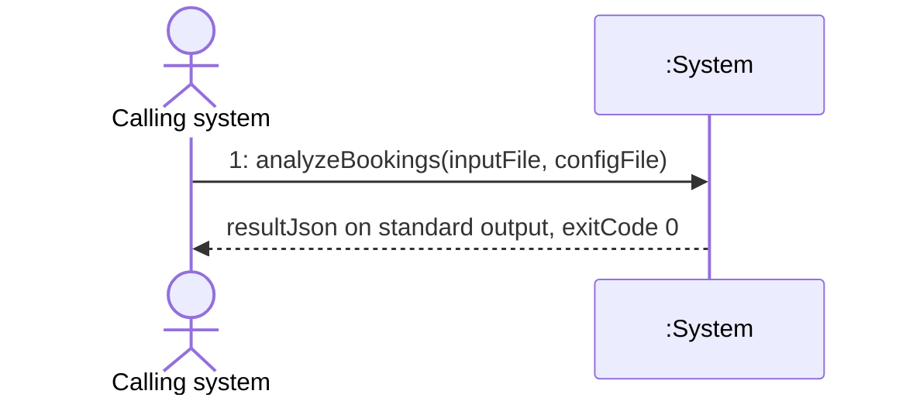
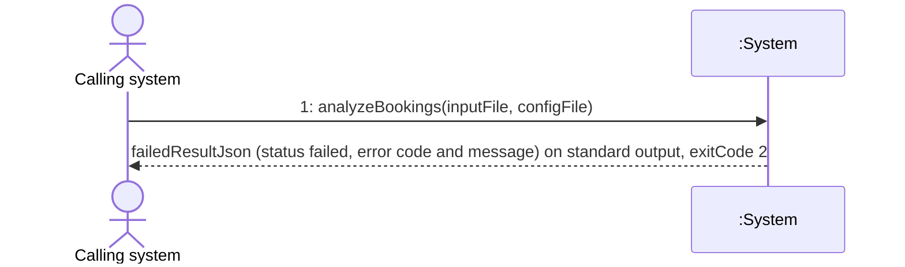
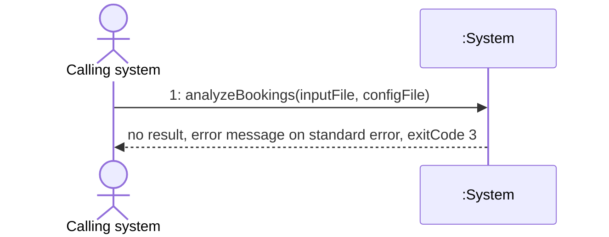
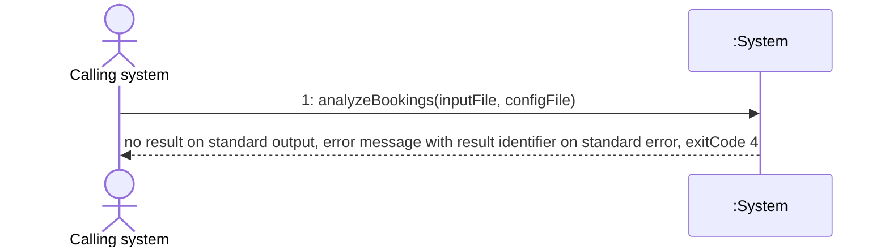
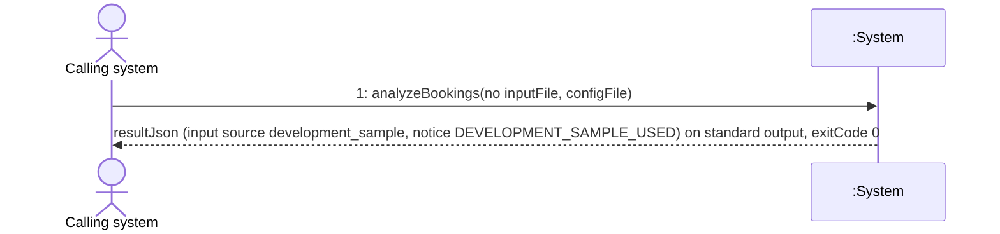
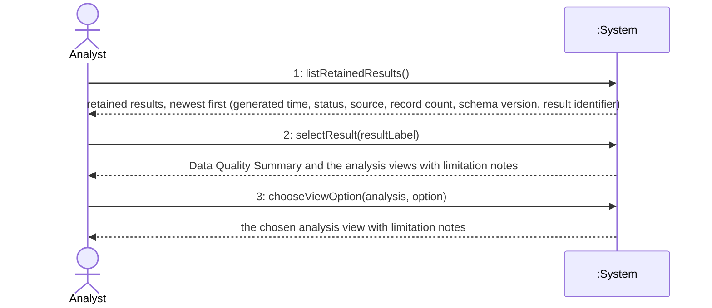
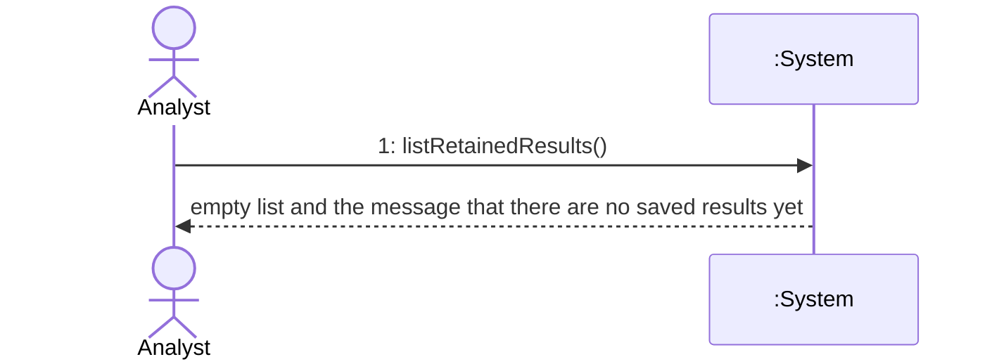
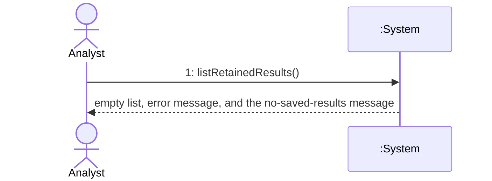
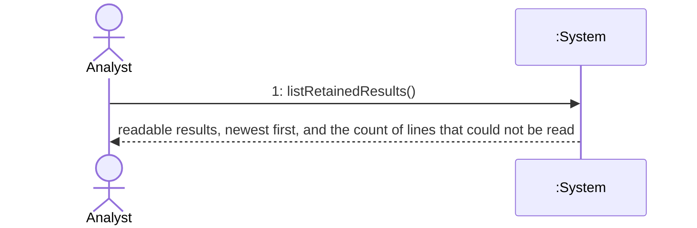
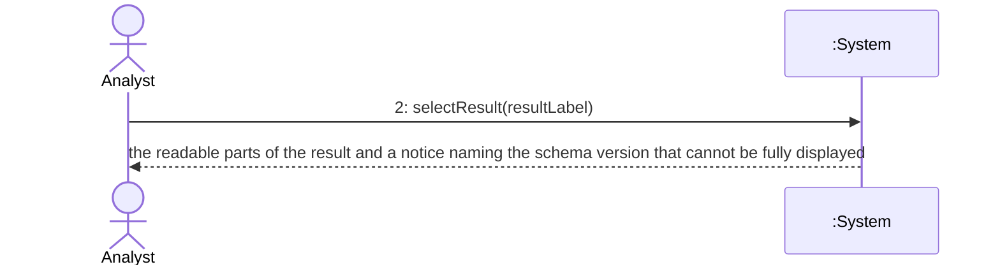

# System Sequence Diagrams

## Metadata
| Key | Value |
| --- | --- |
| ID | SSD-001 |
| CrossReference | [UC-001], [UC-002], [DM-001], [OC-001] |
| DomainLanguages | IT Professional English |

## Version History
| Date | Status | Author | Reviewer |
| --- | --- | --- | --- |
| 2026-09-29 | Proposed | Jens Tirsvad Nielsen | Team2 (S04) |
| 2026-09-29 | Proposed | Jens Tirsvad Nielsen | TBD (S04 not yet named) |
| 2026-09-30 | Proposed | Jens Tirsvad Nielsen | Team2 (S04) |
| 2026-09-30 | Proposed | Jens Tirsvad Nielsen | Team2 (S04) |
| 2026-09-30 | Proposed | Jens Tirsvad Nielsen | Team2 (S04) |

---

This document describes the system **as built** (gateway MIL-007, sequence caveat). Each use case has its own section with the Source Use Case, the diagrams (one scenario per diagram), the System Operations table and the Lifecycle Notes. The system is always a black box (`:System`); the internal objects are shown in the later Sequence Diagram document, not here. Where the built behavior differs from a decision in [ADR-0001] to [ADR-0007], [DM-001] or the use cases, the difference is listed in the section **As-Built Deviations** at the end and is not corrected in the diagrams.

Message numbering: messages are numbered per use case (`UC-001 message 1`, `UC-002 message 2`). The same message number can appear in several diagrams of one use case when the scenarios differ only in the outcome; the Operation Contract document ([OC-001]) has exactly one contract per message number.

## UC-001 Analyze Hotel Bookings

### Source Use Case

Analyze Hotel Bookings ([UC-001]) — scenario: main success scenario (steps 1 to 8), with the extensions 1a, 2a, 2b, 4a, 4b, 6a, 7a, 7b and 8a as separate diagrams or outcomes. The Calling system is the primary actor. The invocation mechanism is the command line of [ADR-0006]: `python -m hotel_booking_analysis analyze [--input <file>] [--config <file>]`, and the outcomes of [ADR-0005] are the result on standard output plus the process exit code.

### Diagram 1.1: main success scenario

Result status `completed` or `completed_with_warnings`; exit code 0.

### Diagram 1.2: input or configuration error (extensions 2a, 7b, and 1a outside development)

The Calling system receives a `failed` result that names the problem; nothing is added to the Result History; exit code 2.

### Diagram 1.3: history write or retention failure (extension 6a)

No result is delivered and an error message goes to standard error; the message states whether the result was appended before retention failed; exit code 3.

### Diagram 1.4: delivery failure (extension 8a)

The result could not be written to standard output; the message on standard error names the result identifier; exit code 4. A completed result stays in the Result History.

### Diagram 1.5: development fallback (extension 1a, in development only)

The Calling system supplies no input file and the configuration file sets `environment` to `development`. The environment is a configuration value, not a message parameter.

### System Operations

| Step | Message | Parameters | Return | Use case step |
| --- | --- | --- | --- | --- |
| UC-001 message 1 | `analyzeBookings` (verb phrase: analyze the bookings of one Booking Submission) | `inputFile`: optional path to the JSON file of Booking Records (`--input`); `configFile`: optional path to the TOML configuration (`--config`) | Analysis Result as JSON on standard output (`resultJson`) and the process exit code: 0 success, 2 input or configuration error, 3 history failure, 4 delivery failure. Messages go to standard error. | 1 (the parameters carry the JSON file the Calling system supplies); 2 (check and prepare), 3 (Data Quality Summary), 4 (each Analysis), 5 (assemble the Analysis Result), 6 (append to the Result History), 7 (apply the Retention Policy) and 8 (return the result and report success) are system responsibilities inside this one message |

**Use case step mapping (every main-success step maps to a message, or the deviation is justified below).**

| Use case step | Mapped to | Where visible to the Calling system |
| --- | --- | --- |
| 1 Calling system supplies a JSON file | UC-001 message 1, parameter `inputFile` | Diagram 1.1 request |
| 2 Check the records and prepare them | UC-001 message 1 (internal) | Failure at this step shows as Diagram 1.2 |
| 3 Record the data-quality summary | UC-001 message 1 (internal) | Part of `resultJson` (Data Quality Summary) |
| 4 Run each analysis whose required fields are present | UC-001 message 1 (internal) | Part of `resultJson` (Analysis entries, unavailable ones with the reason) |
| 5 Assemble one result | UC-001 message 1 (internal) | `resultJson` |
| 6 Append the result to the history | UC-001 message 1 (internal) | Failure shows as Diagram 1.3 |
| 7 Apply the retention limit | UC-001 message 1 (internal) | Failure shows as Diagram 1.3 |
| 8 Return the result as JSON and report success | UC-001 message 1 return | Diagram 1.1 return (result on standard output, exit code 0); failure shows as Diagram 1.4 |

**Justification of the deviation from one message per step.** The Calling system makes one call and receives one answer (batch invocation of a process, [ADR-0006]). Steps 2 to 7 are actions of the system on its own data and produce no interaction with the actor, so they are not system events; showing them as messages would put internal steps on the actor boundary. Step 8 is the return of the single message. The one operation therefore covers the whole main success scenario, and its name `analyzeBookings` follows the use case goal.

**Extension mapping.**

| Extension | Diagram or outcome | Exit code |
| --- | --- | --- |
| 1a in development | Diagram 1.5 | 0 |
| 1a outside development | Diagram 1.2 (failed result with error code `NO_INPUT`; see AD-1) | 2 |
| 2a file not valid JSON or not matching the input contract | Diagram 1.2 | 2 |
| 2b some records invalid | Diagram 1.1 with status `completed_with_warnings`; if no record holds a valid value, Diagram 1.2 (`NO_VALID_RECORDS`) | 0 or 2 |
| 4a required field missing, 4b holiday calendar lacks a year | Diagram 1.1 with the Analysis marked unavailable | 0 |
| 6a history cannot be written or its lock cannot be taken | Diagram 1.3 | 3 |
| 6b malformed line or interrupted earlier write | Diagram 1.1 (the run continues; a warning goes to the diagnostic output) | 0 |
| 7c retention cannot be applied after the append | Diagram 1.3 (the appended result stays) | 3 |
| 7a configuration file missing | Diagram 1.1 with the notice `CONFIG_FILE_NOT_FOUND` | 0 |
| 7b retention value invalid | Diagram 1.2 (error code `CONFIGURATION_ERROR`) | 2 |
| 8a result cannot be returned | Diagram 1.4 | 4 |

### Lifecycle Notes

The System instance is one operating-system process per call. It is created when the process starts (the composition root wires the adapters) and destroyed when the process ends with the exit code. No conversational state survives between calls; the only durable state is the Result History file and the configuration file. Two callers can run two System instances at the same time; they coordinate only through the history lock ([ADR-0003]). A run whose completed Analysis Result could not be delivered (exit code 4) leaves that result in the Result History, so a retry by the Calling system creates a second Analysis Result ([ADR-0005]); a `failed` result that cannot be delivered is never stored (AD-2).

## UC-002 Review Analysis History

### Source Use Case

Review Analysis History ([UC-002]) — scenario: the Analyst opens the marimo interface, sees the retained results, selects one and reads its views (the whole casual scenario), with the empty or missing history, the unreadable history, the malformed lines and the older schema version as separate diagrams. The primary actor is the Analyst (provisional, open issue OI-03 of the use case). The system is the read-only notebook `interface/history_notebook.py` run with `python -m marimo run`. The history location comes from the configuration file in the working directory or the `HOTEL_ANALYSIS_CONFIG` environment variable, so it is not a message parameter.

### Diagram 2.1: main scenario

### Diagram 2.2: empty or missing history

### Diagram 2.3: history cannot be read or configuration invalid

The history file exists but cannot be read, or the configuration file is invalid. The notebook shows the error and an empty list; it does not stop.

### Diagram 2.4: malformed lines in the history

### Diagram 2.5: result from an older or unsupported schema version

### System Operations

| Step | Message | Parameters | Return | Use case step |
| --- | --- | --- | --- | --- |
| UC-002 message 1 | `listRetainedResults` (list the Analysis Results retained by the Result History) | none; the history location is a configuration value | List of retained Analysis Results newest first, each with generated time, status, input source, record count, schema version and result identifier; an empty message when none; a message with the count of lines skipped as malformed; an error message when the configuration or the history cannot be read | U2-1, U2-2, U2-6, U2-7 |
| UC-002 message 2 | `selectResult` (select one retained Analysis Result) | `resultLabel`: the label of one entry of the list | Data Quality Summary, the availability and limitation notes of each Analysis (unavailable ones with the reason, room value labeled as an estimate, findings as associations), the default view of each Analysis, and a schema-version notice when the result cannot be fully displayed | U2-3, U2-4, U2-5, U2-8 |
| UC-002 message 3 | `chooseViewOption` (choose a view option of one Analysis) | `analysis`: one of lead time, seasonality, holidays, cancellations, guest mix; `option`: a value of the option list of that Analysis (lead time and cancellations: split by; seasonality: series and granularity; holidays: window size; guest mix: attribute) | The view of that Analysis for the chosen option, with its limitation notes | U2-4 |

UC-002 is a casual use case without numbered steps, so its narrative is numbered here for the mapping.

| Ref | Narrative element of [UC-002] | Mapped to |
| --- | --- | --- |
| U2-1 | The Analyst opens the marimo interface | UC-002 message 1 (request) |
| U2-2 | The system reads the history and lists the retained results, newest first | UC-002 message 1 (return) |
| U2-3 | The Analyst selects one result | UC-002 message 2 (request) |
| U2-4 | The system shows the data-quality summary and each available analysis with counts and limitation notes | UC-002 message 2 (return) and UC-002 message 3 (view of one Analysis for an option) |
| U2-5 | Unavailable analyses shown with the reason, room value labeled as an estimate, findings as associations | UC-002 message 2 return content (and message 3 return) |
| U2-6 | History missing or empty: the system says there are no saved results yet | UC-002 message 1 return, Diagram 2.2 |
| U2-7 | A malformed line: readable results and the count of unreadable lines | UC-002 message 1 return, Diagram 2.4 |
| U2-8 | Older schema version: show what it can and state the version | UC-002 message 2 return, Diagram 2.5 |

Message 3 has no step of its own in the casual text; it makes the "each available analysis with counts" of U2-4 explorable (for example the holiday window size) and is mapped to U2-4. This is a justified addition: the notebook offers option lists that re-render one view without changing the selection ([ADR-0006], marimo notebook).

### Lifecycle Notes

The System instance is one marimo notebook session, created when the Analyst opens the notebook (`python -m marimo run`) and destroyed when the session ends. The history is read once when the session starts; the list and the parsed results stay in the session, and a result added by a later analysis run appears only after the notebook is opened again (as built, the reading cell has no input that would re-run it). Selection and option choices are session state only; nothing is written to the Result History, the configuration or any file.

## As-Built Deviations

Update 2026-09-30: UC-001 was revised to state the differences AD-1, AD-5 and OD-1 (extensions 1a.2, 6a, 6b, 7b, 7c, 8a and the notes on the main scenario), so those three no longer differ from the use case. AD-2 is amended in ADR-0005, AD-3 in ADR-0003 and AD-4 in ADR-0006.

Differences between the built behavior, seen from the system boundary, and earlier decisions. They are recorded here and are not corrected in the diagrams; each was raised as an open issue in the project plan (OI-21 to OI-27) through the MIL-007 review (Go/No-Go criterion 6), and the last column gives its status.

| ID | Earlier decision | As built | Effect on this document |
| --- | --- | --- | --- |
| AD-1 | [UC-001] extension 1a.2: outside development the system reports that no input was supplied "and stops without a result". | The system returns a `failed` result with error code `NO_INPUT` on standard output and exit code 2, stored nowhere. This follows the input-error row of [ADR-0005], which conflicts with the wording of the use case. | Diagram 1.2 shows a failed result for this case. |
| AD-2 | [ADR-0005] outcome table: a delivery failure (exit code 4) leaves the result saved; a failed result is not stored. | If the `failed` result of an input or configuration error cannot be written to standard output, the run ends with exit code 4 and nothing was stored. The table does not cover this combination. | Diagram 1.4 applies to both cases; the contract in [OC-001] states the difference. |
| AD-3 | [ADR-0003] Order: "latest" means later in the file, not later by `generated_at`. | The notebook lists the results by `generated_at`, newest first (file position only breaks ties, unreadable times sort oldest); retention and the append order still use file position. [UC-002] asks for the newest first by time produced. | UC-002 message 1 returns the list ordered by generated time. |
| AD-4 | [ADR-0006]: the notebook reads the history through the same history reader port as the CLI, the application layer holds "list results" and "load a result" use cases, and the notebook is listed in the infrastructure layer. | The notebook is in a separate `interface` layer, reads through `interface/history_source.load_history` with the concrete configuration loader and history reader, and there are no list-results or load-result use cases in `application`. | The UC-002 operations are realized in the interface layer; this is for SD-001 and DCD-001 to show and for the review to raise. |
| AD-5 | [UC-001] main scenario lists steps 2 to 8 only. | The system reads the configuration file before step 2, serializes the result once before step 6 and, after a successful run, reads the history again to count malformed lines and warns about them on standard error. | These are system responsibilities inside UC-001 message 1; no additional message is needed. |

---

[UC-001]: ./use-cases/uc-001-analyze-hotel-bookings.md
[UC-002]: ./use-cases/uc-002-review-analysis-history.md
[DM-001]: ./domain-model.md
[OC-001]: ./operation-contracts.md
[ADR-0001]: ./adr/adr-0001-input-json-contract.md
[ADR-0003]: ./adr/adr-0003-jsonl-history-and-retention.md
[ADR-0005]: ./adr/adr-0005-delivery-and-failure-semantics.md
[ADR-0006]: ./adr/adr-0006-architecture-and-invocation.md
[ADR-0007]: ./adr/adr-0007-analysis-methods.md
