# System Sequence Diagrams

## Metadata
| Key | Value |
| --- | --- |
| ID | SSD-001 |
| CrossReference | [UC-001], [UC-002], [UC-003], [UC-004], [UC-005], [DM-001], [OC-001] |
| DomainLanguages | IT Professional English |

## Version History
| Date | Status | Author | Reviewer |
| --- | --- | --- | --- |
| 2026-09-29 | Approved | Jens Tirsvad Nielsen | Team2 (S04) |
| 2026-09-29 | Approved | Jens Tirsvad Nielsen | TBD (S04 not yet named) |
| 2026-09-30 | Approved | Jens Tirsvad Nielsen | Team2 (S04) |
| 2026-09-30 | Approved | Jens Tirsvad Nielsen | Team2 (S04) |
| 2026-09-30 | Approved | Jens Tirsvad Nielsen | Team2 (S04) |
| 2026-09-30 | Proposed | Jens Tirsvad Nielsen | Team2 (S04) |

---

This document describes the system **as built** (gateway MIL-007, sequence caveat). Each use case has its own section with the Source Use Case, the diagrams (one scenario per diagram), the System Operations table and the Lifecycle Notes. The system is always a black box (`:System`); the internal objects are shown in the later Sequence Diagram document, not here. Where the built behavior differs from a decision in [ADR-0001] to [ADR-0007], [DM-001] or the use cases, the difference is listed in the section **As-Built Deviations** at the end and is not corrected in the diagrams.

**Scope note (MIL-009, 2026-09-30).** Everything above the heading **Designed Additions (MIL-009, not yet built)** at the end of this document describes the system as built and is unchanged. That last part is a **design made before the code**: the system operations of [UC-003], [UC-004] and [UC-005] and the revised return of `selectResult` ([UC-002]). They are implemented in MIL-010 and MIL-011 and are marked `Designed` in every heading; until then they are checked against the use cases and the decisions [ADR-0008] to [ADR-0012], not against `src/`.

Message numbering: messages are numbered per use case (`UC-001 message 1`, `UC-002 message 2`). The same message number can appear in several diagrams of one use case when the scenarios differ only in the outcome; the Operation Contract document ([OC-001]) has exactly one contract per message number.

## UC-001 Analyze Hotel Bookings

### Source Use Case

Analyze Hotel Bookings ([UC-001]) — scenario: main success scenario (steps 1 to 8), with the extensions 1a, 2a, 2b, 4a, 4b, 6a, 7a, 7b and 8a as separate diagrams or outcomes. The Calling system is the primary actor. The invocation mechanism is the command line of [ADR-0006]: `python -m hotel_booking_analysis analyze [--input <file>] [--config <file>]`, and the outcomes of [ADR-0005] are the result on standard output plus the process exit code.

### Diagram 1.1: main success scenario

Result status `completed` or `completed_with_warnings`; exit code 0.

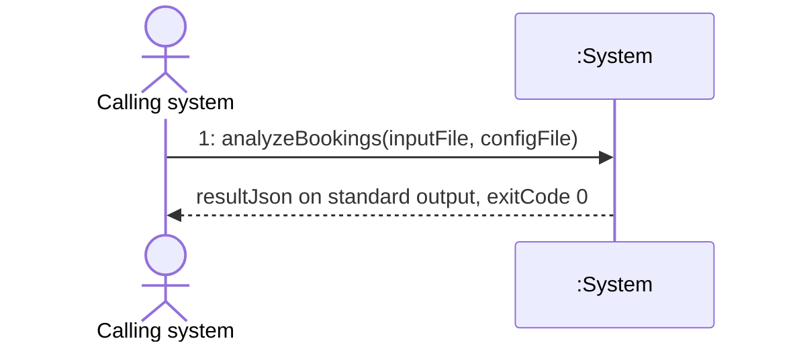

### Diagram 1.2: input or configuration error (extensions 2a, 7b, and 1a outside development)

The Calling system receives a `failed` result that names the problem; nothing is added to the Result History; exit code 2.

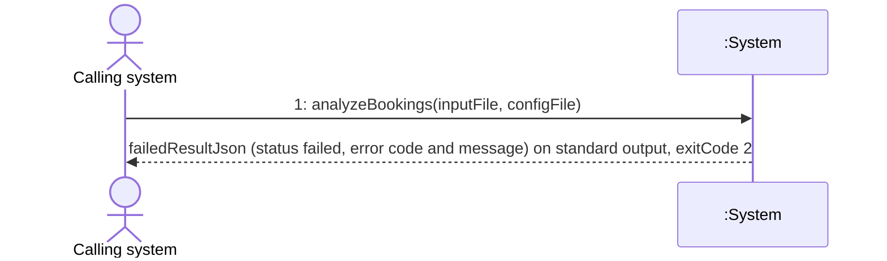

### Diagram 1.3: history write or retention failure (extension 6a)

No result is delivered and an error message goes to standard error; the message states whether the result was appended before retention failed; exit code 3.

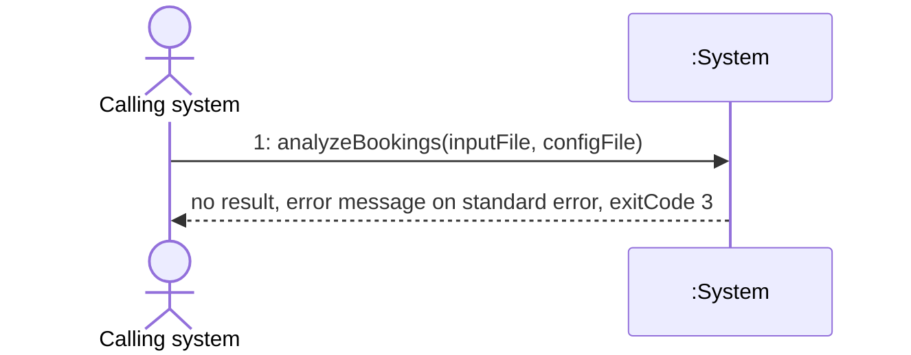

### Diagram 1.4: delivery failure (extension 8a)

The result could not be written to standard output; the message on standard error names the result identifier; exit code 4. A completed result stays in the Result History.

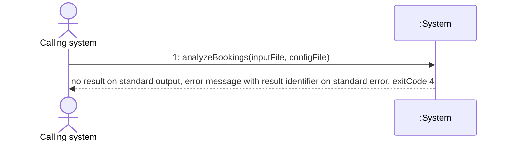

### Diagram 1.5: development fallback (extension 1a, in development only)

The Calling system supplies no input file and the configuration file sets `environment` to `development`. The environment is a configuration value, not a message parameter.

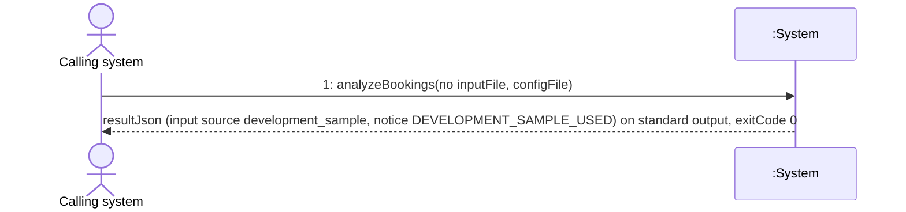

### System Operations

| Step | Message | Parameters | Return | Use case step |
| --- | --- | --- | --- | --- |
| UC-001 message 1 | `analyzeBookings` (verb phrase: analyze the bookings of one Booking Submission) | `inputFile`: optional path to the JSON file of Booking Records (`--input`); `configFile`: optional path to the TOML configuration (`--config`) | Analysis Result as JSON on standard output (`resultJson`) and the process exit code: 0 success, 2 input or configuration error, 3 history failure, 4 delivery failure. Messages go to standard error. | 1 (the parameters carry the JSON file the Calling system supplies); 2 (check and prepare), 3 (Data Quality Summary), 4 (each Analysis), 5 (assemble the Analysis Result), 6 (append to the Result History), 7 (apply the Retention Policy) and 8 (return the result and report success) are system responsibilities inside this one message |

**Use case step mapping (every main-success step maps to a message, or the deviation is justified below).**

| Use case step | Mapped to | Where visible to the Calling system |
| --- | --- | --- |
| 1 Calling system supplies a JSON file | UC-001 message 1, parameter `inputFile` | Diagram 1.1 request |
| 2 Check the records and prepare them | UC-001 message 1 (internal) | Failure at this step shows as Diagram 1.2 |
| 3 Record the data-quality summary | UC-001 message 1 (internal) | Part of `resultJson` (Data Quality Summary) |
| 4 Run each analysis whose required fields are present | UC-001 message 1 (internal) | Part of `resultJson` (Analysis entries, unavailable ones with the reason) |
| 5 Assemble one result | UC-001 message 1 (internal) | `resultJson` |
| 6 Append the result to the history | UC-001 message 1 (internal) | Failure shows as Diagram 1.3 |
| 7 Apply the retention limit | UC-001 message 1 (internal) | Failure shows as Diagram 1.3 |
| 8 Return the result as JSON and report success | UC-001 message 1 return | Diagram 1.1 return (result on standard output, exit code 0); failure shows as Diagram 1.4 |

**Justification of the deviation from one message per step.** The Calling system makes one call and receives one answer (batch invocation of a process, [ADR-0006]). Steps 2 to 7 are actions of the system on its own data and produce no interaction with the actor, so they are not system events; showing them as messages would put internal steps on the actor boundary. Step 8 is the return of the single message. The one operation therefore covers the whole main success scenario, and its name `analyzeBookings` follows the use case goal.

**Extension mapping.**

| Extension | Diagram or outcome | Exit code |
| --- | --- | --- |
| 1a in development | Diagram 1.5 | 0 |
| 1a outside development | Diagram 1.2 (failed result with error code `NO_INPUT`; see AD-1) | 2 |
| 2a file not valid JSON or not matching the input contract | Diagram 1.2 | 2 |
| 2b some records invalid | Diagram 1.1 with status `completed_with_warnings`; if no record holds a valid value, Diagram 1.2 (`NO_VALID_RECORDS`) | 0 or 2 |
| 4a required field missing, 4b holiday calendar lacks a year | Diagram 1.1 with the Analysis marked unavailable | 0 |
| 6a history cannot be written or its lock cannot be taken | Diagram 1.3 | 3 |
| 6b malformed line or interrupted earlier write | Diagram 1.1 (the run continues; a warning goes to the diagnostic output) | 0 |
| 7c retention cannot be applied after the append | Diagram 1.3 (the appended result stays) | 3 |
| 7a configuration file missing | Diagram 1.1 with the notice `CONFIG_FILE_NOT_FOUND` | 0 |
| 7b retention value invalid | Diagram 1.2 (error code `CONFIGURATION_ERROR`) | 2 |
| 8a result cannot be returned | Diagram 1.4 | 4 |

### Lifecycle Notes

The System instance is one operating-system process per call. It is created when the process starts (the composition root wires the adapters) and destroyed when the process ends with the exit code. No conversational state survives between calls; the only durable state is the Result History file and the configuration file. Two callers can run two System instances at the same time; they coordinate only through the history lock ([ADR-0003]). A run whose completed Analysis Result could not be delivered (exit code 4) leaves that result in the Result History, so a retry by the Calling system creates a second Analysis Result ([ADR-0005]); a `failed` result that cannot be delivered is never stored (AD-2).

## UC-002 Review Analysis History

### Source Use Case

Review Analysis History ([UC-002]) — scenario: the Analyst opens the marimo interface, sees the retained results, selects one and reads its views (the whole casual scenario), with the empty or missing history, the unreadable history, the malformed lines and the older schema version as separate diagrams. The primary actor is the Analyst (provisional, open issue OI-03 of the use case). The system is the read-only notebook `interface/history_notebook.py` run with `python -m marimo run`. The history location comes from the configuration file in the working directory or the `HOTEL_ANALYSIS_CONFIG` environment variable, so it is not a message parameter.

### Diagram 2.1: main scenario

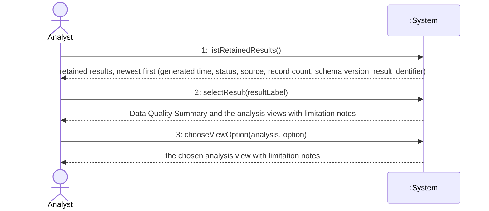

### Diagram 2.2: empty or missing history

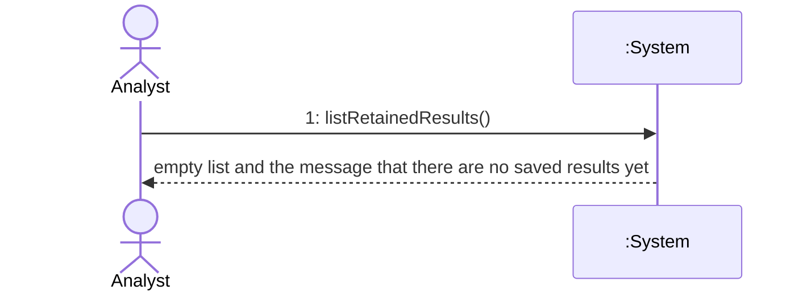

### Diagram 2.3: history cannot be read or configuration invalid

The history file exists but cannot be read, or the configuration file is invalid. The notebook shows the error and an empty list; it does not stop.

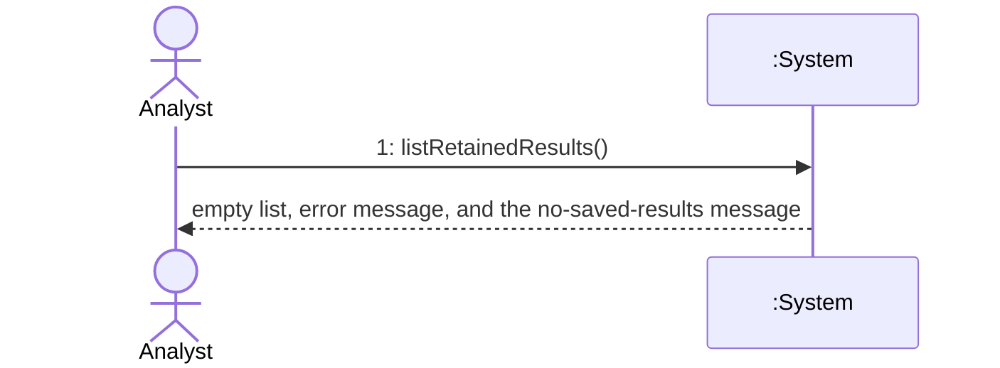

### Diagram 2.4: malformed lines in the history

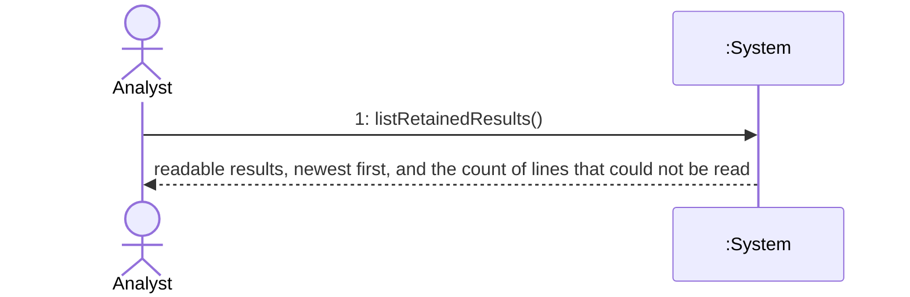

### Diagram 2.5: result from an older or unsupported schema version

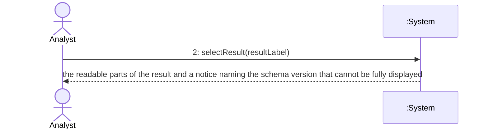

### System Operations

| Step | Message | Parameters | Return | Use case step |
| --- | --- | --- | --- | --- |
| UC-002 message 1 | `listRetainedResults` (list the Analysis Results retained by the Result History) | none; the history location is a configuration value | List of retained Analysis Results newest first, each with generated time, status, input source, record count, schema version and result identifier; an empty message when none; a message with the count of lines skipped as malformed; an error message when the configuration or the history cannot be read | U2-1, U2-2, U2-6, U2-7 |
| UC-002 message 2 | `selectResult` (select one retained Analysis Result) | `resultLabel`: the label of one entry of the list | Data Quality Summary, the availability and limitation notes of each Analysis (unavailable ones with the reason, room value labeled as an estimate, findings as associations), the default view of each Analysis, and a schema-version notice when the result cannot be fully displayed | U2-3, U2-4, U2-5, U2-8 |
| UC-002 message 3 | `chooseViewOption` (choose a view option of one Analysis) | `analysis`: one of lead time, seasonality, holidays, cancellations, guest mix; `option`: a value of the option list of that Analysis (lead time and cancellations: split by; seasonality: series and granularity; holidays: window size; guest mix: attribute) | The view of that Analysis for the chosen option, with its limitation notes | U2-4 |

UC-002 is a casual use case without numbered steps, so its narrative is numbered here for the mapping.

| Ref | Narrative element of [UC-002] | Mapped to |
| --- | --- | --- |
| U2-1 | The Analyst opens the marimo interface | UC-002 message 1 (request) |
| U2-2 | The system reads the history and lists the retained results, newest first | UC-002 message 1 (return) |
| U2-3 | The Analyst selects one result | UC-002 message 2 (request) |
| U2-4 | The system shows the data-quality summary and each available analysis with counts and limitation notes | UC-002 message 2 (return) and UC-002 message 3 (view of one Analysis for an option) |
| U2-5 | Unavailable analyses shown with the reason, room value labeled as an estimate, findings as associations | UC-002 message 2 return content (and message 3 return) |
| U2-6 | History missing or empty: the system says there are no saved results yet | UC-002 message 1 return, Diagram 2.2 |
| U2-7 | A malformed line: readable results and the count of unreadable lines | UC-002 message 1 return, Diagram 2.4 |
| U2-8 | Older schema version: show what it can and state the version | UC-002 message 2 return, Diagram 2.5 |

Message 3 has no step of its own in the casual text; it makes the "each available analysis with counts" of U2-4 explorable (for example the holiday window size) and is mapped to U2-4. This is a justified addition: the notebook offers option lists that re-render one view without changing the selection ([ADR-0006], marimo notebook).

### Lifecycle Notes

The System instance is one marimo notebook session, created when the Analyst opens the notebook (`python -m marimo run`) and destroyed when the session ends. The history is read once when the session starts; the list and the parsed results stay in the session, and a result added by a later analysis run appears only after the notebook is opened again (as built, the reading cell has no input that would re-run it). Selection and option choices are session state only; nothing is written to the Result History, the configuration or any file.

## As-Built Deviations

Update 2026-09-30: UC-001 was revised to state the differences AD-1, AD-5 and OD-1 (extensions 1a.2, 6a, 6b, 7b, 7c, 8a and the notes on the main scenario), so those three no longer differ from the use case. AD-2 is amended in ADR-0005, AD-3 in ADR-0003 and AD-4 in ADR-0006.

Differences between the built behavior, seen from the system boundary, and earlier decisions. They are recorded here and are not corrected in the diagrams; each was raised as an open issue in the project plan (OI-21 to OI-27) through the MIL-007 review (Go/No-Go criterion 6), and the last column gives its status.

| ID | Earlier decision | As built | Effect on this document |
| --- | --- | --- | --- |
| AD-1 | [UC-001] extension 1a.2: outside development the system reports that no input was supplied "and stops without a result". | The system returns a `failed` result with error code `NO_INPUT` on standard output and exit code 2, stored nowhere. This follows the input-error row of [ADR-0005], which conflicts with the wording of the use case. | Diagram 1.2 shows a failed result for this case. |
| AD-2 | [ADR-0005] outcome table: a delivery failure (exit code 4) leaves the result saved; a failed result is not stored. | If the `failed` result of an input or configuration error cannot be written to standard output, the run ends with exit code 4 and nothing was stored. The table does not cover this combination. | Diagram 1.4 applies to both cases; the contract in [OC-001] states the difference. |
| AD-3 | [ADR-0003] Order: "latest" means later in the file, not later by `generated_at`. | The notebook lists the results by `generated_at`, newest first (file position only breaks ties, unreadable times sort oldest); retention and the append order still use file position. [UC-002] asks for the newest first by time produced. | UC-002 message 1 returns the list ordered by generated time. |
| AD-4 | [ADR-0006]: the notebook reads the history through the same history reader port as the CLI, the application layer holds "list results" and "load a result" use cases, and the notebook is listed in the infrastructure layer. | The notebook is in a separate `interface` layer, reads through `interface/history_source.load_history` with the concrete configuration loader and history reader, and there are no list-results or load-result use cases in `application`. | The UC-002 operations are realized in the interface layer; this is for SD-001 and DCD-001 to show and for the review to raise. |
| AD-5 | [UC-001] main scenario lists steps 2 to 8 only. | The system reads the configuration file before step 2, serializes the result once before step 6 and, after a successful run, reads the history again to count malformed lines and warns about them on standard error. | These are system responsibilities inside UC-001 message 1; no additional message is needed. |

## Designed Additions (MIL-009, not yet built)

Design made before the code (gateway MIL-009, task 7). Nothing in this part exists in `src/` yet; it is implemented in MIL-010 (holiday and provider listings) and MIL-011 (insights) and is checked against these diagrams when built. Every use case below has its own section with the Source Use Case, the diagrams (one scenario per diagram), the System Operations table, the step mapping and the Lifecycle Notes, in the same form as above. The system is again a black box (`:System`). The invocation mechanism is the command line with subcommands of [ADR-0008]: `python -m hotel_booking_analysis <subcommand> [options]`; the outcomes are the JSON document on standard output plus the exit code (messages on standard error), as in [ADR-0005] extended by [ADR-0008].

Message numbering continues the rule above: messages are numbered per use case, so `UC-003 message 1`, `UC-004 message 1` and `UC-005 message 1` are new, and `UC-002 message 2` gets a revised return. The Operation Contract document ([OC-001]) has one contract per operation: `UC-005 message 1` is `UC-001 message 1` (`analyzeBookings`) with the additional argument `insights`, so both messages are realized by the one contract `analyzeBookings`, whose Designed change block covers the insights.

The two configuration file parameters are kept as message parameters (`configFile`, the option `--config`) because [ADR-0008] gives every subcommand that option, as `analyzeBookings` already has it.

## UC-003 Get Holiday Calendar (Designed)

### Source Use Case

Get Holiday Calendar ([UC-003]) — scenario: the whole casual scenario (the Calling system names the years and receives the Cambodian holidays as JSON), with the year without calendar data, the invalid request and the failed delivery as separate diagrams. The primary actor is the Calling system. Command: `python -m hotel_booking_analysis holidays [--years <2025 | 2024-2026 | 2024,2026>] [--config <file>]` ([ADR-0008]); the JSON of the listing and the `--years` rules are in [ADR-0011]. No booking file is needed, no analysis runs and the Result History is not touched.

### Diagram 3.1: main scenario (Designed)

Listing status `completed`; exit code 0. When `years` is absent the current year is used and the listing carries the notice `DEFAULT_YEAR_USED`.

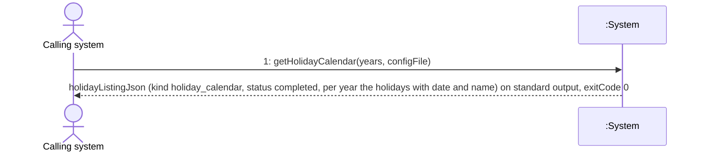

### Diagram 3.2: a year without calendar data (Designed)

The request succeeds; the year is listed as unavailable with the reason `NO_CALENDAR_DATA` and no holiday is invented for it. Exit code 0.

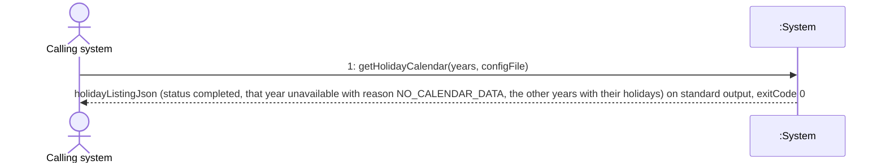

### Diagram 3.3: invalid years or invalid configuration (Designed)

The Calling system receives a `failed` listing that names the problem (`INVALID_YEARS`, or `CONFIGURATION_ERROR` naming the key) and no holidays; nothing is stored; exit code 2.

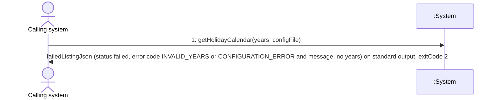

### Diagram 3.4: delivery failure (Designed)

The listing could not be written to standard output; an error message goes to standard error; nothing was stored, so a retry has no side effect; exit code 4.

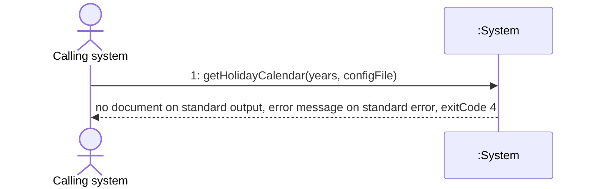

### System Operations

| Step | Message | Parameters | Return | Use case step |
| --- | --- | --- | --- | --- |
| UC-003 message 1 | `getHolidayCalendar` (verb phrase: get the Cambodian holiday calendar of the requested years) | `years`: optional text (`--years`): a single year, a range `2024-2026` or a comma list `2024,2026`; absent means the current year; `configFile`: optional path to the TOML configuration (`--config`) | The holiday listing as JSON on standard output (`listingJson`), or a failed listing, and the process exit code: 0 success (including a year without calendar data), 2 invalid `years` or configuration, 4 delivery failure. Exit code 3 is not used because the history is not touched. Messages go to standard error. | U3-1 (the request names the years), U3-2 and U3-3 (the answer), U3-4 (unavailable year), U3-5 (invalid request), U3-6 (delivery failure), U3-7 (nothing else happens) |

[UC-003] is a casual use case without numbered steps, so its narrative is numbered here for the mapping (as for [UC-002] above).

| Ref | Narrative element of [UC-003] | Mapped to |
| --- | --- | --- |
| U3-1 | The Calling system asks for the Cambodian public holidays and names the years it wants | UC-003 message 1 (request), parameter `years` |
| U3-2 | The system takes the holidays from the calendar source and returns, per requested year, the holidays with date and name | UC-003 message 1 (return), Diagram 3.1 |
| U3-3 | When no year is requested the current year is used and the answer says which | UC-003 message 1 with `years` absent, Diagram 3.1 (notice `DEFAULT_YEAR_USED`) |
| U3-4 | A year the calendar has no data for is marked unavailable with the reason; no holiday is invented | UC-003 message 1 (return), Diagram 3.2 |
| U3-5 | A request that is not a valid year gives a failed answer that names the problem (and an invalid configuration file is reported the same way, [ADR-0011]) | UC-003 message 1 (return), Diagram 3.3, exit code 2 |
| U3-6 | An answer that cannot be returned is reported as a failure, not success; nothing was stored | UC-003 message 1 (return), Diagram 3.4, exit code 4 |
| U3-7 | No booking records, no analysis, the history unchanged | No other message and no message to the history; stated in the Lifecycle Notes and in the postconditions of [OC-001] |

**Justification of one message.** As for `analyzeBookings`, the Calling system makes one call and receives one answer (batch invocation, [ADR-0006], [ADR-0008]). Reading the calendar, building the years and serializing are actions of the system on its own data and are not system events, so the one operation covers the whole scenario and its name follows the use case goal.

### Lifecycle Notes

The System instance is one operating-system process per call, created when the process starts (the composition root wires the calendar, the serializer, the clock and the stream) and destroyed with the exit code. No state survives between calls and nothing is written: the listing is not stored in the Result History, and the same years with the same calendar version give the same answer except its generated time.

## UC-004 Get Available LLM Providers (Designed)

### Source Use Case

Get Available LLM Providers ([UC-004]) — scenario: the whole casual scenario (the Calling system asks which language-model providers can be reached and receives the list as JSON), with the case that no provider is reachable, the invalid configuration and the failed delivery as separate diagrams. The primary actor is the Calling system. Command: `python -m hotel_booking_analysis llm-providers [--config <file>]` ([ADR-0008]); the discovery is fixed in [ADR-0009] (Ollama and LM Studio, checked in that order, read-only, each within the discovery timeout) and the JSON in [ADR-0011]. No model is asked to generate text, no booking data is sent and the Result History is not touched.

### Diagram 4.1: some provider reachable (Designed)

Listing status `completed`; one entry per provider, `reachable` with its models or `unreachable` with the reason; exit code 0.

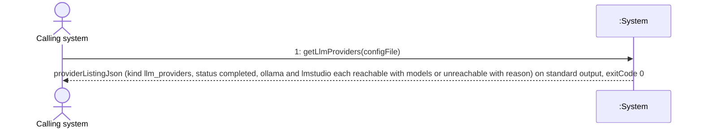

### Diagram 4.2: no provider reachable (Designed)

An unreachable provider is a normal entry, so the request still succeeds; the listing carries the notice `NO_PROVIDER_REACHABLE`; exit code 0.

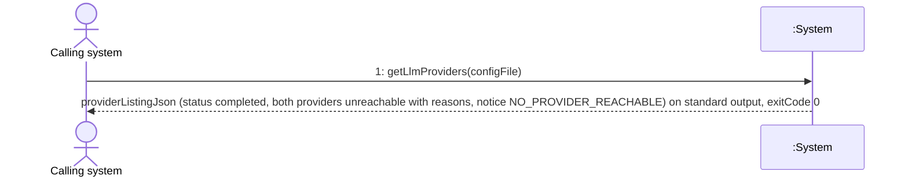

### Diagram 4.3: invalid configuration (Designed)

A configuration value is invalid, for example a provider address that is not a loopback host while `llm.allow_remote` is false ([ADR-0009], [ADR-0012]); no provider is contacted; the failed listing names the key; exit code 2.

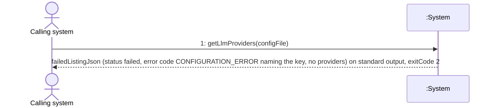

### Diagram 4.4: delivery failure (Designed)

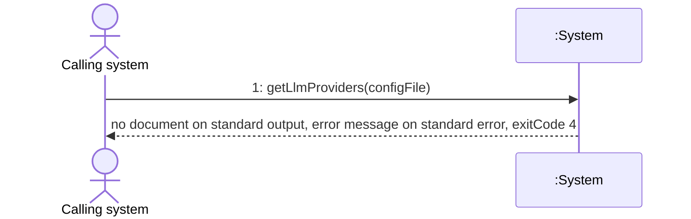

### System Operations

| Step | Message | Parameters | Return | Use case step |
| --- | --- | --- | --- | --- |
| UC-004 message 1 | `getLlmProviders` (verb phrase: get the language-model providers that can be reached) | `configFile`: optional path to the TOML configuration (`--config`); the provider addresses and the discovery timeout are configuration values, not parameters | The provider listing as JSON on standard output (`listingJson`), or a failed listing, and the exit code: 0 success (including no reachable provider), 2 invalid configuration, 4 delivery failure. Exit code 3 is not used. Messages go to standard error. | U4-1 (the request), U4-2 to U4-4 (the answer), U4-5 (invalid configuration), U4-6 (delivery failure), U4-7 (nothing else happens) |

| Ref | Narrative element of [UC-004] | Mapped to |
| --- | --- | --- |
| U4-1 | The Calling system asks which language-model providers the application can reach | UC-004 message 1 (request) |
| U4-2 | For each configured provider the system makes a quick read-only check within a time limit and lists whether it is reachable, the reason when not, and the models of a reachable one | UC-004 message 1 (return), Diagram 4.1 |
| U4-3 | A provider that is not reachable is a normal entry, not an error | UC-004 message 1 (return), Diagram 4.1 (entry `unreachable` with the reason), exit code 0 |
| U4-4 | When no provider is reachable the request still succeeds | UC-004 message 1 (return), Diagram 4.2 |
| U4-5 | An invalid configuration gives a failed answer that names the problem and does not guess | UC-004 message 1 (return), Diagram 4.3, exit code 2 |
| U4-6 | An answer that cannot be returned is reported as a failure; nothing was stored | UC-004 message 1 (return), Diagram 4.4, exit code 4 |
| U4-7 | No analysis, no text generated by a model, no booking data sent, the history unchanged | No other message; stated in the Lifecycle Notes and in the postconditions of [OC-001] |

The same justification as for UC-003 applies: one call, one answer; the checks of the providers are actions of the system towards other systems (the providers) and not events on the boundary to the Calling system, so they do not appear on this diagram. They are shown as internal collaborations in [SD-001].

### Lifecycle Notes

The System instance is one operating-system process per call, created when the process starts (the composition root wires the configuration loader, the provider adapters, the serializer, the clock and the stream) and destroyed with the exit code. The check of the providers is made once per call and its result is not kept: a later call checks again. Nothing is written, and the listing is not stored in the Result History.

## UC-005 Get AI Insights for Analyses (Designed)

### Source Use Case

Get AI Insights for Analyses ([UC-005]) — scenario: the main success scenario (steps 1 to 8) with the extensions 2a, 3a, 4a, 5a, 6a, 7a and 8a. [UC-005] is an `<<extend>>` of [UC-001] at the extension point "insights requested" (after step 4, before step 5), so it is not a second conversation with the Calling system: the Calling system makes the one call of [UC-001] and adds the option `--insights`. `UC-005 message 1` is therefore [UC-001] message 1 (`analyzeBookings`) with the extra argument `insights` set to true. The Calling system is the primary actor. Command: `python -m hotel_booking_analysis analyze [--input <file>] [--config <file>] --insights` ([ADR-0008]); the insights are decided in [ADR-0009] (provider and model choice), [ADR-0010] (what is sent, the answer structure, the guardrails, the failure reasons) and [ADR-0011] (result schema version 1.1). Without `--insights` this use case does not start (Diagram 5.5) and the outcome is exactly that of [UC-001].

### Diagram 5.1: main scenario with insights (Designed)

Result status `completed` (or `completed_with_warnings` for the causes of [UC-001] step 5 alone), schema version 1.1, one insight per available analysis; exit code 0. An analysis that is itself unavailable carries the insight status `not_applicable` (extension 3a).

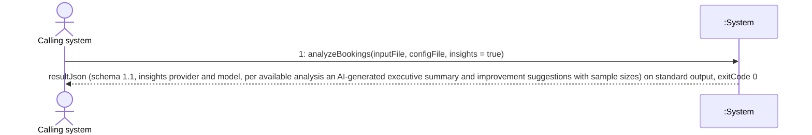

### Diagram 5.2: no reachable provider or no usable model (Designed, extension 2a)

No model is contacted. Every available analysis carries an insight `unavailable` with the reason `NO_PROVIDER` (or `NO_MODEL`); the result is `completed_with_warnings` with the notice `INSIGHTS_UNAVAILABLE`; it is stored and delivered like any completed result; exit code 0.

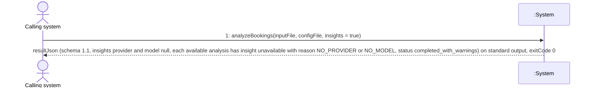

### Diagram 5.3: model failure or timeout (Designed, extensions 4a and 7a)

The insight of the affected analysis is `unavailable` with the reason `MODEL_ERROR` or `TIMEOUT`; the other analyses keep the insights that passed; nothing is retried; exit code 0.

```mermaid
sequenceDiagram
    actor C as Calling system
    participant S as :System
    C->>S: 1: analyzeBookings(inputFile, configFile, insights = true)
    S-->>C: resultJson (schema 1.1, some analyses with insights, others with insight unavailable and reason MODEL_ERROR or TIMEOUT, status completed_with_warnings) on standard output, exitCode 0
```

### Diagram 5.4: answer not in the structure or rejected by the guardrails (Designed, extensions 5a, 6a and 7a)

The text of the answer is not kept. The insight of the affected analysis is `unavailable` with the reason `BAD_STRUCTURE` or `GUARDRAIL_REJECTED`; exit code 0.

```mermaid
sequenceDiagram
    actor C as Calling system
    participant S as :System
    C->>S: 1: analyzeBookings(inputFile, configFile, insights = true)
    S-->>C: resultJson (schema 1.1, some analyses with insights, others with insight unavailable and reason BAD_STRUCTURE or GUARDRAIL_REJECTED and no text, status completed_with_warnings) on standard output, exitCode 0
```

### Diagram 5.5: insights not requested, the default (Designed, no change)

The message is the one of Diagram 1.1 with `insights` false (the default when `--insights` is not given). No model is contacted; the result is schema version 1.0 and identical in content and shape to a result of [UC-001] ([ADR-0011]). The diagram is drawn to show that the extension is opt-in.

```mermaid
sequenceDiagram
    actor C as Calling system
    participant S as :System
    C->>S: 1: analyzeBookings(inputFile, configFile, insights = false)
    S-->>C: resultJson (schema 1.0, no insights, as Diagram 1.1) on standard output, exitCode 0
```

### System Operations

| Step | Message | Parameters | Return | Use case step |
| --- | --- | --- | --- | --- |
| UC-005 message 1 (the extension of UC-001 message 1) | `analyzeBookings` (same operation as [UC-001] message 1 with the additional argument `insights`) | `inputFile` and `configFile` as in UC-001 message 1; `insights`: boolean, true when `--insights` is given, false (the default) otherwise | As UC-001 message 1: the Analysis Result as JSON on standard output and the exit code 0, 2, 3 or 4. With `insights` true a completed result is schema version 1.1 and carries the insights; with `insights` false, and for every `failed` result, it is schema version 1.0. A failed insight never changes the exit code ([ADR-0008]). | 1 (the argument carries the request), 2 to 8 (system responsibilities inside the message, between [UC-001] steps 4 and 5) |

**Use case step mapping (every main-success step maps to the message, or the deviation is justified below).**

| Use case step of [UC-005] | Mapped to | Where visible to the Calling system |
| --- | --- | --- |
| 1 The system finds that the Calling system asked for insights | UC-005 message 1, argument `insights` | Diagram 5.1 request (`insights = true`) |
| 2 Select a reachable provider and a model | UC-005 message 1 (internal) | `insights.provider` and `insights.model` of `resultJson`; failure shows as Diagram 5.2 |
| 3 Prepare the aggregate findings of each available analysis | UC-005 message 1 (internal) | not visible (only aggregate findings are used; no record and no identifier is sent) |
| 4 Send the aggregate findings to the model and ask for the structure | UC-005 message 1 (internal) | not visible; a model failure shows as Diagram 5.3 |
| 5 Receive the structured answer | UC-005 message 1 (internal) | not visible; a wrong structure shows as Diagram 5.4 |
| 6 Check the answer against the guardrails | UC-005 message 1 (internal) | a rejection shows as Diagram 5.4 |
| 7 Label the insight AI-generated with model and provider and attach it | UC-005 message 1 (internal) | part of `resultJson`: `insight` of each analysis |
| 8 Repeat for every available analysis, then return to [UC-001] | UC-005 message 1 return | Diagram 5.1 return (result on standard output, exit code 0) |

**Justification of the deviation from one message per step.** The steps 2 to 8 are actions of the system on its own data and towards the language model provider, which is a supporting system and not the actor of this diagram. The Calling system makes one call and receives one answer; showing the calls to the model would put internal steps on the actor boundary (criterion 2 of QC-SSD-001). The operation is the same as in [UC-001] because [UC-005] extends that use case inside its step sequence and is not a separate conversation.

**Extension mapping.**

| Extension | Diagram or outcome | Exit code |
| --- | --- | --- |
| 2a no reachable provider, or no reachable provider offers a model | Diagram 5.2 (reasons `NO_PROVIDER`, `NO_MODEL`) | 0 |
| 3a an analysis is unavailable | Diagram 5.1 with the insight of that analysis `not_applicable` | 0 |
| 4a the model fails or does not answer within the time limit | Diagram 5.3 (reasons `MODEL_ERROR`, `TIMEOUT`) | 0 |
| 5a the answer is empty or not in the expected structure | Diagram 5.4 (reason `BAD_STRUCTURE`) | 0 |
| 6a the answer fails the guardrails | Diagram 5.4 (reason `GUARDRAIL_REJECTED`) | 0 |
| 7a some analyses have insights and others do not | Diagrams 5.3 and 5.4 (the insights that passed stay in the result) | 0 |
| 8a the result cannot be saved or returned | Diagram 1.3 (exit code 3) or Diagram 1.4 (exit code 4), unchanged from [UC-001]; the insights are part of the retained result | 3 or 4 |
| insights not requested (default) | Diagram 5.5 | 0 |
| invalid configuration, including the `[llm]` keys of [ADR-0012] | Diagram 1.2 (`CONFIGURATION_ERROR`), unchanged; no provider is contacted | 2 |

### Lifecycle Notes

As for `analyzeBookings` above: one operating-system process per call, wired by the composition root, ended with the exit code. With `insights` true the composition root also wires the language model provider adapters; the providers are external systems reached over local HTTP for the length of the call ([ADR-0009]) and are not part of the System instance. The worst-case duration of the call is long (up to six generation requests of 120 seconds each plus discovery, [ADR-0008]), so the Calling system sets its own process timeout. Nothing is cached: insights are generated again for each run ([ADR-0010]).

## UC-002 Review Analysis History: insights (Designed)

### Source Use Case

Review Analysis History ([UC-002], revised on 2026-09-30) — scenario: the Analyst selects a retained result and, in addition to the views above, sees the AI insights of that result. The message is `UC-002 message 2` (`selectResult`), unchanged in name and parameter; only its return is revised (Designed change). Messages 1 and 3 and the Diagrams 2.1 to 2.5 are unchanged. The primary actor is the Analyst; the system is the notebook of Diagram 2.1.

### Diagram 2.6: result with insights (Designed)

```mermaid
sequenceDiagram
    actor A as Analyst
    participant S as :System
    A->>S: 2: selectResult(resultLabel)
    S-->>A: Data Quality Summary, the analysis views with limitation notes, and per analysis the AI insight (executive summary and improvement suggestions labeled AI-generated with model and provider, each suggestion with its sample size and evidence)
```

### Diagram 2.7: result saved without insights (Designed)

A result of schema version 1.0, or of a run made without `--insights`, is shown as before with the statement that it was saved without insights; no error appears.

```mermaid
sequenceDiagram
    actor A as Analyst
    participant S as :System
    A->>S: 2: selectResult(resultLabel)
    S-->>A: Data Quality Summary and the analysis views as before, and the statement that this result was saved without insights
```

### Diagram 2.8: insight unavailable or not applicable (Designed)

```mermaid
sequenceDiagram
    actor A as Analyst
    participant S as :System
    A->>S: 2: selectResult(resultLabel)
    S-->>A: the analysis views, and for an analysis whose insight is unavailable the reason (for example NO_PROVIDER, TIMEOUT, GUARDRAIL_REJECTED) and no text, or the statement not applicable when the analysis itself was unavailable
```

### System Operations (Designed change to UC-002 message 2)

The row of `UC-002 message 2` in the table above is unchanged for the built system. The revised return, valid from MIL-011, is:

| Step | Message | Parameters | Revised return | Use case step |
| --- | --- | --- | --- | --- |
| UC-002 message 2 (Designed change) | `selectResult` | `resultLabel` as above | The return above, and in addition, per Analysis: its AI insight when the selected result holds one (executive summary and improvement suggestions labeled AI-generated with model and provider, each suggestion with its sample size and evidence); the reason of an insight that is unavailable, with no text; the statement not applicable for an analysis that was unavailable; or, when the result holds no insights, the statement that it was saved without insights | U2-9, U2-10, U2-11 |

The narrative of [UC-002] gained three elements (the casual text now has the insight paragraph); they are numbered here as the earlier ones.

| Ref | Narrative element of [UC-002] (revised) | Mapped to |
| --- | --- | --- |
| U2-9 | When the result was produced with AI insights the system also shows, per analysis, the executive summary and the improvement suggestions, each marked AI-generated with model and provider, each suggestion with its sample sizes | UC-002 message 2 return, Diagram 2.6 |
| U2-10 | If the result was saved without insights the system says so and shows the findings as before | UC-002 message 2 return, Diagram 2.7 |
| U2-11 | If an insight is unavailable the system shows it as unavailable with the reason and shows no text for it | UC-002 message 2 return, Diagram 2.8 |

### Lifecycle Notes

Unchanged: one marimo notebook session, read-only. The insights come from the stored result read once at the start of the session; nothing is generated in the notebook, no provider is contacted, and nothing is written.

---

[UC-001]: ./use-cases/uc-001-analyze-hotel-bookings.md
[UC-002]: ./use-cases/uc-002-review-analysis-history.md
[UC-003]: ./use-cases/uc-003-get-holiday-calendar.md
[UC-004]: ./use-cases/uc-004-get-available-llm-providers.md
[UC-005]: ./use-cases/uc-005-get-ai-insights-for-analyses.md
[DM-001]: ./domain-model.md
[OC-001]: ./operation-contracts.md
[SD-001]: ./sequence-diagrams.md
[ADR-0001]: ./adr/adr-0001-input-json-contract.md
[ADR-0003]: ./adr/adr-0003-jsonl-history-and-retention.md
[ADR-0005]: ./adr/adr-0005-delivery-and-failure-semantics.md
[ADR-0006]: ./adr/adr-0006-architecture-and-invocation.md
[ADR-0007]: ./adr/adr-0007-analysis-methods.md
[ADR-0008]: ./adr/adr-0008-invocation-interface.md
[ADR-0009]: ./adr/adr-0009-llm-provider-discovery-and-connection.md
[ADR-0010]: ./adr/adr-0010-ai-insight-generation-and-guardrails.md
[ADR-0011]: ./adr/adr-0011-output-contracts-and-result-1-1.md
[ADR-0012]: ./adr/adr-0012-configuration-extension.md
