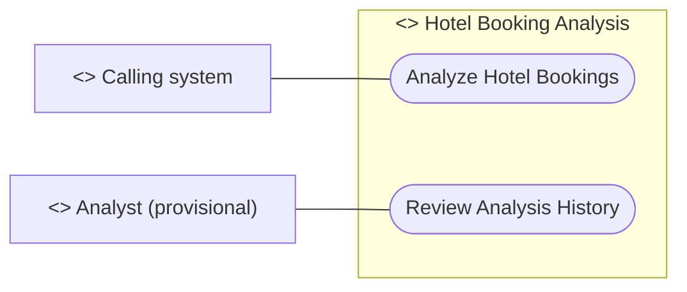

# Use Case Diagram

## Metadata
| Key | Value |
| --- | --- |
| ID | UCD-001 |
| CrossReference | [SA-001], [BC-001], [US-001], [UC-001], [UC-002] |
| DomainLanguages | IT Professional English |

## Version History
| Date | Status | Author | Reviewer |
| --- | --- | --- | --- |
| 2026-09-29 | Proposed | Jens Tirsvad Nielsen | TBD (S04 not yet named) |
| 2026-09-29 | Proposed | Jens Tirsvad Nielsen | TBD (S04 not yet named) |

---

## Purpose and Scope

The system boundary is the hotel-booking analysis application, including its marimo interface. Inside the boundary are validating and analyzing booking records, returning the result as JSON, keeping the JSONL history with configured retention, and displaying saved results. Outside are the calling system itself, the source of the booking data, and the person who reads results.

The primary actor is the Calling system. The Analyst is a provisional secondary actor for reviewing saved results; whether that actor is a human, or whether the Calling system also views history, is open issue OI-03 in [PP-001] and must be confirmed by S01 before the use cases are written.

## Diagram

## Actor Table

| Actor | Stereotype | Stakeholder ID (SA) | Goals (use cases) |
| --- | --- | --- | --- |
| Calling system | `<<Actor>>` | S02 | Analyze Hotel Bookings |
| Analyst (provisional) | `<<Actor>>` | S05 | Review Analysis History |
| Hotel Booking Analysis | `<<System>>` | S01 | Both use cases |

## Use Case Table

| Use Case | Actor(s) | Goal |
| --- | --- | --- |
| Analyze Hotel Bookings | Calling system | Supply booking records as JSON and receive a validated analysis result as JSON, which is also kept in the history |
| Review Analysis History | Analyst (provisional) | Select a retained result and see it with the time it was produced |

## Relationships

| From | Relationship (`<<include>>` / `<<extend>>`) | To | Justification |
| --- | --- | --- | --- |
| None | None | None | The two goals are independent; the history is written by the first and read by the second, which is a data dependency, not an include or extend |

---

[PP-001]: ./project-plan.md
[SA-001]: ./stakeholder-analysis.md
[BC-001]: ./business-case.md
[US-001]: ./user-stories.md
[UC-001]: ./use-cases/uc-001-analyze-hotel-bookings.md
[UC-002]: ./use-cases/uc-002-review-analysis-history.md
