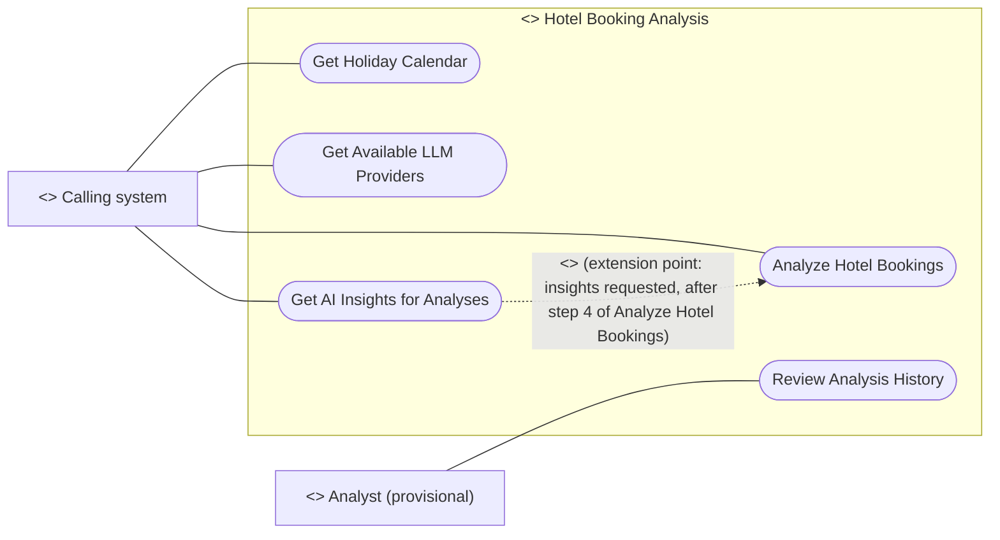

# Use Case Diagram

## Metadata
| Key | Value |
| --- | --- |
| ID | UCD-001 |
| CrossReference | [SA-001], [BC-001], [US-001], [UC-001], [UC-002], [UC-003], [UC-004], [UC-005] |
| DomainLanguages | IT Professional English |

## Version History
| Date | Status | Author | Reviewer |
| --- | --- | --- | --- |
| 2026-09-29 | Approved | Jens Tirsvad Nielsen | TBD (S04 not yet named) |
| 2026-09-29 | Approved | Jens Tirsvad Nielsen | TBD (S04 not yet named) |
| 2026-09-30 | Approved | Jens Tirsvad Nielsen | Team2 (S04) |
| 2026-09-30 | Approved | Jens Tirsvad Nielsen | Team2 (S04) |

---

## Purpose and Scope

The system boundary is the hotel-booking analysis application, including its marimo interface. Inside the boundary are validating and analyzing booking records, returning the result as JSON, keeping the JSONL history with configured retention, and displaying saved results, returning the Cambodian holidays and the reachable language-model (LLM) providers as JSON without an analysis, and adding AI-generated insights to an analysis on request. Outside are the calling system itself, the source of the booking data, and the person who reads results.

The primary actor is the Calling system. The Analyst is a provisional secondary actor for reviewing saved results; whether that actor is a human, or whether the Calling system also views history, is open issue OI-03 in [PP-001] and is to be confirmed by S01 (the use cases were written on the provisional assumption). The Analyst also sees the AI insights that were saved with a result, through Review Analysis History; the request calls this reader a market analyst and the Analyst actor S05 is assumed to be that person (open issue OI-20). The language-model providers (Ollama, LM Studio) are external services the system calls; they are not actors that pursue a goal here, so they are not drawn.

## Diagram

## Actor Table

| Actor | Stereotype | Stakeholder ID (SA) | Goals (use cases) |
| --- | --- | --- | --- |
| Calling system | `<<Actor>>` | S02 | Analyze Hotel Bookings; Get Holiday Calendar; Get Available LLM Providers; Get AI Insights for Analyses |
| Analyst (provisional) | `<<Actor>>` | S05 | Review Analysis History (including the AI insights saved with a result) |
| Hotel Booking Analysis | `<<System>>` | S01 | All five use cases |

## Use Case Table

| Use Case | Actor(s) | Goal |
| --- | --- | --- |
| Analyze Hotel Bookings | Calling system | Supply booking records as JSON and receive a validated analysis result as JSON, which is also kept in the history |
| Review Analysis History | Analyst (provisional) | Select a retained result and see it with the time it was produced, including the AI-generated executive summary and improvement suggestions saved with it |
| Get Holiday Calendar | Calling system | Ask for the Cambodian holidays of the requested years as JSON, without running an analysis or writing the history |
| Get Available LLM Providers | Calling system | Ask which language-model providers (Ollama, LM Studio) the system can reach, and which models they offer, as JSON, without running an analysis or writing the history |
| Get AI Insights for Analyses | Calling system | Ask that each analysis also receives an AI-generated executive summary and improvement suggestions, worded as hypotheses, for a market analyst |

## Relationships

| From | Relationship (`<<include>>` / `<<extend>>`) | To | Justification |
| --- | --- | --- | --- |
| Get AI Insights for Analyses | `<<extend>>` (extension point: insights requested, after step 4 and before step 5 of Analyze Hotel Bookings) | Analyze Hotel Bookings | The insights are optional (off by default) and Analyze Hotel Bookings is complete and valid without them, so the base use case never depends on the extension; the extension runs only under the condition that the Calling system asks for insights, and it needs the findings produced at step 4. It is not an `<<include>>` because it is not always part of the base flow |

Get Holiday Calendar and Get Available LLM Providers are independent goals: they run no analysis, write nothing to the history and use no other use case. The history is written by Analyze Hotel Bookings and read by Review Analysis History, which is a data dependency, not an include or extend.

---

[PP-001]: ./project-plan.md
[SA-001]: ./stakeholder-analysis.md
[BC-001]: ./business-case.md
[US-001]: ./user-stories.md
[UC-001]: ./use-cases/uc-001-analyze-hotel-bookings.md
[UC-002]: ./use-cases/uc-002-review-analysis-history.md
[UC-003]: ./use-cases/uc-003-get-holiday-calendar.md
[UC-004]: ./use-cases/uc-004-get-available-llm-providers.md
[UC-005]: ./use-cases/uc-005-get-ai-insights-for-analyses.md
